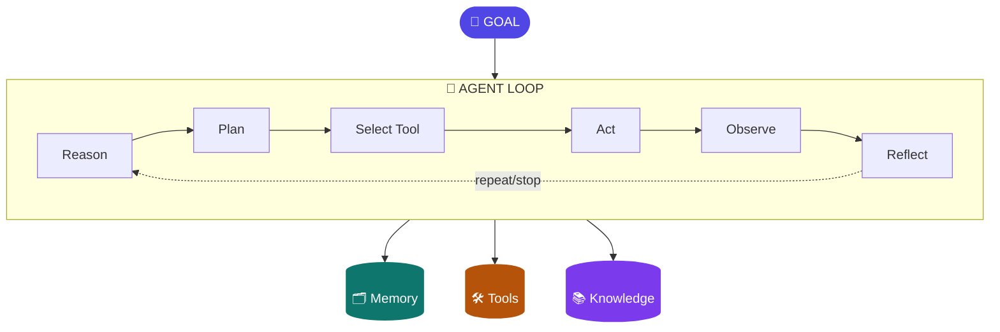

# Chapter 2: Anatomy of an AI Agent

> An LLM generates intelligence. An agent uses intelligence to act. Everything in this chapter is the machinery of "uses."

## 1. The architecture



The loop is the agent. Memory, tools, and knowledge are what it consults or manipulates — each gets its own chapter later (9, 13, 10–12). This chapter earns you the right to say, in any design review or interview, "I know exactly what happens on every turn, and I know which parts are the model and which parts are my software." That sentence is rarer than it should be.

## 2. The loop, step by step — with a worked trace

The steps, precisely:

1. **Reason** — the model reads the goal plus current state and assesses: what's established, what's missing, what would resolve it.
2. **Plan** — it decides the next step (or a short sequence). Planning may be implicit — folded into each turn's reasoning, the ReAct style — or an explicit artifact produced up front (Plan-and-Execute, Ch3).
3. **Select tool** — it chooses an action from the tools it has been *granted* — never "all tools that exist" (Ch13/19).
4. **Act** — the **harness** executes the call. The model only ever emits a structured request; it touches nothing directly. Hold onto this boundary — it is where both reliability and security live, and it recurs in Chapters 5, 7, 13, and 19.
5. **Observe** — the result is appended to context. Result *design* matters: what the model sees back steers what it does next (Ch13).
6. **Reflect** — did that work? Is the goal met? Loop or stop.

Now watch it run. Goal: *"Customer 4471 disputes a ₹4,300 POS charge from 12 Aug. Investigate and recommend."* Granted tools: `get_transactions`, `get_customer_profile`, `search_policy`, `create_case`.

**Turn 1.** Reason: "I need the transaction itself before anything." Select: `get_transactions(customer=4471, from=10Aug, to=14Aug)`. Observe: 6 rows; one POS ₹4,300 on 12 Aug at "SR RETAIL, Indore," terminal T-2231.

**Turn 2.** Reason: "Charge exists. Is it anomalous *for this customer*? I need their pattern." Select: `get_customer_profile(4471)`. Observe: home city Mumbai; no Indore transactions in 12 months; typical POS spend ₹200–800.

**Turn 3.** Reason: "Out-of-city, 5× typical size — consistent with the dispute. What does policy say about provisional credit at this amount?" Select: `search_policy("disputed POS transaction provisional credit threshold")`. Observe: policy 4.2 — disputes under ₹5,000 with an anomalous-pattern flag qualify for provisional credit pending network chargeback.

**Turn 4.** Reason: "All criteria met: transaction verified, pattern anomalous, policy 4.2 applies. Nothing is missing — I'm done gathering." Select: `create_case(type=dispute, txn=..., recommendation=provisional_credit, policy_ref=4.2)`. Observe: case DS-88213 created.

**Turn 5.** Reflect: goal met — emit the summary with the case number, the evidence, and the policy citation. Stop.

Two things to notice in the trace, because they're the chapter in miniature. First, every turn's *reasoning* is the model, and every turn's *execution* is the harness — the boundary held five times. Second, the loop's path wasn't knowable in advance: if turn 2 had shown regular Indore travel, turn 3 would have been a different retrieval and the recommendation likely "contact customer — pattern not anomalous." That path-contingency is *why* this is an agent problem (Ch1's placement logic), and the trace is what its audit record looks like (Ch16).

## 3. The stop problem — the most underrated step

A model can emit perfectly valid tool calls forever and never decide it is finished. This is not hypothetical: Chapter 7 recounts a model that, mid-pipeline, listed the same directory about forty times — not erroring, just not converging. Stopping is a *judgment*, and judgment is exactly what's stochastic. So production systems treat the stop decision as intelligent-but-bounded: the model decides "am I done," and the harness enforces the backstop — max iterations, per-run token budget, wall-clock timeout — with a graceful halt that checkpoints state and reports honestly ("I completed steps 1–3; budget exhausted investigating step 4").

**Goal setting & monitoring** (Gulli's pattern 11) upgrades stopping from vibes to design: state the goal as explicit success criteria in the state object (Ch4) — for the dispute case: *transaction verified; pattern assessed; policy identified; case created* — and have the reflect step check criteria, not feelings. An agent that can say "criterion 3 of 4 unmet" is debuggable, steerable, and honest about partial completion; one that "feels done" is none of those. As a bonus, criteria checked per turn become progress events you can stream to the user (Ch6) and metrics you can monitor (Ch16).

## 4. Reasoning techniques — what happens inside "reason"

The reason step is not monolithic; there's a menu, each item with a cost profile, and choosing per-step is an architecture decision (this is Ch18's model-routing, previewed).

**Chain-of-thought (CoT).** Have the model think step-by-step before answering. The baseline, nearly free, and the foundation everything else builds on. What it buys: decomposition of the problem into checkable steps. What it doesn't: any guarantee the steps are *right* — fluent reasoning to a wrong conclusion is the signature CoT failure.

**Self-consistency.** Sample the same reasoning N times, take the majority answer. Buys real accuracy on problems with a verifiable answer — at N× the tokens. Use it where a single wrong answer is expensive and the question has a discrete answer; skip it for open-ended synthesis, where "majority" is meaningless.

**Tree/graph-of-thoughts.** Explore alternative reasoning branches, evaluate, backtrack. Powerful on genuinely search-shaped problems (puzzles, constrained planning); in production agent loops it's rarely worth the token explosion — the loop *itself* is already a search process with tools as its branches.

**ReAct vs plan-first.** ReAct interleaves reasoning with acting — adaptive, since each observation informs the next thought; opaque, since the "plan" only ever exists one step at a time. Plan-first (Ch3's Plan-and-Execute) front-loads reasoning into an explicit plan artifact — auditable and delegable, but stale the moment an observation invalidates step 2 of 7. The dispute trace above was ReAct; a regulator-facing process might justify plan-first purely for the artifact.

**Reasoning models / test-time compute.** o-series/R-class models internalize deliberation — you buy reasoning by the token at inference time. This changes the design question from "which prompting trick" to "**which steps deserve a reasoning model at what budget**": planning and synthesis steps often yes; extraction, classification, and formatting steps almost never (a standard model at a tenth the cost does those). The economics land in Chapter 18.

**The classical frame — worth knowing for interviews.** Pre-LLM agent theory distinguished **reactive** architectures (perceive→act, fast, no lookahead), **deliberative** ones (model the world, plan ahead — the BDI *belief–desire–intention* tradition: beliefs = what the agent holds true; desires = goals; intentions = the plan it's committed to), and **hybrids**. A modern agentic system *is* the hybrid: deliberative at the graph/planning level, reactive inside nodes. Mapping BDI onto a LangGraph design (beliefs ≈ state, desires ≈ goal criteria, intentions ≈ the plan in state) is a thirty-second answer that signals depth few candidates have.

## 5. State vs memory — the distinction that prevents a class of bugs

- **State** is the loop's working data for *this run*: messages, tool results, intermediate artifacts, iteration count, goal criteria. It lives in the orchestration layer, is typed and checkpointable (Ch4), and dies or is archived when the run ends.
- **Memory** is what survives *across* runs: user facts, past episodes, learned procedures (Ch9).

Why the distinction earns its own section — a story you'll recognize. A team builds a service agent where "memory" is simply the growing chat transcript, persisted per customer. Three months in: sessions slow and costly (the transcript rides in every context window — a state-sized object doing a memory job); the agent "remembers" a stale address from a March conversation and uses it in September (a memory-shaped fact trapped in transcript form, with no consolidation or expiry — Ch9's pipeline never ran); and a privacy review asks what's stored about each customer, to which the honest answer is "everything anyone ever typed, undifferentiated." Every one of those is the *same* bug: conflating state and memory. Design them separately from day one: state gets a schema and a checkpointer; memory gets an extraction policy, provenance, and TTLs.

## 6. Where the intelligence actually is

The decomposition to bring to every design review:

| Component | Deterministic or intelligent? |
|---|---|
| Loop control (max iters, timeouts, budgets) | Deterministic — harness |
| Tool execution | Deterministic — harness |
| Context assembly | Deterministic policy over intelligently *selected* content (Ch8) |
| Next-action choice | Intelligent — the model |
| Stop decision | Intelligent, deterministically bounded |
| Goal criteria definition | Deterministic — you, at design time |

The model makes exactly two kinds of decision: *what to do next* and *am I done*. Everything else is software you design. In review, walk the table row by row and say for each intelligent row what brackets it — that recitation ("the model chooses X, bounded by Y") is, verbatim, how agent designs pass architecture review in regulated environments.

## 7. The loop across frameworks

Every framework is this loop with opinions about where the boxes go. LangGraph makes the loop an explicit graph — the reflect/route step becomes conditional edges you draw (Ch4). OpenAI's Agents SDK wraps the loop in a runner: you configure agent + tools, the SDK owns the iteration, handoffs express delegation. CrewAI hides the loop under role/task metaphors — it's still there, just named "a crew working." Claude-style harnesses keep a simple visible loop and spend their engineering on what surrounds it: context assembly, tool policy, sandboxing (Ch5). Once you've built the raw loop yourself, framework docs stop being magic and start being floor plans — you just ask "where did they put each box, and which boxes do they let me move?"

## 8. Hands-on lab

Build the loop from scratch in ~150 lines of Python: a `while` loop, a model call with tool schemas, a dispatcher that executes the chosen tool, results appended to messages, a max-iteration bound, and a stop condition. No framework. The entire shape, visualized:

```python
messages = [system_msg, user_goal]
for turn in range(MAX_ITERS):                      # deterministic bound
    reply = llm(messages, tools=TOOL_SCHEMAS)      # model: "what next?"
    if reply.tool_call is None:                    # model: "I'm done"
        return reply.text
    result = execute(reply.tool_call)              # HARNESS executes, not the model
    messages.append(tool_result(result))           # observe → loop
return fail_closed("iteration budget exhausted")   # never loop on hope
```

Six lines of logic — everything else in this curriculum is engineering wrapped around them. Extend the lab in three passes: (1) implement the dispute-investigation trace from §2 with four mock tools and watch your own agent walk it; (2) add explicit goal criteria to state and make the stop condition check them — then log "criteria met: 3/4" per turn; (3) break it deliberately — remove the iteration bound and give it an unanswerable goal, and watch the non-convergence failure you'll spend Chapters 5, 16, and 18 preventing. Then map each part of your code onto LangGraph's equivalents. This one lab permanently demystifies the field.

## 9. Trade-offs

More reflection buys better outcomes on hard tasks, and costs linearly: a 10-turn loop at 5k context tokens per turn re-sends context ten times — a different cost class from a single call, before reasoning-model premiums (mitigations: Ch8's compression, Ch18's caching and routing). Implicit ReAct planning is adaptive but audit-hostile; explicit plans are auditable but stale-prone. Wider tool grants raise capability *and* wrong-tool selection rates (measured in Ch17's tool evals) — grant narrowly, expand with evidence.

## 10. Architect's take: the banking read

In a bank, the loop's deterministic bounds are governance surface: iteration caps, budgets, and tool grants are things you put in a design document and defend in a risk review; "the model decides" is not. Design so every intelligent decision is bracketed by a deterministic bound you can name, and present it that way — the §6 table, walked aloud, is the review. And the worked trace from §2 is your template for what an *auditable* agent interaction looks like: every turn attributable, every decision evidenced, every action through a granted tool. If a proposed agent can't produce that trace shape, it isn't ready for a bank.

## Governance & security lens

The loop's deterministic bounds *are* the controls: max iterations, token budget, and timeout are named, reviewable limits on autonomous behavior; the tool-grant list is the capability boundary; the harness-executes/model-requests split is the enforcement point. Governing question: **for every intelligent decision in the loop, what deterministic bound brackets it, and where is the decision logged?** An agent whose stop condition and grants can't be stated in one page isn't ready for a design review.

## Interview-ready lines

- "The model makes two decisions: what next, and am I done. Everything else is software I design."
- "The harness executes tools; the model only ever requests them — that boundary is where security lives."
- "Stopping is a judgment, so I bound it: goal criteria in state, checked per turn, with a hard iteration backstop."
- "State is per-run and checkpointable; memory is cross-run and governed. Conflating them is how chat history becomes a liability."
- "Modern agents are the classical hybrid architecture: deliberative at the graph level, reactive inside nodes — BDI maps straight onto graph state."
- "Reasoning models change the question from 'which prompting trick' to 'which steps deserve deliberation at what budget.'"
