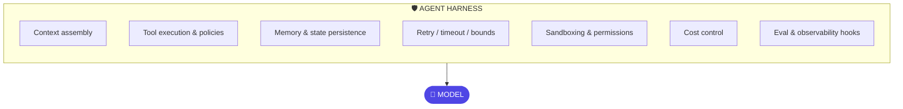

# Chapter 5: Agent Harness Engineering

> Put a frontier model into a badly designed agent system and you get a more articulate failure. The harness — not the model — is where reliability lives.

## 1. The architecture



The **harness** is everything around the model that makes an agent reliable. Five components form one interconnected design — **tools, prompts, memory, orchestration, and human-in-the-loop placement**. They are not five features to configure independently; a change to one shifts load onto the others. Better tools (Ch13) mean the model needs less prompt scaffolding to compensate for an awkward interface. Better memory (Ch9) means less context stuffing to re-explain what the system already knows. Get this coupling wrong and you end up "fixing" a tool problem by writing a longer prompt — which is how harnesses accrete into unmaintainable piles of instructions nobody can safely edit.

## 2. Why the industry needed it — the story behind the shift

2023–24 optimism said capability lives in the model, so wait for the next model release and reliability problems solve themselves. Production taught something different, and it's worth stating precisely because it's counter-intuitive: **two teams handed the identical model, the identical prompt, and the identical task produce measurably different reliability** — one team's agent runs clean for weeks, the other's needs a human to babysit it. The variable isn't the model. It's everything the diagram above lists.

Trace how a harness usually gets built, because the failure mode is almost always the same shape. Team ships a v1 agent as a thin wrapper: system prompt, a few tools, a while-loop. It works in the demo. It works for the first two weeks in production because early traffic is friendly. Then a tool call times out mid-run and the loop hangs for six minutes with no timeout to stop it. A fix goes in — a per-call timeout, bolted on where the hang happened. Two weeks later, a malformed tool argument crashes a downstream service; a validation check goes in, bolted on at that call site. Two weeks after that, someone notices the agent has no record of what it did last Tuesday when a customer disputes an outcome; logging goes in, wherever someone remembered to add a print statement. Nothing here is wrong per fix — every patch is locally reasonable. What's wrong is the *shape*: bounds, validation, and audit logging arrived as one-off patches scattered through the agent's own code, instead of as a harness layer the agent code calls into. Twelve months later this team has no coherent harness — they have an agent wearing a coat of individually-justified patches, none of which generalizes to the next agent they build. By 2026 "harness engineering" is a named discipline precisely because enough teams hit this same accretion pattern that the industry named the alternative: build the layer *first*, as infrastructure, not as a sequence of incident responses. The one-line version: **from clever prompts to reliable infrastructure.**

## 3. A worked example — hardening the dispute-investigation agent

Chapter 2's dispute-investigation agent (customer 4471's ₹4,300 POS dispute) was written as a five-turn reasoning loop with no harness around it — that was deliberate, to show the loop's mechanics in isolation. Rebuild it with a harness and watch what each layer actually buys, one at a time, because "add a harness" is abstract until you see the specific incident each piece prevents.

**No harness (Ch2's version).** The agent calls `fetch_transaction`, then `fetch_profile`, then reasons about policy, then calls `block_card` if it decides the dispute is fraud. Every one of those steps is a bare function call the model's own judgment triggers. Nothing validates the arguments the model constructs. Nothing times out a hung call. Nothing stops the model from calling `block_card` on the wrong customer if it misreads the transaction ID. Nothing records *why* it decided to block versus not block, beyond whatever text happened to land in the transcript.

**Layer 1 — tool policy.** Declare, outside the model's control, which tools this agent may call and under what conditions: `get_card_status` and `fetch_transaction` are `allow` (read-only, low risk); `block_card` is `hitl` — the model may *request* it, but a human must approve before it executes; `transfer_funds` doesn't appear in the policy at all, which means it is not merely "not offered to the model" but structurally impossible for this agent to call, full stop. This is the harness enforcing Ch1's control-flow-ownership question at the level of a single tool, not a whole workflow.

**Layer 2 — argument validation.** Before `block_card` reaches the human approver, the harness checks the arguments the model constructed: is `customer_id` a well-formed ID that matches the customer this run was invoked for? Is the reason code one of the enum values policy allows? A model that hallucinates a plausible-looking but wrong customer ID gets caught here, before a human ever sees the approval request — the human is approving a validated, well-typed action, not free text.

**Layer 3 — bounds.** Max 12 tool calls, 60-second wall clock per run, 60,000 token budget. If `check_policy`'s reasoning spirals (Ch2's "keeps second-guessing itself" failure), the run halts at the bound and surfaces "exceeded iteration bound, escalate to human" instead of quietly consuming budget forever.

**Layer 4 — sandboxing.** None of this agent's tools execute arbitrary code, so the sandbox requirement is thin here — but note it as a design decision, not an oversight: if a future tool ever lets the model run a generated script (e.g., a "compute the refund adjustment" helper), that tool runs in a container with no network access by default, because *any* code-execution tool is a sandboxing decision the moment it's added, not later.

**Layer 5 — persistence.** Every tool call and its result checkpoints into state (Ch4's checkpointer). Kill the process after `fetch_profile` returns and resume rebuilds exactly where it left off, without re-fetching the transaction or re-running any completed step.

**Layer 6 — cost control.** This run costs roughly $0.03 in model calls — trivial per-run, but the harness still enforces a per-user daily cap (Ch2's customer can't trigger 400 dispute investigations in an afternoon) and routes the cheap `fetch_*` reasoning to a smaller model, saving the frontier model's budget for `check_policy`'s genuinely hard interpretation step (Ch18's model-routing-by-step-type pattern, previewed here).

**Layer 7 — hooks.** Every one of the above — the tool call, the validation result, the bound check, the checkpoint, the routing decision — emits a trace event with a timestamp, a run ID, and enough structure to reconstruct exactly what happened for customer 4471's run months later, when a regulator or an internal auditor asks.

Seven layers, and notice none of them touched the model's reasoning. The `check_policy` step is exactly as intelligent as it was in Chapter 2. What changed is everything *around* it — which is the entire thesis of this chapter in miniature.

## 4. A failure story — the notification storm

A retail-banking chatbot team shipped `send_notification` as a tool an agent could call to text a customer when their dispute status changed. No per-user rate limit — the harness policy for that tool was, in effect, `{ grant: allow }` and nothing else. The agent had a subtle bug: an ambiguous state transition caused the `validate` node (in the Ch4 sense) to loop back and re-evaluate a dispute that was, in fact, already resolved — and each re-evaluation triggered a fresh "your dispute status has been updated" notification. Under normal traffic this bug was invisible, because the loop usually terminated in one or two extra passes. Under a batch reprocessing job that re-ran 6,000 stale disputes overnight to backfill a data migration, the loop compounded: some disputes cycled through the notification step dozens of times before a human noticed. By morning, roughly 41,000 SMS messages had gone out — many customers received the same "update" eight or ten times overnight — and the SMS vendor bill for that one incident ran past $9,000, on top of the customer-trust cost of a 2 a.m. text storm and the support-queue spike from confused customers calling in.

The fix was one line in the harness policy: `send_notification: { grant: allow, rate_per_user_day: 3 }` — exactly the line already sitting in this chapter's policy-as-data example below. That's the point of leading with the failure before the fix: a rate limit reads as boilerplate until you've seen what its absence costs, and every seasoned harness has a policy file with lines like this one written in the same blood-and-invoice-numbers way.

## 5. Design decisions

- **One harness, many agents.** The harness is platform, agents are tenants. Twenty teams each building their own retries, their own tool policy, their own trace format is how you get twenty half-harnesses — each with slightly different bugs, each audited separately, each a duplicate cost. This is the argument Chapter 21 formalizes as a platform decision, but it starts here: the first time you write a second agent and find yourself copy-pasting the first agent's timeout logic, that's the signal to extract a shared harness.
- **Policy as data, not code.** Tool grants, bounds, and budgets should be configuration a risk team can review line by line without reading a diff of Python. This isn't just a compliance convenience — it changes who *can* catch a mistake. A `rate_per_user_day` typo in a YAML file is visible to anyone who reads YAML; the same mistake buried in application code is visible only to the engineer who wrote it and whoever reviews that specific pull request.
- **Fail closed.** Unknown tool, malformed arguments, exhausted budget, sandbox denial — every one of these stops the run and surfaces the failure. The tempting alternative — "just let it continue and log a warning" — is how the notification storm above kept running for six hours instead of failing after the first anomalous burst.
- **Thin at first, thickened by evidence.** Don't build all seven layers from §3 before the first agent ships. Start with bounds, tool policy, and tracing — the three that are cheap to add early and expensive to retrofit after an incident — and add sandboxing, sophisticated cost routing, and elaborate validation as traces (Ch16) show where the real risk concentrates. The notification storm is exactly the kind of evidence that justifies adding rate limiting; better to have caught it in a red-team review than an invoice.

## 5b. Policy as data, visualized

```yaml
# harness-policy.yaml — reviewable by a risk team, no code reading required
agent: card-services
bounds:   { max_iterations: 12, run_token_budget: 60000, wall_clock_s: 180 }
tools:
  get_card_status:    { grant: allow,  timeout_s: 5,  retries: 2 }
  fetch_transaction:  { grant: allow,  timeout_s: 8,  retries: 2 }
  block_card:         { grant: hitl,   idempotency: required }   # human approves
  send_notification:  { grant: allow,  rate_per_user_day: 3 }    # the line the storm was missing
  transfer_funds:     { grant: deny }                            # absent = impossible
on_violation: fail_closed
```

The model never sees this file — the harness enforces it around every request the model makes. Notice each line answers a question a risk reviewer will actually ask: *what can this agent do, how often, and who signs off.* That's the test for whether a policy file is doing its job — read it out loud to a non-engineer and see if the questions it answers are the questions they'd ask.

## 6. Trade-offs

Harness rigor costs iteration speed early on. A team under demo pressure that spends the first sprint building bounds, sandboxing, and a full trace schema before shipping anything ships nothing in that sprint — and there's a real version of this critique that's correct: not every prototype needs seven layers on day one. The mature position from §5 holds: a thin harness from day one (bounds + tracing + tool policy — the three cheapest and most failure-preventing), thickened as traces reveal need. What's not defensible is the opposite failure — shipping *no* bounds at all because "we'll add it later" — because "later" in practice means "after the incident," and the notification storm's $9,000 lesson was cheap compared to what an unbounded `transfer_funds`-adjacent tool could cost under the same bug.

The other trade-off worth naming: a shared harness (§5's "one harness, many agents") is a dependency every agent team now has. If the harness team is slow to add a new tool-policy feature, every downstream agent team waits. This is a real platform cost, and it's the same cost every internal platform team accepts in exchange for consistency — Chapter 21 covers how to structure that relationship so it doesn't become a bottleneck.

## 7. Industry implementation

The best-known harnesses in production today are coding agents (Claude Code, Codex-style systems, Cursor's agent mode) — study them as *harness* case studies, not as coding tools, because the discipline is identical: aggressive context management (Ch8, deciding what code the model sees this turn out of a codebase far larger than any context window), sandboxed execution (generated shell commands run in a contained environment, not the host machine), permission prompts at dangerous actions (deleting a file, running an unfamiliar command — the HITL pattern from §3's `block_card`, generalized), and everything traced (every file read, every command run, every edit, logged). The awesome-harness-engineering ecosystem on GitHub catalogs the emerging toolchain — trace formats, sandboxing libraries, policy engines — and the pattern worth noticing across all of it: every serious lab in 2026 invests more engineering hours in the harness than in prompt text. AWS Bedrock AgentCore's Runtime and Harness components (Ch7) are the managed-cloud answer to the same problem — buy the bounds/sandbox/trace layer instead of building it, at the cost of less control over its internals.

## 8. Hands-on lab

Take your Chapter 2 raw loop (or the dispute-investigation agent from §3) and harden it in three passes, each with a deliberate-break test so you feel what the layer actually catches:

**Pass 1 — bounds and tracing.** Add a per-run token budget, a wall-clock timeout, and JSON trace events for every model and tool call. Break it: force a tool to hang (sleep past the timeout) and confirm the run halts gracefully with a clear "timeout exceeded" trace event, not a silent hang.

**Pass 2 — tool policy and validation.** Move tool grants into a YAML policy file like §5b's, add argument validation before execution, and set one tool to `hitl`. Break it: have the model construct a malformed argument (wrong ID format) for the HITL tool and confirm validation catches it *before* the human approval step — the human should never see an invalid request.

**Pass 3 — rate limiting and cost routing.** Add a per-user rate limit to whichever tool sends an external message or notification, and route the cheap reasoning steps to a smaller/cheaper model while keeping the frontier model on the genuinely hard step. Break it: script 20 rapid-fire calls that should trigger the rate limit and confirm the 21st is rejected with a clear reason, not silently dropped or silently allowed.

Deliverable: a one-page incident report, written as if each break actually happened in production — what would have gone wrong without the guard, using the notification-storm story in §4 as your template for tone and specificity (name a plausible cost, a plausible customer-facing symptom, a plausible time-to-detection).

## 9. Architect's take: the banking read

In a bank the harness is where policy becomes enforcement. "The agent won't do X" is a hope if X is merely discouraged by prompt wording, and a control if X is prevented by the harness — no tool grant exists, no network path exists, the budget cap halts the run. Frame every harness component as a named control — bounds, grants, sandbox, audit trail — and your agent platform inherits the vocabulary your risk and audit functions already speak: a "bound" is a limit control, a "grant" is an access control, a "trace" is an audit log. This framing alone differentiates an architect's presentation from an engineer's demo, and it's the difference between a risk committee asking "how do we know it won't do that" and being handed an answer versus being handed reassurance.

## Governance & security lens

The harness is where policy stops being a request and becomes enforcement: grants, bounds, budgets, and sandbox rules live here as *data a risk team can review* without reading code, and violations fail closed. Governing questions: **who approves changes to the policy file, is it version-controlled with the same rigor as code, and does every enforcement decision (blocked tool, exhausted budget) land in the audit stream?** A harness whose policy can be changed by the same engineer who writes the agent, without review, is a control on paper only — separation of duties applies to configuration, not just money.

## Interview-ready lines

- "Model quality sets the ceiling; harness quality sets the floor — and production lives on the floor."
- "The model requests, the harness decides and executes. That boundary is where both reliability and security live."
- "Harness policy should be data a risk team can review, not code they must trust."
- "A prompt is a request; the harness is a fact."
- "Harnesses that grow one incident-response patch at a time end up as a coat of fixes with no coherent shape — build the layer before the first incident, not after."
- "A missing rate limit isn't a style nitpick — it's an unbounded loop wearing a different tool. I've seen what that costs by the invoice."
