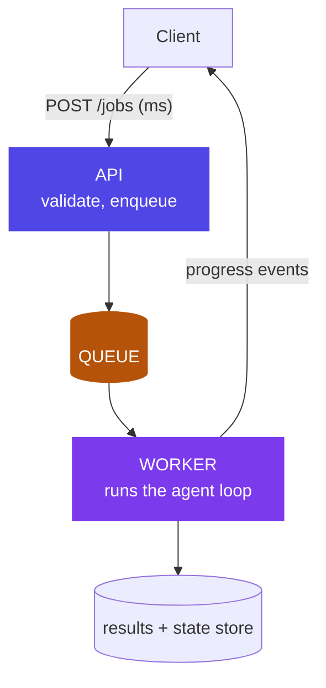

# Chapter 6: Backend & System Design for Agent Services

> A web app answers in milliseconds. An agent thinks for minutes. That one difference drives the entire backend design.

*Source: Karan Shingde, "Designing the Backend for Agent Systems (Part 2)," AI That Ships.*

## 1. The anti-pattern everyone writes first

```python
@app.post("/agent")
def run(req: Request):
    return agent.run(req.prompt)   # DO NOT ship this
```

Six ways it fails, worth memorizing because each maps to a component of the fix:

1. Holds a connection open for 90–120s (browsers and load balancers time out)
2. Client disconnect = job lost
3. Network retry = the whole expensive run re-executes
4. User sees a spinner with zero information
5. No way to cancel mid-run
6. Failure at step 9 of 10 loses everything

## 2. Why the industry needed it — a duplicate refund, traced to its root cause

Every team that ships the anti-pattern above discovers its cost the same way: not in a design review, but in an incident. Here's a representative one, close enough to real production postmortems to be instructive.

A card-services team shipped the dispute-investigation agent from Chapter 2 behind exactly the sync endpoint in §1. It worked fine in testing — test runs finish in 8-12 seconds, well inside any timeout. In production, `check_policy`'s reasoning occasionally ran long: a genuinely ambiguous dispute could push total run time past 90 seconds, and the mobile app's HTTP client had a 60-second timeout. When that happened, the app showed the customer an error and — because the app's retry logic treated any failed request as safe to resubmit — silently retried the identical request a few seconds later. The *first* run was still executing on the server; the retry created a *second*, fully independent run. Both runs reached the same conclusion (approve the dispute, issue a refund) and both called `issue_refund`. The customer received two refunds of ₹4,300 for the same disputed transaction, eleven days apart in the reconciliation report from when anyone noticed — because nothing about either run looked wrong in isolation; two refunds for two "different" job executions is only anomalous once you know they were answering the same customer complaint.

The root cause was not the agent's reasoning — `check_policy` was correct both times. The root cause was architectural: a request that can silently retry into a system with no idempotency key and no notion of "this exact job already ran" will eventually double-execute a real-world side effect. Fixing the prompt would have done nothing. Fixing the backend shape is the only fix that closes this class of bug entirely, which is the argument for treating backend design as a first-class architecture decision for agents, not an implementation detail beneath it.

## 3. The workload properties that drive the design

Agent workloads are **long-running, asynchronous, iterative, and expensive to retry** — each property individually rules out the sync anti-pattern, and together they point at one shape: split the fast path from the slow path.



## 4. The components — and what each one specifically prevents

Walk these against the duplicate-refund incident in §2, because every component here maps to a specific way that incident could have been stopped.

- **Submission API** — `POST /jobs` returns a `job_id` in milliseconds. Idempotency keys so a retried submit doesn't create duplicate expensive runs — this alone would have stopped the refund incident: the retried request carries the same idempotency key as the original, the API recognizes it, and returns the *existing* job instead of starting a second one.
- **Queue** (Redis/SQS/RabbitMQ) — decouples acceptance from execution; absorbs bursts; enables priority tiers and per-tenant fairness. This is also where a second failure mode gets solved: imagine one bank branch triggers a 5,000-job batch reprocessing run during a data migration. Without a queue with fairness policy, those 5,000 jobs occupy every worker and the contact center's real-time dispute lookups — which should complete in seconds — queue behind them, and customer wait times spike past 40 minutes. A priority tier (interactive traffic ahead of batch traffic) or per-tenant fair-share scheduling prevents one tenant's burst from starving another's latency-sensitive path.
- **Worker pool** — consumes jobs, runs the harness (Ch5) and graph (Ch4). Scales independently of the API. Holds entire agent runs in memory — size it ~2x the API (Ch7).
- **Progress streaming** — SSE (simpler, one-way, usually right) or WebSockets (bidirectional, needed only if the user talks back mid-run). Stream *events* (step started, tool called, tokens) not just final output — this is the spinner fix, and it's also a trust fix: a customer watching "checking transaction… checking policy… preparing recommendation" trusts the system more than one watching a blank spinner for 40 seconds, even at identical total latency.
- **State & results store** — Postgres for jobs/results/sessions; checkpoints (Ch4) make failure at step 9 resume at step 9, not restart at step 1.
- **Cancellation** — a flag the worker checks between nodes; graphs make this clean (finish current node, stop at the edge) rather than killing mid-tool-call and leaving a half-executed side effect.
- **Session management** — conversations span jobs; session state lives in the store, never in worker memory, because a worker can die between jobs and a new worker must be able to pick up the next job for that session with full context.
- **Rate limiting & cost control** — per-user job quotas, per-run token budgets, queue-depth backpressure. An agent endpoint without rate limits is a blank check, and it's the backend-level twin of Chapter 5's harness-level rate limiting — one throttles tool calls *within* a run, this throttles job submission *across* runs.

## 5. The fix, visualized (~15 lines)

```python
@app.post("/jobs")                                    # FAST PATH: milliseconds
async def submit(req: JobRequest, idem_key: str = Header(...)):
    if existing := await store.by_idempotency(idem_key):
        return existing                               # retried submit ≠ second run
    job = await store.create(req, status="queued")
    await queue.push(job.id)
    return {"job_id": job.id}

@app.get("/jobs/{id}/events")                         # progress, not spinners
async def events(id: str):
    return EventSourceResponse(store.stream_events(id))   # SSE

# worker.py — SLOW PATH, separate process, no HTTP anywhere
while True:
    job_id = queue.pop()
    run_graph(job_id, checkpointer=saver)             # crash → resume at last node
```

Trace the duplicate-refund incident through this code: the mobile app's retry arrives with the *same* `idem_key` as the original request (a well-built client generates the idempotency key once per user action, not once per HTTP attempt). `store.by_idempotency(idem_key)` finds the original job — already queued or already running — and returns its `job_id` instead of creating a second job. One dispute, one investigation, one refund, no matter how many times the network makes the client retry.

## 6. Design decisions

- **Sync façade where products need it**: you can still offer "wait up to 30s then return or hand back job_id" — but built *on* the async core, never instead of it. A product team asking for "just make it feel synchronous for short requests" is a legitimate ask; the API layer can poll internally and return fast when the job happens to finish quickly, while every job still goes through the same idempotent, queued, checkpointed path underneath.
- **Structured outputs at the boundary**: workers persist typed results (validated JSON), not prose; downstream systems consume the type, and the UI renders from it. This also makes the duplicate-refund class of bug easier to catch in monitoring — a typed `refund_issued` event with an amount and a transaction ID is trivial to reconcile against the transaction ledger; free-text output isn't.
- **One image, two commands**: API and worker run the same container image with different entrypoints, so they can never run different code — no scenario where a hotfix reaches the API but not the worker, silently. This becomes a deploy invariant in Ch7.
- **Queue semantics**: at-least-once delivery + idempotent job handling beats exactly-once promises, because exactly-once delivery across a network is not actually achievable — design the job, not the queue, for redelivery. Every job handler should be safe to run twice with the same input and produce the same observable outcome once.

## 7. Trade-offs

The async architecture costs you: more moving parts (a queue is a new operational dependency with its own failure modes), eventual consistency in UX ("queued… running…" instead of an instant answer), and an operational surface to monitor (queue depth, worker health, dead-letter handling for jobs that fail repeatedly). It buys you: survivable disconnects, resumable failures, backpressure, cancellation, and honest progress — and, per §2, it closes an entire class of duplicate-side-effect bugs that no amount of careful prompt engineering can close from the model side. For anything beyond a demo that never touches a real side effect, the trade is not close: the moment an agent can issue a refund, block a card, or send a message a human will read, the sync anti-pattern is a standing liability, not a shortcut.

The one real counter-case: a genuinely short, read-only, side-effect-free agent call (e.g., "summarize this document" with no tool calls) can reasonably stay synchronous — the async machinery's cost isn't worth paying for a call with nothing to retry into a duplicate. The dividing line is the same one Chapter 1 uses for "is this even an agent": does this call touch state or trigger a side effect anyone would care about happening twice? If not, a plain synchronous endpoint is honest and correct.

## 8. Industry implementation

This is the shape underneath every serious agent product: ChatGPT-style deep research, coding agents, document processors — all job-queue-worker with streamed progress. FastAPI + Celery/RQ + Redis + Postgres is the common self-hosted stack; managed equivalents (SQS + ECS workers) appear in Ch7. LangGraph Platform and similar sell exactly this layer — evaluate them as "backend-in-a-box" against building it: the honest comparison question is the same one Chapter 4 raised for orchestration frameworks — where does state live, who owns retries, and what happens on a crash at step 9 of 10 — asked here at the level of the whole service instead of a single graph run.

## 9. Hands-on lab

Convert your Ch4 graph into a service, in stages, each with a specific failure to reproduce and fix:

**Stage 1 — the anti-pattern, on purpose.** Wire your Ch4 graph behind the sync endpoint from §1. Fire two identical requests within a second of each other (simulating a client retry) and confirm you get two independent runs — reproduce the duplicate-refund bug yourself before fixing it, so the fix means something.

**Stage 2 — the async core.** Build the FastAPI submission endpoint with an idempotency key, a Redis queue, and a worker process running the graph with checkpoints. Re-run the two-identical-requests test from Stage 1 and confirm you now get one job, one run.

**Stage 3 — progress and control.** Add SSE progress streaming and `DELETE /jobs/{id}` for cancellation, plus a per-user limit of 3 concurrent jobs. Kill the worker mid-job; prove the job resumes at the last checkpoint, not from zero. Disconnect the client mid-stream; prove the job finishes anyway and the result is retrievable afterward. Submit a 4th concurrent job as the same user and confirm it's rejected with a clear reason.

Deliverable: a short incident report for the Stage 1 bug you reproduced, written the way you'd write it for a real postmortem — root cause, blast radius, the specific architectural fix, and why a prompt-level fix wouldn't have worked.

## 10. Architect's take: the banking read

Bank infrastructure reviews will ask exactly these questions — timeout behavior, retry semantics, idempotency, backpressure, DR — because they're the same questions asked of any transaction system, agentic or not. Answering them fluently for agents is how you establish that agentic AI is an engineering discipline, not an experiment. Extra banking notes: idempotency is non-negotiable where a duplicated job could duplicate a customer action, per §2's refund incident; per-tenant fairness matters when one branch's batch upload must not starve the contact center, per §4's queue-starvation scenario; and the queue is an audit point — every job's submission, ownership, and outcome is a record you can hand to an auditor asking "show me everything this agent did for this customer, in order, with timestamps."

## Governance & security lens

The job system is an audit and safety layer, not just plumbing: every job records who submitted it, under what identity, with what outcome — the queue is a ledger. Idempotency keys are a *customer-protection* control (a network retry must never duplicate a real-world action, as §2's refund incident shows concretely); per-tenant quotas and backpressure are availability controls; cancellation is the operational kill lever for a single run. Governing questions: **can we reconstruct any job end-to-end from records, are all payloads encrypted in transit and at rest, and does a replayed message ever cause a second side effect?** That last question isn't rhetorical — it's the exact test that would have caught §2's bug in a design review, before it reached a customer.

## Interview-ready lines

- "Agent workloads are long, async, iterative, and expensive to retry — so split the fast path from the slow path."
- "Return a job_id in milliseconds; stream events, not spinners."
- "At-least-once delivery plus idempotent jobs beats exactly-once promises."
- "The API accepts, the queue absorbs, the worker thinks, the store remembers."
- "A retried request without an idempotency key isn't a network detail — it's a duplicate refund waiting for a slow tool call to happen once."
- "Ask what happens on a crash at step 9 of 10 — if the honest answer is 'restart from zero,' the backend isn't done yet."
