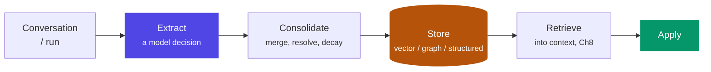

# Chapter 9: Memory Architecture

> The design question is not "how do agents remember?" — it's "what should be remembered, for how long, visible to whom, and forgettable on demand?"

## 1. The taxonomy

| Memory type | Contains | Lifetime | Example |
|---|---|---|---|
| Short-term | Current conversation | Session | The last few turns |
| Working | Current task state | Run (Ch4 state) | Plan, intermediate results |
| Episodic | What happened before | Long | "Last month this customer disputed a charge" |
| Semantic | Facts we know | Long | "Customer prefers Hindi; salaried; has a home loan" |
| Procedural | How to do things | Long | Learned resolutions, playbooks |

Short-term and working memory are really *state* (Ch2's distinction). The architecture problem is the long-term kinds: extraction, storage, retrieval, and governance.

## 2. Why the industry needed it — a fraud flag that outlived its own evidence

The abstract argument for memory governance is easy to nod along to; the concrete version is what makes it stick. A digital-banking assistant, early in its rollout, had a memory-writing step that ran after every interaction: a small model looked at the conversation and extracted "worth remembering" facts with no allowlist constraining what counted. During one interaction, a customer's transaction pattern briefly resembled a known fraud signature — a rapid sequence of small transactions followed by one large one — and the extraction step wrote `"customer exhibits fraud-risk transaction pattern"` to long-term memory, unattributed to any specific case number, with no expiry, no confidence score, and no link back to whichever fraud-review process (if any) had actually looked at it.

It turned out to be a false positive — the large transaction was a legitimate down payment the customer had been saving toward for months, and no fraud case was ever opened. But the memory persisted, because nothing in the system was designed to expire or reconsider it. Over the following eight months, that stored fact surfaced across fourteen separate interactions: it subtly weighted the agent's tone (slightly more cautious phrasing), it appeared as context in two escalations to human agents (who saw "flagged: fraud-risk pattern" and treated the customer with unwarranted suspicion), and it eventually contributed to a loan pre-approval agent declining to fast-track an application it would otherwise have fast-tracked. The customer noticed the pattern of unexplained friction, complained, and — because nobody could produce the original evidence for the flag, only the flag's persistent shadow across unrelated interactions — the complaint escalated to the banking ombudsman. The post-incident review found the root cause wasn't the original false-positive detection (false positives are expected and tolerable); it was that the *memory write* had no provenance, no confidence threshold, and no expiry, so a single unverified inference became permanent institutional "knowledge" about a customer with no path back to reconsider or delete it.

This is why memory design carries more governance weight than context design (Ch8): a poisoned context affects one call, gone at the end of the run. A poisoned memory, per this incident, affects every future interaction until someone notices — and "someone notices" took eight months and an ombudsman complaint here.

## 3. The memory pipeline



Each stage is a failure mode, and §2's incident touched three of the four: **extract too eagerly** and you store noise (and liabilities) — the fraud-pattern inference should never have passed an extraction policy that only allowed stated facts and confirmed case outcomes; **consolidate poorly** and memories contradict or, as here, simply never get revisited once the underlying situation resolved; **retrieve badly** and the agent "remembers" irrelevant things at the wrong moment — surfacing an unresolved risk flag in a loan pre-approval context it had no evidentiary connection to.

## 4. The 2026 framework landscape (architect's comparison)

Mem0, Zep, Letta, LangMem, Cognee dominate the open conversation; **Bedrock AgentCore Memory** is the managed entrant — explicit short-term (multi-turn, session-scoped) and long-term (cross-session, sharable across agents) stores with extraction strategies you configure rather than build, attractive when the rest of the stack is AgentCore (Ch7 §8) and subject to the same governance axes below. Compare them on the axes that matter, not features: *where extraction runs* (inline vs async), *storage model* (vector-only vs temporal knowledge graph — Zep/Cognee lean graph, which pays off exactly when relationships and time matter), *whether consolidation is real* (updating and contradiction-handling vs append-forever — note that append-forever storage is exactly what let §2's flag persist unchallenged; a store that actively reconsiders old entries against new evidence is structurally safer), and *governance surface* (per-user isolation, TTL, deletion APIs). For a bank, the last axis is usually decisive — and it's the one feature checklists skip. Build-vs-buy: memory frameworks are young; the storage layer is replaceable, but the *schema of what you remember* is yours forever — design that yourself regardless.

## 5. A governable memory record, visualized

```python
class Memory(BaseModel):
    customer_id: str            # partition key — isolation is STRUCTURAL
    kind: Literal["episodic", "semantic", "procedural"]
    fact: str                   # "prefers Hindi for service calls"
    source_ref: str             # trace/conversation id — provenance = deletability
    confidence: float           # §2's fix: unconfirmed inferences never reach "fact" status
    purpose: str                # DPDP purpose limitation, checked at retrieval
    ts: datetime
    ttl_days: int | None        # stale facts expire; balances aren't facts; RISK FLAGS especially aren't

def recall(customer_id, query, purpose):
    return search(query,
        filter={"customer_id": customer_id, "purpose": purpose, "confidence__gte": 0.8})  # BEFORE similarity
```

Everything the governance sections below demand is a *field*, not a hope. Trace §2's incident through this schema: `"customer exhibits fraud-risk transaction pattern"` with no confirmed fraud case behind it would either fail the extraction policy outright (§6's allowlist) or land with a low `confidence` and a short `ttl_days` — either way, it would not have survived eight months and fourteen retrievals as an unexamined fact.

## 6. Design decisions

- **Remember by policy, not by default.** Define categories the system MAY store (stated preferences, case history, *confirmed* case outcomes) and categories it must NOT (inferred traits, unconfirmed risk signals, sensitive attributes without purpose). Extraction runs against the policy — §2's flag is precisely the category this allowlist exists to exclude: an inference about the customer, not a stated or confirmed fact.
- **Provenance per memory**: source conversation, timestamp, confidence. Unattributable memories are undeletable and unauditable — and, per §2, unreviewable: nobody could trace the fraud flag back to whatever momentary pattern triggered it, which is exactly what made it impossible to correct once it turned out to be wrong.
- **Scope boundaries**: per-customer memory must be structurally isolated (partition keys, not prompt discipline) — retrieval for customer A must be *unable* to return customer B, enforced the same way §8's `check_policy` filters by `customer_id` before similarity search runs at all.
- **Expiry as a feature**: balances change, addresses change, and risk assessments change fastest of all. Prefer durable phrasings, timestamp everything, decay what's stale — a `ttl_days` on a risk-adjacent inference should be measured in days or weeks, not "forever by default," which was §2's actual bug.
- **Forgetting on demand**: deletion is an API and a regulatory obligation (DPDP right to erasure), which means derived artifacts (summaries, embeddings) must be traceable to their sources — a customer who successfully disputes a stored inference needs that dispute to actually remove it from every derived form, not just the primary record.

## 7. Learning and adaptation — memory's active cousin

Memory stores; **learning changes future behavior**. Without touching model weights, agent systems adapt through: **procedural memory** — successful resolutions distilled into playbooks the agent retrieves ("last 5 KYC-exception cases resolved via steps X-Y-Z"); **feedback incorporation** — HITL corrections (Ch20) and eval outcomes (Ch17) written back as do/don't exemplars, making the traces→evals flywheel also a traces→behavior flywheel; **self-reflection** — post-run critique ("what would I do differently?") stored and retrieved for similar future tasks (the Reflection pattern, Ch3, pointed at the long term). The governance catch, and it's the same lesson §2 taught the hard way: a system that adapts is a system that *drifts* — learned content needs the same provenance, review thresholds, and rollback as any memory write, and in a bank, a changed behavior needs a traceable cause (an MRM expectation, Ch20). Design learning as versioned, reviewable memory — never as silent accumulation, because silent accumulation is exactly the mechanism that let one false-positive inference become eight months of unexamined institutional behavior.

## 8. Why bad memory is worse than no memory

Wrong personalization (acting on stale or misattributed facts) destroys trust faster than forgetfulness — §2's customer would have been better served by an agent with no memory of the fraud-pattern moment at all than by one that carried it forward uncritically. Memory is also an attack surface — a poisoned memory persists across sessions, unlike a poisoned context (Ch8), which is scoped to one call. And every stored personal fact is a data-protection liability with a lifecycle. The bar for writing to memory should be *higher* than the bar for using context, precisely because a bad context decision costs one call and a bad memory decision, per §2, can cost eight months and an ombudsman complaint.

## 9. Industry implementation

Consumer assistants (ChatGPT memory, Claude memory) converge on: explicit extraction with user visibility, editable/deletable stores, and category exclusions for sensitive data. Enterprise deployments add tenancy isolation and retention schedules. Notice the pattern: the mature implementations spend most of their design on *governance*, not recall quality — recall quality is the easy 80%; the governance surface (confidence thresholds, provenance, expiry, deletion) is the hard 20% that determines whether the system is safe to run on real customers, and it's exactly the 20% that was missing in §2.

## 10. Hands-on lab

Build a minimal memory layer for the banking agent, in stages that specifically test for §2's failure mode:

**Stage 1 — the naive version, on purpose.** An extraction step (small model + a loose prompt with no allowlist) writing whatever it judges "worth remembering" to Postgres + embeddings, with no confidence field and no TTL. Feed it a conversation containing an ambiguous, unconfirmed risk signal (mirroring §2) and confirm it gets stored as an undifferentiated fact.

**Stage 2 — the governed version.** Add the allowlist extraction policy, the `confidence` and `ttl_days` fields from §5's schema, and a retrieval filter requiring `confidence >= 0.8`. Re-run the same ambiguous conversation and confirm the low-confidence inference either doesn't get stored or expires quickly and never surfaces in a later, unrelated retrieval.

**Stage 3 — structural isolation and erasure.** Build retrieval that filters by customer partition *before* similarity; attempt a cross-customer retrieval and prove it structurally impossible (not just unlikely). Add a `DELETE /customers/{id}/memories` endpoint and prove it provably clears derived data — embeddings included, not just the primary record.

Deliverable: a short write-up tracing §2's incident through your Stage 1 system (showing it reproduces the failure) and then through your Stage 2/3 system (showing the same input no longer produces a persistent, unreviewable flag).

## 11. Architect's take: the banking read

RBI/DPDP framing turns memory design into three enforceable statements: (1) purpose limitation — memories are stored under a named purpose and retrieved only for it; (2) minimization — the extraction policy is an allowlist, reviewed like any data-collection form; (3) erasure — deletion cascades to embeddings and summaries, demonstrable in audit. §2's incident is what happens when a fourth, implicit statement is missing — *reconsideration*: any stored inference that influenced a customer-facing decision needs a path back to being challenged, corrected, or expired, not just a path to eventual deletion on request. An agent memory system you cannot make these statements about is not deployable in an Indian bank, whatever its recall benchmarks say.

## Governance & security lens

Memory is the layer where a governance failure *persists*: a stored inference, a cross-customer leak, or a poisoned memory outlives the session that created it — §2's fraud flag outlived it by eight months and fourteen interactions. The controls are structural, not procedural — allowlist extraction policy, confidence thresholds, purpose tags checked at retrieval, partition isolation, provenance on every record, TTLs, and erasure that cascades to derived artifacts. Governing questions: **can we show a regulator every memory held about a customer, why each was collected, and delete them provably; can any write reach memory without passing the policy; and does any inference that influenced a customer-facing decision carry a confidence score and an expiry?** (This chapter and Ch19/20 are where the lens originates; the summary here is the checklist.)

## Interview-ready lines

- "The bar for writing memory should be higher than the bar for using context — memory persists, and so do its mistakes."
- "Isolation by partition key, not prompt discipline."
- "A memory without provenance is undeletable — and therefore non-compliant by construction."
- "Frameworks are replaceable; your memory schema and policy are the architecture."
- "An unconfirmed inference with no confidence score and no expiry doesn't stay a hypothesis — it quietly becomes institutional fact. I've seen it take eight months to get challenged."
- "A poisoned context costs one call; a poisoned memory costs every call until someone notices — that asymmetry is why memory governance is stricter than context governance."
