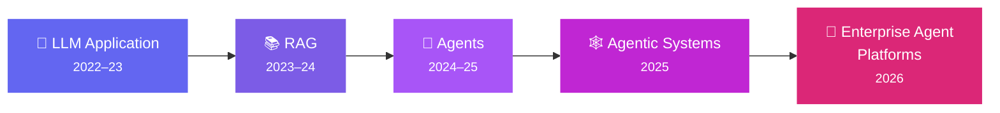
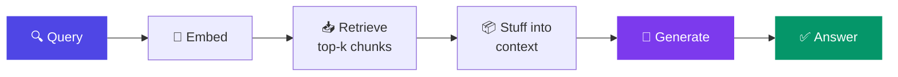

# Chapter 1: The Evolution of AI Systems

> Each generation of AI system exists because of a specific **architectural failure** of the previous one. Name the failure and you understand the generation.

## 1. The framing



Most people learn this ladder as a timeline. That's the shallow version. The deep version is that each rung is a *response to a named architectural limitation* of the rung below — and once you can name the limitation, three things follow: you can explain *why* the industry moved (not just that it did), you can predict what the next rung must fix, and most importantly you can **place any use case on the correct rung** instead of defaulting to the newest one. The ladder is not a maturity scale where higher is better. It is a placement decision per use case, and placement is the first thing this chapter teaches you to defend.

## 2. Generation 1 — The LLM Application (2022–23)

### What it is, mechanically

Architecturally, a Gen-1 system is a stateless function: `text in → text out`. The application layer is thin — it collects a prompt, calls the model API, and displays the response. ChatGPT's launch in November 2022 created a gold rush of "GPT wrappers": a UI, an API key, sometimes a system prompt with brand personality. Some were genuinely useful. All of them shared the same three failures, because the failures were in the architecture, not the implementation.

### The three failures, worked through a bank's eyes

**Frozen knowledge.** The model's knowledge stops at its training cutoff. Ask a 2023-trained model about a repo-rate change from last month and it will answer from a world that no longer exists — fluently. For a bank, this isn't an inconvenience; it's a correctness time-bomb, because policy, pricing, and regulation change monthly.

**No access to your data.** The model has read the public internet; it has never seen Axis Bank's loan prepayment policy, your product catalog, or a single customer record. Ask "what's the foreclosure charge on my home loan?" and the model has literally no path to the answer. It will produce *a* foreclosure-charge answer — a plausible-sounding one drawn from the statistical shape of every bank policy it read during training. Which leads to failure three.

**Confident generation without knowledge — hallucination.** Here is the point most explanations miss: hallucination is not a bug in the model, it is the *correct behavior of the architecture*. A language model's job is to produce the most plausible continuation of the text. When it knows the answer, plausible and true coincide. When it doesn't, plausible wins alone — and the model has no architectural mechanism to tell the difference, because nothing in `text in → text out` contains a step called "check whether I actually know this."

### The diagnosis that sets up everything else

These three failures share a root: **the model is the entire system, and a model is not a system.** A system has components with responsibilities — something that knows current facts, something that checks claims, something that acts. Gen 1 has one component doing everything, and a better model doesn't fix it: GPT-4 hallucinated your foreclosure charges more eloquently than GPT-3.5 did. When you hear "the next model will fix this," the Gen-1 lesson is the rebuttal: *architectural failures don't yield to model quality.* That sentence recurs in every chapter of this curriculum.

## 3. Generation 2 — RAG (2023–24)

### The architectural insight

RAG's move was to **separate knowledge from the model**. Instead of hoping knowledge lives in the weights, put it in a retrieval layer and inject it into the context window at query time:



Walk the pipeline once concretely. Your policy documents are split into chunks and embedded into vectors offline. At query time, "what's the foreclosure charge on my home loan?" is embedded too; the nearest chunks — hopefully the foreclosure section of the housing-loan policy — are retrieved and pasted into the prompt above the question, with instructions to answer *from the provided context*. Now the model isn't asked to know anything; it's asked to *read*. Knowledge updates by re-indexing a document, not retraining a model. Answers can cite sources. Two of Gen 1's three failures — frozen knowledge, no access — fall immediately, and the third (hallucination) is reduced because generation is grounded in retrieved text.

RAG was and remains a genuinely great architecture. Chapter 10 is devoted to doing it properly, because "RAG is old news" is a junior take — RAG didn't die, it became a component. But it has a structural ceiling, and the ceiling is what forced Gen 3.

### The ceiling: RAG is a fixed pipeline

Every query — trivial or complex — takes the same path: one embed, one retrieve, one generate. That fixedness produces four failures. They look different; they are one failure in four costumes.

**Can't decompose.** Ask: *"Compare our home-loan prepayment rules in 2023 with today's, and explain what changed for a customer who took a loan in 2022."* Answering requires retrieving the 2023 policy, separately retrieving the current policy, and synthesizing a comparison with the customer's situation applied. The pipeline gets one retrieval. It embeds the whole question, pulls chunks that are *sort of* about prepayment, and generates a comparison from whatever mixture arrived. Sometimes it lucks out. It has no mechanism to *plan* two retrievals, because there is no planning step anywhere in the architecture.

**Can't recover.** Suppose retrieval goes wrong — the query says "foreclosure" but the policy says "pre-closure," and the embedding match pulls the credit-card annual-fee section instead. What happens next? Generation proceeds on garbage, confidently. Nothing in the pipeline looks at the retrieved chunks and asks, "does this actually answer the question?" There's no feedback edge in the diagram — data flows one way, and no step can send it back.

**Can't choose.** "How many customers prepaid their home loans last quarter?" is not a document question — it's a SQL question. The pipeline has one hardwired knowledge path (the vector store), so it retrieves policy prose *about* prepayment and generates something that looks like an answer to a question that needed a database. The system can't say "this question is shaped for a different source" because choosing sources isn't a step that exists.

**Can't act.** "Block my card, I lost it." The retrieval layer dutifully finds the card-blocking policy; the model generates a beautifully grounded, correctly cited paragraph *about how card blocking works*. The customer did not want a summary. Producing text is the only verb the architecture has.

### The unifying diagnosis

Look at where intelligence sits in the RAG diagram: entirely in the generate box, at the end. Everything before it — chunking, embedding, retrieval count, source selection — is dumb, hardcoded, and blind. **The smartest component in the system has zero say over what the system does.** It cannot request a second retrieval, veto bad chunks, redirect to SQL, or trigger an action, because the pipeline's control flow was frozen in code before the query arrived. Once you see the four failures as this single failure, the next generation designs itself.

## 4. Generation 3 — Agents

### The defining move

> **An agent is what you get when you move control flow from code into the model.**

Instead of a pipeline that *calls* the model as its final step, you build a loop in which the model *decides what happens next*. Give it a goal, a set of tools (retrieve documents, query SQL, call the card-blocking API), and let it reason: What do I need? Which tool gets it? Did that work? What next? Am I done?

Watch the four failures dissolve on the comparison question that broke RAG. The agent reads the question and *plans*: "I need the 2023 policy and the current policy — two retrievals." (Decomposition: it's just a decision now.) The first retrieval returns credit-card content; the agent observes this, notes the mismatch, rewrites the query with "pre-closure" and retries. (Recovery: also just a decision.) The customer-count sub-question gets routed to the SQL tool. (Choosing: a decision.) And if the conversation ends with "actually just block the card," the agent calls the blocking API — through an approval gate we'll design in Chapter 20. (Acting: a decision, wrapped in governance.) Nothing here required a smarter model than RAG used. It required the smartest component to be *given the wheel*.

### The discriminator that settles every "agent vs X" debate

All the definitional noise — is it an agent? is it just a chatbot with tools? — collapses into one question: **who owns control flow?**

| System | Control flow owned by | Intelligence used for |
|---|---|---|
| Chatbot | Nobody (single turn) | Generating a reply |
| Workflow | Code (deterministic) | Individual steps within it |
| Agent | The model | Deciding what to do next |
| Autonomous system | The model, plus it initiates goals | Everything, unsupervised |

Three clarifications that mark senior understanding. A workflow containing ten LLM calls is still a workflow if code decides the sequence — LLM *usage* doesn't make something agentic; LLM *control* does. An agent that must ask a human before acting is still an agent — **autonomy is a dial, not part of the definition** (Chapter 20 designs the dial). And "autonomous system" is a different thing again: an agent pursues a goal you gave it; an autonomous system also decides *what goals to pursue* — almost nothing in an enterprise should live there.

## 5. Generation 4 — Agentic Systems: the correction

### The hangover

Through 2023–24 the industry sprinted toward "give the model full control" — AutoGPT-style loops that would, given a goal, autonomously plan and execute indefinitely. The demos were intoxicating. Production told a different story, and it's worth telling as a story because you will be asked for it.

A team ships a pure-loop agent for supplier-invoice reconciliation. In testing it's brilliant. In production, week two: one malformed invoice sends the agent into a retrieve-reason-retry spiral that burns through $400 of tokens overnight before anyone notices — there was no iteration bound, because the loop was the architecture. Week three: two identical invoices, run minutes apart, produce different reconciliations — one path retrieved an extra document and reasoned differently. Finance asks which one is correct; the honest answer is "both were plausible," which is not an answer finance accepts. Week four: audit asks for the decision procedure; the team hands over 40-turn transcripts. The project is quietly shelved. Nothing in this story involves the model being *bad* — every individual decision was locally reasonable. The system was ungovernable.

### The diagnosis and the retreat

**Non-determinism is the cost of Gen 3's move.** Everything enterprises need — predictable latency, bounded cost, reproducibility, auditability, testability — comes from determinism. Everything that makes agents valuable comes from surrendering it. Gen 4 is the industry's *partial retreat*: put deterministic structure back around the intelligence, without taking back the wheel entirely.

The instrument is the **graph** (Chapter 4): declared states, declared transitions, the model choosing *within* nodes and at *declared* branch points, never inventing paths. Checkpoints, retries, iteration bounds, validation gates, and human interrupts live in the deterministic layer. The invoice agent, rebuilt as a graph, has a 10-turn bound (cost capped), checkpointed steps (reproducible, resumable), and a validation node before anything posts to the ledger (auditable). It is still an agent — the model still decides how to reconcile — but the *envelope* is engineered.

This gives you the central design question of the entire field, asked per decision point, in every chapter that follows:

```text
 Deterministic code owns it          Model owns it
 ◄───────────────────────────────────────────────►
 predictable, auditable,             flexible, adaptive,
 testable, boring                    powerful, unpredictable
```

There is no globally correct position on this dial. There are only correct positions *per decision*, and the architect's job is choosing them deliberately and being able to say why.

## 6. Generation 5 — The Enterprise Agent Platform

Now scale the picture organizationally. It's 2026; your bank has one agent in production and eleven teams building more. Each team is independently building: retry logic, tool integrations, context management, tracing, eval harnesses, guardrails. Twenty half-built harnesses, none audited to the same standard, three different answers to "which systems can agents touch?" This is where platform thinking becomes forced, not fashionable: centralize the harness (Ch5), the tool gateway (Ch14), observability (Ch16), evals (Ch17), and governance (Ch20) into shared infrastructure, and let teams ship *agents* rather than agent-infrastructure. Chapter 21 designs this platform; every chapter between here and there builds one of its layers. The arc of the whole curriculum is this chapter's ladder, climbed slowly and properly.

## 7. Design decisions: placement, worked three times

The heuristic: **choose the lowest rung that solves the problem** — cost, latency, and audit burden all rise as you climb. Practice on three real banking use cases:

**"What documents do I need for a gold loan?"** — Knowledge exists in documents; the question shape is stable; no action needed. **RAG.** An agent here adds 5–10× cost and non-determinism to produce the same answer. If volumes are high, the answer is *cached* RAG (Ch18). Placement earned: rung 2.

**"Block my card and issue a replacement."** — The steps are fixed by policy: verify identity → block → order replacement → confirm. Compliance *requires* this sequence; adaptivity is not a feature here, it's a defect. **Workflow with LLM steps** (the LLM parses the request and drafts the confirmation; code owns the sequence). Putting a model in charge of a mandated sequence is a design error you'd have to defend to a regulator — and couldn't. Rung: workflow.

**"This customer's transactions look odd — investigate."** — The path genuinely cannot be known in advance: what you find at each step determines the next step (that's what "investigate" *means*). Fixed pipelines produce checklist theater; this is where non-determinism earns its cost. **Agent**, inside a Gen-4 envelope: bounded, checkpointed, escalating to a human with an assembled case. Rung 3–4.

The pattern across all three: the sentence that justifies placement always has the same shape — *"control flow here needs to be owned by X, because Y, and that costs us Z."* Learn the sentence shape; it's the most reusable artifact in this chapter.

**Where agents should not be used** — worth stating as a list you can recite:

- **Fixed-sequence compliance processes** — the sequence is the point; adaptivity is a defect here, not a feature.
- **Hard-latency paths** (e.g. payments authorization) — the loop's variance is disqualifying.
- **High-volume/low-value queries** — cost per query dominates, and a fixed or cached path is cheaper at the same quality.
- **Anywhere the decision must be *exactly* replayable**, not merely explainable.

And a hybrid note: real systems mix rungs freely — a workflow whose step 3 is an agent, an agent whose sub-tasks are pipelines. The ladder classifies *decision points*, not whole products.

## 8. How the industry actually moved (the timeline you can cite)

2022: ChatGPT; the wrapper gold rush. 2023: RAG becomes the default enterprise pattern; first agent frameworks (LangChain agents, AutoGPT's viral moment and equally viral failures). 2024: the production reckoning — "agents don't work" discourse, which was really "unstructured agents don't work"; LangGraph and graph orchestration emerge as the correction. 2025: agents work — coding agents prove it publicly; MCP standardizes tools; harness engineering becomes a discipline; enterprises pilot seriously. 2026: platform consolidation (AgentCore-class managed stacks), protocol stack maturing (A2A), governance frameworks landing (OWASP agentic, RBI FREE-AI operationalization). The through-line: **every "agents don't work" moment was an architecture gap, and every fix was more structure, not more model.**

## 9. Hands-on lab

Take one question — *"Compare our home-loan prepayment rules for 2023 vs today and draft a customer explanation"* — and run it through three builds: (a) a bare LLM call; (b) a naive RAG pipeline (embed → top-k → generate) over a small policy corpus you version in two dated folders; (c) a minimal agent loop with a retrieval tool and a max-iteration bound. For each, capture the output, the failure(s), token cost, and latency. Deliverable: a one-page failure analysis mapping each observed failure to this chapter's vocabulary (frozen knowledge / can't decompose / can't recover / …). That document *is* the argument for agents — and writing it once makes the vocabulary permanently yours.

## 10. Architect's take: the banking read

Your differentiation at AVP level is not knowing the ladder — everyone knows the ladder. It's three behaviors: placing use cases on it *with the justification sentence* ("control flow owned by X because Y, costing Z"); resisting rung inflation from both directions ("agents everywhere" is exactly as wrong as "agents are unreliable, avoid them"); and recognizing that in a bank, the ladder is also a *risk* ladder — each rung up is a governance conversation, and proposing the rung without proposing its controls (bounds, checkpoints, approval gates) is proposing a rejection. The architect who brings the control story in the same breath as the capability story is the one whose designs ship.

## Governance & security lens

Ladder placement is itself a risk decision: every rung upward trades auditability for adaptivity, so each use case's placement should be *documented with its justification* — that document is the first artifact a risk review asks for. The governing question at this layer: **who owns control flow, and can we replay the decision path?** A workflow can be replayed exactly; an agent can only be replayed via its trace — which means choosing "agent" creates an observability obligation (Ch16) on the day you choose it, not later.

## Interview-ready lines

- "An agent is control flow moved from code into the model."
- "RAG's four failures — decompose, recover, choose, act — are one failure: the smartest component has no say over what the system does."
- "Hallucination is the correct behavior of the Gen-1 architecture — that's why better models don't fix it."
- "Agentic systems are a partial retreat from pure agents: determinism where you must, intelligence where it pays."
- "The ladder is a placement decision per use case, not a maturity scale — and in a bank it's also a risk ladder."
- "Every 'agents don't work' moment in the timeline was an architecture gap; every fix was more structure, not more model."


## Interview Questions & Answers

**Q1: Interviewers often ask "how is agentic AI different from traditional AI or plain automation?" — how do you answer that at architect level?**

Traditional automation and even a Gen-1 LLM wrapper have their control flow owned by code or by nothing at all — a script executes a fixed sequence, or a chatbot just replies once. Agentic AI is different in exactly one structural way: control flow moves from code into the model, so the system itself decides what to do next, which tool to call, and when it's done. The naive answer — "it uses AI to do tasks automatically" — is what a junior candidate says; the answer that signals seniority is "who decides the next step, and can they prove it." For a bank, that reframe matters because it tells you the real question isn't "is this AI-powered," it's "how much of this decision am I comfortable handing to a non-deterministic component," which is a risk conversation, not a technology one.

**Q2: "Is this really an agent or just an LLM wrapper with tools bolted on?" — this comes up a lot in interviews. What's the test?**

The test is the control-flow discriminator, not the tool count: a chatbot with five tools is still not an agent if code decides which tool fires and in what order — that's a workflow with LLM steps, which is exactly how you'd correctly build "block my card and issue a replacement" at a bank, because compliance mandates the sequence. It becomes an agent the moment the model itself is deciding, at runtime, which tool to call next based on what it observed from the last one — planning a second retrieval after the first one missed, for instance. I'd also push back on the framing that autonomy is required — an agent that must get human approval before every action is still an agent, because autonomy is a separate dial from control ownership, not part of the definition.

**Q3: What if the agent's first tool call retrieves the wrong data — say it pulls the credit-card fee section when the customer asked about home-loan foreclosure? What happens next, and how is that different from RAG?**

In a RAG pipeline, nothing happens next — there's no step in the architecture that inspects retrieved chunks and asks whether they actually answer the question, so generation proceeds confidently on the wrong context and produces a fluent, wrong answer. In an agent, this is where the model's control actually earns its cost: it can observe that "pre-closure" wasn't matched by a query that said "foreclosure," recognize the mismatch, rewrite the query, and retry — recovery becomes a decision instead of a dead end. The risk this introduces is the mirror image of the benefit: recovery loops need a bound, because without one, "retry with a better query" can retry forever, which is precisely the failure mode that burned $400 in tokens overnight in the invoice-reconciliation story.

**Q4: After an agent makes a bad tool-selection decision in a bounded Gen-4 system versus an unbounded Gen-3 loop, what actually happens downstream?**

In the unbounded loop, a bad decision just becomes the new context for the next decision — the agent reasons from a flawed premise, takes another action, and the error compounds turn over turn with nothing to catch it, which is exactly what happened when a malformed invoice sent a reconciliation agent into an overnight retrieve-reason-retry spiral. In a graph-bounded Gen-4 system, the same bad decision hits a declared boundary: a validation node checks the output before it's allowed to post to the ledger, a checkpoint means the run can be inspected or resumed rather than replayed from scratch, and an iteration bound caps how many bad turns can happen before the run halts and escalates. The downstream consequence you're really being tested on is auditability — after the fact, can you show *why* the agent did what it did, or do you hand an auditor a 40-turn transcript and call that an explanation.

**Q5: Walk through the cost trade-off of using an agent versus RAG for something like "what documents do I need for a gold loan?"**

That question is a stable-shape, document-lookup question with no decomposition and no action required, so RAG answers it in one embed-retrieve-generate pass. Routing it to an agent instead means the model first reasons about what it needs, decides to call a retrieval tool, observes the result, and decides whether it's satisfied — that's several LLM calls where RAG needed one, which the chapter puts at roughly a 5–10x cost multiple for the identical answer, plus non-determinism you didn't need to buy. The architect's move at high volume isn't even RAG as-is — it's caching the RAG answer, because the heuristic is always to choose the lowest rung that solves the problem, since cost, latency, and audit burden all climb as you move up the ladder.

**Q6: What data security risks show up once you give an agent both a policy vector store and a SQL tool against core banking data?**

The moment intelligence controls which tool fires, you've also handed intelligence the ability to decide *what data gets pulled into context* — a customer-count question about home-loan prepayments routes to SQL, and now live transaction data is sitting in the model's context window, potentially alongside a system prompt or retrieved chunk that could be adversarially crafted to redirect that query somewhere it shouldn't go. The core exposure is that a single compromised or poorly scoped tool call can pull far more than the specific answer needed — a badly written SQL tool with broad table access, invoked by a model that only needed one customer's prepayment count, can return rows well beyond that customer. The mitigation isn't a smarter model catching this — it's the same principle as the rest of the chapter: keep the risky surface (what data a tool can touch) in a deterministic, scoped layer, never trust the model's judgment alone to limit its own blast radius.

**Q7: Given the invoice-reconciliation story — the overnight token burn, the two identical invoices reconciled differently, the un-auditable 40-turn transcript — what guardrails would you put around that agent before it goes back to production?**

Four, matching the three failures in the story. An iteration bound, so a retrieve-reason-retry spiral halts instead of running overnight — that caps the cost failure directly. A checkpointed graph structure instead of a raw loop, so two runs of the same invoice are resumable and inspectable rather than two independent 40-turn improvisations, which addresses the reproducibility failure finance couldn't accept. A validation gate before anything posts to the ledger, so a locally-reasonable-but-wrong reconciliation doesn't reach the system of record un-reviewed. And human-interrupt points for anything above a materiality threshold, because the goal of Gen-4 isn't removing the model's judgment, it's engineering the envelope around it so the judgment is bounded, checkpointed, and auditable rather than free-running.

**Q8: How would you design access control for an agent that has a tool capable of blocking a customer's card?**

Least privilege at the tool layer, not at the model layer — the model should never be trusted to self-limit what it's allowed to touch, because its reasoning is exactly the part of the system you can't fully predict. Concretely: the card-blocking tool is scoped to act only on the authenticated customer in the current session, never a customer ID passed as free text in a prompt; the action sits behind an approval gate for anything the bank has decided is high-consequence, which the chapter frames as a governance dial rather than a binary allow/deny; and the entitlement to invoke that tool at all is granted to the agent's service identity the same way you'd scope any other system credential — narrowly, and logged. The design principle is that autonomy and access are two separate dials, and a bank should be tightening both independently rather than assuming a capable model implies a trustworthy one.

**Q9: A common interview question right now is "why do AI agents that work great in testing fail in production?" How would you answer that using this chapter's framing?**

Because testing rarely exercises the failure modes that only show up under real distribution and real duration — a malformed invoice, two runs minutes apart taking different reasoning paths, a request that needs an explanation nobody built a way to produce. The invoice-reconciliation story is the canonical version of this: every individual model decision along the way was locally reasonable, so nothing "broke" in the sense a unit test would catch, yet the system as a whole was ungovernable — unbounded cost, non-reproducible outputs, and no defensible decision trail. The lesson for a deployment checklist is that production-readiness for an agent isn't "does it get good answers in eval," it's "does it have bounds, checkpoints, and a validation gate around it" — the Gen-4 correction exists precisely because that gap between demo and production was industry-wide, not one team's mistake.

**Q10: Design the system for "this customer's transactions look odd — investigate," for a bank. What rung do you place it on, and what controls come with it?**

This sits at rung 3–4: the investigation path genuinely can't be fixed in advance, because what you find at each step determines the next step — that's what "investigate" means, and a fixed pipeline here produces checklist theater instead of a real investigation. So it's an agent, not a workflow, but it's an agent inside a Gen-4 envelope: bounded iterations so it can't spiral, checkpointed so a compliance reviewer can see exactly which evidence led to which sub-question, and it terminates by escalating to a human analyst with an assembled case rather than taking any unilateral action like freezing the account itself. The justification sentence you'd give a risk committee is the chapter's template: control flow here needs to be owned by the model, because the investigation path is not knowable in advance, and that costs us non-determinism we bound with a graph and an audit trail.

**Q11: What's the difference between RAG and what people are now calling "agentic RAG," and when do you upgrade one into the other?**

Plain RAG is a fixed pipeline — one embed, one retrieve, one generate, no matter the question's shape — which is exactly the right architecture for a stable, document-shaped question like a gold-loan document checklist. Agentic RAG is what you get when you hand the retrieval decision itself to the model: it can decide to retrieve twice, reformulate a failed query, or route a question to SQL instead of the vector store — this is precisely how the comparison question ("2023 prepayment rules vs today") gets solved after breaking plain RAG, because it needs two retrievals and a synthesis step the fixed pipeline has no mechanism to plan. The upgrade trigger is never "agentic sounds more advanced" — it's a specific failure you can name: can't decompose, can't recover, can't choose, or can't act. If none of those four apply to your use case, agentic RAG is paying non-determinism and 5–10x cost for a capability you don't need.

**Q12: An auditor asks you to replay exactly why the system produced a particular answer six months ago. How does your answer differ depending on whether it was a workflow, a plain RAG pipeline, or an agent?**

A workflow and a plain RAG pipeline can be replayed exactly, because their control flow is deterministic code — same input, same retrieval, same generation call, same output, and you can hand the auditor the pipeline definition itself as the explanation. An agent can only be replayed via its trace, because the path it took was a sequence of model decisions, not a fixed sequence of steps — which means the moment you choose "agent" for a use case, you've also signed up for an observability obligation that has to exist on day one, not bolted on after the first audit request. That's the practical reason ladder placement is documented with its justification before a system ships: the governance conversation about "can we replay this" is far cheaper to have at design time than the day a regulator asks for a decision trail you never built the capability to produce.
