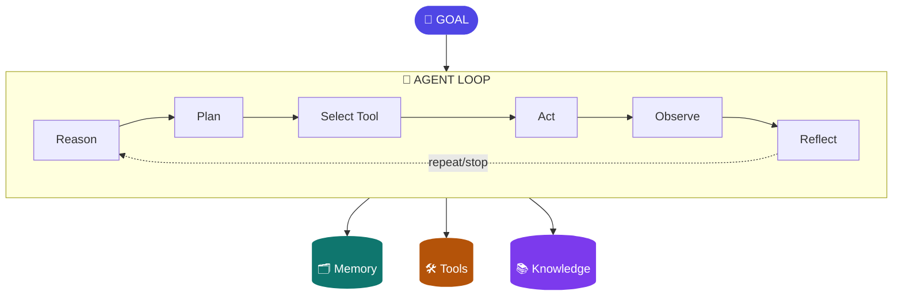

# Chapter 2: Anatomy of an AI Agent

> An LLM generates intelligence. An agent uses intelligence to act. Everything in this chapter is the machinery of "uses."

## 1. The architecture



The loop is the agent. Memory, tools, and knowledge are what it consults or manipulates — each gets its own chapter later (9, 13, 10–12). This chapter earns you the right to say, in any design review or interview, "I know exactly what happens on every turn, and I know which parts are the model and which parts are my software." That sentence is rarer than it should be.

## 2. The loop, step by step — with a worked trace

The steps, precisely:

1. **Reason** — the model reads the goal plus current state and assesses: what's established, what's missing, what would resolve it.
2. **Plan** — it decides the next step (or a short sequence). Planning may be implicit — folded into each turn's reasoning, the ReAct style — or an explicit artifact produced up front (Plan-and-Execute, Ch3).
3. **Select tool** — it chooses an action from the tools it has been *granted* — never "all tools that exist" (Ch13/19).
4. **Act** — the **harness** executes the call. The model only ever emits a structured request; it touches nothing directly. Hold onto this boundary — it is where both reliability and security live, and it recurs in Chapters 5, 7, 13, and 19.
5. **Observe** — the result is appended to context. Result *design* matters: what the model sees back steers what it does next (Ch13).
6. **Reflect** — did that work? Is the goal met? Loop or stop.

Now watch it run. Goal: *"Customer 4471 disputes a ₹4,300 POS charge from 12 Aug. Investigate and recommend."* Granted tools: `get_transactions`, `get_customer_profile`, `search_policy`, `create_case`.

**Turn 1.** Reason: "I need the transaction itself before anything." Select: `get_transactions(customer=4471, from=10Aug, to=14Aug)`. Observe: 6 rows; one POS ₹4,300 on 12 Aug at "SR RETAIL, Indore," terminal T-2231.

**Turn 2.** Reason: "Charge exists. Is it anomalous *for this customer*? I need their pattern." Select: `get_customer_profile(4471)`. Observe: home city Mumbai; no Indore transactions in 12 months; typical POS spend ₹200–800.

**Turn 3.** Reason: "Out-of-city, 5× typical size — consistent with the dispute. What does policy say about provisional credit at this amount?" Select: `search_policy("disputed POS transaction provisional credit threshold")`. Observe: policy 4.2 — disputes under ₹5,000 with an anomalous-pattern flag qualify for provisional credit pending network chargeback.

**Turn 4.** Reason: "All criteria met: transaction verified, pattern anomalous, policy 4.2 applies. Nothing is missing — I'm done gathering." Select: `create_case(type=dispute, txn=..., recommendation=provisional_credit, policy_ref=4.2)`. Observe: case DS-88213 created.

**Turn 5.** Reflect: goal met — emit the summary with the case number, the evidence, and the policy citation. Stop.

Two things to notice in the trace, because they're the chapter in miniature. First, every turn's *reasoning* is the model, and every turn's *execution* is the harness — the boundary held five times. Second, the loop's path wasn't knowable in advance: if turn 2 had shown regular Indore travel, turn 3 would have been a different retrieval and the recommendation likely "contact customer — pattern not anomalous." That path-contingency is *why* this is an agent problem (Ch1's placement logic), and the trace is what its audit record looks like (Ch16).

## 3. The stop problem — the most underrated step

A model can emit perfectly valid tool calls forever and never decide it is finished. This is not hypothetical: Chapter 7 recounts a model that, mid-pipeline, listed the same directory about forty times — not erroring, just not converging. Stopping is a *judgment*, and judgment is exactly what's stochastic. So production systems treat the stop decision as intelligent-but-bounded: the model decides "am I done," and the harness enforces the backstop — max iterations, per-run token budget, wall-clock timeout — with a graceful halt that checkpoints state and reports honestly ("I completed steps 1–3; budget exhausted investigating step 4").

**Goal setting & monitoring** (Gulli's pattern 11) upgrades stopping from vibes to design: state the goal as explicit success criteria in the state object (Ch4) — for the dispute case: *transaction verified; pattern assessed; policy identified; case created* — and have the reflect step check criteria, not feelings. An agent that can say "criterion 3 of 4 unmet" is debuggable, steerable, and honest about partial completion; one that "feels done" is none of those. As a bonus, criteria checked per turn become progress events you can stream to the user (Ch6) and metrics you can monitor (Ch16).

## 4. Reasoning techniques — what happens inside "reason"

The reason step is not monolithic; there's a menu, each item with a cost profile, and choosing per-step is an architecture decision (this is Ch18's model-routing, previewed).

**Chain-of-thought (CoT).** Have the model think step-by-step before answering. The baseline, nearly free, and the foundation everything else builds on. What it buys: decomposition of the problem into checkable steps. What it doesn't: any guarantee the steps are *right* — fluent reasoning to a wrong conclusion is the signature CoT failure.

**Self-consistency.** Sample the same reasoning N times, take the majority answer. Buys real accuracy on problems with a verifiable answer — at N× the tokens. Use it where a single wrong answer is expensive and the question has a discrete answer; skip it for open-ended synthesis, where "majority" is meaningless.

**Tree/graph-of-thoughts.** Explore alternative reasoning branches, evaluate, backtrack. Powerful on genuinely search-shaped problems (puzzles, constrained planning); in production agent loops it's rarely worth the token explosion — the loop *itself* is already a search process with tools as its branches.

**ReAct vs plan-first.** ReAct interleaves reasoning with acting — adaptive, since each observation informs the next thought; opaque, since the "plan" only ever exists one step at a time. Plan-first (Ch3's Plan-and-Execute) front-loads reasoning into an explicit plan artifact — auditable and delegable, but stale the moment an observation invalidates step 2 of 7. The dispute trace above was ReAct; a regulator-facing process might justify plan-first purely for the artifact.

**Reasoning models / test-time compute.** o-series/R-class models internalize deliberation — you buy reasoning by the token at inference time. This changes the design question from "which prompting trick" to "**which steps deserve a reasoning model at what budget**": planning and synthesis steps often yes; extraction, classification, and formatting steps almost never (a standard model at a tenth the cost does those). The economics land in Chapter 18.

**The classical frame — worth knowing for interviews.** Pre-LLM agent theory distinguished **reactive** architectures (perceive→act, fast, no lookahead), **deliberative** ones (model the world, plan ahead — the BDI *belief–desire–intention* tradition: beliefs = what the agent holds true; desires = goals; intentions = the plan it's committed to), and **hybrids**. A modern agentic system *is* the hybrid: deliberative at the graph/planning level, reactive inside nodes. Mapping BDI onto a LangGraph design (beliefs ≈ state, desires ≈ goal criteria, intentions ≈ the plan in state) is a thirty-second answer that signals depth few candidates have.

## 5. State vs memory — the distinction that prevents a class of bugs

- **State** is the loop's working data for *this run*: messages, tool results, intermediate artifacts, iteration count, goal criteria. It lives in the orchestration layer, is typed and checkpointable (Ch4), and dies or is archived when the run ends.
- **Memory** is what survives *across* runs: user facts, past episodes, learned procedures (Ch9).

Why the distinction earns its own section — a story you'll recognize. A team builds a service agent where "memory" is simply the growing chat transcript, persisted per customer. Three months in: sessions slow and costly (the transcript rides in every context window — a state-sized object doing a memory job); the agent "remembers" a stale address from a March conversation and uses it in September (a memory-shaped fact trapped in transcript form, with no consolidation or expiry — Ch9's pipeline never ran); and a privacy review asks what's stored about each customer, to which the honest answer is "everything anyone ever typed, undifferentiated." Every one of those is the *same* bug: conflating state and memory. Design them separately from day one: state gets a schema and a checkpointer; memory gets an extraction policy, provenance, and TTLs.

## 6. Where the intelligence actually is

The decomposition to bring to every design review:

| Component | Deterministic or intelligent? |
|---|---|
| Loop control (max iters, timeouts, budgets) | Deterministic — harness |
| Tool execution | Deterministic — harness |
| Context assembly | Deterministic policy over intelligently *selected* content (Ch8) |
| Next-action choice | Intelligent — the model |
| Stop decision | Intelligent, deterministically bounded |
| Goal criteria definition | Deterministic — you, at design time |

The model makes exactly two kinds of decision: *what to do next* and *am I done*. Everything else is software you design. In review, walk the table row by row and say for each intelligent row what brackets it — that recitation ("the model chooses X, bounded by Y") is, verbatim, how agent designs pass architecture review in regulated environments.

## 7. The loop across frameworks

Every framework is this loop with opinions about where the boxes go. LangGraph makes the loop an explicit graph — the reflect/route step becomes conditional edges you draw (Ch4). OpenAI's Agents SDK wraps the loop in a runner: you configure agent + tools, the SDK owns the iteration, handoffs express delegation. CrewAI hides the loop under role/task metaphors — it's still there, just named "a crew working." Claude-style harnesses keep a simple visible loop and spend their engineering on what surrounds it: context assembly, tool policy, sandboxing (Ch5). Once you've built the raw loop yourself, framework docs stop being magic and start being floor plans — you just ask "where did they put each box, and which boxes do they let me move?"

## 8. Hands-on lab

Build the loop from scratch in ~150 lines of Python: a `while` loop, a model call with tool schemas, a dispatcher that executes the chosen tool, results appended to messages, a max-iteration bound, and a stop condition. No framework. The entire shape, visualized:

```python
messages = [system_msg, user_goal]
for turn in range(MAX_ITERS):                      # deterministic bound
    reply = llm(messages, tools=TOOL_SCHEMAS)      # model: "what next?"
    if reply.tool_call is None:                    # model: "I'm done"
        return reply.text
    result = execute(reply.tool_call)              # HARNESS executes, not the model
    messages.append(tool_result(result))           # observe → loop
return fail_closed("iteration budget exhausted")   # never loop on hope
```

Six lines of logic — everything else in this curriculum is engineering wrapped around them. Extend the lab in three passes: (1) implement the dispute-investigation trace from §2 with four mock tools and watch your own agent walk it; (2) add explicit goal criteria to state and make the stop condition check them — then log "criteria met: 3/4" per turn; (3) break it deliberately — remove the iteration bound and give it an unanswerable goal, and watch the non-convergence failure you'll spend Chapters 5, 16, and 18 preventing. Then map each part of your code onto LangGraph's equivalents. This one lab permanently demystifies the field.

## 9. Trade-offs

- **More reflection buys better outcomes on hard tasks, and costs linearly.** A 10-turn loop at 5k context tokens per turn re-sends context ten times — a different cost class from a single call, before reasoning-model premiums (mitigations: Ch8's compression, Ch18's caching and routing).
- **Implicit ReAct planning is adaptive but audit-hostile**; explicit plans are auditable but stale-prone.
- **Wider tool grants raise capability *and* wrong-tool selection rates** (measured in Ch17's tool evals) — grant narrowly, expand with evidence.

## 10. Architect's take: the banking read

In a bank, the loop's deterministic bounds are governance surface: iteration caps, budgets, and tool grants are things you put in a design document and defend in a risk review; "the model decides" is not. Design so every intelligent decision is bracketed by a deterministic bound you can name, and present it that way — the §6 table, walked aloud, is the review. And the worked trace from §2 is your template for what an *auditable* agent interaction looks like: every turn attributable, every decision evidenced, every action through a granted tool. If a proposed agent can't produce that trace shape, it isn't ready for a bank.

## Governance & security lens

The loop's deterministic bounds *are* the controls: max iterations, token budget, and timeout are named, reviewable limits on autonomous behavior; the tool-grant list is the capability boundary; the harness-executes/model-requests split is the enforcement point. Governing question: **for every intelligent decision in the loop, what deterministic bound brackets it, and where is the decision logged?** An agent whose stop condition and grants can't be stated in one page isn't ready for a design review.

## Interview-ready lines

- "The model makes two decisions: what next, and am I done. Everything else is software I design."
- "The harness executes tools; the model only ever requests them — that boundary is where security lives."
- "Stopping is a judgment, so I bound it: goal criteria in state, checked per turn, with a hard iteration backstop."
- "State is per-run and checkpointable; memory is cross-run and governed. Conflating them is how chat history becomes a liability."
- "Modern agents are the classical hybrid architecture: deliberative at the graph level, reactive inside nodes — BDI maps straight onto graph state."
- "Reasoning models change the question from 'which prompting trick' to 'which steps deserve deliberation at what budget.'"


## Interview Questions & Answers

**Q1: What's the actual difference between "calling an LLM" and "building an agent"? Isn't an agent just a wrapper around API calls?**

A single LLM call is one reasoning step with no way to act on its own conclusions — it can *tell* you the ₹4,300 POS charge looks anomalous, but it can't go look up customer 4471's transaction history to check. An agent is that same model wired into a loop — reason, plan, select a tool, act, observe, reflect — where the harness executes what the model requests and feeds the result back in, so the next reasoning step is grounded in fresh evidence rather than a single static prompt. The dispute-investigation trace in this chapter is the proof: four separate tool calls, each one informed by what the previous call returned, arriving at a policy-cited recommendation no single prompt could have produced up front. So "wrapper around API calls" undersells it — the loop is what turns a model that only generates text into a system that can investigate, decide when it has enough evidence, and stop.

**Q2: Explain ReAct-style reasoning and how it differs from a plan-first architecture. When would you choose one over the other for a banking workflow?**

ReAct interleaves reasoning with acting one step at a time — the model reasons about the current state, picks one tool, observes the result, and only then reasons again, so each step is grounded in what just happened. Plan-first front-loads the reasoning into an explicit multi-step plan artifact before any tool runs, which is auditable and delegable but goes stale the moment an early observation invalidates a later step. The dispute trace in this chapter is ReAct: turn 3's policy lookup only happened because turn 2 confirmed the charge was out-of-city and 5x typical spend — a pre-committed plan couldn't have known to branch that way. I'd choose ReAct for investigative, open-path work like fraud triage, and reach for plan-first where a regulator or a delegated approver needs to see the intended steps before execution — say, a multi-account funds-transfer workflow where the plan itself is the artifact under review.

**Q3: What if, in the customer-4471 dispute trace, turn 2 had come back showing the customer travels to Indore regularly instead of an anomaly? Walk me through what changes.**

Nothing about the loop's *structure* changes — it's still reason, select tool, act, observe, reflect — but the path through it forks at turn 3. Instead of searching policy for provisional-credit thresholds, the model would reason "pattern isn't anomalous, this looks like a legitimate charge the customer doesn't recognize for another reason," and the next tool call would likely be a different policy query or a request for merchant-level detail rather than `create_case` with a provisional-credit recommendation. That's the point of the worked trace: the path isn't knowable in advance because each turn's action depends on the prior turn's observation, which is exactly why this is an agent problem rather than a fixed script. In production I'd make sure the goal criteria in state ("pattern assessed") don't silently collapse "anomalous" and "not anomalous" into the same downstream branch — the reflect step needs to check which criterion was actually satisfied, not just that a check ran.

**Q4: How do you stop an agent that never decides it's finished — say, one that keeps calling the same tool over and over?**

This isn't hypothetical for me — Chapter 7 has a model that listed the same directory roughly forty times mid-pipeline, never erroring, just never converging, because stopping is a judgment call and judgment is the stochastic part of the system. I treat it as intelligent-but-bounded: the model gets to decide "am I done," but the harness enforces a deterministic backstop — max iterations, a per-run token budget, and a wall-clock timeout — with a graceful halt that checkpoints whatever state exists and reports honestly, e.g. "completed steps 1–3, budget exhausted on step 4," rather than failing silently. On top of that I add explicit goal criteria to the state object — for the dispute case, transaction verified / pattern assessed / policy identified / case created — so the reflect step checks criteria instead of vibes, and a partially-done run can say "criterion 3 of 4 unmet" instead of just running out the clock. That combination is what separates "the model got stuck" from "the system caught it and told me exactly where."

**Q5: After `create_case` returns DS-88213 in the trace, what actually happens next, and what could go wrong if the harness doesn't handle that step correctly?**

Structurally, the observe step appends the tool result — the case number — into context, the reflect step checks it against the goal criteria (case created: yes), and the loop emits the final summary with evidence and policy citation before stopping; that's turn 5 in the trace. What can go wrong lives entirely on the harness side of the boundary: if `create_case` actually failed silently (a downstream API timeout, say) but returned something that *looks* like a success payload, the model has no way to know that and will confidently report a case number that doesn't exist in the case-management system. That's why the harness — not the model — owns validating tool results before they're trusted as "observed fact," and why the reflect step's criteria check needs to be checking a verified state, not just the presence of *a* result. In a bank, an agent that reports a fabricated case ID to a customer-facing summary is a worse failure than one that says "case creation failed, retrying" — so the harness should fail loudly on ambiguous tool results rather than let the loop reflect on them as if they were clean.

**Q6: What's the token-cost trade-off of running a multi-turn reflective agent loop versus a single LLM call, and where do the costs actually come from?**

A 10-turn loop at roughly 5k context tokens per turn re-sends the accumulating context ten times, not once — that's a fundamentally different cost class from a single call, and it compounds further if any of those turns route to a reasoning model that charges a premium for internal deliberation. The lever isn't "use fewer turns" in the abstract — it's choosing per-step which reasoning technique earns its cost: chain-of-thought is nearly free and does most of the work, self-consistency buys real accuracy at N times the tokens but only pays off on discrete-answer problems, and tree-of-thoughts is rarely worth it in an agent loop because the loop itself is already a search process with tools as its branches. For the dispute agent specifically, I'd route planning and the final synthesis to a stronger or reasoning-capable model and keep the four tool-selection turns on a cheaper standard model, since picking `get_customer_profile` next isn't a task that needs deliberation-grade compute — that routing decision is where the real savings are, not in cutting turns the loop actually needs.

**Q7: What are the data security implications of the observe step — appending tool results straight into the model's context?**

Every tool result that comes back — the customer's home city, their transaction pattern, their policy match — becomes part of the context the model reasons over on every subsequent turn, which means whatever PII or sensitive detail a tool returns is now living inside a prompt that gets re-sent, logged, and potentially cached at every later step. That has two consequences: first, tool outputs need the same data-minimization discipline as any other system boundary — `get_customer_profile` should return what the reasoning step needs, not the customer's entire record, because "it's already in context" is a much easier thing to leak than a field you never fetched. Second, an observed tool result is untrusted input to the *next* reasoning step exactly the way a user message is — a manipulated or spoofed tool response is a prompt-injection vector into the loop, so result design (Chapter 13) has to assume what comes back from `search_policy` or any external-facing tool could be adversarial, not just noisy. Design review question I'd ask: for each tool this agent can call, what's the minimum field set it returns, and is that result validated before it's trusted as fact the model reasons over?

**Q8: How would you decide which tools to grant this dispute-investigation agent, and why does "grant everything, let the model figure it out" fail in a regulated environment?**

The agent in the trace is granted exactly four tools — `get_transactions`, `get_customer_profile`, `search_policy`, `create_case` — not "all tools that exist," because the tool grant list *is* the capability boundary: whatever the model can request, the harness will execute, so an over-broad grant is a standing risk regardless of whether the model ever misuses it. I'd scope grants to the narrowest set that lets the loop complete its goal criteria — this agent investigates and recommends, so it gets read access to transactions and profile, read access to policy, and write access to exactly one case-creation action; it has no grant for reversing a transaction or issuing a refund, because that's a different, higher-privilege workflow with its own approval path. Chapter 17's tool evals back this up empirically — wider tool grants raise both capability and the wrong-tool-selection rate, so the entitlement question isn't just "can this leak data," it's "does giving the model more options make it worse at picking the right one." In review I'd defend the grant list the same way I'd defend a service account's IAM policy: least privilege, expand only with evidence the narrower set is actually insufficient.

**Q9: How do you monitor and debug an agentic loop once it's running in production, versus in a notebook during development?**

In development you can eyeball the trace turn by turn the way the dispute example is laid out in this chapter; in production you need that same visibility as structured telemetry — every turn's reasoning, tool selection, and observation logged with enough detail to reconstruct the path after the fact, because the loop's path isn't fixed and "why did it call `search_policy` on turn 3" needs to be answerable from logs, not memory. The goal criteria I put in state for the stop condition double as progress events and metrics for free — "criteria met: 3/4" per turn is exactly the kind of signal that turns into a dashboard tracking completion rate, average turns-to-completion, and how often runs hit the iteration or budget backstop instead of finishing cleanly. That last number matters most operationally: a rising rate of runs hitting the max-iteration ceiling is the production-grade version of the Chapter 7 "forty times" non-convergence story, and it's the metric that tells you before a customer complaint does that a tool result's format changed or a prompt regressed. I'd also make sure the checkpointed partial-state on a budget-exhausted run is queryable, not just logged, so an ops engineer can see exactly which of the four criteria a stuck dispute case actually satisfied.

**Q10: Design the agent loop for a loan-restructuring request at a bank. What tools does it get, and what's the stop condition?**

I'd start from the same shape as the dispute trace: reason over the goal, select from a narrowly granted tool set, act through the harness, observe, reflect against explicit criteria. Tool grants would be read-heavy and narrow at first — pull the loan account, pull repayment history, pull the applicable restructuring policy thresholds — with any tool that actually modifies terms or commits a new repayment schedule either withheld from this agent entirely or gated behind a human-approval tool call that pauses the loop rather than executes silently, because restructuring terms is a materially different risk class than the dispute agent's "create a case for a human to review." Goal criteria in state would be something like: eligibility verified against policy, affordability assessed from repayment history, restructuring option identified, and — critically — human approval obtained before any commit action, so the reflect step can never report "done" on a criterion that requires a human sign-off it hasn't received. The stop condition is the same deterministic backstop as any other agent — iteration cap, budget, timeout — but here I'd set it to fail closed toward "escalate to a human loan officer" rather than toward silence, since a restructuring workflow that times out mid-investigation should hand off cleanly, not just stop.

**Q11: If a risk officer with no engineering background asks you what the AI actually controls in this system versus what your team controls, how do you answer?**

I'd walk the same decomposition I use in every design review: the model makes exactly two kinds of decision — what to do next, and whether it's done — and everything else, including loop control, tool execution, and context assembly, is deterministic software my team writes and can test. Concretely, for the dispute agent: the model chose which of the four granted tools to call and in what order, but my code enforced the iteration cap, executed every tool call, and defined up front what "done" means as explicit goal criteria — the model doesn't get to invent its own definition of finished. I'd tell them that's exactly why the trace in this chapter is auditable: every turn is attributable to either "the model requested X" or "the system did Y," never an undifferentiated black box, and that recitation — "the model chooses X, bounded by Y" — is, row by row, how these designs pass architecture review. The one-sentence version I'd leave them with: nothing the model decides ever touches a system directly, and nothing it's allowed to decide is unbounded.

**Q12: What's the difference between an agent's state and its memory, and why does conflating them cause real production problems?**

State is this run's working data — messages, tool results, iteration count, the goal criteria being checked — it's typed, checkpointable, and it dies or gets archived when the run ends; memory is what's meant to survive across runs — user facts, past episodes, learned procedures — and it needs its own extraction, provenance, and expiry policy. The failure mode I'd point to is the service-agent story in this chapter: a team let the growing chat transcript double as "memory," and three months in they had sessions slowing down because a state-sized object was riding in every context window doing a memory job, the agent using a customer's stale March address in a September conversation because nothing ever expired it, and a privacy review with no better answer than "we stored everything anyone ever typed." All three symptoms trace back to one design mistake — treating a per-run object as if it were a governed, cross-run store — so the fix is architectural, not a patch: give state a schema and a checkpointer, and give memory an extraction policy, provenance tracking, and TTLs, from day one rather than after the privacy review flags it.
