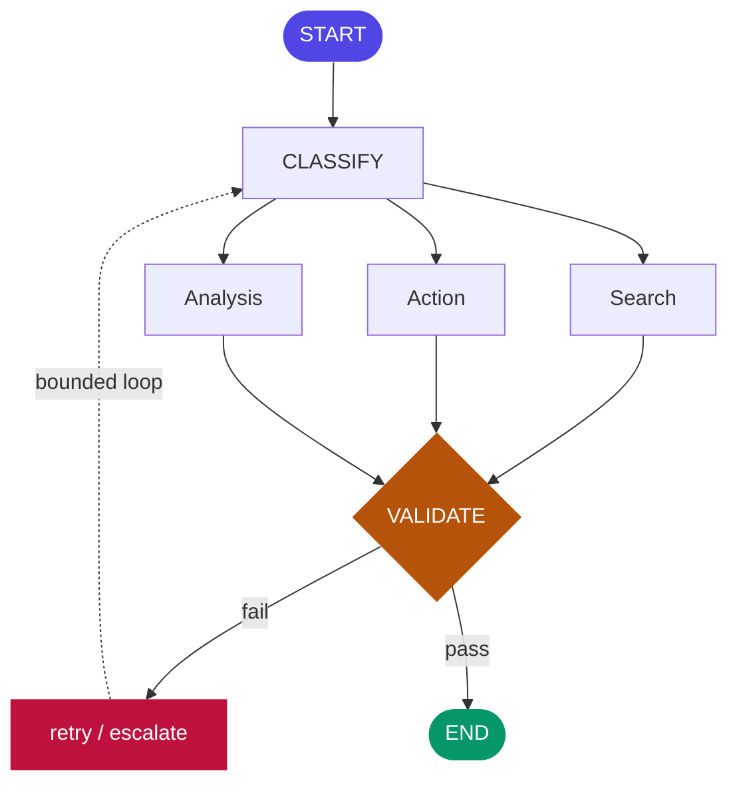

# Chapter 4: Agent Graphs & State Machines

> The central design question: should intelligence control the workflow, or should deterministic software control the workflow? Graphs are how you answer "both, precisely."

## 1. The architecture



Instead of `Agent → Agent → Agent` or an unbounded ReAct loop, model the system as a **stateful graph**. Nodes do work (call a model, run a tool, run plain code). Edges define legal transitions. **Conditional edges** route based on state — the router can be a rule (`if score < 0.7`) or a model decision (Ch3's owner-of-control-flow question, asked per edge). **State** is a typed, shared object every node reads and writes — not a chat transcript.

## 2. Why the industry needed it — the story behind the shift

Chapter 1 told the invoice-agent story at a high level: a pure ReAct loop given a goal and let run produced brilliant demos and ungovernable production incidents — unbounded cost, non-reproducible outcomes, unauditable transcripts. Here's the mechanism of the fix, because "add a graph" undersells what actually changed.

A pure loop has exactly one place decisions live: inside the model's head, turn by turn, with no record of what paths were *available* versus what path was *taken*. When something goes wrong, you have a transcript — a description of one run — but no map of the system's possible behavior. Two engineers debugging the same incident draw two different mental models of "what the agent could have done," because nothing forces the possibility space to be written down.

A graph forces exactly that: the possibility space is drawn *before* the agent runs a single query. `CLASSIFY` can route to `Search`, `Action`, or `Analysis` — and to nothing else. If a bug sends a query somewhere the graph doesn't permit, that's not a subtle behavioral drift; it's a hard runtime error, immediately visible. Rebuild the invoice agent as a graph and the incident from Chapter 1 becomes structurally impossible in two of its three failure modes: the cost blowup is capped because the graph has a bounded retry edge, not an open-ended loop, and the two-runs-different-answers problem is caught because every node's input/output is now typed and checkpointed — you can diff two runs' state at each node and see exactly where they diverged, rather than diffing two 40-turn transcripts by eye.

## 3. Nodes, edges, and the state object — a worked design

Design the dispute-investigation agent from Chapter 2 as a graph, because seeing the same problem solved two ways — as a loop, then as a graph — is the fastest way to feel the difference.

**State schema first**, because in graph design the schema *is* the architecture:

```python
class DisputeState(TypedDict):
    customer_id: str
    transaction: dict | None
    profile: dict | None
    policy_ref: str | None
    recommendation: str | None
    attempts: int
    criteria_met: dict[str, bool]   # explicit goal criteria (Ch2 §3)
```

**Nodes**, each a pure function `State -> partial State`: `fetch_transaction`, `fetch_profile`, `check_policy`, `validate` (checks whether `criteria_met` is complete and internally consistent), `create_case`. Five small, individually testable, individually retriable units — compare this to the ReAct version, where the equivalent logic was folded into one model's undifferentiated reasoning across five turns.

**Edges.** `START → fetch_transaction → fetch_profile → check_policy → validate`, then a **conditional edge** out of `validate`: if criteria incomplete and `attempts < 3`, loop back to whichever fetch is missing (a rule-owned edge — deterministic, because "did we get the data" is a factual check, not a judgment call); if criteria complete, proceed to `create_case → END`. Notice only one edge in this entire graph is remotely judgment-shaped (which fetch to retry), and even that's resolvable by a rule (check which field in state is still `None`). This is normal and good: most real graphs are mostly deterministic plumbing around one or two genuinely intelligent nodes (here, `check_policy`'s interpretation of which policy clause applies).

## 4. The durability layer — what turns a diagram into a system

Four features separate a graph on a whiteboard from a graph in production, and each solves a specific failure you will hit without it.

- **Checkpoints.** State persists after every node. Without this, a crash between `fetch_profile` and `check_policy` means the *entire* run — including the transaction fetch that already succeeded and cost tokens and an API call — is lost and must restart from zero. With checkpointing, resume picks up exactly at `check_policy` with `transaction` and `profile` already populated. For a run that touches paid APIs or expensive retrieval, this is not a nicety; it's the difference between a five-second resume and a five-minute re-run that also duplicates any side effects the first attempt already caused (which is why Chapter 6's idempotency matters even inside a single graph run).
- **Interrupts.** The graph pauses at a *declared* point, state persists, a human acts, execution resumes from that exact checkpoint with the human's input folded in. This is the entire mechanics of human-in-the-loop (Ch20) — not a UI trick layered on top, but a first-class graph feature. In the dispute graph, an interrupt before `create_case` when the recommended amount exceeds a threshold means the graph literally cannot proceed past that node until an approval event arrives.
- **Retries per node.** A flaky tool call in `fetch_transaction` retries itself with backoff; the rest of the graph is unaffected and unaware. Compare to a raw loop, where "retry the last tool call" requires the model to notice failure and decide to retry — an intelligent decision doing a job that should be mechanical.
- **Durable execution / time travel.** For processes that live hours or days (waiting on an external event — a document upload, a customer's reply), the same idea Temporal made standard in microservices applies directly: the workflow is replayable from an event log, can be resumed after the entire process restarts, and — critically for debugging — can be *replayed from any checkpoint with modified state* to answer "what would have happened if step 2 had returned a different result?" Know this pattern by name; agent platforms (AgentCore's Runtime, LangGraph Platform) are converging on it as a first-class primitive, not an add-on.

## 5. Design decisions

- **Rule edges vs model edges.** Every conditional edge is a choice of owner (Ch1's dial, now applied at the granularity of a single branch point). Default to rules; hand the model an edge only where the routing decision genuinely requires judgment a rule can't encode. Count your model-owned edges per graph — that number is your non-determinism budget, and it should be small and deliberate, not "most of them, because it was easier to let the model decide."
- **State schema discipline.** Design it like an API contract, because multiple nodes — possibly written by different engineers — depend on it. Typed fields, no `misc: dict` escape hatch (it becomes a silent landfill within two months), explicit reducers for concurrent writes when branches run in parallel (Ch3's Parallelization pattern) — without a reducer, two branches writing the same field race, and the winner is whichever finished last, which is not a decision anyone made on purpose.
- **Granularity.** A node should be small enough to name in one sentence and to be the natural unit of retry and observability (its own span in Ch16's tracing). "Handle the customer request" is not a node; it's a graph. If you can't finish the sentence "this node's job is to ___" cleanly, split it.
- **Loops need state-based bounds.** Any cycle in the graph must be bounded by a counter *in state* (`attempts`), never by hoping the condition resolves. An unbounded loop inside a "safely graphed" system is Chapter 1's invoice-agent failure, reintroduced through the back door.

## 6. Trade-offs

- **The cost.** Graphs add real ceremony — a schema to design, nodes to wire, a checkpointer to configure — and for a genuinely 3-step task with no loops, no HITL, and no durability requirement, that ceremony can exceed the value; a plain function call is honest and correct there.
- **The payoff.** It arrives exactly when you need checkpointing, interrupts, parallelism, or an audit trail — which, per Chapter 1's placement logic, is most of what qualifies as "an agent" rather than "a workflow" in the first place.
- **The failure mode in the other direction.** Over-graphing (a node per line of logic, edges for things that are never actually conditional) produces a diagram that's technically accurate and practically unreadable — apply the same "can you name this node's job in one sentence" test to avoid it.

## 7. The shape in code (LangGraph, ~15 lines)

```python
class State(TypedDict):
    request: str; category: str; result: str; attempts: int

g = StateGraph(State)
g.add_node("classify", classify)          # each node: State -> partial State
g.add_node("handle", handle)
g.add_node("validate", validate)
g.add_edge(START, "classify")
g.add_conditional_edges("classify", route,          # rule or model owns this edge
    {"search": "handle", "action": "handle"})
g.add_conditional_edges("validate",
    lambda s: "handle" if s["attempts"] < 3 else END)  # bounded loop, in STATE
app = g.compile(checkpointer=PostgresSaver(...),        # survive crashes
                interrupt_before=["send_email"])        # HITL, declared
```

Every concept of this chapter is visible: typed state, declared edges, a bounded cycle, a checkpointer, an interrupt.

## 8. Framework comparison — the architect's view

- **LangGraph** — the graph is explicit and first-class; checkpointing, interrupts, and streaming are built in; state, edges, and reducers are all yours to declare. This is the most direct expression of this chapter, which is why it's our reference stack.
- **OpenAI Agents SDK** — control flow lives in code plus handoffs between agents; a simpler mental model, but the "graph" is implicit in how you wire handoffs rather than declared as a data structure you can inspect or diff.
- **CrewAI** — role and task abstractions generate the flow underneath; fastest to a working demo, least explicit control over state and edges.

None of these is "better" in the abstract; the comparison question for any framework, in an interview or a bake-off, is always the same three sub-questions: *where does state live, who owns each edge, and what happens on a crash at step 7 of 9?* A framework that can't answer the third question crisply isn't ready for production, whatever its demo looks like.

## 9. Hands-on lab

Build the dispute-investigation graph from §3 as a LangGraph: five nodes, the conditional retry edge with a state-based bound, a checkpointer (Postgres or SQLite for the lab), and an interrupt before `create_case` when the recommended action exceeds a mock threshold. Then run three deliberate breakages and observe the recovery: (1) kill the process mid-run after `fetch_profile` — resume and confirm `fetch_transaction`'s result wasn't re-fetched; (2) force `check_policy` to fail twice — confirm the retry edge fires and the third attempt succeeds or escalates cleanly at the bound; (3) trigger the interrupt — confirm the graph genuinely halts (no background continuation) and resumes correctly once you supply an approval. Deliverable: a short write-up of what each break would have looked like in the Chapter 2 raw-loop version, and why the graph made it recoverable instead of catastrophic.

## 10. Architect's take: the banking read

The graph *is* the compliance story, and this is worth internalizing as a literal presentation technique: when you show a risk committee "here are the states, here are the legal transitions, here is where a human must approve, here is the checkpoint log of what actually happened for run #4471" — that is a document risk can approve, because it's the same shape as a flowchart-and-controls document for any other regulated process. An unbounded loop has no equivalent document to offer; "the model figures it out" is not an answer a risk review accepts, and shouldn't be. Design graphs so the picture you'd draw on a whiteboard for the regulator and the code that actually runs are *the same artifact* — in LangGraph this is nearly free, since the graph definition **is** both the executable code and the diagram (most tooling can render it directly). That equivalence — approved design equals deployed code — is worth calling out explicitly in any design review; it's rarer than it should be and it's exactly the kind of detail that separates an architect's presentation from an engineer's.

## Governance & security lens

The graph is the governance artifact: declared states and transitions are the legal behavior space, checkpoints are the tamper-evident record of what actually happened, interrupts are where approval authority is structurally enforced, and the count of model-owned edges is your documented non-determinism budget. Governing question: **is the diagram shown to risk and the code that runs the same artifact?** Drift between the approved design and the deployed graph is a finding waiting to be written.

## Interview-ready lines

- "A graph turns the model's freedom into a choice among declared transitions — that's what made agents deployable in production."
- "Count your model-owned edges; that's your non-determinism budget, and it should be small and deliberate."
- "Checkpoint plus interrupt is the entire mechanics of human-in-the-loop — not a UI layer, a graph feature."
- "Nodes are the unit of retry and observability; state schema is an API contract, not a scratchpad."
- "In LangGraph the approved design and the deployed code are the same artifact — that's a governance property, not just a convenience."


## Interview Questions & Answers

**Q1: Why would you replace a working ReAct-style agent loop with a graph? Isn't that just extra engineering overhead?**

A pure loop keeps every routing decision inside the model's head, turn by turn, with no record of what paths were available versus what path was actually taken — which is exactly what turned the Chapter 1 invoice agent from a good demo into an ungovernable production incident: unbounded cost, non-reproducible runs, unauditable transcripts. A graph forces the possibility space to be drawn before a single query runs — `CLASSIFY` can only route to `Search`, `Action`, or `Analysis`, nothing else — so a bug that tries to go anywhere else is a hard runtime error, not a subtle drift you discover three weeks later. It also gives you two runs' state, diffed field by field at each node, instead of two forty-turn transcripts you have to read by eye. The overhead is real, but for anything a bank would call "an agent" rather than "a script," it buys back exactly the properties — bounded cost, reproducibility, auditability — that a loop structurally cannot offer.

**Q2: Walk me through how you'd decide which edges in a graph should be rule-owned versus model-owned.**

Every conditional edge is a choice of owner, and the default should be a rule, not the model — hand an edge to the model only where the routing decision genuinely requires judgment a rule can't encode. In the dispute-investigation graph, the retry edge out of `validate` is rule-owned: "is `criteria_met` complete" is a factual check against typed state, resolvable by looking at which field is still `None`. The one edge that's genuinely judgment-shaped is inside `check_policy`, where the model interprets which policy clause applies to a given transaction pattern — that's a decision a static rule can't safely encode. The number of model-owned edges in a graph is your non-determinism budget: count it deliberately, keep it small, and be able to justify each one in a design review, because that count is exactly what a risk committee will ask about.

**Q3: What happens if an individual node — say, a tool call inside `fetch_transaction` — fails mid-run? Does the whole agent have to start over?**

No, and that's the point of per-node retries: a flaky call in `fetch_transaction` retries itself with backoff, and the rest of the graph is unaffected and unaware it happened. Compare that to a raw loop, where "retry the last tool call" requires the model to notice the failure and decide to retry — an intelligent decision doing a job that should be purely mechanical. Combined with checkpointing, a crash between `fetch_profile` and `check_policy` doesn't lose the transaction fetch that already succeeded and already cost tokens and an API call; resume picks up exactly at `check_policy` with `transaction` and `profile` already populated in state. The failure boundary is the node, not the run, which is a much smaller blast radius than a monolithic loop gives you.

**Q4: What if a cycle in the graph never resolves — for example, `validate` keeps sending the dispute case back for more data indefinitely?**

That's precisely the failure this chapter calls out as the back door for Chapter 1's invoice-agent incident to reappear inside a "safely graphed" system: an unbounded loop, wherever it lives, produces unbounded cost and no forced exit. The fix is that every cycle must be bounded by a counter that lives *in state*, not by hoping the condition eventually resolves — in the dispute graph that's the `attempts` field, checked on the conditional edge out of `validate`, so after three tries the graph routes to escalation instead of looping again. The bound has to be part of the typed state schema, not a variable inside a node's local logic, because only state is checkpointed and inspectable — a counter buried in a closure disappears the moment you need to audit why a run stopped retrying. Any graph review should treat "show me the state field that bounds this cycle" as a mandatory question for every loop in the diagram.

**Q5: After `validate` determines the dispute case is complete, what actually happens downstream, and what's checkpointed at that point?**

Once `criteria_met` is internally consistent and complete, the conditional edge routes to `create_case`, but before that node executes, a declared interrupt fires if the recommended action exceeds a threshold — the graph literally cannot proceed past that point until a human approval event arrives, with state persisted at exactly that checkpoint. If no interrupt is triggered, `create_case` runs and the graph reaches `END`, and every node's input and output along the way — the fetched transaction, the fetched profile, the policy reference, the final recommendation — sits in the checkpoint log as a typed, queryable record of run #whatever. That checkpoint log is what turns "the model recommended X" into something a risk reviewer can actually inspect: not a transcript to read by eye, but a structured diff between what state looked like at each node.

**Q6: Doesn't all this graph machinery — schema, nodes, checkpointer, interrupts — cost more in tokens and engineering time than just letting the model loop?**

For a genuinely three-step task with no loops, no human-in-the-loop requirement, and no durability requirement, yes — the ceremony of designing a state schema, wiring nodes, and configuring a checkpointer can exceed the value, and a plain function call is the honest, correct choice there. The graph's payoff arrives specifically when you need checkpointing, interrupts, parallelism, or an audit trail, which in practice is most of what actually qualifies as "an agent" rather than "a workflow" by Chapter 1's placement logic. Token cost itself isn't materially worse in a well-designed graph — nodes are individually retriable rather than re-running an entire multi-turn transcript on failure, which is usually cheaper than a loop's habit of re-deriving context on every turn. The real cost risk runs the other way: over-graphing, where you add a node per line of logic or a conditional edge for something that's never actually conditional, producing a diagram that's technically accurate and operationally unreadable.

**Q7: State gets passed and mutated across every node in the graph — what data security concerns does that raise, especially for something like the dispute-investigation graph?**

The `DisputeState` object carries `customer_id`, `transaction`, and `profile` through every node and into every checkpoint, which means the checkpoint store — Postgres, SQLite, whatever backs the checkpointer — becomes a persistent store of customer PII and transaction detail, not just an ephemeral in-memory object, and has to be governed like one: encryption at rest, access logging, and a retention policy that doesn't quietly outlive the bank's data-retention rules. It also means every node that touches state can, by default, read fields it doesn't need — `check_policy` doesn't need the customer's full profile to interpret a policy clause, only the fields relevant to that decision, so a disciplined schema narrows what each node actually receives rather than handing the whole object downstream by convention. The "time travel" replay feature described in this chapter is powerful for debugging but doubles as a data-security question in its own right: replaying a checkpoint with modified state means someone can reconstruct or alter a historical record of a customer's data, so that capability needs its own access control, separate from ordinary run execution.

**Q8: Where do guardrails actually live in a graph architecture — is it the same idea as guardrails around a single LLM call?**

Guardrails in a graph aren't a wrapper bolted around a model call; they're structural — they live at the conditional edges and at declared interrupt points. The `validate` node in the dispute graph is itself a guardrail: it's the point where the graph checks whether `criteria_met` is complete and internally consistent before anything downstream can act on the recommendation, and the graph cannot route around it because the edge topology doesn't allow it to. The interrupt before `create_case` is a second, stronger guardrail — it's not a check that can be reasoned past by the model, it's a hard halt that requires a human approval event to clear. That's the core architectural claim of this chapter: a graph turns "the model should behave" into "the model literally cannot proceed past this point without satisfying a declared condition," which is a categorically stronger guarantee than instructing a model to be careful inside an unbounded loop.

**Q9: How would you think about access control and least privilege at the level of individual nodes in a graph?**

Because each node is a small, individually named function — `fetch_transaction`, `fetch_profile`, `check_policy`, `validate`, `create_case` — each one can be scoped to exactly the credentials and tool access it needs, rather than a single agent holding one broad set of entitlements for its entire run. `fetch_transaction` needs read access to the transaction system and nothing else; `create_case` needs write access to the case-management system and nothing else; neither needs the other's credentials, and a graph lets you enforce that at the node boundary instead of hoping the model self-restricts inside a monolithic loop. This maps directly onto the "who owns this edge" discipline from earlier in the chapter — just as you audit which edges are model-owned, you should be able to list, per node, exactly which systems and data it's entitled to touch, and that list is a natural artifact for an access-review meeting with the bank's security team. The failure mode this avoids is the one raw loops are prone to: one agent identity with standing access to everything the task might conceivably need, because nobody could cleanly separate "what does step 3 need" from "what does the whole run need."

**Q10: In production, how do checkpointing and interrupts actually work when a graph crashes mid-run or needs to hand off to a human — and how would you version a graph safely once it's deployed?**

State persists after every node, so a crash between `fetch_profile` and `check_policy` doesn't lose the work already done — resume picks up exactly at `check_policy` with the prior nodes' outputs already in state, rather than restarting from zero and potentially duplicating side effects the first attempt already caused. An interrupt is the same mechanism used deliberately: the graph pauses at a declared point, state persists, a human acts, and execution resumes from that exact checkpoint with the human's input folded in — it's not a UI trick layered on top of the graph, it's a first-class feature of it. Versioning is where teams get burned if they're careless: a graph's checkpoint schema is tied to its node structure, so changing a node's signature or a state field between versions can break resumability for runs checkpointed under the old graph — the safe pattern is to version the graph definition alongside the state schema and either migrate in-flight checkpoints explicitly or let old runs drain on the old version before cutting traffic to the new one. For processes that live hours or days waiting on an external event, this is the same durable-execution pattern Temporal made standard in microservices, and it's worth knowing that name in an interview — agent platforms like LangGraph Platform and AgentCore's Runtime are converging on it as a first-class primitive, not an add-on.

**Q11: Design the graph for a loan-pre-approval agent at a bank — walk me through the nodes, the edges, and where you'd put controls.**

Start with the state schema, because in graph design the schema is the architecture: something like `applicant_id`, `credit_bureau_data`, `income_verification`, `risk_score`, `decision`, `attempts`, and an explicit `criteria_met` dict, mirroring the dispute-investigation pattern from this chapter rather than inventing a new shape from scratch. Nodes stay small and individually named — `pull_credit_report`, `verify_income`, `score_risk`, `validate`, `issue_decision` — each one the natural unit of retry and of its own observability span. Edges run mostly deterministic: `validate` checks whether every required field is populated and the risk score is within a codified policy band, with a state-bound retry edge back to whichever fetch is missing; the only model-owned edge worth considering is inside `score_risk` if judgment is needed to interpret an edge-case income pattern, and that edge should be named and justified in the design doc as part of the bank's non-determinism budget. The guardrail is a declared interrupt before `issue_decision` whenever the risk score sits in a marginal band or the loan amount exceeds a threshold — the graph cannot issue that decision until a credit officer's approval event arrives, and the checkpoint log of that run is the artifact you'd hand to a risk committee to prove the control actually fired rather than describing it in a policy document that may not match the running code.

**Q12: How would you compare LangGraph against something like CrewAI or the OpenAI Agents SDK when picking a framework for a regulated bank's agent platform?**

The comparison question is always the same three sub-questions regardless of framework: where does state live, who owns each edge, and what happens on a crash at step 7 of 9 — a framework that can't answer the third crisply isn't production-ready no matter how good its demo looks. LangGraph makes the graph explicit and first-class, with checkpointing, interrupts, and streaming built in and state, edges, and reducers all yours to declare — which is why it's the most direct expression of this chapter's ideas and the natural reference stack for a bank that needs to show risk a diagram that *is* the running code. CrewAI's role-and-task abstractions get you to a working demo fastest but leave you with the least explicit control over state and edges, which is a bad trade the moment you need to answer "what exactly happened at step 7" for an auditor. The OpenAI Agents SDK sits in between — control flow lives in code plus handoffs between agents, which is a simpler mental model, but the graph is implicit in how handoffs are wired rather than a data structure you can inspect or diff, so proving governance properties takes more manual documentation than a framework where the graph definition and the diagram are the same artifact.
