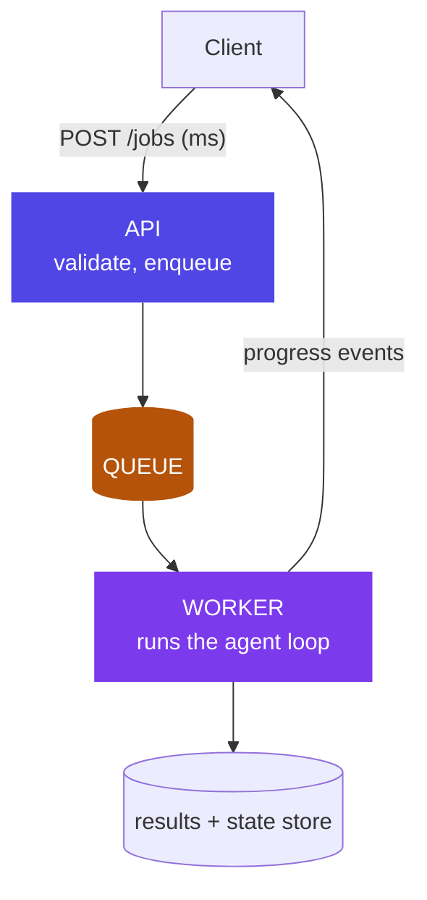

# Chapter 6: Backend & System Design for Agent Services

> A web app answers in milliseconds. An agent thinks for minutes. That one difference drives the entire backend design.

## 1. The anti-pattern everyone writes first

```python
@app.post("/agent")
def run(req: Request):
    return agent.run(req.prompt)   # DO NOT ship this
```

Six ways it fails, worth memorizing because each maps to a component of the fix:

1. Holds a connection open for 90–120s (browsers and load balancers time out)
2. Client disconnect = job lost
3. Network retry = the whole expensive run re-executes
4. User sees a spinner with zero information
5. No way to cancel mid-run
6. Failure at step 9 of 10 loses everything

## 2. Why the industry needed it — a duplicate refund, traced to its root cause

Every team that ships the anti-pattern above discovers its cost the same way: not in a design review, but in an incident. Here's a representative one, close enough to real production postmortems to be instructive.

A card-services team shipped the dispute-investigation agent from Chapter 2 behind exactly the sync endpoint in §1. It worked fine in testing — test runs finish in 8-12 seconds, well inside any timeout. In production, `check_policy`'s reasoning occasionally ran long: a genuinely ambiguous dispute could push total run time past 90 seconds, and the mobile app's HTTP client had a 60-second timeout. When that happened, the app showed the customer an error and — because the app's retry logic treated any failed request as safe to resubmit — silently retried the identical request a few seconds later. The *first* run was still executing on the server; the retry created a *second*, fully independent run. Both runs reached the same conclusion (approve the dispute, issue a refund) and both called `issue_refund`. The customer received two refunds of ₹4,300 for the same disputed transaction, eleven days apart in the reconciliation report from when anyone noticed — because nothing about either run looked wrong in isolation; two refunds for two "different" job executions is only anomalous once you know they were answering the same customer complaint.

The root cause was not the agent's reasoning — `check_policy` was correct both times. The root cause was architectural: a request that can silently retry into a system with no idempotency key and no notion of "this exact job already ran" will eventually double-execute a real-world side effect. Fixing the prompt would have done nothing. Fixing the backend shape is the only fix that closes this class of bug entirely, which is the argument for treating backend design as a first-class architecture decision for agents, not an implementation detail beneath it.

## 3. The workload properties that drive the design

Agent workloads are **long-running, asynchronous, iterative, and expensive to retry** — each property individually rules out the sync anti-pattern, and together they point at one shape: split the fast path from the slow path.



## 4. The components — and what each one specifically prevents

Walk these against the duplicate-refund incident in §2, because every component here maps to a specific way that incident could have been stopped.

- **Submission API** — `POST /jobs` returns a `job_id` in milliseconds. Idempotency keys so a retried submit doesn't create duplicate expensive runs — this alone would have stopped the refund incident: the retried request carries the same idempotency key as the original, the API recognizes it, and returns the *existing* job instead of starting a second one.
- **Queue** (Redis/SQS/RabbitMQ) — decouples acceptance from execution; absorbs bursts; enables priority tiers and per-tenant fairness. This is also where a second failure mode gets solved: imagine one bank branch triggers a 5,000-job batch reprocessing run during a data migration. Without a queue with fairness policy, those 5,000 jobs occupy every worker and the contact center's real-time dispute lookups — which should complete in seconds — queue behind them, and customer wait times spike past 40 minutes. A priority tier (interactive traffic ahead of batch traffic) or per-tenant fair-share scheduling prevents one tenant's burst from starving another's latency-sensitive path.
- **Worker pool** — consumes jobs, runs the harness (Ch5) and graph (Ch4). Scales independently of the API. Holds entire agent runs in memory — size it ~2x the API (Ch7).
- **Progress streaming** — SSE (simpler, one-way, usually right) or WebSockets (bidirectional, needed only if the user talks back mid-run). Stream *events* (step started, tool called, tokens) not just final output — this is the spinner fix, and it's also a trust fix: a customer watching "checking transaction… checking policy… preparing recommendation" trusts the system more than one watching a blank spinner for 40 seconds, even at identical total latency.
- **State & results store** — Postgres for jobs/results/sessions; checkpoints (Ch4) make failure at step 9 resume at step 9, not restart at step 1.
- **Cancellation** — a flag the worker checks between nodes; graphs make this clean (finish current node, stop at the edge) rather than killing mid-tool-call and leaving a half-executed side effect.
- **Session management** — conversations span jobs; session state lives in the store, never in worker memory, because a worker can die between jobs and a new worker must be able to pick up the next job for that session with full context.
- **Rate limiting & cost control** — per-user job quotas, per-run token budgets, queue-depth backpressure. An agent endpoint without rate limits is a blank check, and it's the backend-level twin of Chapter 5's harness-level rate limiting — one throttles tool calls *within* a run, this throttles job submission *across* runs.

## 5. The fix, visualized (~15 lines)

```python
@app.post("/jobs")                                    # FAST PATH: milliseconds
async def submit(req: JobRequest, idem_key: str = Header(...)):
    if existing := await store.by_idempotency(idem_key):
        return existing                               # retried submit ≠ second run
    job = await store.create(req, status="queued")
    await queue.push(job.id)
    return {"job_id": job.id}

@app.get("/jobs/{id}/events")                         # progress, not spinners
async def events(id: str):
    return EventSourceResponse(store.stream_events(id))   # SSE

# worker.py — SLOW PATH, separate process, no HTTP anywhere
while True:
    job_id = queue.pop()
    run_graph(job_id, checkpointer=saver)             # crash → resume at last node
```

Trace the duplicate-refund incident through this code: the mobile app's retry arrives with the *same* `idem_key` as the original request (a well-built client generates the idempotency key once per user action, not once per HTTP attempt). `store.by_idempotency(idem_key)` finds the original job — already queued or already running — and returns its `job_id` instead of creating a second job. One dispute, one investigation, one refund, no matter how many times the network makes the client retry.

## 6. Design decisions

- **Sync façade where products need it**: you can still offer "wait up to 30s then return or hand back job_id" — but built *on* the async core, never instead of it. A product team asking for "just make it feel synchronous for short requests" is a legitimate ask; the API layer can poll internally and return fast when the job happens to finish quickly, while every job still goes through the same idempotent, queued, checkpointed path underneath.
- **Structured outputs at the boundary**: workers persist typed results (validated JSON), not prose; downstream systems consume the type, and the UI renders from it. This also makes the duplicate-refund class of bug easier to catch in monitoring — a typed `refund_issued` event with an amount and a transaction ID is trivial to reconcile against the transaction ledger; free-text output isn't.
- **One image, two commands**: API and worker run the same container image with different entrypoints, so they can never run different code — no scenario where a hotfix reaches the API but not the worker, silently. This becomes a deploy invariant in Ch7.
- **Queue semantics**: at-least-once delivery + idempotent job handling beats exactly-once promises, because exactly-once delivery across a network is not actually achievable — design the job, not the queue, for redelivery. Every job handler should be safe to run twice with the same input and produce the same observable outcome once.

## 7. Trade-offs

- **What it costs.** More moving parts (a queue is a new operational dependency with its own failure modes), eventual consistency in UX ("queued… running…" instead of an instant answer), and an operational surface to monitor (queue depth, worker health, dead-letter handling for jobs that fail repeatedly).
- **What it buys.** Survivable disconnects, resumable failures, backpressure, cancellation, and honest progress — and, per §2, it closes an entire class of duplicate-side-effect bugs that no amount of careful prompt engineering can close from the model side.
- **When the trade isn't close.** For anything beyond a demo that never touches a real side effect: the moment an agent can issue a refund, block a card, or send a message a human will read, the sync anti-pattern is a standing liability, not a shortcut.
- **The one real counter-case.** A genuinely short, read-only, side-effect-free agent call (e.g., "summarize this document" with no tool calls) can reasonably stay synchronous — the async machinery's cost isn't worth paying for a call with nothing to retry into a duplicate. The dividing line is the same one Chapter 1 uses for "is this even an agent": does this call touch state or trigger a side effect anyone would care about happening twice? If not, a plain synchronous endpoint is honest and correct.

## 8. Industry implementation

This is the shape underneath every serious agent product: ChatGPT-style deep research, coding agents, document processors — all job-queue-worker with streamed progress. FastAPI + Celery/RQ + Redis + Postgres is the common self-hosted stack; managed equivalents (SQS + ECS workers) appear in Ch7. LangGraph Platform and similar sell exactly this layer — evaluate them as "backend-in-a-box" against building it: the honest comparison question is the same one Chapter 4 raised for orchestration frameworks — where does state live, who owns retries, and what happens on a crash at step 9 of 10 — asked here at the level of the whole service instead of a single graph run.

## 9. Hands-on lab

Convert your Ch4 graph into a service, in stages, each with a specific failure to reproduce and fix:

**Stage 1 — the anti-pattern, on purpose.** Wire your Ch4 graph behind the sync endpoint from §1. Fire two identical requests within a second of each other (simulating a client retry) and confirm you get two independent runs — reproduce the duplicate-refund bug yourself before fixing it, so the fix means something.

**Stage 2 — the async core.** Build the FastAPI submission endpoint with an idempotency key, a Redis queue, and a worker process running the graph with checkpoints. Re-run the two-identical-requests test from Stage 1 and confirm you now get one job, one run.

**Stage 3 — progress and control.** Add SSE progress streaming and `DELETE /jobs/{id}` for cancellation, plus a per-user limit of 3 concurrent jobs. Kill the worker mid-job; prove the job resumes at the last checkpoint, not from zero. Disconnect the client mid-stream; prove the job finishes anyway and the result is retrievable afterward. Submit a 4th concurrent job as the same user and confirm it's rejected with a clear reason.

Deliverable: a short incident report for the Stage 1 bug you reproduced, written the way you'd write it for a real postmortem — root cause, blast radius, the specific architectural fix, and why a prompt-level fix wouldn't have worked.

## 10. Architect's take: the banking read

Bank infrastructure reviews will ask exactly these questions — timeout behavior, retry semantics, idempotency, backpressure, DR — because they're the same questions asked of any transaction system, agentic or not. Answering them fluently for agents is how you establish that agentic AI is an engineering discipline, not an experiment. Extra banking notes: idempotency is non-negotiable where a duplicated job could duplicate a customer action, per §2's refund incident; per-tenant fairness matters when one branch's batch upload must not starve the contact center, per §4's queue-starvation scenario; and the queue is an audit point — every job's submission, ownership, and outcome is a record you can hand to an auditor asking "show me everything this agent did for this customer, in order, with timestamps."

## Governance & security lens

The job system is an audit and safety layer, not just plumbing: every job records who submitted it, under what identity, with what outcome — the queue is a ledger. Idempotency keys are a *customer-protection* control (a network retry must never duplicate a real-world action, as §2's refund incident shows concretely); per-tenant quotas and backpressure are availability controls; cancellation is the operational kill lever for a single run. Governing questions:

- Can we reconstruct any job end-to-end from records?
- Are all payloads encrypted in transit and at rest?
- Does a replayed message ever cause a second side effect?

That last question isn't rhetorical — it's the exact test that would have caught §2's bug in a design review, before it reached a customer.

## Interview-ready lines

- "Agent workloads are long, async, iterative, and expensive to retry — so split the fast path from the slow path."
- "Return a job_id in milliseconds; stream events, not spinners."
- "At-least-once delivery plus idempotent jobs beats exactly-once promises."
- "The API accepts, the queue absorbs, the worker thinks, the store remembers."
- "A retried request without an idempotency key isn't a network detail — it's a duplicate refund waiting for a slow tool call to happen once."
- "Ask what happens on a crash at step 9 of 10 — if the honest answer is 'restart from zero,' the backend isn't done yet."


## Interview Questions & Answers

**Q1: Why does an agent backend need different guarantees than a typical CRUD service?**

A CRUD endpoint does one cheap, deterministic write and returns in milliseconds, so a client can safely assume "no response means try again." An agent run is long-running (seconds to minutes), asynchronous by nature, iterative (it may call `check_policy` and `issue_refund` several tool-calls deep), and expensive to redo — properties that individually break the sync request/response model and together force a fast-path/slow-path split. The dispute-investigation agent in this chapter proved the point: it ran fine in testing at 8-12 seconds but occasionally pushed past 90 seconds in production, well past the mobile client's 60-second timeout, which is exactly the gap a CRUD backend never has to plan for. Once a workload can silently retry into a system that has no idea "this exact job already ran," the backend itself — not the model's reasoning — becomes the source of correctness bugs.

**Q2: How would you design an idempotent API for something like a refund-issuing job submission endpoint?**

The client generates one idempotency key per user action — not per HTTP attempt — and sends it as a header on `POST /jobs`. The API's first move is `store.by_idempotency(idem_key)`: if a job with that key already exists, queued or running, it returns the existing `job_id` instead of creating a new one; only on a genuine miss does it create the job and push it to the queue. This is deliberately cheap and synchronous — it has to run in the same milliseconds as job creation, before anything expensive happens — so the actual agent work, however long it takes, is only ever started once per real user action regardless of how many times the network causes the client to retry.

**Q3: What happens if a client's retry fires while the original job is still executing?**

Walking through the `/jobs` handler in this chapter: the retry arrives with the same idempotency key as the original, `store.by_idempotency` finds the original job — status "queued" or "running" — and the handler returns that existing job_id immediately without touching the queue or the worker pool. This is exactly what didn't exist in the ₹4,300 duplicate-refund incident: the mobile app's retry, arriving after a 60-second client timeout while the server-side run was still going, created a second independent job because nothing recognized it as the same customer action. With the idempotency check in place, both the original request and its retry converge on one job_id, one worker execution, and one call to `issue_refund`.

**Q4: What happens if a worker crashes mid-job — say, after calling `check_policy` but before it writes the refund event?**

Because the graph runs with a checkpointer (`run_graph(job_id, checkpointer=saver)`), the worker isn't holding the only copy of progress in memory — each node's completion is persisted to the state store as it happens. When the worker process dies and a new worker picks the job back up, it resumes at the last completed checkpoint rather than restarting the whole graph from node one, so a crash after `check_policy` but before `issue_refund` re-enters at the refund step, not at the beginning. This is also why cancellation is designed to finish the current node and stop at the edge rather than kill mid-tool-call — an uncontrolled kill mid-write is precisely the scenario that produces a half-executed side effect with no clean resume point. The interview-worthy line here is the step-9-of-10 test: if the honest answer to "what happens on a crash at step 9" is "restart from zero," the backend isn't done yet.

**Q5: What's the difference between at-least-once and exactly-once delivery, and which should this kind of system pick?**

Exactly-once delivery across a network is not actually achievable — a message can always be delivered, the ack lost, and the sender legitimately retry — so any queue that claims exactly-once is really doing at-least-once delivery plus deduplication somewhere in the stack. The right design target is at-least-once delivery combined with idempotent job handling: every job handler must be safe to run twice with the same input and land on the same observable outcome, which is what the idempotency-key check and the typed, reconciliation-friendly `refund_issued` event both exist to guarantee. That reframes the engineering problem correctly — you're not trying to make redelivery impossible, you're making redelivery harmless, which is a much more achievable and auditable target for a banking system.

**Q6: After a job completes and persists its result, what happens downstream, and what breaks if that result isn't structured?**

The worker persists a typed, validated result — a `refund_issued` event with an amount and transaction ID, not a paragraph of prose — and downstream systems (the UI, the ledger, monitoring) consume that type directly rather than parsing free text. This matters concretely for catching the duplicate-refund class of bug: a typed event with an amount and transaction ID is trivial to reconcile against the transaction ledger, which is how a second refund for the same dispute becomes an obvious anomaly instead of two unremarkable-looking entries that only get noticed eleven days later, as happened in the incident this chapter traces. If the worker instead wrote unstructured prose, reconciliation would require re-parsing model output to find the amount and transaction reference, which is exactly the fragile step that let the real duplicate sit unnoticed.

**Q7: What are the cost and infrastructure trade-offs of adding a queue and separate worker pool instead of just running the agent inline?**

The async shape costs more moving parts — a queue is a new operational dependency with its own failure modes, health checks, and on-call surface — plus eventual-consistency UX ("queued… running…" instead of an instant answer) and things you now have to actively monitor: queue depth, worker health, dead-letter handling for jobs that fail repeatedly. In exchange it buys survivable client disconnects, resumable failures via checkpointing, backpressure so a burst doesn't take down the API, clean cancellation, and honest progress streaming — and it closes an entire class of duplicate-side-effect bugs that no amount of prompt engineering can fix from the model side. The trade isn't close once a real side effect is involved: the moment an agent can issue a refund or block a card, the infrastructure cost of the queue is cheaper than one more ₹4,300 duplicate payout and the reconciliation work it triggers. The one legitimate counter-case is a short, read-only, side-effect-free call like document summarization, where there's nothing to duplicate and the async machinery isn't worth its cost.

**Q8: What are the data security implications of the job queue and state store?**

Every job payload, progress event, and stored result can contain customer PII and transaction data, so the queue and state store need to be treated as sensitive stores, not scratch infrastructure — payloads encrypted in transit and at rest, same as any core banking data store. The queue also becomes an audit ledger by design: every job records who submitted it and under what identity, so a security review can reconstruct any job end-to-end from records rather than trusting application logs that may not capture the full picture. Because sessions live in the store rather than in worker memory, a compromised or misbehaving worker process never becomes the sole holder of a customer's conversational or transactional context — it can be killed and replaced without that context leaking or being lost.

**Q9: Beyond the idempotency key itself, what other guardrails stop an agent backend from producing a duplicate real-world action?**

The idempotency check on job submission is the first guardrail, but it's paired with a second one at the output boundary: workers persist typed, validated results instead of prose, which makes a duplicate `refund_issued` event detectable in monitoring rather than buried in free text. A third guardrail is architectural rather than code-level — treating "does a replayed message ever cause a second side effect?" as a standing governance question asked at design-review time, not just an incident postmortem question; that's the exact test that would have caught this chapter's refund bug before it reached a customer. Together these form a layered defense: prevent the duplicate job from starting, and if one somehow gets through, make its output structured enough that reconciliation catches it fast.

**Q10: How should access control and least privilege apply across the API, queue, and worker pool?**

The API layer, the queue, and the worker pool are separate trust boundaries and should be entitled separately: the API only needs to validate and enqueue, the queue only needs to move job IDs, and only the worker process — running the actual graph — needs credentials to call sensitive tools like `issue_refund`. Running API and worker from the same container image with different entrypoints, as this chapter's deploy pattern does, doesn't mean they share the same runtime permissions; it means they can never silently drift onto different code, which is a correctness guarantee, not an access-control one. Per-tenant and per-user scoping matters just as much operationally as it does for security — a per-user cap on concurrent jobs and per-tenant fair-share queueing exist specifically so one branch's batch job can't consume the shared worker pool and degrade another tenant's access to time-sensitive dispute lookups.

**Q11: What does this look like in production — what do you monitor, and what's the deploy discipline?**

In production you're watching queue depth, worker health, and dead-letter volume as the core operational signals, plus job-level metrics like time-to-completion and per-tenant fairness, since a queue with fairness policy is only doing its job if a 5,000-job batch run doesn't push contact-center dispute lookups from seconds to the 40-minute wait times this chapter describes as the failure mode. Deploy discipline centers on the one-image-two-commands invariant: API and worker run the same container image with different entrypoints, so a hotfix can never reach one without the other, which removes an entire category of "it works in the API but the worker's still on old code" incidents. FastAPI plus Celery or RQ plus Redis plus Postgres is the common self-hosted version of this stack; a bank moving to managed infrastructure would look at SQS-plus-ECS-workers or evaluate a platform like LangGraph Platform as backend-in-a-box, asking the same ownership questions either way — where does state live, who owns retries, and what happens on a crash at step 9 of 10.

**Q12: Design the backend for a bank's dispute-resolution agent that can issue refunds, given that a duplicate refund already happened once. Walk through your architecture.**

Start from the incident: a sync endpoint holding the connection open let a 90-second run outlive a 60-second mobile timeout, and the client's blind retry created a second, fully independent run that both reached the same correct conclusion and both called `issue_refund` — two ₹4,300 payouts for one dispute, undetected for eleven days. The fix is `POST /jobs` returning a job_id in milliseconds, gated by an idempotency key generated once per user action so a retried submit returns the existing job instead of starting a second one; the actual investigation runs in a separate worker process consuming from a queue, checkpointed so a crash resumes at the last completed node instead of restarting; progress streams back over SSE so the customer sees "checking transaction… checking policy…" instead of a blank spinner; and the final `issue_refund` call persists as a typed event with amount and transaction ID so it reconciles cleanly against the ledger. Add per-user job caps and per-tenant fair-share queueing so a batch reprocessing run from one branch can't starve real-time dispute lookups elsewhere, and treat the queue itself as an audit ledger — every submission, ownership, and outcome recorded so an auditor can be handed a full, timestamped trail for that customer on request.
