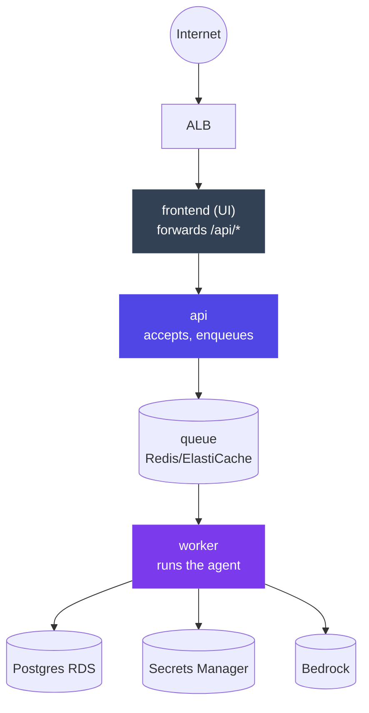

# Chapter 7: Deploying Agent Systems — IaC, CI/CD & Cloud Runtime

> A green pipeline is not proof. Nothing before a real job ever calls the model.

## 1. The deployment shape

The Ch6 fast-path/slow-path split, made physical — three containers on ECS/Fargate behind a load balancer:



Three properties of this shape matter more than any AWS detail:

- **Only the frontend is internet-reachable.** The worker has *no address at all* — no load balancer, no health check. It only pulls from the queue. Slow work sits nowhere near the request path, so a two-minute job cannot time out a web request.
- **API and worker run the same image** with different start commands — the worker can never run different code than the API.
- **No model API key exists anywhere.** The worker calls the model service (Bedrock) using an identity attached to the container itself.
- Sizing: worker ≈ 2× the API's CPU/memory — the API holds a request for milliseconds; the worker holds an entire agent run for the life of the job.

## 2. Why the industry needed a deployment discipline, not just a Dockerfile

A model API call and a container deployment feel like unrelated concerns until the first incident makes the connection obvious. Deploying the Chapter 6 job service by hand — click through the AWS console, remember the eleven settings that made last week's deploy work, hope this week's deploy remembers them too — works exactly once, for the person who did it. The second deploy, done under time pressure by someone else, drifts: a security group rule set slightly differently, a missing environment variable, a task role with one permission too many because copying an existing role was faster than scoping a new one. None of these drifts show up in a health check. They show up three weeks later, in production, on the one job that happens to need the permission nobody granted or hit the security group nobody opened.

This is the same accretion pattern Chapter 5 described for harnesses, one layer up the stack: infrastructure built by hand accretes inconsistency the same way agent code built without a harness accretes patches. The fix is the same shape too — infrastructure as code (§3) makes the actual configuration reviewable and reproducible instead of tribal knowledge; CI/CD with OIDC (§4) makes *who deployed what, from where* a matter of record instead of "ask around"; and the two-role model (§5) makes *what the running code can touch* an explicit, auditable grant instead of whatever the last person copy-pasted.

## 3. Infrastructure as Code: Terraform with workspaces

One folder of ~15 single-purpose files (network, security, ecr, rds, iam, ecs, alb, logs, monitoring…), **never copied per environment**. Workspaces produce isolated dev and prod stacks from identical code:

```hcl
locals {
  name_prefix = "${var.stack}-${terraform.workspace}"
  workspace_config = {
    dev  = { db_instance_class = "db.t4g.micro", log_retention_days = 7 }
    prod = { db_instance_class = "db.t4g.micro", log_retention_days = 30 }
  }
}
```

The only difference between environments is that small table. States live separately (`env:/dev/`, `env:/prod/`), so destroying dev cannot touch prod. Two copied folders drift apart, and the drift is always discovered during an incident — the classic version of this: someone fixes a security group rule in the prod folder under incident pressure, forgets to port the fix back to dev's copy, and six months later dev's "identical" stack behaves differently in a way nobody can explain until they diff two folders that were never supposed to diverge.

Remote state (S3) + a lock (DynamoDB) let laptop and CI see the same picture — without the lock, two people running `terraform apply` at the same moment corrupt each other's state, which is a Tuesday-afternoon incident with a name ("who ran apply, I was mid-apply too"). A **run-once bootstrap** (state bucket, lock table, GitHub OIDC provider, deploy role) is the only hand-created infrastructure; everything after happens on `git push`. Teardown order is sacred: environments first, foundations second — delete the state bucket early and Terraform forgets what it made while the resources keep billing, which is precisely how a "decommissioned" dev environment shows up on next month's AWS bill as a live RDS instance nobody can find in any Terraform state.

## 4. CI/CD: OIDC, gates, and the identity trap — a worked incident

**No cloud password exists anywhere.** GitHub Actions gets an hourly credential by presenting a signed token ("this is repo X, environment Y") that AWS checks against the deploy role's trust rules — OIDC. The trap that costs an afternoon, worked through concretely: a workflow job declares `environment: prod` for its deploy step but no environment for its earlier build/test steps. GitHub's OIDC token presents a different `sub` claim depending on whether the job used an `environment` block — `environment:prod` for the gated step, `ref:refs/heads/main` for the ungated ones. If the deploy role's trust policy only lists one of these two subject patterns, the *other* half of the same pipeline fails with `Not authorized to perform sts:AssumeRoleWithWebIdentity` — a message that gives no hint that the fix is "list both subject claims in the trust policy," because the error looks like a permissions problem, not an identity-shape problem. Teams that haven't seen this before spend an afternoon checking IAM policy JSON line by line before someone realizes the *role* was never the issue — the *claim* presented didn't match either configured trust condition. Once you've debugged it once, it takes thirty seconds to recognize the second time; that asymmetry is exactly why it belongs in a curriculum instead of only in tribal memory.

Pipeline structure: checks on every push/PR (lint, secret scan, terraform validate, unit tests, compose smoke test); deploy only on push, only after checks. Promotion policy in one line: `environment: prod` + a required reviewer = every prod deploy pauses for a human. `main` → dev automatically; a `prod-*` tag → prod with approval. Same commit, same Terraform, only the workspace differs. And never `cancel-in-progress` on deploys — a cancelled Terraform leaves a stuck lock, and the next engineer to touch that environment spends twenty minutes finding and manually releasing a DynamoDB lock row before they can do anything at all. (Never save the plan as an artifact either: it contains generated secrets in plaintext — a plan artifact sitting in GitHub Actions' build logs is a credential leak waiting to be discovered by whoever next audits CI artifact retention.)

Two agent-specific CI rules: **don't test what the model says** (non-deterministic → flaky → ignored suite; test the machinery — state transitions, parsing, truncation), and **check SDK imports inside the built image** — agent apps load model libraries lazily, so a missing one survives startup and the health check, then fails on the first real job. This second rule deserves its own worked failure: a team's Dockerfile installed dependencies from a `requirements.txt` that was missing the Bedrock SDK extra (a one-line omission during a refactor). The image built cleanly, the container started cleanly, the health check passed cleanly — because none of those steps ever import the model client. The first real job hit `ImportError` inside the worker, which had no HTTP endpoint to surface the error to a user, so the failure showed up only as jobs silently stuck in "running" with a crashed worker process behind them, discovered when queue depth alarms fired an hour later. The fix (§8's "five checks") is running one real end-to-end job as a deployment gate — the only check in the whole pipeline that actually imports the model client.

## 5. The two roles — where agent security becomes real

Every container has two identities:

- **Execution role** — AWS's, used *before* your code runs: pull image, create log stream, read secrets. Rule of thumb: failure before the first log line = execution role; look at ECS service events.
- **Task role** — your code's, used *while* it runs: model calls, S3, everything the agent does.

The task role is where agent security actually happens, and it's worth a concrete illustration of why. Say the dispute-investigation agent's `fetch_transaction` tool reads transaction records from an S3 bucket, and the task role was scoped broadly — `s3:GetObject` on the whole bucket, because it was faster to copy an existing role than write a new policy during a sprint crunch. Months later, a prompt-injection attempt (Ch19) via a manipulated document the agent processes tries to get the model to read a different customer's file from the same bucket. With the broad task role, that read *succeeds* — the model asked, IAM allowed it, and only after-the-fact log review would ever catch it, if anyone thought to look. With a task role scoped to exactly the prefix this agent needs (`s3:GetObject` on `disputes/{tenant}/*` only), the same injection attempt fails at the IAM layer regardless of what the model was tricked into requesting — the request never reaches application logic at all, because the cloud provider's own access control rejects it. This is the concrete version of the chapter's central claim: **restricting an agent in the prompt is a request. Restricting it in the task role is a fact.** (Generalized in Ch19.) The gap between "we told the model not to" and "the model structurally cannot" is exactly the gap between an incident and a non-event.

Secrets: Terraform creates placeholders with `lifecycle { ignore_changes = [secret_string] }` (without it, every deploy resets your real key to REPLACE_ME — a genuinely common first-week mistake that looks like "the API stopped working" and is actually "Terraform just overwrote the real secret with its placeholder value on a routine `apply`"); real values set once via CLI, never in repo or image.

## 6. Model access & model choice

Workload identity → zero API keys: the SDK finds credentials automatically (local profile on laptop, task role in cloud). Know the Bedrock ID trap: foundation model IDs vs inference profile IDs (`us.` prefix) — permit both forms or get misleading AccessDenied errors; prompt-cache markers on unsupported models also surface as AccessDenied that isn't a permissions problem. And choose models that **converge** in long tool loops: one model passed every quick test, then listed the same directory forty times without moving on — not erroring, just not finishing, burning tokens and wall-clock time against nothing. Test with a real end-to-end job, never a single call — the convergence failure is invisible in a single-turn eval and only shows up once you run the full loop length production traffic actually reaches.

## 7. Production wiring: logs → alarms → traces

Built in this order because each depends on the previous:

1. **Structured JSON logs** with job_id — the only way to follow one job across three containers. Free-text logs make this forensically painful: reconstructing one job's path through frontend, api, and worker logs by grep-ing timestamps and hoping nothing else logged at the same second is exactly the kind of task that turns a 20-minute incident into a 3-hour one.
2. **Metric filters → alarms → email** on error patterns, plus a budget alarm (80%/100%) because agent stacks spend quietly. The dependency bites: an alarm matching a JSON field your logs don't emit deploys green and can never fire — you learn during the incident it was meant to catch, which is the worst possible time to learn a safety net has a hole in it. Verify every alarm by deliberately triggering its condition once, in dev, before trusting it in prod.
3. **Tracing** (Langfuse-class): the decorator gives the outer span; the *callback* fills in model calls, tools, and cost; the explicit flush is mandatory in a background worker or finished jobs' traces sit unsent — a worker process that exits right after finishing a job can terminate before an async trace exporter has flushed its buffer, and you discover this only when a completed job has no trace to show for it. Verify by running a real job and seeing the nested trace — unverified tracing is worse than none, because you'll trust it in an audit and be wrong.

**Deployment verification, the five checks:** all services have running tasks; health endpoint returns ok; *one real job end-to-end* (the one people skip, and the only one that calls the model — §4's missing-SDK-extra incident is exactly what this check catches); that job's trace appears; the alarm email subscription is confirmed. Skipping any one of the five is how a "successful" deploy ships a worker that has never actually run an agent.

## 8. The managed alternative: Amazon Bedrock AgentCore

Everything this chapter builds by hand, AWS now sells as managed services — **Bedrock AgentCore** (GA Oct 2025, expanded through 2026). The service list maps almost one-to-one onto this curriculum, which is worth noticing: it means the concepts here are the industry-converged shape, and AgentCore is one vendor's packaging of them.

| AgentCore service | What it replaces | Our chapter |
|---|---|---|
| Runtime (serverless, session-isolated microVMs, long-running async) | The queue/worker/Fargate stack | Ch6–7 |
| Harness (managed agent loop) | Hand-built loop + harness | Ch2, Ch5 |
| Memory (short-term + long-term, cross-session) | DIY memory layer | Ch9 |
| Gateway (APIs/Lambda → MCP tools, auth) | The MCP gateway | Ch14 |
| Identity (agent IAM, IdP federation) | NHI machinery | Ch19 |
| Policy (Cedar rules intercepting tool calls) | Tool policy enforcement | Ch5, Ch19 |
| Observability (OTel traces) / Evaluations | Langfuse-class stack + eval harness | Ch16–17 |
| Registry (agents/MCP/tools catalog) | Tool & agent registry | Ch13–14 |
| Code Interpreter / Browser | Sandboxed execution | Ch5 |

**The architect's build-vs-buy read:** AgentCore compresses months of Ch6–7 work into configuration and is framework-agnostic (LangGraph, CrewAI, LlamaIndex run inside it) — a strong default for teams already on AWS who want scale without platform engineering. The trade-offs to name in a design review: consumption pricing at scale vs owned infrastructure; region availability and data-residency fit (verify against RBI localisation for each service, not just the headline); portability (Gateway/Policy/Registry are AWS-shaped — keep your tool contracts MCP-standard so you can exit); and the newest services (Policy, Optimization, Payments) being young. The mature posture: *learn* the DIY stack (this chapter — it's what makes you able to evaluate AgentCore), *adopt* managed pieces where they clear governance, and keep the invariants (identity not keys, worker isolation, real-job verification) regardless of who runs the servers.

## 9. Hands-on lab

Deploy the Ch6 stack in stages, each ending in a deliberate break so the education sticks:

**Stage 1 — bootstrap and first deploy.** Bootstrap state bucket, lock table, OIDC provider, deploy role. Terraform apply via GitHub Actions with OIDC, dev on push to main. Confirm all five deployment-verification checks from §7 pass, including the real end-to-end job.

**Stage 2 — reproduce the identity trap.** Add a prod environment gated by `environment: prod` without updating the deploy role's trust policy to include both subject claim shapes from §4. Push a tag and watch the `AssumeRoleWithWebIdentity` failure. Fix the trust policy; confirm prod deploys clean.

**Stage 3 — reproduce the missing-SDK-extra incident.** Deliberately drop the model SDK from the worker's dependency list, deploy, and confirm the container starts and passes health checks while the first real job fails inside the worker with no HTTP surface to report it. Add the real-job check back as a deployment gate and confirm it now catches this class of failure before traffic reaches it.

**Stage 4 — task-role scoping.** Start with a broadly-scoped task role, confirm (in a safe dev bucket) that the worker can read a resource it shouldn't need. Scope the role down to exactly what the agent's tools require, and confirm the same read now fails at the IAM layer.

## 10. Architect's take: the banking read

Every pattern here has a bank-grade name your infra teams already use: OIDC = federated workload identity; task role = least privilege; approval gate = change management; budget alarm = cost governance; teardown order = state management discipline. Presenting agent deployment in this vocabulary — rather than as "AI magic" — is what gets it through a bank's change advisory board. On-prem/private-cloud variants (your world, given data residency): the shape survives intact — swap Fargate for K8s, Bedrock for on-prem serving, Secrets Manager for Vault; the *invariants* (worker unreachable, one image, identity not keys, real-job verification) are the architecture, not the specific AWS service names. When a risk reviewer asks "what stops a compromised container from reading data it shouldn't," §5's task-role walkthrough is the answer, told with a specific bucket and a specific IAM policy rather than in the abstract.

## Governance & security lens

This chapter is largely made of controls — name them as such: OIDC = no standing cloud credentials to steal; task roles = least privilege enforced by the platform; approval gates = change management; the plan-never-in-artifacts rule = secrets hygiene; budget alarms = financial control; teardown order = state integrity. Governing questions:

- Who can assume the deploy role, and from which branches/environments?
- Who approves prod?
- Is every deployment attributable to a commit, a pipeline run, and a person?

Infrastructure-as-code makes the whole answer reviewable — which is *why* IaC is a governance requirement, not a convenience.

## Interview-ready lines

- "The worker has no address — that's the fast/slow split made physical."
- "One commit can present two identities to the cloud; your trust policy must expect both."
- "Restricting an agent in the prompt is a request; in the task role it's a fact."
- "A green pipeline proves nothing about the model path — run one real job."
- "A health check that never imports the model SDK will pass on a worker that can't actually run an agent — the real-job check is the only one that catches it."
- "Scope the task role to what the tool needs, not what the service account has always had — that's the difference between an injection attempt failing at IAM and succeeding in application logic."


## Interview Questions & Answers

**Q1: Why does deployment discipline matter more for an agent system than for a typical stateless microservice?**

A normal service either answers a request or returns an error within milliseconds, so a bad deploy usually fails loudly and fast. An agent worker can start a two-minute tool-calling loop, pass every health check because health checks never import the model client, and only fail on the first job that actually reaches the model — by which point it's a queue-depth alarm an hour later, not a red pipeline. The chapter's own incident is the proof: a missing Bedrock SDK extra in `requirements.txt` built cleanly, started cleanly, and passed health checks cleanly, because none of those steps ever touch the model library. Deployment discipline — the five verification checks, especially the one real end-to-end job — exists specifically to catch the class of failure that lives entirely inside the part of the system a conventional deploy never exercises.

**Q2: Why use OIDC-based workload identity instead of long-lived access keys for a CI/CD pipeline, and what's the trade-off?**

OIDC means GitHub Actions never holds a standing cloud credential — it presents a signed token asserting "this is repo X, environment Y," and AWS issues an hourly credential only after checking that token against the deploy role's trust policy, so there's no static key sitting in a secrets store waiting to be exfiltrated. The trade-off is that trust now depends on getting the *claim shape* right, not just the permissions: a workflow with a gated `environment: prod` deploy step and ungated build/test steps presents two different `sub` claims from the same pipeline run, and a trust policy that only lists one of them locks out the other half with an `AssumeRoleWithWebIdentity` error that looks like a permissions problem. So OIDC trades a credential-theft risk for a configuration-precision risk — worth it, but only if the team actually understands what claim their pipeline is presenting at each stage.

**Q3: What happens if a worker silently fails after a deploy that passed every check?**

This is exactly the missing-SDK-extra scenario from the chapter: the image builds, the container starts, and the health endpoint returns ok, because none of those checks import the model client — the import only happens lazily, inside the code path a real job triggers. The worker then crashes on `ImportError` the moment the first job reaches it, but the worker has no HTTP endpoint to surface that error to anyone, so the job just sits in "running" against a dead process. Nobody sees this at deploy time; the first signal is a queue-depth alarm firing roughly an hour later, once enough jobs have piled up behind the crashed worker. The fix is structural, not procedural — add a real end-to-end job as a deployment gate, because it's the only check in the pipeline that actually imports the model client and would have caught this before traffic ever reached it.

**Q4: A prod deploy's OIDC trust policy only lists one subject claim shape and the deploy step starts failing with an authorization error — what do you actually check, and what happens if a team misdiagnoses it?**

The instinct under pressure is to read the IAM policy JSON line by line looking for a missing permission, because the error text — `Not authorized to perform sts:AssumeRoleWithWebIdentity` — reads like a permissions problem. The real cause is upstream of permissions: GitHub's OIDC token presents `environment:prod` as its subject when the step has an `environment:` block and `ref:refs/heads/main` when it doesn't, and the trust policy needs both patterns listed if both kinds of steps in the same pipeline assume the role. Teams that haven't hit this before typically burn an afternoon on the wrong layer before someone realizes the *role* was fine and the *claim* never matched either configured condition. Once diagnosed once, it's a thirty-second fix the second time — which is precisely the asymmetry that makes it worth teaching explicitly rather than leaving to be rediscovered incident by incident.

**Q5: How do identity claims and access control intersect to actually protect customer data in an agent pipeline, beyond just prompt instructions?**

Take the dispute-investigation agent's `fetch_transaction` tool: if its task role is scoped broadly to `s3:GetObject` on the whole bucket — often because copying an existing role was faster than writing a new policy under sprint pressure — then a prompt-injection attempt via a manipulated document that tries to get the model to read a different customer's file will simply succeed, because IAM allows the request and only after-the-fact log review would ever catch it. Scope that same task role to `s3:GetObject` on `disputes/{tenant}/*` only, and the identical injection attempt fails at the IAM layer regardless of what the model was tricked into asking for — the request never even reaches application logic. That's the concrete difference between telling a model not to do something and making it structurally unable to: restricting an agent in the prompt is a request, restricting it in the task role is a fact, and OIDC-scoped task roles are where that principle becomes enforceable rather than aspirational.

**Q6: What are the real cost trade-offs in this deployment shape, and how do they show up operationally?**

Compute is deliberately asymmetric: the worker is sized roughly 2x the API's CPU/memory because it holds an entire agent run for the life of a job while the API only holds a request for milliseconds, so naively sizing them the same either starves the worker or over-provisions the API. Beyond compute, agent stacks spend quietly on model calls in a way conventional services don't, which is why the chapter treats a budget alarm at 80% and 100% of expected spend as load-bearing rather than optional — without it, a convergence failure (a model looping on the same tool call forty times without erroring) burns real money before anyone notices. At the platform level there's a build-versus-buy trade-off too: Bedrock AgentCore compresses months of this hand-built Ch6–7 work into configuration, but that convenience is consumption pricing at scale versus owned infrastructure, so the right call depends on whether the team's volume and governance needs favor elastic spend or a fixed, auditable footprint.

**Q7: What guardrails belong in the CI/CD pipeline itself for an agent system, as opposed to guardrails in the agent's runtime behavior?**

Two rules are specific to agents and don't apply to ordinary services: don't test what the model says, because model output is non-deterministic and a suite asserting on exact text becomes flaky and gets ignored — test the machinery instead, meaning state transitions, parsing, and truncation logic; and verify SDK imports inside the *built* image, because agent apps load model libraries lazily, so a missing dependency survives build and health check and only surfaces on the first real job. On top of those, the pipeline itself has structural guardrails: checks (lint, secret scan, terraform validate, unit tests, compose smoke test) run on every push, but deploy only runs after checks pass and only on push, and prod additionally requires an `environment: prod` gate plus a human reviewer. The single most important guardrail is the one most pipelines skip — running one real end-to-end job as a deployment gate, since it's the only check that exercises the actual model path rather than everything around it.

**Q8: Walk through the five deployment-verification checks and why skipping any one of them is dangerous.**

The five are: all services have running tasks, the health endpoint returns ok, one real job runs end-to-end, that job's trace appears in the tracing system, and the alarm email subscription is confirmed — and they're ordered deliberately from cheapest-to-verify to most-diagnostic. The first two only prove the containers started; they say nothing about the model path, which is exactly the gap the missing-SDK-extra incident lived in. The real end-to-end job is the only check that actually imports the model client, so it's the one that would have caught that incident before it reached production traffic, and it also catches convergence failures that a single-turn eval can't see. Skipping the trace check or the alarm confirmation is just as dangerous in a quieter way — an alarm matching a JSON field the logs don't emit deploys green and can never fire, and you only discover that during the incident it was supposed to catch, which is the worst possible moment to find a hole in a safety net.

**Q9: Why is an explicit trace flush mandatory in a background worker, and what breaks without it?**

Tracing libraries like the Langfuse-class stack the chapter uses typically buffer spans and export them asynchronously, which is fine in a long-lived web server but dangerous in a worker process that exits the moment it finishes a job — the process can terminate before the async exporter has flushed its buffer, so the trace for a job that completed successfully simply never arrives. Without an explicit, blocking flush call at the end of each job, you end up with completed jobs that have no trace to show for them, and you typically only discover this gap when you go looking for a specific job's trace during an incident and it isn't there. The chapter's broader point generalizes past tracing: unverified observability is worse than none, because a missing signal you trust is a false sense of coverage you'll rely on in an audit and be wrong. The fix is procedural, not just code — run a real job and confirm its nested trace actually appears before you trust the pipeline in prod.

**Q10: You're taking the dispute-investigation agent live for a bank's fraud-ops team. Walk through the deployment decisions you'd make end to end.**

Infrastructure comes from one Terraform codebase with dev and prod as workspaces, not copied folders, so the two environments can never silently drift apart — the only difference between them is a small config table (instance class, log retention), with state stored remotely in S3 and locked via DynamoDB so CI and a laptop can never corrupt each other's apply. The pipeline authenticates via OIDC with no standing cloud credential, runs checks on every push, and gates the prod deploy behind an `environment: prod` block plus a required human reviewer — and I'd make sure the trust policy lists both subject-claim shapes so the gated and ungated steps in the same workflow don't lock each other out. The worker's task role gets scoped to exactly the S3 prefix the agent's tools need — `disputes/{tenant}/*`, not the whole bucket — so a prompt-injection attempt against a manipulated document fails at the IAM layer even if the model gets tricked into asking for it. Before calling it live, I'd run all five deployment-verification checks, including a real end-to-end dispute investigation job with a visible trace, and I'd verify the budget and error alarms actually fire by deliberately triggering them once in dev.

**Q11: How do you handle testing in a CI pipeline for a system whose core component — the model — is non-deterministic?**

You stop trying to assert on what the model says and instead test everything deterministic around it: the state machine that moves a job through its stages, the parsing and validation of tool outputs, truncation logic when context gets long, and the retry and error-handling paths. A suite that asserts on exact model text becomes flaky under normal model variance, gets ignored by the team the first time it blocks an unrelated PR, and stops providing any signal at all — which is worse than not having it, because it creates false confidence. The one place you do need the real model is a single, deliberate end-to-end job run as a deployment gate rather than a unit test — it's not there to assert on exact output, it's there to prove the model path executes at all, which is the thing a mocked test suite structurally cannot verify.

**Q12: How would you prevent infrastructure drift between environments over time, and why do teams get this wrong even when they know better?**

The failure mode is well known and still common: someone copies the Terraform folder per environment, then fixes a security group rule in the prod copy under incident pressure and forgets to port it back to dev, and six months later dev's supposedly "identical" stack behaves differently in a way nobody can explain until they diff two folders that were never supposed to diverge. The structural fix is a single codebase with environment-specific values isolated to one small config table and Terraform workspaces producing separate state (`env:/dev/`, `env:/prod/`) from the same code — there's no folder to fork, so there's nothing to forget to port back. It still requires discipline around teardown order (environments before foundations — deleting the state bucket first makes Terraform forget what it manages while the resources keep billing) and around never hand-editing resources outside the code, because a single manual "just this once" fix is exactly how drift starts even in a workspace-based setup.
