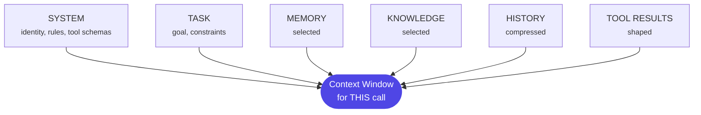

# Chapter 8: Context Engineering

> Prompt engineering asks "how do I phrase this?" Context engineering asks "what should the model see at this exact moment?" The second question is an architecture question.

## 1. The architecture

Every model call is a context assembly decision:



The harness assembles this deterministically each turn (Ch5). The engineering discipline is deciding the *policy*: what gets in, in what form, in what order, within what budget.

## 2. Why the industry needed it — a wrong recommendation, traced to a bad window

Long context windows made the problem worse, not better, and the mechanism is worth tracing through a concrete failure rather than stating as a slogan. Three empirical realities forced the discipline: **degradation** — models reason worse over 100k tokens of mush than 8k of signal ("lost in the middle" is real, and it's not a training artifact that newer models simply fix; it recurs across model generations because attention genuinely dilutes with irrelevant tokens); **cost** — context is billed per call, and a 20-turn loop re-sends it 20 times, so an unmanaged context grows the bill quadratically with conversation length; **poisoning** — one bad retrieved document or stale tool result steers every subsequent decision, because the model has no way to know a fact in its window is wrong.

Here's poisoning as an incident, not an abstraction. A card-services agent's `check_policy` step retrieves relevant policy documents via RAG (Ch10) to decide whether a disputed transaction qualifies for a fee waiver. The retrieval pipeline's index hadn't been re-run since a policy update three weeks earlier — an operational gap, not a bug in the agent itself — so the top-ranked retrieved chunk was the *previous* version of the fee-waiver policy, which had a more generous threshold than the current one. Nothing in the context window flagged this chunk as stale; it looked exactly like a current, authoritative policy document, because to the retrieval system it was simply the highest-scoring match. The model reasoned correctly *given what it saw* — that's the uncomfortable part of a poisoning failure: the model's reasoning step, examined in isolation, looks fine. It approved a fee waiver that the current policy no longer permitted, and it kept doing so consistently for every similar dispute until someone doing a routine policy-audit sample noticed a mismatch. The root cause traced back not to the model, not to the harness's tool policy, but specifically to context assembly having no mechanism to detect or flag a stale retrieval — which is the argument for treating "what entered this window, and how do we know it's current" as its own design surface, not an assumed property of retrieval working correctly.

## 3. The techniques — worked through the dispute-investigation agent

Ground each technique in the same running example so the abstractions don't float free of a real system.

- **Selection** — retrieve/include only what this step needs. The question is per-*step*, not per-task: `fetch_transaction` needs the transaction record and nothing else; `check_policy` needs the retrieved policy chunks and the transaction's category, not the customer's entire profile history. Feeding `check_policy` the full context every other node used is exactly how the poisoning incident in §2 got harder to catch — more irrelevant material in the window means more places a stale fact can hide unnoticed.
- **Prioritization & ordering** — critical instructions at the start and end; the middle is where attention goes to die. Order retrieved policy chunks by relevance *and* recency, not raw similarity score alone — the fix that would have caught §2's incident directly: a retrieval ranker that penalizes document age, or that surfaces "this chunk was last verified on [date]" as a visible field the model can reason about, turns a silent staleness bug into a visible one.
- **Compression** — summarize resolved history ("steps 1–6 accomplished X") instead of carrying raw transcripts. Compress tool results to what matters: a 200-row SQL result becomes stats + 5 sample rows + row count, not 200 rows of raw JSON competing for the model's attention against the one policy clause that actually matters.
- **Pruning** — drop superseded attempts, failed paths (keep one-line lessons), and stale retrievals. State (Ch4) holds everything; context holds what's *live*. This is where the poisoning fix belongs structurally: a retrieval result that fails a freshness check should be pruned from context before the model ever sees it, not left in for the model to (hopefully) discount.
- **Token budgets** — a per-call budget with allocations per section (system / task / knowledge / history), enforced by the harness. When knowledge overflows its share, re-rank and cut — don't silently eat the history's share, which is how an agent starts "forgetting" what it already established earlier in the run purely because a retrieval step happened to return a lot of matches.
- **Sub-agent isolation** — the strongest tool: give a subtask a *fresh, minimal* context and return only its distilled result to the parent. Multi-agent architectures are often justified by context isolation alone (this is the legitimate version of Ch3's "when to split") — a sub-agent whose only job is "verify this one policy chunk is current and applicable" can be given a narrow, easily-audited context, distinct from the main investigation's broader window.
- **Caching alignment** — stable prefix (system + tools) first, volatile content last, so prompt caching (Ch18) actually hits. Retrieved knowledge, being volatile per-query, goes late in the assembly order specifically so the stable system/tool prefix keeps its cache hit rate high across a run's many calls.

## 4. Budgeted assembly, visualized

```python
BUDGET = {"system": 2000, "task": 1000, "knowledge": 6000, "history": 4000}

def assemble(state) -> list[Message]:
    knowledge = rerank(retrieve(state.query))          # select
    knowledge = [k for k in knowledge if is_fresh(k)]   # prune stale (the §2 fix)
    knowledge = trim_to(knowledge, BUDGET["knowledge"]) # cut low-rank, not history
    history = (state.turns[-6:] if fits(state.turns, BUDGET["history"])
               else [summarize(state.turns[:-4]), *state.turns[-4:]])  # compress
    return [SYSTEM, *tag(knowledge, origin="retrieved", as_of=knowledge.indexed_at),  # trust + freshness labels (Ch19)
            *history, task(state)]                     # stable prefix first → cache
```

Deterministic policy, intelligent content — and every call's composition is loggable (Ch16). Notice the one line added versus a naive version: `is_fresh(k)` — a single filter step that turns "the model has to notice a document is stale" (it usually won't) into "a stale document never reaches the model at all" (which is the entire lesson of §2).

## 5. Design decisions

- **Who assembles?** Deterministic policy assembles; the model can *request* more (a retrieval tool) but never controls the assembly directly — otherwise context becomes another injection surface (Ch19): a model that can decide unilaterally what enters its own next context is a model that a crafted document can manipulate into pulling in more of itself.
- **What's the unit of history?** Turns? Steps? Summarized episodes? Pick per use case; conversational agents keep recent turns verbatim + older summary; task agents keep the plan + latest results. The dispute agent, being a bounded task rather than an open conversation, keeps the plan and the latest state snapshot — carrying five turns of "I checked X, then I checked Y" prose forward would waste budget the retrieved policy chunks need more.
- **Where does compression run?** A small cheap model summarizing for a big one is standard and pays for itself — routing this specific sub-task to a cheaper model (Ch18's routing-by-step-type pattern) is one of the easiest cost wins in the whole stack, because summarization is a much easier task than the reasoning it's in service of.
- **Freshness as a first-class field.** Per §2, any retrieved content that can go stale (policy documents, product terms, rate tables) needs an explicit "as of" timestamp carried alongside it into the window and a pruning rule that acts on it — this is a design decision worth making explicitly rather than assuming retrieval relevance implies retrieval currency.

## 6. Trade-offs

- **Compression is a lossy bet.** You will occasionally cut the fact that mattered. Mitigate with retrieval-over-state: keep everything in the store, compress the *view*, and let the agent fetch back detail via a tool rather than trying to guess up front exactly which detail will matter.
- **Aggressive isolation costs integration quality.** Sub-agents that return over-distilled results starve the parent — a policy-verification sub-agent that returns only "approved" with no clause reference gives the parent nothing to cite if a customer later disputes the outcome.
- **Freshness filtering has its own trade-off.** Too strict a staleness threshold and you prune documents that are still valid, starving the agent of legitimate context; too loose and §2's incident recurs.

Tune all three with traces, not intuition — the right threshold is an empirical question, answered by looking at what actually got pruned and whether the agent's downstream decisions changed.

## 7. Industry implementation

The published lessons from serious agent builders (Anthropic's context-engineering guidance, coding-agent postmortems) converge: treat context as a budgeted, curated resource; use sub-agents for isolation; compact aggressively between phases; put stable content first for cache. Frameworks now expose the levers (LangGraph state + message trimming, SDK sessions) but the *policy* is always yours — no framework can know that your fee-waiver policy documents need a freshness check while your product-brochure documents don't; that's domain knowledge only the architect designing the system has.

## 8. Hands-on lab

Instrument your Ch6 worker to log, for every model call: total tokens, tokens per section, and cache hit rate. Run a 15-turn job; plot context growth. Then add four policies — history summarization after 8 turns, tool-result compression, budget enforcement, and a freshness filter on retrieved content (reject or flag anything older than a configurable threshold) — and re-run. As a specific verification step, seed your retrieval index with one deliberately stale document (mirroring §2) and confirm the freshness filter either excludes it or visibly flags its age in a way that changes the model's confidence in citing it. Target: flat context curve, same task success, measurably lower cost, and a demonstrated catch of the staleness failure mode. The before/after chart plus the staleness-catch demo is a portfolio artifact — it shows you didn't just learn the technique, you can point to the specific failure it prevents.

## 9. Architect's take: the banking read

Context assembly is also a *data-governance* control point: it is exactly where you enforce "the model may see this customer's data only for this session's purpose" — masking PII fields not needed for the task, watermarking retrieved documents with their classification, and logging what was shown (you cannot answer a DPDP data-access question if you don't know what entered the window). §2's incident adds a second banking-specific reason to take this seriously: a stale policy document silently steering a compliance-relevant decision (a fee waiver, in that example) is not just a quality bug — it's a documented instance of the system acting on outdated policy, which is exactly the kind of finding an internal audit or an RBI examination is built to surface. In a bank, the context assembler is a compliance component and deserves a design review as one, with freshness and provenance treated as controls, not conveniences.

## Governance & security lens

The context assembler is a data-governance chokepoint: it is where purpose limitation is enforced (only task-relevant fields enter the window), where PII is masked, where retrieved content gets trust and freshness labels that downstream policy keys off, and where "what did the model see?" becomes answerable — log context composition or forfeit the ability to investigate incidents like §2's stale-policy waiver. Governing questions:

- Can we state, for any run, exactly what customer data entered the window and under what entitlement?
- Can we state whether every policy-relevant document shown was current as of that run?
- Can untrusted content ever trigger a mutating action without a human?

If any of these three answers isn't a structural "yes" (or a structural "no" for the third), you're running on luck rather than a control.

## Interview-ready lines

- "Long windows made context engineering more necessary, not less — degradation, cost, and poisoning all scale with mush."
- "Selection is per-step, not per-task."
- "State holds everything; context holds what's live; retrieval bridges them."
- "The context assembler is where data governance is enforced — it's a compliance component."
- "A model reasoning correctly over a stale document still produces a wrong answer — the fix is a freshness check in context assembly, not better reasoning."
- "Retrieval relevance and retrieval currency are different properties — a document can be the best match and still be three weeks out of date."


## Interview Questions & Answers

**Q1: Interviewers often ask "what's the difference between prompt engineering and context engineering?" — how would you answer that for a banking agent stack?**

Prompt engineering optimizes the wording of a single instruction; context engineering decides, call by call, what the model is even allowed to see before that instruction runs — the system prompt, the task, selected memory, selected knowledge, compressed history, and shaped tool results, all assembled under a token budget. The distinction matters operationally: you can phrase a `check_policy` prompt perfectly and still get a wrong fee-waiver decision if the context assembler handed the model a three-week-stale policy chunk, because the model reasons correctly over whatever it's given. So in an architecture review I'd frame prompt engineering as a per-call wording concern and context engineering as a system-level design surface — selection, ordering, compression, pruning, budgets, and freshness — that a harness enforces deterministically every turn. It's the second one that produces incidents like the one traced in this chapter, not the first.

**Q2: What if a retrieved document in the context window is stale or has been superseded — how does that actually cause a wrong output, and how would you catch it?**

It causes a wrong output silently: the retrieval pipeline scores the stale chunk as the best match for the query, nothing in the window marks it as outdated, and the model reasons validly over what looks like an authoritative source — that's exactly the card-services `check_policy` case where a fee-waiver policy document three weeks out of date had a more generous threshold and got applied consistently until a routine audit sample caught the mismatch. Catching it structurally means treating currency as a separate property from relevance — tagging every retrieved chunk with an `as_of` timestamp at ingestion and running an `is_fresh()` filter before the chunk ever enters the model's context, not hoping the model notices. I'd also want the ranker itself penalizing document age, not just similarity score, and a visible "last verified" field so a human reviewing a decision can see currency at a glance rather than inferring it.

**Q3: Walk through what happens downstream once a poisoned or stale context artifact enters an agent's window — what's the failure's blast radius?**

The immediate effect is one wrong decision — an approved fee waiver the current policy doesn't permit — but the real danger is that nothing in the pipeline flags it as wrong, so the same stale chunk keeps winning retrieval for every structurally similar dispute and the agent applies the outdated threshold consistently, not as a one-off. That consistency is what makes it dangerous: a single bad decision is a bug, but the same bug repeated across every fee-waiver case for three weeks is a systemic control failure that shows up as a pattern in a routine policy-audit sample rather than a single-transaction complaint. Downstream of that, it becomes a governance problem, not just an engineering one — you now need to reconstruct which runs saw the stale document, which customers were affected, and what the remediation and disclosure obligations are, and none of that is answerable unless context composition was logged per call. That's the practical argument for §2's audit trail: the blast radius of a context failure is measured in "how many runs, how far back, how do we know," and only logging answers those questions.

**Q4: Context window size drives cost directly — how do you reason about that trade-off when you're designing the budget for an agent like the dispute-investigation one?**

Context is billed per call, and in a multi-turn loop the same accumulated context gets re-sent every turn, so an unmanaged context grows the bill roughly quadratically with conversation length, not linearly — that's the concrete cost case for budgets, not just a quality argument. The chapter's worked example allocates a fixed budget per section — system 2000 tokens, task 1000, knowledge 6000, history 4000 — and when knowledge overflows its share the policy re-ranks and cuts low-relevance chunks rather than silently eating into history's allocation, because that's how an agent starts "forgetting" earlier findings purely because one retrieval step happened to return a lot of matches. Compression and sub-agent isolation are the other two cost levers: summarizing resolved history instead of carrying raw transcripts, and giving a narrow sub-task (like verifying one policy chunk) a fresh minimal context instead of the full investigation window. I'd also route the compression step itself to a cheaper model, since summarization is an easier task than the reasoning it serves — that's one of the cheapest wins available in the whole stack.

**Q5: What are the data-security implications of what you let into an agent's context window, especially for a bank?**

Every field that enters the context window is a field the model can act on or leak in its output, so context assembly is the actual enforcement point for purpose limitation — the `check_policy` step should see the retrieved policy chunks and the transaction's category, not the customer's entire profile history, because feeding it everything is exactly how a poisoning incident gets harder to catch and how an unrelated PII field ends up in a model response it had no business touching. Practically that means masking PII fields not needed for the specific task, watermarking retrieved documents with their data classification, and treating "what entered this window" as loggable evidence, because you cannot answer a DPDP data-access request or produce evidence for an audit if you don't know what a given run's context actually contained. The governing question I'd want a structural "yes" to before production is: can we state, for any run, exactly what customer data entered the window and under what entitlement — if that's not answerable by design, the system is running on luck, not a control.

**Q6: What guardrails would you put around retrieved content before it reaches the model, given that context poisoning is a real failure mode?**

Two things, and they're different controls: trust labels and freshness labels. A trust label marks retrieved content's provenance and classification so downstream policy can distinguish an internal policy document from, say, customer-submitted text that could carry a prompt injection; a freshness label carries an `as_of` timestamp so the model — or the pruning logic upstream of the model — can distinguish "best match" from "current." Structurally, the fix belongs before the model sees anything: a retrieval result that fails a freshness check should be pruned from context entirely, not left in for the model to hopefully discount, because the poisoning incident's uncomfortable lesson is that the model's reasoning over a bad document looks perfectly sound in isolation. I'd also keep assembly itself out of the model's hands — deterministic policy assembles context, the model can request more via a retrieval tool, but it never controls its own next context directly, because a model that can decide unilaterally what enters its own window is a model a crafted document can manipulate into pulling in more of itself.

**Q7: How would you enforce access control or least privilege over what context a given agent call is allowed to see?**

Selection has to be scoped per step, not per task — `fetch_transaction` gets the transaction record and nothing else, `check_policy` gets the retrieved policy chunks and the transaction category, and neither gets the customer's full profile history by default, because the broader the window, the more places a stale or sensitive fact can hide unnoticed. That per-step scoping is itself an access-control decision, and I'd back it with an explicit entitlement check at assembly time — the harness, not the model, decides what this call is allowed to pull in, under what purpose, logged as part of the call record. Sub-agent isolation extends the same principle further: a sub-agent whose only job is verifying one policy chunk gets a narrow, easily-audited context distinct from the main investigation's broader window, so a compromised or over-privileged step can't reach data it never needed. The test I'd apply in review is whether we can state, for any run, exactly what data entered the window and under what entitlement — if the answer requires reconstructing intent after the fact rather than reading a log, the access control isn't structural.

**Q8: In production, how do you keep context freshness and prompt-cache efficiency from working against each other?**

They pull in opposite directions if you're not deliberate: caching wants a stable prefix — system prompt and tool schemas first — so the cache hits across a run's many calls, while freshness wants volatile, frequently-changing content like retrieved policy documents checked and possibly excluded on every call. The resolution is ordering, not compromise — put the stable system and tool prefix first specifically so it keeps its cache hit rate high, and put retrieved knowledge, which is volatile per query anyway, late in the assembly order where its freshness check can run without disturbing the cached prefix. Operationally that means the freshness filter (`is_fresh()` in the chapter's worked assembly function) has to run before trimming to budget, on every call, not as a periodic batch job — a document that was fresh on Monday's index run can be stale by Thursday's dispute, and the filter needs to catch that at call time, not at index time. I'd want a monitored freshness SLA on the retrieval index itself, too, since the root cause of the §2 incident wasn't the agent's logic at all — it was an index that hadn't been re-run for three weeks after a policy update, an operational gap upstream of context assembly.

**Q9: Design the context assembly for a fee-dispute investigation agent at a bank — what does the context window contain at each step, and what stops a repeat of a stale-policy incident?**

I'd assemble per step rather than once for the whole run: `fetch_transaction` gets only the transaction record; `check_policy` gets the transaction's category plus retrieval-reranked policy chunks, each tagged with an `as_of` freshness timestamp and passed through an `is_fresh()` filter before assembly, so a chunk that fails currency never reaches the model regardless of how well it matched the query. History gets compressed rather than carried raw — for a bounded task like this I'd keep the plan and the latest state snapshot rather than verbatim turn history, since prose recaps of "I checked X then Y" would eat budget the policy chunks need more. I'd enforce a fixed per-section token budget (system, task, knowledge, history) so an unusually large retrieval result can't silently crowd out history's share, and I'd isolate the actual policy-currency check into a narrow sub-agent whose only job is confirming one chunk is current and applicable, returning a distilled, citable result rather than raw text. Finally, every assembly gets logged — tokens per section, what was pruned and why, cache hit rate — so if a wrong waiver decision does surface in an audit sample, the composition of the exact context window that produced it is reconstructable rather than inferred.

**Q10: A common interview framing is "how do you decide what to keep versus compress versus drop from an agent's context?" — what's your decision rule?**

I'd anchor it to the state-versus-context distinction: the durable store holds everything, context holds only what's live for this step, and retrieval is the bridge between them — so the decision isn't really "keep or drop," it's "does this belong in the window now, or does it stay retrievable on demand." Compression is the right call for resolved history and bulky tool results — a 200-row SQL result becomes stats plus five sample rows plus a row count, because 200 rows of raw JSON compete for attention against the one policy clause that actually decides the case. Pruning is the right call for superseded attempts, failed paths reduced to a one-line lesson, and anything that fails a freshness check — which is where the fix for the §2 incident structurally lives, since a stale policy chunk should never survive pruning to reach the model. Compression is a lossy bet, though — you'll occasionally cut the fact that mattered — so I mitigate that by compressing the view while keeping the full detail retrievable via a tool call, rather than betting up front on exactly which detail will turn out to matter.

**Q11: What if two retrieved documents in the same context window contradict each other — say, an old and a current version of the same policy both get pulled in?**

That's actually a worse failure mode than a single stale document, because now the model has to arbitrate between two plausible-looking sources with no signal in the window telling it which one to trust — and without a freshness or authority field, it has no principled way to choose, so the outcome becomes essentially arbitrary rather than a clean silent error. The fix is the same mechanism as §2's, applied more strictly: freshness and provenance need to be first-class fields carried alongside every retrieved chunk, and the assembly policy should resolve conflicts deterministically before the model sees them — keep the highest `as_of` timestamp for a given policy identifier and prune the rest, rather than handing the model two versions and hoping it picks correctly. I'd also treat a detected version conflict at retrieval time as a signal worth surfacing operationally, not just resolving silently, because two versions of the same policy both being indexed usually means the ingestion pipeline itself has a gap — the same kind of gap that let the original stale chunk persist for three weeks in the first place.

**Q12: Why does context engineering deserve to be treated as its own discipline with real design review, rather than something that falls out naturally once you have a good retrieval system?**

Because retrieval relevance and retrieval currency are genuinely different properties, and a system built only to optimize the first will happily hand a model the best-matching document even when it's three weeks out of date — that's not a retrieval bug, it's a missing design decision, since nothing in a plain RAG pipeline asks "is this still true" at all. The chapter's incident is the concrete case for why this needs governance-level attention in a bank specifically: a stale policy document silently steering a fee-waiver decision isn't just a quality miss, it's a documented instance of the system acting on outdated policy — precisely the kind of finding an RBI examination or internal audit is designed to surface. Treating context assembly as an assumed side effect of "retrieval working" is how that gap goes unnoticed until an audit sample catches it; treating it as a designed control — with explicit selection, budgets, freshness fields, and logged composition — is what makes the question "what did the model see, and was it current" answerable before an examiner asks it. That's the argument for a design review, not just code review, on the assembler: it's a compliance component wearing an engineering hat.
