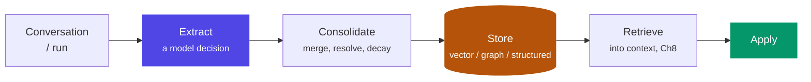

# Chapter 9: Memory Architecture

> The design question is not "how do agents remember?" — it's "what should be remembered, for how long, visible to whom, and forgettable on demand?"

## 1. The taxonomy

| Memory type | Contains | Lifetime | Example |
|---|---|---|---|
| Short-term | Current conversation | Session | The last few turns |
| Working | Current task state | Run (Ch4 state) | Plan, intermediate results |
| Episodic | What happened before | Long | "Last month this customer disputed a charge" |
| Semantic | Facts we know | Long | "Customer prefers Hindi; salaried; has a home loan" |
| Procedural | How to do things | Long | Learned resolutions, playbooks |

Short-term and working memory are really *state* (Ch2's distinction). The architecture problem is the long-term kinds: extraction, storage, retrieval, and governance.

## 2. Why the industry needed it — a fraud flag that outlived its own evidence

The abstract argument for memory governance is easy to nod along to; the concrete version is what makes it stick. A digital-banking assistant, early in its rollout, had a memory-writing step that ran after every interaction: a small model looked at the conversation and extracted "worth remembering" facts with no allowlist constraining what counted. During one interaction, a customer's transaction pattern briefly resembled a known fraud signature — a rapid sequence of small transactions followed by one large one — and the extraction step wrote `"customer exhibits fraud-risk transaction pattern"` to long-term memory, unattributed to any specific case number, with no expiry, no confidence score, and no link back to whichever fraud-review process (if any) had actually looked at it.

It turned out to be a false positive — the large transaction was a legitimate down payment the customer had been saving toward for months, and no fraud case was ever opened. But the memory persisted, because nothing in the system was designed to expire or reconsider it. Over the following eight months, that stored fact surfaced across fourteen separate interactions: it subtly weighted the agent's tone (slightly more cautious phrasing), it appeared as context in two escalations to human agents (who saw "flagged: fraud-risk pattern" and treated the customer with unwarranted suspicion), and it eventually contributed to a loan pre-approval agent declining to fast-track an application it would otherwise have fast-tracked. The customer noticed the pattern of unexplained friction, complained, and — because nobody could produce the original evidence for the flag, only the flag's persistent shadow across unrelated interactions — the complaint escalated to the banking ombudsman. The post-incident review found the root cause wasn't the original false-positive detection (false positives are expected and tolerable); it was that the *memory write* had no provenance, no confidence threshold, and no expiry, so a single unverified inference became permanent institutional "knowledge" about a customer with no path back to reconsider or delete it.

This is why memory design carries more governance weight than context design (Ch8): a poisoned context affects one call, gone at the end of the run. A poisoned memory, per this incident, affects every future interaction until someone notices — and "someone notices" took eight months and an ombudsman complaint here.

## 3. The memory pipeline



Each stage is a failure mode, and §2's incident touched three of the four: **extract too eagerly** and you store noise (and liabilities) — the fraud-pattern inference should never have passed an extraction policy that only allowed stated facts and confirmed case outcomes; **consolidate poorly** and memories contradict or, as here, simply never get revisited once the underlying situation resolved; **retrieve badly** and the agent "remembers" irrelevant things at the wrong moment — surfacing an unresolved risk flag in a loan pre-approval context it had no evidentiary connection to.

## 4. The 2026 framework landscape (architect's comparison)

Mem0, Zep, Letta, LangMem, Cognee dominate the open conversation; **Bedrock AgentCore Memory** is the managed entrant — explicit short-term (multi-turn, session-scoped) and long-term (cross-session, sharable across agents) stores with extraction strategies you configure rather than build, attractive when the rest of the stack is AgentCore (Ch7 §8) and subject to the same governance axes below. Compare them on the axes that matter, not features: *where extraction runs* (inline vs async), *storage model* (vector-only vs temporal knowledge graph — Zep/Cognee lean graph, which pays off exactly when relationships and time matter), *whether consolidation is real* (updating and contradiction-handling vs append-forever — note that append-forever storage is exactly what let §2's flag persist unchallenged; a store that actively reconsiders old entries against new evidence is structurally safer), and *governance surface* (per-user isolation, TTL, deletion APIs). For a bank, the last axis is usually decisive — and it's the one feature checklists skip. Build-vs-buy: memory frameworks are young; the storage layer is replaceable, but the *schema of what you remember* is yours forever — design that yourself regardless.

## 5. A governable memory record, visualized

```python
class Memory(BaseModel):
    customer_id: str            # partition key — isolation is STRUCTURAL
    kind: Literal["episodic", "semantic", "procedural"]
    fact: str                   # "prefers Hindi for service calls"
    source_ref: str             # trace/conversation id — provenance = deletability
    confidence: float           # §2's fix: unconfirmed inferences never reach "fact" status
    purpose: str                # DPDP purpose limitation, checked at retrieval
    ts: datetime
    ttl_days: int | None        # stale facts expire; balances aren't facts; RISK FLAGS especially aren't

def recall(customer_id, query, purpose):
    return search(query,
        filter={"customer_id": customer_id, "purpose": purpose, "confidence__gte": 0.8})  # BEFORE similarity
```

Everything the governance sections below demand is a *field*, not a hope. Trace §2's incident through this schema: `"customer exhibits fraud-risk transaction pattern"` with no confirmed fraud case behind it would either fail the extraction policy outright (§6's allowlist) or land with a low `confidence` and a short `ttl_days` — either way, it would not have survived eight months and fourteen retrievals as an unexamined fact.

## 6. Design decisions

- **Remember by policy, not by default.** Define categories the system MAY store (stated preferences, case history, *confirmed* case outcomes) and categories it must NOT (inferred traits, unconfirmed risk signals, sensitive attributes without purpose). Extraction runs against the policy — §2's flag is precisely the category this allowlist exists to exclude: an inference about the customer, not a stated or confirmed fact.
- **Provenance per memory**: source conversation, timestamp, confidence. Unattributable memories are undeletable and unauditable — and, per §2, unreviewable: nobody could trace the fraud flag back to whatever momentary pattern triggered it, which is exactly what made it impossible to correct once it turned out to be wrong.
- **Scope boundaries**: per-customer memory must be structurally isolated (partition keys, not prompt discipline) — retrieval for customer A must be *unable* to return customer B, enforced the same way §8's `check_policy` filters by `customer_id` before similarity search runs at all.
- **Expiry as a feature**: balances change, addresses change, and risk assessments change fastest of all. Prefer durable phrasings, timestamp everything, decay what's stale — a `ttl_days` on a risk-adjacent inference should be measured in days or weeks, not "forever by default," which was §2's actual bug.
- **Forgetting on demand**: deletion is an API and a regulatory obligation (DPDP right to erasure), which means derived artifacts (summaries, embeddings) must be traceable to their sources — a customer who successfully disputes a stored inference needs that dispute to actually remove it from every derived form, not just the primary record.

## 7. Learning and adaptation — memory's active cousin

Memory stores; **learning changes future behavior**. Without touching model weights, agent systems adapt through:

- **Procedural memory** — successful resolutions distilled into playbooks the agent retrieves ("last 5 KYC-exception cases resolved via steps X-Y-Z").
- **Feedback incorporation** — HITL corrections (Ch20) and eval outcomes (Ch17) written back as do/don't exemplars, making the traces→evals flywheel also a traces→behavior flywheel.
- **Self-reflection** — post-run critique ("what would I do differently?") stored and retrieved for similar future tasks (the Reflection pattern, Ch3, pointed at the long term).

The governance catch, and it's the same lesson §2 taught the hard way: a system that adapts is a system that *drifts* — learned content needs the same provenance, review thresholds, and rollback as any memory write, and in a bank, a changed behavior needs a traceable cause (an MRM expectation, Ch20). Design learning as versioned, reviewable memory — never as silent accumulation, because silent accumulation is exactly the mechanism that let one false-positive inference become eight months of unexamined institutional behavior.

## 8. Why bad memory is worse than no memory

Wrong personalization (acting on stale or misattributed facts) destroys trust faster than forgetfulness — §2's customer would have been better served by an agent with no memory of the fraud-pattern moment at all than by one that carried it forward uncritically. Memory is also an attack surface — a poisoned memory persists across sessions, unlike a poisoned context (Ch8), which is scoped to one call. And every stored personal fact is a data-protection liability with a lifecycle. The bar for writing to memory should be *higher* than the bar for using context, precisely because a bad context decision costs one call and a bad memory decision, per §2, can cost eight months and an ombudsman complaint.

## 9. Industry implementation

Consumer assistants (ChatGPT memory, Claude memory) converge on the same short list:

- Explicit extraction with user visibility.
- Editable/deletable stores.
- Category exclusions for sensitive data.

Enterprise deployments add tenancy isolation and retention schedules. Notice the pattern: the mature implementations spend most of their design on *governance*, not recall quality — recall quality is the easy 80%; the governance surface (confidence thresholds, provenance, expiry, deletion) is the hard 20% that determines whether the system is safe to run on real customers, and it's exactly the 20% that was missing in §2.

## 10. Hands-on lab

Build a minimal memory layer for the banking agent, in stages that specifically test for §2's failure mode:

**Stage 1 — the naive version, on purpose.** An extraction step (small model + a loose prompt with no allowlist) writing whatever it judges "worth remembering" to Postgres + embeddings, with no confidence field and no TTL. Feed it a conversation containing an ambiguous, unconfirmed risk signal (mirroring §2) and confirm it gets stored as an undifferentiated fact.

**Stage 2 — the governed version.** Add the allowlist extraction policy, the `confidence` and `ttl_days` fields from §5's schema, and a retrieval filter requiring `confidence >= 0.8`. Re-run the same ambiguous conversation and confirm the low-confidence inference either doesn't get stored or expires quickly and never surfaces in a later, unrelated retrieval.

**Stage 3 — structural isolation and erasure.** Build retrieval that filters by customer partition *before* similarity; attempt a cross-customer retrieval and prove it structurally impossible (not just unlikely). Add a `DELETE /customers/{id}/memories` endpoint and prove it provably clears derived data — embeddings included, not just the primary record.

Deliverable: a short write-up tracing §2's incident through your Stage 1 system (showing it reproduces the failure) and then through your Stage 2/3 system (showing the same input no longer produces a persistent, unreviewable flag).

## 11. Architect's take: the banking read

RBI/DPDP framing turns memory design into three enforceable statements: (1) purpose limitation — memories are stored under a named purpose and retrieved only for it; (2) minimization — the extraction policy is an allowlist, reviewed like any data-collection form; (3) erasure — deletion cascades to embeddings and summaries, demonstrable in audit. §2's incident is what happens when a fourth, implicit statement is missing — *reconsideration*: any stored inference that influenced a customer-facing decision needs a path back to being challenged, corrected, or expired, not just a path to eventual deletion on request. An agent memory system you cannot make these statements about is not deployable in an Indian bank, whatever its recall benchmarks say.

## Governance & security lens

Memory is the layer where a governance failure *persists*: a stored inference, a cross-customer leak, or a poisoned memory outlives the session that created it — §2's fraud flag outlived it by eight months and fourteen interactions. The controls are structural, not procedural:

- Allowlist extraction policy.
- Confidence thresholds.
- Purpose tags checked at retrieval.
- Partition isolation.
- Provenance on every record.
- TTLs.
- Erasure that cascades to derived artifacts.

Governing questions:

- Can we show a regulator every memory held about a customer, why each was collected, and delete them provably?
- Can any write reach memory without passing the policy?
- Does any inference that influenced a customer-facing decision carry a confidence score and an expiry?

(This chapter and Ch19/20 are where the lens originates; the summary here is the checklist.)

## Interview-ready lines

- "The bar for writing memory should be higher than the bar for using context — memory persists, and so do its mistakes."
- "Isolation by partition key, not prompt discipline."
- "A memory without provenance is undeletable — and therefore non-compliant by construction."
- "Frameworks are replaceable; your memory schema and policy are the architecture."
- "An unconfirmed inference with no confidence score and no expiry doesn't stay a hypothesis — it quietly becomes institutional fact. I've seen it take eight months to get challenged."
- "A poisoned context costs one call; a poisoned memory costs every call until someone notices — that asymmetry is why memory governance is stricter than context governance."


## Interview Questions & Answers

**Q1: Why does an agent need a durable memory layer at all, when the context window already holds the entire conversation?**

The context window is scoped to one run — it disappears the moment the call ends, along with anything the agent learned during it. A banking assistant that resolves a KYC exception on Monday has no way to recall that resolution on Thursday unless something outside the window persisted it, and re-deriving every fact from scratch each session is both expensive and impossible for things the model can't re-derive at all, like "this customer disputed a charge last month." Memory is what lets an agent behave as a system with continuity rather than a sequence of amnesiac calls. But that continuity is exactly what raises the stakes: per §8 of this chapter, a poisoned context costs one call, while a poisoned memory costs every call until someone notices — which is why the design bar for writing to memory has to be higher than the bar for using context.

**Q2: Walk me through the different types of memory an agent architecture actually needs, and how they differ.**

I'd split it the way this chapter's taxonomy does: short-term and working memory are really just *state* — the current conversation and the current task's plan and intermediate results, scoped to a session or a run. The long-term kinds are the actual architecture problem: episodic memory ("last month this customer disputed a charge"), semantic memory ("customer prefers Hindi, is salaried, has a home loan"), and procedural memory (learned resolutions and playbooks distilled from past successful cases). Each has a different retention policy and a different failure mode if it's wrong — a stale semantic fact about a phone number is an inconvenience, but a stale episodic fact framed as a risk signal, like the fraud-pattern inference in §2, is a governance incident. The design work isn't recall — it's deciding, per category, what gets extracted, for how long, and under what confidence.

**Q3: When would you choose a vector store versus a graph or structured store for an agent's long-term memory?**

Vector-only stores are fine for pure similarity recall — "find memories that read like this query" — but they're weak at representing relationships and time, which is exactly what episodic memory needs: what happened, in what order, connected to which case. That's why frameworks like Zep and Cognee lean toward a temporal knowledge graph rather than vectors alone, and it's the axis I'd actually compare frameworks on rather than feature checklists. For a bank, I'd also weigh a third option this chapter treats as non-optional: a structured, governed record (§5's `Memory` schema, with `customer_id`, `confidence`, `source_ref`, `ttl_days`) sitting underneath whatever similarity index you use, so that retrieval can filter on partition, purpose, and confidence *before* similarity search runs — not after.

**Q4: Suppose a memory-extraction step writes an inference to long-term memory that later turns out to be wrong, and nothing in the system is designed to expire or revisit it. What actually goes wrong?**

This is close to a real incident this course is built around: an extraction step, running with no allowlist, saw a transaction pattern that briefly resembled fraud and wrote "customer exhibits fraud-risk transaction pattern" to memory with no case number, no confidence score, and no expiry. It turned out to be a false positive — a legitimate down-payment transaction — but the flag persisted for eight months across fourteen interactions: it colored the agent's tone, it appeared in two human-agent escalations as unexplained justification for suspicion, and it contributed to a loan pre-approval agent declining a fast-track it should have granted. What goes wrong isn't the false positive itself — those are expected — it's that an unverified inference with no provenance and no path back to reconsideration becomes permanent institutional "knowledge," indistinguishable in the system from a confirmed fact.

**Q5: If a bad memory record like that does get retrieved months later, what's the downstream blast radius across the rest of the agent estate?**

It's rarely contained to one interaction, because a shared memory store fans one bad write out to every downstream consumer that queries it. In the actual case, the same fraud-pattern flag touched tone generation, two separate human-escalation contexts, and an entirely unrelated loan pre-approval agent — three different systems, none of which had any evidentiary link back to whatever moment produced the flag. That's the structural danger: unlike a bad context decision, which is contained to the call that made it, a bad memory decision compounds across every agent and every channel that shares the store, and the harder it is to trace provenance, the harder it becomes to even identify how far the damage spread once someone finally does notice.

**Q6: What are the real cost trade-offs in designing a memory store — storing everything versus being selective, and across different retrieval strategies?**

Storing everything looks cheap upfront — extraction is a small model call, and storage is inexpensive per record — but the real cost shows up downstream: every unfiltered fact is something retrieval has to rank, embed, and potentially surface at the wrong moment, and every stored personal fact is a data-protection liability with its own lifecycle to manage. The cheaper posture, long-run, is an allowlist that stores less but stores it with confidence and provenance attached, because the alternative cost — an eight-month, fourteen-interaction failure that escalates to the banking ombudsman — dwarfs any storage-line-item savings from being permissive. On retrieval, the trade-off is between pure vector similarity (fast, cheap, but blind to relationships and time) and a graph or structured layer (more expensive to maintain and query, but the only way to filter by customer partition, purpose, and confidence before similarity runs at all) — for a regulated bank, that governance filter is not optional, so it's a cost you architect for from day one rather than bolt on later.

**Q7: What data-security risks does a persistent, cross-session memory store introduce that a stateless context window doesn't?**

A context window is scoped to one call and gone at the end of it; a memory store is a standing repository of customer facts that has to be defended continuously, which makes it an attack surface a context window simply isn't — a poisoned memory persists across sessions rather than being contained to one. The specific risks are cross-customer leakage if isolation is enforced by prompt discipline rather than structurally, unattributable records that can't be audited or challenged, and derived artifacts — summaries, embeddings — that quietly retain data even after the primary record is deleted. §5's schema treats `customer_id` as a structural partition key precisely because isolation has to be enforced by the query layer (filtering before similarity search runs), not by hoping the model behaves — the same discipline the retrieval function in §5 applies before ever touching the vector index.

**Q8: What guardrails would you put in place before allowing a model's inference to be written to long-term memory?**

Three, and they map directly onto the fields in this chapter's `Memory` schema. First, an allowlist extraction policy — the system defines categories it may store (stated preferences, confirmed case outcomes) and categories it must not (inferred traits, unconfirmed risk signals), so an ambiguous pattern-match like the fraud-flag case never passes extraction as a bare fact in the first place. Second, a confidence threshold — unconfirmed inferences either don't get written or get written with a low `confidence` value that keeps them out of retrieval (§5's `recall` function filters on `confidence__gte` before similarity search runs). Third, a `ttl_days` field sized to the risk of the content — a stated language preference can be durable, but a risk-adjacent inference should expire in days or weeks, not persist "forever by default," which was the actual root cause in §2, not the false-positive detection itself.

**Q9: How would you design access control over who — or what — can read and write to a customer's memory record?**

I'd treat read and write as separate entitlements, not one permission. Writes should be restricted to the extraction pipeline running against the allowlist policy from §6 — no ad hoc process should be able to append to memory outside that gate, because an unreviewed write path is exactly how an inference like §2's fraud flag entered the system in the first place. Reads should be scoped two ways at once: structurally by `customer_id` as a partition key, so retrieval for one customer is *unable* to return another's records regardless of query wording, and by `purpose`, so a memory collected for service-preference tracking can't be silently pulled into a lending decision it was never authorized for — both are enforced as filters applied before similarity search runs, not as prompt-level courtesy.

**Q10: How do you actually operate a memory store in production at bank scale — what does the scaling and pruning cadence look like?**

Scaling is mostly a storage-and-index problem — vector or graph indexes for millions of customers need sharding by partition (naturally, since `customer_id` is already the isolation boundary) and monitoring on retrieval latency as the store grows, the same way any production data store would be operated. The part that's specific to memory, though, is pruning: TTL expiry can't be an occasional batch job run "when someone remembers" — it needs to be a scheduled, monitored process, because §2's entire failure was a fact that should have expired in weeks sitting untouched for eight months. I'd also run a periodic reconciliation pass that checks whether any long-lived, high-influence memory (something that's been retrieved repeatedly and fed customer-facing decisions) still has current provenance and confidence behind it, rather than assuming that because a record hasn't been challenged, it's still correct.

**Q11: Design the memory architecture for a banking assistant that needs to remember a customer's language preference, their dispute history, and a possible fraud-risk signal. How do you treat each differently?**

I wouldn't treat them as one bucket. Language preference is a durable semantic fact — high confidence, long or no TTL, low review burden, because getting it wrong just means one awkward interaction. Dispute history is episodic and needs strong provenance — each entry tied to a `source_ref` case number, because a customer or auditor may need to trace exactly which conversation produced it. A fraud-risk signal is the highest-risk category of the three and should follow §5's schema most strictly: it enters memory only if it passes the extraction allowlist as a *confirmed* case outcome rather than a pattern match, it carries a low default confidence unless a fraud case explicitly confirms it, it gets a short `ttl_days` measured in days or weeks, and its retrieval is filtered by `purpose` so it can't silently surface in an unrelated context — like a loan pre-approval — the way it did in the actual incident this chapter is built around.

**Q12: How does episodic memory help an agent improve over time, and how do you keep that "learning" from drifting into unreviewed behavior change?**

Episodic and procedural memory are what let an agent get better without retraining the model — successful resolutions get distilled into playbooks ("the last five KYC-exception cases were resolved via steps X-Y-Z"), and human corrections or eval outcomes get written back as do/don't exemplars the agent retrieves next time it sees something similar. The catch is that a system which adapts is a system that drifts, and the same discipline that governs a single memory write has to govern learned content too: provenance, a review threshold before a pattern becomes a playbook step, and rollback if it turns out to be wrong. That's the same lesson §2 taught at the level of a single fact — silent accumulation is exactly the mechanism that let one false-positive inference become eight months of unexamined institutional behavior, and "learning" is just that same mechanism operating at the level of behavior instead of a single record, so it needs the same MRM-style traceability (Ch20) rather than being treated as harmless self-improvement.
