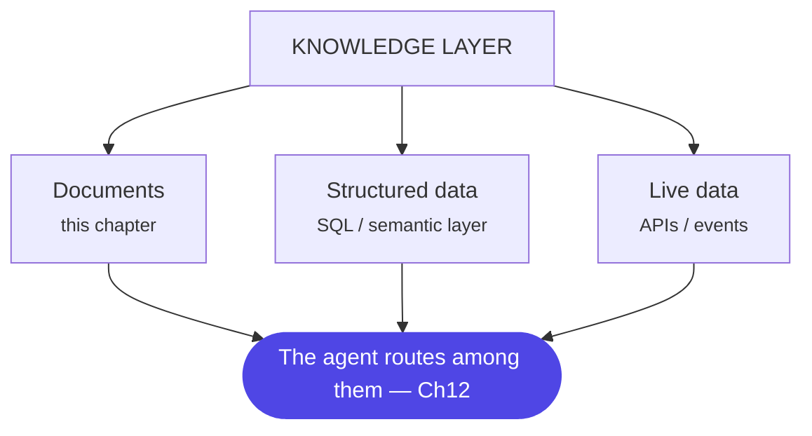

# Chapter 10: Enterprise RAG, Properly

> RAG didn't die when agents arrived — it became one knowledge source among several, and the bar for doing it well went up.

## 1. The architecture

In an agentic platform, RAG is a *service the agent calls*, not the application itself. This chapter is about making the document leg excellent, because "agentic" doesn't fix bad retrieval — it just retries it, more expensively, and with more confidence in the wrong answer.

## 2. Why the industry needed it — chunking stopped being a preprocessing checkbox

Every team's first RAG pipeline treats chunking as a step you configure once and forget: pick a token count (512 is the folk-wisdom default), split, embed, move on. It works in the demo, because demo documents are short and demo questions don't land near a boundary. It keeps working in early production, because most real questions still don't land near a boundary. Then a question does — a clause split exactly where the chunker happened to cut, a conditional that lives in the *next* chunk over — and the system doesn't fail loudly. It answers confidently, cites a real document, and is quietly wrong, because nothing about a well-formed 512-token chunk *looks* truncated. §4 below is that failure, in full, because "chunking is a preprocessing detail" is the single most expensive assumption a RAG team makes, and it's almost always made silently, by whichever engineer configured the ingestion job first and never revisited it.

The industry's answer, matured over the last two years: chunking is a **design decision with its own trade-off space** (how a chunk is drawn) and its own **architectural timing decision** (when it's drawn — before indexing, or on demand at query time) — both decided per corpus, against an eval set, the same disciplined way Ch17 asks you to decide everything else.

## 3. A worked example — building the policy-document leg for the banking agent

Ch8's fee-waiver policy documents (the ones behind `check_policy`) are the running example. Walk through choosing a chunking strategy the way you'd actually do it, not by picking the first one you read about:

**Start with what the documents look like.** Bank policy documents are structured (numbered clauses, headers, cross-references), dense (a single sentence often carries a condition that changes the answer), and they change on a schedule (quarterly circulars, ad hoc amendments). That rules out the simplest option immediately: **fixed-size chunking** (split every N tokens, optionally with overlap) is fast and requires zero document understanding, but it cuts wherever the token count lands, with no awareness of a clause boundary — exactly the failure mode §4 walks through. It's the right default for unstructured, low-stakes text (meeting notes, short FAQs); it's the wrong default for anything a compliance answer will cite.

**Move to structure awareness.** **Document-based chunking** splits at the document's own boundaries — headers, numbered clauses, `<section>` tags — so a chunk boundary and a clause boundary are the same thing by construction. For policy documents this is the floor, not the ceiling: it guarantees you never split *within* a clause, but a single clause can still be too short to be useful alone (a cross-reference like "see clause 4.2" is meaningless without 4.2's content) or too long to embed precisely (a clause with five sub-conditions bundled together produces a noisy, averaged embedding that matches everything and nothing well).

**Add a second layer for precision and context together.** **Hierarchical chunking** keeps multiple granularities — the full policy, its sections, its individual clauses — so retrieval can match at the precise clause level while the system still has the surrounding section available to expand into. This is what "retrieve small, expand to parent" (the v1 version of this chapter's advice) actually means in practice: the small unit gives you retrieval precision, the parent gives the model context it needs to reason correctly, and the two are linked by metadata, not guessed at generation time.

**Consider the timing decision separately from the strategy.** All of the above is **pre-chunking**: documents are chunked once, offline, before any query arrives — fast at query time, but the chunking policy is baked into the index, so changing it means re-processing the corpus. The alternative, **post-chunking**, retrieves whole documents first and chunks them dynamically in response to the specific query — more flexible (the chunk boundary can be shaped by what the query actually needs) and more architecturally complex, at the cost of added latency on the first response. For a bank's policy corpus, where documents change on a predictable schedule and low query latency matters more than per-query chunking flexibility, pre-chunking is the right default — but this is exactly the kind of choice worth stating explicitly and revisiting with evidence, not assuming.

The resulting pipeline: document-based chunking as the structural floor, hierarchical linkage from clause to section to document, metadata on every chunk (document, section, clause number, effective date, product), pre-chunked and indexed offline, re-chunked only when a document version changes.

## 4. A failure story — the clause that got cut in half

Before the fee-waiver policy corpus moved to structure-aware chunking, it ran on the folk-wisdom default: fixed-size chunks of 512 tokens with a 50-token overlap. One clause read, in full: *"Waivers up to ₹2,000 are approved automatically for first-time disputes, provided the customer has no more than one prior waiver in the preceding 12 months."* The 512-token boundary fell — by pure accident of document length, nowhere near any clause the ingestion team had looked at — in the middle of that sentence, right before "provided." Chunk A ended with "...approved automatically for first-time disputes." Chunk B began with "provided the customer has no more than one prior waiver..." Neither chunk read as obviously broken: Chunk A is a complete, grammatically fine sentence on its own, and it's also exactly the kind of sentence a semantic-similarity search ranks highly against a query like "is this waiver approved automatically" — it's a strong, confident, on-topic match. Chunk B, starting mid-clause with "provided," carries weaker embedding signal for that same query and often didn't make the top-k cut at all.

For weeks, `check_policy` retrieved Chunk A, reasoned correctly over what it saw, and approved waivers with no visibility into the twelve-month condition living one chunk away. Nothing about any individual run looked wrong — the retrieved chunk was real, the citation was real, the model's reasoning over that chunk was sound. A compliance sample review, checking a batch of approved waivers against customers' full waiver history, found a cluster of repeat-waiver approvals that should have been declined. The root cause traced not to `check_policy`'s reasoning, not to the retrieval ranking, but to a chunk boundary drawn by a token counter that had never read the document it was cutting.

## 5. Design decisions

- **Chunking is chosen per corpus, against an eval set — never defaulted.** §3's decision tree (structure available? clauses need cross-linking? does timing matter more than flexibility?) is the reusable version of this; the wrong default, applied without an eval set to catch it, is exactly what produced §4's incident.
- **The chunk boundary and the citable unit should be the same thing.** If a compliance reviewer would cite "clause 4.2," your retrieval unit should be able to return exactly clause 4.2 — not an arbitrary 512-token window that happens to overlap it. This is the structural fix for §4: a document-based or hierarchical chunker cannot silently split a clause, because the clause boundary *is* the chunk boundary by construction.
- **Structure-aware beats fixed-size** for anything a citation depends on; fixed-size stays legitimate for low-stakes, unstructured text where speed matters more than precision (Ch8's context-budget bullets, meeting notes, FAQs).
- **Pre-chunk by default; post-chunk when the query genuinely needs to shape the boundary.** §3's timing decision — pre-chunking wins on latency and simplicity for a corpus that changes on a schedule; post-chunking earns its added complexity only when different queries need genuinely different chunk shapes from the same source document.
- **Metadata travels with the chunk, not beside it.** Document, section, clause number, effective date, product — attached at chunking time, filtered on at query time (§2b's `retrieve()`), and carried into the citation, so "which clause said that" is always answerable without a second lookup.

## 6. Trade-offs

- Bigger chunks: more context per hit, worse precision, costlier windows. Smaller: the reverse — and per §4, small-but-blind (fixed-size) trades precision you can't see you're losing until an incident finds it.
- Structure-aware and hierarchical chunking cost more engineering upfront (the chunker has to understand document structure, not just count tokens) — worth it exactly where §4's failure mode is expensive, i.e., anywhere a chunk becomes a compliance citation.
- Late chunking — embedding the full document first with a long-context model, then deriving chunk-level vectors from those pre-computed, context-aware tokens instead of embedding each chunk in isolation (the technique Jina AI published in 2024) — buys chunks that keep cross-references and pronouns resolvable against the whole document, at the cost of needing a long-context embedding model and more compute per document.
- Reranking adds ~100–300ms and a model dependency; almost always worth it above trivial corpora.
- Hybrid search doubles index maintenance; still the default because enterprise queries are id-heavy.
- Post-chunking's flexibility costs first-response latency and a more complex runtime path — don't pay for it on a corpus that doesn't need it.
- Multilingual (your Siddhi world): multilingual embedding models vs translate-then-embed — decide with evals per language pair, not vibes.

## 7. Industry implementation

**The chunking-strategy landscape has converged on a handful of named techniques**, worth knowing by name because they show up in vendor docs and interviews alike: fixed-size (fast, structure-blind), recursive (splits by a prioritized separator list — paragraphs, then sentences, then words — a solid default for unstructured text), document-based (splits at the document's own structural boundaries), semantic chunking (groups sentences by embedding similarity and cuts where the topic shifts, rather than by any fixed rule), LLM-based chunking (a model reads the document and proposes meaning-preserving boundaries directly), agentic chunking (an agent selects — or combines — whichever of the above fits a given document's structure and content), hierarchical chunking (multiple linked granularities, per §3), and late chunking (per §6, embed-the-whole-document-first). None of these is universally "best" — §3's decision process, not a leaderboard, is what picks one.

**The mature stack** is object store → parsing service → chunker → dual index (vector + keyword) → retrieval API with filters + reranker — exposed to agents *as a tool* with a clean schema (Ch13). Managed services (Bedrock Knowledge Bases, Azure AI Search, Vertex AI Search) give you the skeleton; the differentiating work — chunking policy, metadata schema, eval set, freshness pipeline — is never in the box, which is exactly why §4's incident is a chunking-policy failure and not a vendor failure: the vendor gave the team a chunker, not a chunking *decision*.

## 8. Hands-on lab

Build the policy-document leg for the banking agent, then prove the chunking choice with evidence rather than intuition:

**Stage 1 — build the eval set first.** 50 questions with known source clauses (include at least 10 where the correct answer depends on a conditional clause, mirroring §4). This eval set is what every later stage gets measured against — no chunking decision ships without a number from it.

**Stage 2 — reproduce §4 on purpose.** Ingest with plain fixed-size chunking (512 tokens, 50-token overlap) and run the eval set. Confirm you can reproduce the failure: at least one question whose correct answer depends on a conditional that a chunk boundary split away from its main clause.

**Stage 3 — fix it and re-measure.** Rebuild the index with document-based (or hierarchical) chunking, metadata-linked to section and clause. Re-run the identical eval set and report recall@5 and answer groundedness before and after — this before/after table, with the specific clause-split failure named, is the portfolio artifact.

**Stage 4 — the timing decision.** Argue, in writing, why this corpus is pre-chunked rather than post-chunked, referencing §3's decision criteria (document change cadence vs. query latency requirements) rather than asserting it.

## 9. Architect's take: the banking read

In a bank, RAG's differentiators are governance-shaped: retrieval must respect document classification and the *user's* entitlements (filter at query time by ACL, not by hoping the corpus is clean); citations must point to the authoritative version of the policy, because "the bot said X" incidents end with "which document version said X?"; and effective-dating is not optional when regulations change quarterly. §4 adds a specific, underrated fourth: the citation itself must be *complete* — a citation to a real, correctly-classified, current document version is still a liability if the retrieved chunk silently omits the clause's own condition. Bad RAG in a bank isn't just unhelpful — it's an incorrect-disclosure risk, and a chunking policy chosen without an eval set is how that risk gets introduced invisibly.

## Governance & security lens

RAG's core risk in an enterprise is *wrong or unauthorized disclosure*: retrieval must filter by the requesting user's entitlements at query time (never rely on a "clean" corpus), respect document classification, cite the authoritative version (incidents end with "which document version said that?"), and honor effective dates. The corpus is also an injection surface — a poisoned document is an instruction delivery vehicle, which is why retrieved content carries trust labels (Ch8). §4 adds a specific control worth naming: a chunking policy for any document that can be cited in a compliance decision should itself be reviewed and versioned, the same way the policy documents it chunks are — a silent token-count default is not a decision anyone signed off on. Governing questions: can a user ever retrieve a chunk their role couldn't read at the source, can we trace every generated claim to a governed document version, and can we show that our chunking policy never separates a clause from the conditions that qualify it?

## Interview-ready lines

- "Top-k similarity is a candidate generator; filtering and reranking make it retrieval."
- "Chunking is a design decision with an eval, not a preprocessing default."
- "Hybrid search is the default because enterprise queries are full of exact identifiers."
- "An enterprise RAG that can't say 'not in sources' is a liability generator."
- "A chunk that reads as a complete, grammatically fine sentence can still be a truncated clause — fixed-size chunking can't tell the difference, and neither can a human skimming the citation."
- "Pick the chunking strategy from a decision tree — document structure, clause linkage needs, query-time flexibility — not from whichever default the tutorial used."
- "The chunk boundary should be the citable unit. If a reviewer would cite 'clause 4.2,' retrieval should be able to return exactly clause 4.2."
