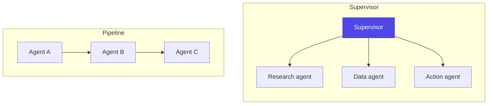

# Chapter 15: Multi-Agent Systems

> First question in every multi-agent design review: do you actually need multiple agents? Usually the honest answer is "not yet."

## 1. The architecture



From Ch3 and Ch8, the *only* durable justifications for splitting one agent into several:

1. **Context isolation** — subtasks whose working context would poison or bloat each other (a research sweep vs a synthesis pass).
2. **Permission boundaries** — the card agent holds card-system credentials; the loan agent holds LOS credentials; no agent holds both (least privilege as architecture).
3. **Heterogeneous models/costs** — a cheap fast model for triage, an expensive one for synthesis.
4. **Parallelism across independent subtasks** — wall-clock, not quality.
5. **Organizational ownership** — different teams ship and eval their agents independently (a platform reason, Ch21).

"Researcher + writer + critic because that's how humans do it" is not on the list (anthropomorphic decomposition, Ch3).

**Topologies.** **Supervisor** — one agent decomposes, delegates, integrates; single point of coherence and audit, but a bottleneck whose context accumulates everything (compress worker results aggressively — Ch8). **Router + specialists** (most production "multi-agent") — classify, dispatch, done, no inter-agent chatter at all. **Pipeline** — agent A's artifact feeds agent B feeds agent C; deterministic order, no shared context at all, each agent sees only what the one before it handed off. **Peer/network** — agents invoke each other; rarely justified internally, and where A2A-style contracts (Ch14) matter most, because coherence must come from task contracts, not shared context.

## 2. Why the industry needed it — the join problem

Most retrieval questions have one answer that lives in one place — "who is the CFO of this company" resolves to one record, and a single-agent tool call is the right shape for that. A useful category of enterprise question doesn't work that way: the answer only exists once you combine two things that live in genuinely separate systems and were never going to show up together in one search result. "Which of our mid-market corporate relationships have had a leadership or funding event in the last quarter, *and* which of those contacts have we not reached out to since?" isn't answerable from one query against one source, because the trigger event lives in market and regulatory news, and the contact's role history and relationship status live in an entirely different system.

A single generalist agent *can* answer this — by searching, opening a dozen pages, reading past the marketing copy for the one paragraph that matters, and repeating that for every candidate company — but that's an expensive, brittle way to do a join. Every fetched page returns a pile of unstructured text the model has to re-parse, and the model doing that re-parsing at every step is exactly the "fragment reassembly" tax Ch8's context-engineering argument warns about, paid over and over across dozens of candidates. The industry's answer is the one this chapter has been building toward since §1: split the join into stages, give each stage a narrow, well-scoped job and only the tools that job needs, and let the final stage merge two already-clean records instead of reconstructing them from scratch. Retrieval tools that return whole structured records instead of search snippets (Ch10's chunking argument, generalized — a snippet is a badly-drawn chunk of an answer) make each stage cheaper and more reliable, but the multi-agent shape is what makes the join possible at all.

## 3. A worked example — the relationship-opportunity pipeline

A mid-market corporate relationship team wants a standing pipeline that surfaces, every morning, which existing clients just had something happen worth a phone call — a new CFO, a funding round, a credit-relevant expansion — and who on the relationship-management team should make that call, with a specific reason to open with. This is Ch15's textbook join problem: the trigger event and the contact's current role live in different places, and the team's own book of relationships lives in a third place entirely. Three agents, in a strict pipeline (§1):

**Agent 1 — Signal Scout.** Given the bank's list of existing corporate relationships, it queries a market/news retrieval tool for events in a fixed lookback window: leadership changes, funding rounds, expansions, credit-rating actions. It holds *only* this tool — no access to the bank's internal counterparty systems, because its job is external signal-finding, and giving it more than that widens its blast radius for no benefit (Ch5's tool-policy discipline, applied here at the agent level instead of the tool level). Output: a typed list of `{company, person_name_as_reported, event_type, event_date, source}` — deliberately *not* a resolved identity yet, because the name in a news headline is not the same thing as a verified contact record, which is exactly what §4's failure story is about.

**Agent 2 — Counterparty Enricher.** Given Agent 1's output, it queries the bank's internal, KYC-cleared counterparty and contact database for each named individual, resolving the reported name to a specific, structured contact record — current title, tenure, relationship-manager of record, and contact permissions. It holds *only* this internal-lookup tool; it cannot reach the open web, because its job is resolution and enrichment against data the bank already governs, not discovery. This is the "permission boundaries" reason from §1 doing real work: Agent 1 and Agent 2 each hold exactly one tool, and neither tool is powerful enough on its own to leak the other's job.

**Agent 3 — Relationship Strategist.** Holds *no* retrieval tools at all — it reasons only over what Agents 1 and 2 already produced, merging a resolved contact record with its triggering event into a ranked list: who to call, why now, and a one-line reason grounded in the specific event. Because it never touches a tool, its failure modes are limited to reasoning over already-verified inputs — it cannot itself misidentify a person, only propagate a bad identification if one reached it (which is exactly what happens in §4).

**A hybrid heuristic worth stating explicitly:** for the single most senior trigger at a client — a CEO or board-level change — a broader, human-reviewed source is the more reliable first call, because that signal is rare, high-stakes, and worth a person's judgment before it reaches a relationship manager's call list. Agent 1's automated news scan earns its keep at the layer below that: the dozens of VP- and director-level changes across a large book of relationships that no team has the headcount to track by hand. Chaining "generalist judgment at the top, automated pipeline for the depth below" gets more coverage than either alone, and is a cleaner design than trying to make one retrieval tool authoritative at every seniority level.

## 4. A failure story — the outreach call to someone who'd already left

Agent 1 surfaced a real event: a headline reporting that a client company's CFO was stepping down, with a successor named later in the same article. The delegation from Agent 1 to Agent 2 — per §1's typed-handoff pattern, but under-specified in this instance — passed only a bare name string, "R. Kapoor," extracted from the headline's first sentence, with no field distinguishing *outgoing* from *incoming*. The article had, in fact, named the outgoing CFO first. Agent 2 resolved "R. Kapoor" against the bank's counterparty database, found a matching contact, and enriched a complete, accurate record — for the departing executive, not the new one. Nothing in Agent 2's output looked wrong: it was a real person, a real prior role at that company, a plausible-looking record. Agent 3 merged it with the trigger event and produced exactly what it was designed to produce — a ranked outreach recommendation with a specific opening line congratulating this contact on the new role. A relationship manager, trusting the pipeline's output, called the number on file to offer congratulations, and reached someone who had left the company two months earlier and was, understandably, confused and a little irritated. No system alarm fired, because every individual step had done its job correctly against the input it was given — the failure lived entirely in what the delegation between Agent 1 and Agent 2 left unsaid.

## 5. Design decisions

- **Delegation payloads carry structured identifiers, not bare names.** §4's incident traces to a `person_name` string with no `role_direction` (outgoing/incoming) or other disambiguating field — the fix is the same principle Ch19 applies to entitlements: identify by structured, checkable fields, not by a string a human (or a model) has to interpret correctly on every hop. §3b's `Delegation` contract should have a required field for exactly this kind of ambiguity whenever the upstream source itself is ambiguous.
- **Each agent gets exactly the tools its job needs, never "just in case."** §3's Signal Scout and Counterparty Enricher each hold one tool; the Strategist holds none. This isn't caution for its own sake — it's what makes each agent's failure surface small enough to reason about, and it's the same logic as Ch5's per-tool grants, applied at the granularity of an entire agent.
- **Route by seniority and stakes, not by a single retrieval tool for everything.** §3's hybrid heuristic — human-reviewed judgment for the rare, high-stakes signal; an automated pipeline for the high-volume layer below — is a legitimate multi-agent design decision, not a tooling afterthought: it's deciding *which* agent (or human) is authoritative for which slice of a problem.
- Start single-agent; split only when traces show a named reason from §1. Record which reason justified each split — it disciplines the design and gives evals a hypothesis to test.
- Fixed topology beats emergent: declare who may talk to whom (it's an authorization matrix, not an emergent property).
- Independent evolvability: each agent gets its own eval suite (Ch17) so teams can ship without cross-breaking.

## 5b. The delegation contract, visualized

```python
class Delegation(BaseModel):          # every handoff is typed — never a vibe
    goal: str                         # "Resolve and enrich this reported contact"
    subject: ReportedPerson           # {name_as_reported, role_direction, company}  <- the §4 fix
    constraints: list[str]            # ["match on company + role_direction, not name alone"]
    output_schema: type[BaseModel]    # ResolvedContact — the worker's contract
    budget: Budget                    # max_tokens=8k, max_turns=3
    on_behalf_of: str                 # user/team identity travels (Ch19)

result = enricher.run(Delegation(...))        # Agent 2 holds ONE tool, no web access
state["contact"] = compress(result, 300)      # distill before it enters the Strategist's ctx
```

## 6. Trade-offs

- **Cost multiplication.** N agents × M turns × context each. Multi-agent systems routinely cost 5–15× a single-agent baseline on the same task. Anthropic's published multi-agent research experience is blunt about this: parallelism buys speed on genuinely parallel tasks, at a large token premium — §3's pipeline isn't parallel, so the multiplier here is closer to "three sequential calls," a smaller and more predictable cost than a fan-out topology.
- **Debugging becomes a provenance problem.** A wrong answer now has to be traced through which agent, which handoff — §4's incident took a human noticing an awkward phone call, not a system alert, because the failure was a *correct* execution of an *incomplete* instruction. Without per-agent tracing (Ch16) you are archaeology-ing transcripts after the fact.
- **Information loss at boundaries.** Every delegation is a summary, and every summary is lossy (the Ch8 trade-off, squared). §4 is the sharpest version of this: not information lost from *too much* compression, but a critical disambiguating field that was never in the payload to begin with.
- **Conflict resolution needs an explicit policy.** Two workers return contradictory findings — the supervisor (or, in a pipeline, the final synthesis stage) needs an explicit policy: prefer higher-confidence source, escalate, or run a tiebreak, rather than silently picking one.
- **What it buys, worth restating against all of the above.** A cleanly-scoped pipeline turns an expensive, brittle join (one generalist agent re-parsing fragments across dozens of candidates) into a cheap, reliable merge across two already-clean records — §2's whole argument, and the reason the cost multiplier is often still worth paying.

## 7. Industry implementation

**MCP (Ch14) is what makes selective, per-agent tool grants cheap to build.** A retrieval tool exposed once as an MCP server can be connected to exactly the agents that need it — Agent 1 and Agent 2 in §3's pipeline, not Agent 3 — without custom integration code per agent; the framework's job becomes wiring connections, not writing adapters.

**Structured-record retrieval is a real, growing category of tool worth knowing**, distinct from general web search: rather than returning ranked links with snippets that an agent must fetch, parse, and reassemble, a handful of newer retrieval APIs (Seltz is a recent, venture-backed example — a "web index for agents" that returns full structured person and news records in one call) are built specifically to make the multi-agent join in §2 cheap: one call per agent, a complete record back, no second fetch. The pattern is worth recognizing even where you build the equivalent yourself against internal systems, which is exactly what §3's Counterparty Enricher does against the bank's own KYC-cleared database instead of an external API.

**Framework comparison (the architect's matrix).** Run the same design through three lenses: **LangGraph** — topology is an explicit graph; state, scopes, and checkpoints are yours; most control, most code. **OpenAI Agents SDK** — handoffs-as-tool-calls; lightweight, elegant for supervisor patterns; less declared structure. **CrewAI** — role/task metaphors, agents connect to a shared MCP tool via a simple `mcps=[...]` parameter per agent, and tasks pass typed context to the next task by declaring `context=[prior_task]` — fast to stand up a §3-shaped pipeline, though the role/task metaphor pushes toward anthropomorphic decomposition (§1's warning) if you're not deliberate about which agent gets which tool and why. Evaluation axes for all three: where does state live, how are handoffs audited, what happens on partial failure, can topologies be constrained. (This matrix, filled in from your own lab runs, is a strong portfolio artifact.)

## 8. Hands-on lab

Build §3's relationship-opportunity pipeline, then prove the fix for §4's failure with a deliberate-break test:

**Stage 1 — build it as specified, with the gap.** Three agents, sequential, Agent 1 and 2 each with exactly one tool (or a mock/stub if you don't have live data sources), Agent 3 with none. Use a bare `person_name` string in the Agent 1 → Agent 2 delegation, matching §4 exactly.

**Stage 2 — reproduce the failure on purpose.** Feed Agent 1 a synthetic headline naming two people (an outgoing and incoming role-holder) for the same event, and confirm Agent 2 resolves the wrong one at least some of the time — this is the concrete, reproducible version of §4's incident.

**Stage 3 — fix it with §5's structured identifier.** Add `role_direction` (or equivalent) to the delegation schema, require Agent 1 to populate it from the source article, and require Agent 2 to match on company + role_direction, not name alone. Re-run Stage 2's synthetic case and confirm the correct person resolves every time.

**Stage 4 — measure the multiplier.** Compare this three-agent pipeline against a single generalist agent doing the same end-to-end task with one broad tool. Report cost, latency, and — using Stage 2/3's test case as your rubric — accuracy on the specific failure mode this chapter is about.

Deliverable: a before/after table (like §4/§5's fix) plus the cost-multiplier comparison from Stage 4, written as the design-review memo you'd actually bring to defend the multi-agent decision.

## 9. Architect's take: the banking read

In a bank, the permission-boundary justification usually *is* the architecture: agents map to systems-of-record entitlements, no single agent holds both external-discovery and internal-lookup credentials, and every delegation is an auditable record between named identities (Ch19's NHI). §3's pipeline is a clean illustration because the boundary isn't incidental — Agent 1 (external signal) and Agent 2 (internal counterparty data) *must* stay separate, because merging their credentials would mean one compromised or misconfigured agent could pivot from public news scanning straight into KYC-cleared internal records. There's a banking-specific angle §2's generic "join problem" framing doesn't have to consider: any pipeline that turns public signals into outreach touches marketing-consent and relationship-disclosure rules that a generic sales tool never has to think about — "we saw your CFO change in the news, so we called" is a very different compliance conversation for a bank than for a SaaS vendor's sales team, and that conversation needs to happen before the pipeline ships, not after a relationship manager makes the first call.

## Governance & security lens

Multi-agent topology *is* an authorization matrix: who may talk to whom is declared, each agent runs under its own identity with its own grants, and every delegation carries the on-behalf-of user — producing maker-checker-shaped audit records banks already understand. The new risk class is cascading compromise: one poisoned agent's output becomes another's trusted input, so inter-agent messages get the same trust-labeling as retrieved content, and a worker's output never triggers another agent's irreversible action without the same gates a user-triggered action would face. §4 adds a narrower but very concrete control: any delegation built from an *external, unverified* source (a news headline, a scraped page) must carry enough structure for the next agent to disambiguate identity — a bare name string crossing that boundary is itself a governance gap, not just a data-quality nuisance. And per §9, any pipeline that converts external signals into customer or prospect outreach needs a compliance sign-off on the underlying data use *before* build, not a retrofit after a relationship manager has already made a call. Governing question: **if agent X is fully compromised, which other agents can it influence, and what's the worst combined action the topology permits — and separately, has legal/compliance signed off on every external data source this pipeline's outreach decisions are allowed to be triggered by?**

## Interview-ready lines

- "Split on context, permissions, cost tiers, or parallelism — never on human metaphors."
- "Every delegation is a lossy summary; delegation messages deserve schema-level design."
- "The supervisor should hold no credentials — orchestration and capability are separate concerns."
- "Multi-agent costs 5–15× single-agent; the traces must justify the multiplier."
- "A join across two separate systems is the strongest legitimate reason for a multi-agent pipeline — not because it's elegant, but because a single agent doing that join has to reassemble structure from fragments, over and over, at cost."
- "A bare name string crossing an agent boundary is an incident waiting for an ambiguous headline — identify by structured, checkable fields, the same discipline Ch19 applies to entitlements."
- "Route by stakes: human judgment for the rare, high-value signal; an automated pipeline for the high-volume layer underneath it. Neither one alone covers the whole book."


## Interview Questions & Answers

**Q1: Why split a task into a multi-agent pipeline instead of just building one bigger, more capable agent?**

Because a category of enterprise question can't be answered by a single query against a single source no matter how capable the model is — the "join problem" from §2. The relationship-opportunity example is the clean case: the trigger event (a CFO change) lives in market and regulatory news, and the contact's current role and relationship-manager of record live in an entirely separate, KYC-cleared internal system. A single generalist agent can still do this by searching, fetching, and re-parsing unstructured pages for every candidate company, but it pays Ch8's "fragment reassembly" tax on every step, across dozens of candidates. Splitting into Signal Scout, Counterparty Enricher, and Relationship Strategist turns that into three narrow, well-scoped jobs where the last stage merges two already-clean records instead of reconstructing them from scratch — cheaper and more reliable, not more "intelligent."

**Q2: When would you use a single agent over a multi-agent system?**

By default, always — start single-agent and only split when the traces show one of the five durable reasons from §1: context isolation, a real permission boundary, heterogeneous model/cost tiers, genuine parallelism, or separate team ownership. A routine internal task like summarizing a credit memo or answering a policy FAQ doesn't need three agents; it needs one agent with the right tool. "Researcher, writer, and critic because that's how a human team would do it" is explicitly not a valid reason — that's anthropomorphic decomposition, not architecture. The discipline worth stating in an interview is that every split should be traceable to a named reason, recorded at design time, because that record is also the eval hypothesis you're testing later.

**Q3: In the relationship-opportunity pipeline, what happens when the handoff between agents is ambiguous — say, a news headline names both an outgoing and incoming CFO for the same event?**

This is exactly §4's incident. Agent 1 extracted a bare `person_name` string, "R. Kapoor," from the headline's first sentence with no field marking whether that name was the outgoing or incoming executive — the article had, in fact, named the departing CFO first. Agent 2 did its job correctly: it resolved "R. Kapoor" against the counterparty database and returned a complete, accurate, real record — just for the wrong person. Agent 3 also did its job correctly, merging that record with the trigger event into a plausible outreach recommendation, so a relationship manager called someone who had left the company two months earlier. The failure wasn't in any single agent's execution; it was in what the Agent 1 to Agent 2 delegation left unsaid, which is why §5's fix adds a required `role_direction` field to the `ReportedPerson` payload rather than patching either agent individually.

**Q4: After a bad resolution like the R. Kapoor case reaches the final agent and produces a ranked call list, what are the consequences beyond the one awkward phone call?**

The immediate cost is reputational — a bank calling a former employee to "congratulate" them on a role they never took reads as sloppy at best, and if it happens more than once it's a data-governance conversation with compliance, not just an engineering bug. The harder problem is that no system alarm fires, because every step executed correctly against the input it was given; catching it required a human noticing the call felt wrong, and diagnosing it required tracing the delegation payload itself (Ch16), not just the final output. Once found, the fix isn't a one-off correction — every other recommendation the pipeline generated from a bare `person_name` handoff during the same window is now suspect and needs re-verification, because the same missing field could have silently mis-resolved other contacts too. That's the real cost of an under-specified delegation contract: it isn't a single bad answer, it's a whole batch whose correctness you can no longer assume.

**Q5: What are the cost trade-offs of a multi-agent topology versus a single agent doing the same job?**

Multi-agent systems routinely cost 5–15× a single-agent baseline on the same task — it's N agents times M turns times the context each one carries, and Anthropic's own published multi-agent research is blunt that parallelism buys wall-clock speed at a real token premium. The relationship-opportunity pipeline is a milder case because it's a strict sequential pipeline, not a fan-out topology — three agents each doing one bounded call is closer to "three sequential calls" than to a parallel multiplier, and that's a materially smaller and more predictable cost than a router that spins up several specialists at once. The number only makes sense against what it buys: turning an expensive, brittle join (one generalist agent re-parsing fragments across dozens of candidates) into a cheap, reliable merge of two already-clean records, per §2. Any cost conversation with a business stakeholder should lead with that trade, not with the topology diagram.

**Q6: What are the data security implications of giving Signal Scout and Counterparty Enricher different, non-overlapping tool access?**

Signal Scout holds only the external market/news retrieval tool and has no path to the bank's internal counterparty systems, because its job is external signal-finding and giving it more widens its blast radius for no benefit — a compromised or prompt-injected news-facing agent still can't reach KYC-cleared internal data. Counterparty Enricher is the mirror image: it holds only the internal-lookup tool and cannot reach the open web, so it can't be tricked by adversarial content in a fetched page into leaking internal records outward. Neither tool alone is powerful enough to do the other agent's job, which is the actual security property — it isn't about trusting either agent's judgment, it's that the blast radius of a single compromised agent is capped by what its one tool can do. This is Ch5's per-tool grant discipline applied at the granularity of a whole agent instead of a single call.

**Q7: How does access control and least privilege actually get designed at the agent level, rather than the tool level?**

Each agent maps to a systems-of-record entitlement, and the rule is that no single agent holds both external-discovery and internal-lookup credentials at once — §3's pipeline is the clean illustration, with Agent 1 holding exactly one external tool, Agent 2 holding exactly one internal tool, and Agent 3 holding none at all. Giving the Relationship Strategist zero tools isn't an oversight; it caps its failure surface to reasoning over already-verified inputs, so it can propagate a bad identification but can never itself misidentify a person. On top of the tool grants, every delegation carries an `on_behalf_of` field so the user or team identity travels with the request, producing an auditable, maker-checker-shaped record between named non-human identities (Ch19). The topology itself is the access-control artifact: declaring who may talk to whom is an authorization matrix, not something left to emerge at runtime.

**Q8: What does taking a multi-agent system like this to production actually require operationally?**

Topology has to be fixed and declared up front — who may call whom is an authorization matrix, not an emergent property discovered at runtime — and each agent needs its own eval suite (Ch17) so teams can ship and iterate without silently breaking another agent's behavior. Every delegation should carry an explicit budget (max tokens, max turns) as a cheap production safety valve against runaway loops, and per-agent tracing (Ch16) is not optional — §4's incident was found by a human noticing an awkward phone call, not a system alert, because the failure was a correct execution of an incomplete instruction, and without tracing that's archaeology through transcripts after the fact. MCP (Ch14) is what makes the tool-grant side of this cheap: a retrieval tool exposed once as an MCP server connects to exactly the agents that need it without bespoke integration code per agent. And per §9, anything that turns external signals into customer or prospect outreach needs a compliance sign-off on the underlying data use before the pipeline ships, not after a relationship manager has already made the call.

**Q9: Design a multi-agent system for a bank that combines an external adverse-media or sanctions feed with internal transaction history to decide which fraud alerts get escalated to a human investigator. Walk through the topology and controls.**

This is the relationship-opportunity pipeline's shape reused for a higher-stakes case: a pipeline, not a peer network, because the join is the same — external signal in one system, internal account and transaction history in another, and no query joins them directly. An External Signal agent holds only the sanctions/adverse-media retrieval tool; an Internal Account Resolver holds only internal transaction and account-holder lookups, matched on structured fields like `account_holder_id` and `transaction_id` rather than a bare name, because §4's incident is exactly the failure mode a name-only match would reproduce here with worse consequences. A final Alert Composer merges the two into a ranked escalation with a stated reason, but — unlike the relationship pipeline's outreach call — it must not be allowed to close or dismiss an alert autonomously; escalation-closure is an irreversible, compliance-sensitive action and stays gated behind human investigator review, the same "no worker output triggers an irreversible action without the gates a user-triggered action would face" rule from the governance lens. Every delegation carries `on_behalf_of` and a budget cap, and the whole pipeline needs a documented sign-off on which external data sources are permitted to drive an escalation before it goes live.

**Q10: How do Supervisor, Router, Pipeline, and Peer topologies differ, and how do you pick one?**

Supervisor is one agent decomposing, delegating, and integrating — it gives a single point of coherence and audit but its context accumulates everything, so worker results need aggressive compression before they land back in it (Ch8). Router-plus-specialists is what most production multi-agent actually is: classify, dispatch, done, with no inter-agent chatter at all. Pipeline is what §3 uses — Agent A's artifact feeds Agent B feeds Agent C in a deterministic order with no shared context, each agent seeing only what the one before it handed off, which is the right shape when the job is a strict sequence of transformations like signal-find, resolve, then synthesize. Peer/network, where agents invoke each other directly, is rarely justified inside one organization's boundary; it earns its keep where A2A-style contracts across separate organizations matter more than shared context, because in that setting coherence has to come from the task contract itself, not from anything the agents share.

**Q11: What guardrails would you put around a multi-agent system to keep a bad handoff from turning into a bad real-world action?**

The first guardrail is structural: no worker's output ever triggers another agent's irreversible action without the same approval gate a user-triggered action would face, which is precisely what §9's escalation design and the outreach story both turn on. The second is a trust boundary — inter-agent messages, especially anything built from an external, unverified source like a news headline, get the same trust-labeling as retrieved content, because a poisoned or merely under-specified upstream output becomes another agent's trusted input otherwise. The third, directly from §5's fix, is schema-level: any delegation payload built from an ambiguous external source must carry enough structure — a `role_direction`, not just a `person_name` — for the receiving agent to actually disambiguate, and that requirement should be enforced by the `Delegation` contract itself, not left to the sending agent's discretion. Finally, contradictory findings between workers need an explicit conflict-resolution policy — prefer the higher-confidence source, escalate, or run a tiebreak — rather than a supervisor silently picking one, because a silent pick is a guardrail gap in disguise.

**Q12: How do you debug a multi-agent system when the final output is wrong but no individual agent step actually errored?**

That's exactly §4's incident, and it's the reason "debugging becomes a provenance problem" is called out as a trade-off in §6: Signal Scout correctly extracted a name from a real headline, Counterparty Enricher correctly resolved that name against the database, and Relationship Strategist correctly merged the two — every step succeeded against the input it received, and the wrong output only exists because of what was missing between two of those correct steps. Debugging this requires per-agent tracing (Ch16) that captures the full delegation payload at each hop, not just each agent's final answer, because the gap — a `person_name` field with no `role_direction` — is only visible if you can inspect the `Delegation` object itself, not just its output. Without that tracing, you're reconstructing the failure from transcripts after the fact, which is exactly how this one was actually found — a human noticed an awkward phone call, not a system alert. The practical takeaway for production logging: log the contract, not just the result, because a multi-agent bug usually lives in what a schema failed to require.
