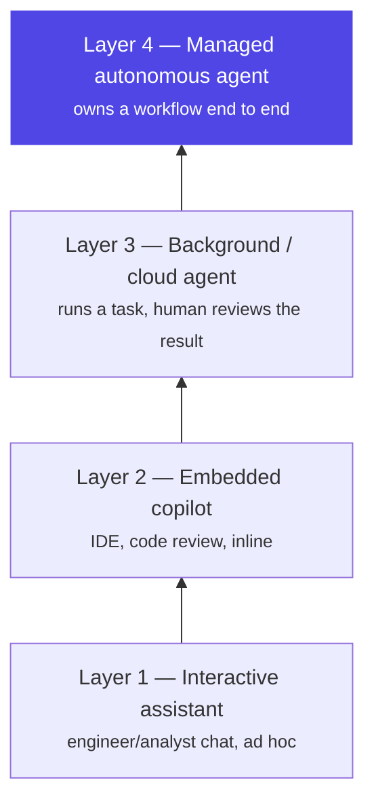

# Chapter 18: Reliability & Cost Engineering

> The goal of this chapter: an agent an SRE team will accept in production and a CFO will keep paying for. In production those turn out to be the same problem — a wasted retry that burns tokens and a wasted hour that burns a customer's trust are both just waste, caught by the same discipline.

## 1. The architecture



Two questions run through this chapter, and they turn out to share one answer: *how do we stop an agent from failing expensively, and how do we stop it from being expensive while it succeeds?* Reliability wraps every stochastic model call in deterministic contracts — validate, bound, fallback, fail closed, the pattern Ch5's harness enforces at the tool-call level and this chapter enforces at the model-call level. Cost engineering wraps every run in a **cost equation**: total spend as several multiplied terms — how many people use the system, how often, and then a further set of terms that are the agent's *own* overhead layered on top of what a person actually asked for (turns per request, tokens per turn, price per token, and retries). The first kind of term you want to grow. The rest is almost entirely where the optimization work lives, because it represents work the agent does on its own behalf that nobody explicitly asked for — the same "hidden work" question Ch1 raised about control flow, now measured in dollars instead of trust.

The four layers above aren't a maturity ladder you're obligated to climb — they're a map of where you actually have leverage. The higher a workload sits, the more you control which model runs it, how its cost is bounded, and how its failures are contained: an interactive chat session is mostly the engineer's own judgment call in the moment, but a fully managed agent processing thousands of runs a day is entirely your architecture's call, end to end. That's the deepest lesson of the industry case study in §7 below — the biggest wins came from moving workloads deliberately up this ladder, not from endlessly tuning prompts at Layer 1.

### Reliability: deterministic boundaries around stochastic cores

- **Structured output validation** at every boundary (Ch13): typed schemas, one repair pass with the validation error, then fail closed. Never let unvalidated model output cross into a downstream system.
- **Retries with judgment**: retry *transient* failures (timeouts, 429s) with exponential backoff + jitter; do NOT blind-retry model calls that returned confidently wrong content — that's a different failure needing a different prompt or path, not repetition. Retries are only safe where tools are idempotent (Ch6/13) — and, as §4's failure story shows, an unjudged retry policy is also a silent cost multiplier, not just a reliability gap.
- **Timeouts everywhere**: per tool call, per model call, per node, per run — nested budgets, each enforced by the harness (Ch5). An agent without timeouts is an outage with extra steps.
- **Fallback chains, defined not improvised**: primary model → fallback model (same schema!) → degraded deterministic path → honest failure with state preserved (Ch4 checkpoint) for resume or human pickup. Degrading gracefully ("here's what I found; I couldn't complete X") beats both silent failure and heroic hallucination.
- **Circuit breakers** per dependency (model endpoint, each tool): trip on error-rate, fail fast, probe to recover. Protects both your latency and the struggling dependency.
- **Error recovery as design**: distinguish *retriable* (transient), *reroutable* (this path failed, try another — Ch12's self-correction), and *terminal* (stop, checkpoint, surface). Tag every failure mode in the codebase with one of the three; untagged errors default to terminal.

### Cost: the four levers

Agent cost decomposes into calls × context × model price × retries. The levers, in typical ROI order:

1. **Context discipline** (Ch8) — the flat-context-curve work is usually the single biggest saving; wandering, non-converging runs (Ch16's metric) are pure waste to hunt down.
2. **Prompt caching** — structure prompts stable-prefix-first (system + tools, then volatile) so cache hit rates transform economics on loops that re-send context every turn; know your provider's cache pricing (Ch7's trap: cache markers on unsupported models throw misleading errors) — §7 below has the concrete TTL math.
3. **Model routing** — cheap models for classification, extraction, summarization; expensive models for planning and synthesis. Route by *step type*, validated by evals (Ch17) so downgrades are proven safe, not hoped. An LLM-gateway layer (LiteLLM-class or your platform's own) centralizes routing, quotas, and provider failover.
4. **Budgets as hard rails** — per run, per user, per tenant, per day (Ch5/6); alert at 80%, halt gracefully at 100% with state checkpointed. The Ch7 billing alarm is the backstop; harness budgets are the frontstop.

## 2. Why the industry needed it — the same incident, two postmortems

Reliability engineering and cost engineering are usually staffed, reviewed, and even measured as separate disciplines — an SRE owns uptime, a platform-cost owner watches the cloud bill, and the two rarely read each other's postmortem. Production keeps teaching the same lesson: they're the same discipline wearing two different invoices. An agent that blind-retries a hung tool five times isn't just slow — it's burning five times the tokens for the same non-answer. An agent whose fallback path was never validated against production policy isn't just a cost anomaly waiting to be found in a bill review — it's a compliance incident that happens to also be free of any code bug, because the failover code did exactly what it was told. §4 below is one incident that generated both kinds of finding, discovered together, because they were never actually two problems.

## 3. A worked example — hardening the dispute-investigation agent's reliability and cost stack

Take Chapter 2's dispute-investigation agent, already hardened once by Ch5's harness (tool policy, bounds, sandboxing, persistence). This chapter adds the layer *above* the harness: what happens when a model call itself fails or drifts, and what the whole stack costs per run at scale.

**Reliability, one gap at a time.** Baseline: a naive retry wrapper retries every failure — timeout, malformed output, rate limit — identically, three times, before giving up. First gap: a malformed `check_policy` output (the model returned prose instead of the typed decision schema) got blind-retried three times, at full token cost each time, before finally failing — three failures for the price of three runs, delivering nothing. Fix: separate retriable (timeout, 429) from reroutable (schema mismatch — send one repair prompt with the validation error, not a blind repeat) from terminal (everything else — stop, checkpoint, surface). Second gap: no circuit breaker meant a struggling policy-lookup dependency kept getting hit by every new run at full retry cost during its own outage, compounding the vendor's problem and the bill simultaneously. Fix: a breaker that trips on error rate and fails fast, so a bad 10 minutes for the dependency costs 10 minutes of fast, cheap failures instead of 10 minutes of expensive retries against a wall.

**The fallback chain, visualized:**

```python
async def call_model(ctx, step_type):
    model = ROUTE[step_type]                     # "classify"→small, "synthesize"→large
    for attempt in backoff(retries=2):
        try:
            out = await llm(model, ctx, timeout=TIMEOUTS[step_type])
            return OutputSchema.model_validate_json(out)   # contract at the boundary
        except (Timeout, RateLimited):  continue           # retriable: transient only
        except ValidationError as e:
            out = await llm(model, ctx + repair_prompt(e)) # ONE repair pass
            return OutputSchema.model_validate_json(out)   # then fail closed
    if breaker.allows(FALLBACK[model]):
        return await call_model(ctx, step_type, model=FALLBACK[model])  # eval-gated
    checkpoint(ctx); raise Degraded("partial result preserved")  # fail clean, resumable
```

**Cost, applied to the same run.** With reliability now bounded, the cost picture becomes measurable instead of noisy — a run that used to cost anywhere from $0.03 to $0.15 depending on how many blind retries it hit now costs a predictable $0.03 every time. From there, the four levers compound: context discipline (Ch8's freshness-filtered, budgeted assembly) keeps the policy-lookup step from re-sending the full customer history every turn; prompt caching, with a TTL matched to how long this agent's steps actually sit idle between turns (a few seconds, not minutes — so the cheaper 5-minute-TTL cache is the right default here, not the 1-hour one §7 uses for slower interactive sessions); model routing sends `fetch_transaction` and `fetch_profile` to a small model and reserves the frontier model for `check_policy`'s genuinely hard interpretation step; and a per-user daily budget caps the blast radius of any customer who somehow triggers hundreds of investigations in an afternoon. None of these four is expensive to add — the expensive mistake is not measuring which one actually matters for *this* agent's traffic pattern before tuning it.

## 4. A failure story — the fallback that changed policy without telling anyone

At 2:14 a.m., the primary model provider serving the dispute-investigation agent had a partial outage — elevated 500s on a fraction of requests. The circuit breaker did exactly its job: it tripped on the rising error rate and routed traffic to the fallback model, precisely as §3's code above is written to do. Nothing about the failover was a bug. The fallback model had been smoke-tested for schema compliance months earlier — it returned the right JSON shape, passed every structural check — but it had never been run through the Ch17 eval suite specifically against the fee-waiver policy's borderline cases, because nobody had treated "the fallback model" as a thing that needed its own eval gate; it was treated as a reliability feature, reviewed by the reliability team, not the policy team. Over the roughly 50 minutes until the primary recovered and the breaker reset, the fallback approved a materially wider band of fee-waiver requests than the primary would have — not fraud, not a reasoning failure anyone could point at, just a subtly different calibration on cases near the policy threshold. A monthly reconciliation review, not a real-time alert, is what caught it: a cluster of waivers from that 50-minute window that a policy audit flagged as inconsistent with current policy. The dollar figure was modest — a few hundred waivers, avoidable had the fallback been eval-gated — but the finding that mattered wasn't the amount. It was that a mechanism built and reviewed entirely as a *reliability* control had quietly executed an unauthorized *policy* change, and the review process that would normally catch a policy change never saw it happen, because nobody files a change request for a circuit breaker doing its job.

## 5. Design decisions

- **A fallback model is a policy decision wearing a reliability costume.** Any model that can reach a production decision path — approve, deny, block, waive — must clear the *same* eval gate as the primary before it's wired into a fallback chain, not a lighter one. §4's incident is what happens when "reliability review" and "policy review" are treated as two different approval processes for the same code path.
- **Retries are typed, not counted.** A retry policy that treats every failure identically is both a reliability gap and a cost leak at once — distinguish retriable, reroutable, and terminal explicitly (§1, §3), because an untyped retry silently multiplies your worst-case cost by however many attempts you allowed.
- **Cache TTL is chosen from measured idle-gap duration, not defaulted.** §7's Uber case study below found the standard 5-minute prompt-cache default was wrong for their own interactive engineers (who idle longer than 5 minutes between turns, so the default constantly rebuilt the cache at full price) but right for short-lived subagent tasks. The lesson generalizes: measure how long *this specific agent's* turns actually sit idle before picking a TTL, the way §3 picked a shorter TTL for the dispute agent's fast-turn pattern.
- **Model selection starts with a benchmark, not a leaderboard.** Before routing any step to any model, build a benchmark from that step's *real* historical inputs and outputs — not a generic public leaderboard — score it on the metrics that step actually cares about (accuracy, but also cost and latency), and re-run the comparison every time a new model ships, because the frontier moves every few weeks and yesterday's routing decision has a shelf life.
- **Tool schema overhead is a cost lever most teams don't know they're pulling.** Every MCP tool installed adds its schema to every session's starting context whether or not that session ever calls it — an agent with a large tool catalog can be carrying tens of thousands of tokens of unused schema before a user types anything. Prune aggressively, and prefer letting the model search for a tool on demand over loading the full catalog every time (Ch14 covers the protocol-level mechanics).

## 5b. FinOps for agents: attribution, budgets, and cost-per-task

§1's four levers get an agent's *aggregate* spend under control; they don't yet tell you whose spend it is, when to stop a given run before it turns into a bill you discover in arrears, or what a single completed piece of work actually cost to produce. That's a separate, narrower discipline — the tagging, budgeting, and per-unit tracking that finance teams call FinOps — and it's worth naming explicitly rather than leaving it implied, because §9's line about cost attribution per business unit "is what lets this survive its second budget cycle" is describing a mechanism, not a sentiment.

- **Cost attribution starts at the call, not the invoice.** Tag every model call *and* every tool call, at the moment it's made, with the agent, the step, and the requesting team or business unit — not reconstructed later from logs. On the dispute-investigation agent, that means every `fetch_transaction`, `fetch_profile`, and `check_policy` call carries the case ID and the originating team, rolled up monthly into a per-team figure rather than one platform-wide line item. Without call-level tags, what you have is showback — "the platform cost this much" — not chargeback, and a risk committee (§9) can tell the difference.
- **Soft and hard budgets are different controls, not two thresholds on the same one.** A soft budget fires a notification at a set spend level — the 80% alert §1's fourth lever already uses — and lets the run continue: someone should look, nobody has to stop it. A hard budget is a wall: at 100%, the run halts with state checkpointed for resume or human handoff (Ch4), the same pattern §3 applies to the dispute agent's per-user daily cap. Pick the behavior deliberately per budget — a soft limit that silently degrades a real customer's case is one failure mode, a hard limit nobody's watching that halts one unattended is another — and name an owner for who can override a hard stop, the way §1 already names an owner for the Ch7 billing alarm it backstops.
- **Cost-per-task belongs on the same dashboard as accuracy and latency, not in a separate finance report.** Track cost per completed dispute investigation as a first-class benchmark metric (§5's "scored on the metrics that step actually cares about") the way §7's Uber numbers report cost per session next to quality, not as a figure finance pulls once a quarter. Cost tracked per *task* tells you something aggregate spend can't: whether a routing change that looks cheaper in total is actually cheaper per successful investigation, or just cheaper per attempt because more of those attempts are failing and getting retried somewhere else in the stack — §3's cost-and-reliability coupling again, now as a metric instead of an anecdote.
- **Tool cost is a separate ledger from model cost, and it's usually the one nobody's dashboarding.** Every lever in §1 targets the model call — tokens, price per token, caching, routing. But a tool call can cost real money independent of any model at all: if `fetch_profile` wraps a paid identity-verification API billed per lookup, or the fraud-scoring step behind `check_policy` hits a third-party vendor with its own per-call price, that spend happens regardless of which model decided to place the call. A cheap model that calls an expensive tool ten times because its reasoning wasn't tight can cost more per task than an expensive model that calls the same tool twice — model routing alone won't see that, let alone fix it; only cost-per-task tracking at the tool-call level will. Attribute and budget tool calls the same way as model calls, with their own soft and hard limits, because a circuit breaker (§1) that trips on error rate says nothing about a dependency that is healthy, responsive, and quietly expensive.

## 6. Trade-offs

- **Reliability machinery adds its own testable surface.** Fallback chains, breakers, and retry taxonomies are code paths that themselves need testing — chaos-style fault injection (Ch16's lab) is the honest way, not "we're pretty sure it works."
- **Fallback models risk quality cliffs — and now, per §4, policy cliffs.** Gate them with evals; prefer "degrade the task" (return a partial, honest result) over "degrade the model" wherever the output is contractual, like a compliance decision.
- **Aggressive caching risks staleness in the cached prefix.** A tool schema change or a policy update must bust the cache, or the agent keeps reasoning against a stale prefix — the same freshness problem Ch8 raised for retrieved documents, now showing up in the cache layer instead.
- **Defaulting to a cheaper reasoning setting is a real quality trade, not a free lunch.** §7's case study defaults reasoning effort to "medium" because it's the right balance for most of their traffic — but "most" isn't "all": a step that reasons about a fee waiver or a fraud flag is not the step to cost-optimize by defaulting down reasoning effort, even if the average step across the fleet benefits from it.
- **Cost optimization that costs more than it saves is theater.** Routing logic that adds 200ms to save a fraction of a cent needs to be measured on both sides of the ledger, not assumed.

## 7. Industry implementation — running a software factory at Uber's scale

Uber's engineering team published a detailed account of how they run reliability and cost engineering for agents across their entire software development lifecycle, and it's worth studying closely because — unlike most public writing on this topic — it comes with real, measured production numbers rather than general advice. As of their writeup, more than 70% of their pull requests are attributed to local or cloud agents, engineers have built over 3,600 reusable agent skills across the SDLC, and the fleet executes more than 30,000 agent skill runs a day. Between February and August 2026, weekly active users of their agentic tooling grew 7x and weekly agent requests grew 9.4x — while total AI spend stayed roughly flat from April onward. Isolating their own optimization work from the effect of model upgrades (which change behavior on their own), they held one model fixed from February to July and still found cost per 1,000 model requests down almost 34% from its peak, and cost per session down 52% from its June peak.

**The cost equation, made explicit.** They decompose total spend into six multiplied terms: two represent adoption and engagement (users, and how often they engage — terms you want to *grow*), and the remaining three represent overhead the agent adds on top of what was actually asked for (extra turns, tokens per turn, and price per token) — almost all of their optimization effort goes into those last three, which is exactly this chapter's §1 argument, now with a name and a measured trend line behind it.

**Benchmark-driven model selection.** Their process is the same four steps for every managed agent: build a benchmark from that agent's *real* work, run it on a harness that can serve any model behind one interface, move to whichever model is Pareto-optimal for that workload (best combination of cost per completed task, output quality, and reliability), and keep moving as the frontier shifts every few weeks. Their concrete example: `uReview`, an AI code-review agent, benchmarked against real pull requests with known bugs graded easy/medium/hard, scored on precision, recall, and F1 against those bugs plus cost per review, latency, and noise — switching the underlying model improved F1 *and* cut cost per PR sharply, plotted against a Pareto frontier where everything below-and-left is simply worse on both axes. The same discipline (§5's "benchmark before you route") runs across their whole SDLC agent fleet via an internal benchmark built from thousands of real pull requests across their monorepos.

**Where the token bloat actually was.** Standard MCP integration loads every installed tool's full schema into every session regardless of whether that session ever calls it — with 100+ tools installed, this added roughly 50,000–70,000 tokens of schema overhead to the *initial* prompt, re-sent on every single turn of every session. A single third-party SaaS tool bundle added another ~22,000 tokens by itself; loading two or three such vendor integrations could mean an agent was carrying more schema than the file it was about to edit, before a user typed a single word. Two fixes: letting the model resolve and invoke a tool as a shell command against a central gateway (removing the schema from context entirely until the moment it's actually called), and letting the model search a tool catalog on demand instead of preloading it. A related technique — **code-mode** — has the model write a small script that batches multiple tool calls into one subprocess loop, so a chatty operation like a database query that needs several status polls returns only its final summary to the model's context instead of every intermediate poll; even on small result sets this cut token usage by more than half, and bulk workflows (what would have been many separate model turns collapsed into one script) saved over 90%.

**Grounding cuts search overhead directly.** Across a codebase of hundreds of millions of lines and thousands of data tables, agents were spending most of their turns *locating* information rather than generating anything — so the team built a knowledge graph connecting tens of millions of nodes and edges across dozens of internal systems (services, teams, incidents, pull requests, design docs, deployments, datasets, table-usage history), queryable by any agent in natural language. Their own comparison, same prompt and same model, with and without this grounding: the grounded agent found the specific table used by dozens of analysts and answered in 38 seconds; the ungrounded agent spent 20 minutes inspecting service code, spawned two subagents, hit three errors, and concluded — wrongly — that the data wasn't queryable at all. This is Ch8's freshness-and-selection argument at organization scale: an agent that can't find the right context doesn't fail cheaply, it fails slowly and expensively while still failing.

**Visibility as its own lever.** A live running-cost counter sits in the terminal status line for every session; spend is tracked against shared tiers (not per-tool caps) with Slack nudges at 50/80/100% of expected spend and a fast manager-approval path for a tier upgrade — the goal being to let engineers judge their own task's ROI in the moment rather than hit an invisible wall. A session-analysis tool goes further: it inspects a user's actual session traces, with zero setup, and flags specific, named anti-patterns with a dollar impact and a fix attached — simple multi-turn work running on an unnecessarily expensive model, large tool-call payloads sitting in context and getting re-billed on every subsequent turn, a resumed session paying full price because its prompt cache expired during a long break, or a hundred thousand tokens of system instructions loaded before the user has typed anything at all.

**The conclusion worth taking to a design review.** In their own words: managing AI cost is "a tractable engineering challenge" — the gains came from eliminating wasted, zero-value token consumption, not from chasing lower unit prices or downgrading tooling, which is how they scaled usage 7x while cost per unit of work went *down*. The strategic shift underneath everything above is moving workloads from ad hoc interactive sessions (§1's Layer 1) toward specialized, fully managed agents (§1's Layer 4) — because a managed environment is the only place you get full control over model routing, the execution harness, and spend, and a fleet of narrow, benchmarked, Pareto-tuned agents is a fundamentally more tractable thing to optimize than thousands of engineers' individual terminal sessions.

## 8. Hands-on lab

Take your Ch6 worker and run it through Uber's own methodology, end to end:

**Step 1 — build the benchmark first.** Before touching any routing logic, collect 15–20 real runs of your worker (or synthesize realistic ones from Ch2's dispute scenarios) and score them on the metrics that matter for *this* agent: task success, cost per run, and latency. This benchmark is what every later step gets measured against — no routing change ships without a before/after number from it.

**Step 2 — apply typed retries and an eval-gated fallback.** Reproduce §4's failure on purpose: force the fallback path to activate, and confirm it's blocked from activating until it's passed the same Ch17 eval suite the primary model runs against. Then reproduce the untyped-retry cost leak from §3: force a malformed output and confirm it triggers exactly one repair pass, not a blind retry loop.

**Step 3 — route by step type, prove it against the benchmark.** Split your worker's steps into "needs frontier reasoning" and "doesn't," route accordingly, and re-run Step 1's benchmark. Report the Pareto comparison the way §7's `uReview` example does: quality metric on one axis, cost per run on the other, and state in one sentence whether the cheaper route is actually on the frontier or just cheaper.

**Step 4 — audit your own tool-schema overhead.** Count the tokens your worker's system prompt spends on tool schemas it used zero times across Step 1's benchmark runs. If that number is non-trivial, prune the unused tools or gate them behind on-demand lookup, and re-measure.

Deliverable: a one-page before/after report in the same style as §7's numbers — cost per 1,000 runs, cost per session, and the specific waste category each fix eliminated.

## 9. Architect's take: the banking read

A risk committee doesn't need to hear "we optimized costs" — it needs to hear the shape §7 makes explicit: which layer a workload runs at, what benchmark justified its model, and what eval gate every path that can reach a decision (primary *and* fallback) had to clear before it went live. That reframes a cost conversation into a control conversation, which is the register a bank's leadership already thinks in. The "software factory" framing is also a useful maturity story to tell upward: most banking AI programs start entirely at Layer 1 (engineers chatting with an assistant) and the real platform win — the one worth a roadmap slide — is a deliberate migration of specific, benchmarked workloads up to Layer 3 and 4, the same journey Ch21's reference architecture describes for the platform as a whole. Cost attribution per business unit (showback, ideally chargeback) is what lets this survive its second budget cycle, and §4's incident is the argument for why "reliability owns this" and "compliance owns that" can't be two separate sign-offs on the same fallback chain.

## Governance & security lens

Reliability and cost machinery carry governance weight, not just engineering weight: a fallback model reaching a customer-facing decision must clear the *same* policy and eval gates as the primary — §4 is what happens when a "reliability" control quietly executes an unreviewed policy change and no existing process is watching for that. Kill behavior must checkpoint state and leave a clean, resumable audit trail — "stop cleanly" is the RBI kill-switch expectation made real, not a power cut. Budget rails are financial controls with named owners and periodic review, not a knob engineers tune unilaterally. And a default that trades quality for cost — a cheaper model, a lower reasoning-effort setting, a shorter cache TTL — is itself a decision that belongs on record, because §6 already flagged that "the average step benefits" is not the same claim as "every step, including the compliance-sensitive ones, benefits." Governing questions:

- Is every path that can reach a production decision — primary model *and* every fallback — validated against the identical eval and policy suite?
- When we halt an agent, can we show exactly what it had done, and resume without loss?
- Who signed off on each cost-saving default (model, reasoning effort, cache TTL), and would that signature survive being read aloud to an auditor?

## Interview-ready lines

- "Wrap every stochastic component in a deterministic contract — validate, bound, fallback, fail closed."
- "Never blind-retry a confidently wrong model call; that's a reroute, not a retry — and an untyped retry policy is a cost leak wearing a reliability costume."
- "Route by step type, prove downgrades with evals — and benchmark the step with its own real data before you route it anywhere."
- "A kill switch that loses state isn't a control, it's a second incident."
- "A fallback model is a policy decision wearing a reliability costume — it needs the same eval gate as the primary, not a lighter one, or it can quietly change what your agent approves for as long as the outage lasts."
- "One production team held their model fixed and still cut cost per session in half — the saving wasn't a cheaper model, it was eliminating the agent's own wasted turns, tokens, and retries."
- "The real lever isn't tuning a single agent's prompt forever — it's moving the right workloads from ad hoc interactive sessions to specialized, benchmarked, managed agents, because that's the only layer where you fully control routing, cost, and failure containment."


## Interview Questions & Answers

**Q1: Why is reliability engineering for an AI agent a genuinely different problem from reliability engineering for a traditional banking service, rather than the same SRE playbook applied to a new kind of service?**

A traditional service fails the same way twice — a timeout is a timeout, a 500 is a 500, and a health check either passes or it doesn't. An agent's core is stochastic: a model call can succeed in every infrastructure sense — 200 response, valid connection, no exception thrown — while still returning a confidently wrong or subtly miscalibrated answer that no uptime dashboard would ever flag. That is why this chapter's model is deterministic boundaries wrapped around a stochastic core: validate every output against a typed schema, classify every failure as retriable, reroutable, or terminal, and treat "wrong but well-formed" as its own failure class rather than folding it into generic errors. The dispute-investigation agent's malformed `check_policy` output makes this concrete: infrastructure reported success on a call that returned prose instead of the decision schema, and it took a typed-retry taxonomy, not a health check, to catch it. An SRE playbook built only for uptime would have blind-retried that call three times at full token cost and still never noticed the real problem.

**Q2: What if a fallback model, wired in purely as a reliability safety net, starts making materially different decisions than your primary model — and nobody notices until weeks later?**

This is exactly what happened in the chapter's failure story: a circuit breaker correctly tripped during a 2:14 a.m. partial outage and routed the dispute-investigation agent's fee-waiver decisions to a fallback model for roughly 50 minutes. The fallback had only ever been smoke-tested for schema compliance, never run through the Ch17 eval suite against the fee-waiver policy's borderline cases, because it had been reviewed by the reliability team as a reliability feature rather than by the policy team as a decision path. Over that window it approved a materially wider band of waivers than the primary would have — not fraud, not a reasoning bug, just a different calibration near the policy threshold — and nothing about the failover itself was broken code. A monthly reconciliation review, not a real-time alert, is what eventually surfaced the anomaly, which is the real lesson: any model that can reach a production decision must clear the identical eval gate as the primary before it is wired into a fallback chain, because a reliability control with no policy sign-off can quietly execute an unauthorized policy change.

**Q3: After a circuit breaker trips, fails over, and later resets back to the primary once the outage clears, what still needs to happen downstream — and what actually caught the problem in this chapter's real incident?**

Resetting the breaker only restores the *routing*; it does nothing to the decisions the fallback already made while it was live, so those roughly 50 minutes of fee-waiver approvals needed to be found and reviewed separately from the outage itself. In the chapter's incident, that discovery happened a full billing cycle later, through a monthly reconciliation review that flagged a cluster of waivers inconsistent with current policy — not through any real-time alert, because no existing process was watching a circuit breaker's failover for policy impact. The fix that follows is to tag every decision with which model produced it during ingestion, so a fallback window can be isolated and re-reviewed in hours rather than a month, and to route "fallback was active" itself into the same alerting path as an error-rate spike. The deeper downstream consequence is organizational: reliability and policy review had been two separate sign-off processes for the same code path, and the incident is the argument for merging them, not just patching the alerting gap.

**Q4: Walk me through how you'd decompose an agent's per-run cost, and which lever you'd pull first.**

The chapter's cost equation is calls times context times price-per-token times retries — of which "calls" (users and how often they engage) is the term you want to grow, and everything else is the agent's own overhead layered on top of what was actually asked for. In typical ROI order, context discipline comes first, because a wandering, non-converging run that keeps re-sending bloated history is usually the single biggest and cheapest fix available; prompt caching comes next, restructuring prompts stable-prefix-first so repeated turns hit cache instead of paying full price; model routing follows, sending cheap steps like classification and extraction to small models and reserving the frontier model for genuinely hard synthesis, validated by evals so the downgrade is proven safe rather than hoped; and budgets as hard rails come last, capping blast radius per run, user, and tenant with an alert at 80% and a graceful, checkpointed halt at 100%. Applied to the dispute-investigation agent, fixing reliability first turned a run that used to cost anywhere from $0.03 to $0.15 depending on how many blind retries it hit into a predictable $0.03 every time — which is the point: cost engineering only becomes measurable once reliability engineering has stopped the noise underneath it.

**Q5: How do you choose a prompt-cache TTL, and why might two agents at the same bank legitimately need different values?**

The TTL should come from measuring how long that specific agent's turns actually sit idle, not from defaulting to whatever the provider ships. The dispute-investigation agent's steps turn over in a few seconds, so a shorter, cheaper TTL is the right default — using a longer one would just mean paying for cache retention the agent never benefits from. Contrast that with Uber's own interactive engineer sessions, where the standard 5-minute default was wrong in the opposite direction: engineers routinely idle longer than 5 minutes between turns, so the cache kept expiring and rebuilding at full price before they came back. The general design decision is that cache TTL is chosen from measured idle-gap duration per agent, the same way a compliance-sensitive policy change or a tool schema update must actively bust the cache — otherwise the agent keeps reasoning against a stale, unrefreshed prefix.

**Q6: What data security implications does a fallback model introduce that a single-model deployment doesn't have to think about?**

A fallback chain often means a second vendor endpoint, sometimes a different underlying provider entirely, which is a second place customer transaction and dispute data can land — and that endpoint needs the same data residency, retention, and contractual protections as the primary, not a lighter version because it's "just a backup." In the chapter's incident, the fallback had been reviewed for schema compliance but never for whether routing live customer disputes through it satisfied the same data-handling obligations the primary had already cleared. Every decision also needs to be tagged with which model and which endpoint touched it, both so a data-residency question can be answered precisely and so a reconciliation review — like the one that caught §4's incident — has something concrete to audit. The practical rule is that a fallback path is a new data-processing relationship, not just a new inference path, and it needs its own review on that basis before it goes live.

**Q7: Design the guardrail that would have stopped this chapter's fallback incident from becoming a policy problem, not just a reliability event.**

The core guardrail is an eval gate applied uniformly: any model that can reach a production decision — approve, deny, block, waive — must pass the same Ch17 eval suite against the same borderline policy cases as the primary before it is wired into the fallback chain, with schema-compliance testing treated as necessary but nowhere near sufficient. Layered on top of that, the circuit breaker itself should stay narrowly scoped to what it already does well — trip on error rate, fail fast, probe to recover — while a second, independent guardrail flags every decision made while the breaker was open for expedited policy review, rather than waiting for the next scheduled reconciliation. Structurally, that means fallback activation can't be purely a reliability team's call: the policy or compliance owner needs a seat in wiring any model into a decision-reaching fallback path, exactly because "reliability review" and "policy review" were the two separate approval processes that let this incident happen unreviewed. The general principle worth stating out loud in an interview is that a fallback model is a policy decision wearing a reliability costume, and the guardrail has to be built for the costume, not just the reliability underneath it.

**Q8: How does least-privilege access control apply to an agent's fallback and retry paths, not only its primary model?**

Every model or tool endpoint in a fallback chain needs the same tool-policy scoping the Ch5 harness enforces on the primary — sandboxing, bounded tool access, entitlements tied to what that specific step is allowed to touch — because a fallback identity that inherits broader access "just to be safe during an outage" quietly widens the blast radius of exactly the moment things are already going wrong. In the dispute-investigation agent, that means the fallback model reaching `check_policy` should have the identical customer-data scope, the identical set of callable tools, and the identical audit logging as the primary, provisioned and reviewed on the same cadence rather than configured once during a reliability sprint and forgotten. Access reviews also need to explicitly ask whether a fallback path was ever entitlement-tested, not just latency- and schema-tested, since the chapter's incident shows a path can be perfectly access-controlled from an infrastructure standpoint and still be under-governed from a decision-rights standpoint. The rule generalizes past this chapter: least privilege has to be evaluated per model identity and per code path, and "it's only used during failover" is not a justification for skipping that review.

**Q9: In production, how would you route model calls by step type, and what would you monitor to know that routing is still correct months later?**

Route by the nature of the step, not by habit: cheap models handle classification, extraction, and summarization, while the frontier model is reserved for planning and synthesis steps where the reasoning is genuinely hard — in the dispute agent, `fetch_transaction` and `fetch_profile` go to a small model while `check_policy`'s interpretation work stays on the frontier model, with an LLM-gateway layer centralizing routing, quotas, and provider failover. Every routing decision has to be validated by evals before it ships, and Uber's `uReview` code-review agent is the concrete version of this: benchmarked against real pull requests with known bugs, scored on precision, recall, F1, cost, latency, and noise, and only moved to a cheaper model once that move sat on the Pareto frontier rather than just costing less. Monitoring afterward means two things: re-running the benchmark on a recurring cadence as new model versions ship, because a routing decision that was correct in February can be stale by July, and instrumenting live sessions the way Uber's session-analysis tool does — flagging named anti-patterns like a simple multi-turn task running on an unnecessarily expensive model, with a dollar figure attached, not just an aggregate spend number. Without both halves, routing decays silently: it looks fine on the dashboard because nobody re-checked it against the metric that mattered.

**Q10: Design the reliability-and-cost stack you'd put around a fee-waiver decisioning agent at a bank, end to end.**

Start with the Ch5 harness — tool policy, bounded and sandboxed access, checkpointed persistence — then layer this chapter's reliability controls on top: typed output validation with one repair pass and fail-closed behavior, retries classified as retriable, reroutable, or terminal so a malformed decision never gets blind-retried at full cost, per-dependency circuit breakers that trip on error rate and fail fast, and a fallback chain where the fallback model has cleared the identical Ch17 eval suite as the primary against the fee-waiver policy's borderline cases specifically. Wrap that in the four cost levers in ROI order — context discipline so the policy lookup isn't re-sending full customer history every turn, a cache TTL matched to this agent's actual idle-gap duration, step-type routing that reserves the frontier model for the genuinely hard interpretation step, and per-user daily budgets that alert at 80% and checkpoint-and-halt at 100%. Finally, tag every decision with the model and endpoint that produced it, feed that into both real-time monitoring and the periodic reconciliation review, and make sure the kill switch checkpoints state cleanly enough that a halted run can resume or be handed to a human without losing what it had already found. The single design decision that ties the whole stack together is treating any decision-reaching path — primary or fallback — as subject to the same governance, so a circuit breaker doing exactly its job can never again quietly execute an unreviewed policy change.

**Q11: If a model passed your production-routing benchmark six months ago, is that clearance still valid today — and how would you know if it wasn't?**

No, and treating it as still valid is one of the more common blind spots interviewers now probe for: the frontier moves every few weeks, so a routing decision has a shelf life, and a benchmark run once and never revisited is a static snapshot masquerading as an ongoing guarantee. The fix this chapter argues for is building the benchmark from that step's real historical inputs and outputs rather than a public leaderboard, scoring it on the metrics that step actually cares about — accuracy, cost, and latency together, not accuracy alone — and re-running that comparison every time a new model ships, the same discipline Uber applied by holding one model fixed from February to July specifically to isolate their own optimization gains from model-upgrade effects. You'd know a routing decision had gone stale the same way you'd catch anything else that decays silently: by re-running the fixed benchmark on a schedule and watching whether the currently-routed model still sits on the Pareto frontier of quality versus cost, rather than trusting that a decision made once stays correct because nothing about your code changed.

**Q12: How do you decide the error-rate threshold and recovery behavior for a circuit breaker around a model endpoint, and how is that different from a budget-based cost circuit breaker?**

A reliability circuit breaker and a cost circuit breaker trip on different signals for different reasons, and conflating them is a mistake: the reliability breaker trips on rising error rate against a model or tool dependency, fails fast rather than queuing requests behind a struggling endpoint, and periodically probes to detect recovery — its job is protecting your own latency and not compounding a vendor's outage with a wall of retries. A budget rail, by contrast, trips on spend against a per-run, per-user, or per-tenant ceiling, alerting at 80% and halting gracefully with checkpointed state at 100% — it's a financial control with a named owner, not an infrastructure health signal, and the two shouldn't share a threshold or a review process even though both are "circuit breakers" in the colloquial sense. Where they intersect is the failure mode this chapter spends most of its time on: an untyped reliability breaker that fails over to an unevaluated fallback can trip a cost problem and a policy problem simultaneously, which is exactly why the fallback path needs its own eval gate and not just its own error-rate threshold. In an interview, the sharpest answer distinguishes what each breaker protects — latency and dependency health for one, financial blast radius for the other — rather than treating "circuit breaker" as a single undifferentiated pattern.

**Q13: How would you design cost attribution and budget enforcement for a multi-team agent platform, and why isn't one aggregate spend dashboard enough?**

An aggregate dashboard tells you the platform cost X last month; it can't tell you which team's traffic drove it, whether a given run should have been allowed to keep spending, or whether a cheaper-looking model is actually cheaper per completed task rather than just cheaper per attempt. Fixing that means tagging every model call *and* every tool call, at the point it's made, with the agent, step, and requesting team — on the dispute-investigation agent, that's every `fetch_transaction`, `fetch_profile`, and `check_policy` call carrying its case ID and originating team, rolled up into real per-team chargeback instead of one platform-wide line item. Budgets then split into two distinct controls rather than two thresholds on one: a soft budget alerts (Uber's own Slack nudges at 50/80/100% of expected spend, §7, are this in production) and lets the run continue, while a hard budget halts the run at its ceiling with state checkpointed for resume, the same pattern §3 uses for the dispute agent's per-user daily cap — and each needs a named owner for who can override a hard stop. The piece easiest to miss is that tool calls need their own ledger and their own budget, separate from the model call: a tool wrapping a paid third-party API (an identity check, a fraud-scoring vendor) spends money independent of which model invoked it, and only cost-per-task tracking — not model routing — will catch a cheap model calling an expensive tool too many times because its reasoning wasn't tight.
