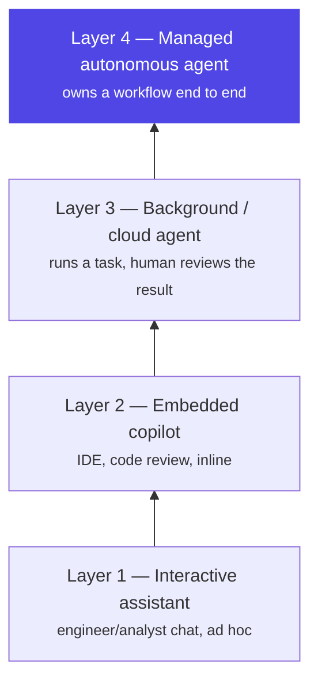

# Chapter 18: Reliability & Cost Engineering

> The goal of this chapter: an agent an SRE team will accept in production and a CFO will keep paying for. In production those turn out to be the same problem — a wasted retry that burns tokens and a wasted hour that burns a customer's trust are both just waste, caught by the same discipline.

## 1. The architecture



Two questions run through this chapter, and they turn out to share one answer: *how do we stop an agent from failing expensively, and how do we stop it from being expensive while it succeeds?* Reliability wraps every stochastic model call in deterministic contracts — validate, bound, fallback, fail closed, the pattern Ch5's harness enforces at the tool-call level and this chapter enforces at the model-call level. Cost engineering wraps every run in a **cost equation**: total spend as several multiplied terms — how many people use the system, how often, and then a further set of terms that are the agent's *own* overhead layered on top of what a person actually asked for (turns per request, tokens per turn, price per token, and retries). The first kind of term you want to grow. The rest is almost entirely where the optimization work lives, because it represents work the agent does on its own behalf that nobody explicitly asked for — the same "hidden work" question Ch1 raised about control flow, now measured in dollars instead of trust.

The four layers above aren't a maturity ladder you're obligated to climb — they're a map of where you actually have leverage. The higher a workload sits, the more you control which model runs it, how its cost is bounded, and how its failures are contained: an interactive chat session is mostly the engineer's own judgment call in the moment, but a fully managed agent processing thousands of runs a day is entirely your architecture's call, end to end. That's the deepest lesson of the industry case study in §7 below — the biggest wins came from moving workloads deliberately up this ladder, not from endlessly tuning prompts at Layer 1.

### Reliability: deterministic boundaries around stochastic cores

- **Structured output validation** at every boundary (Ch13): typed schemas, one repair pass with the validation error, then fail closed. Never let unvalidated model output cross into a downstream system.
- **Retries with judgment**: retry *transient* failures (timeouts, 429s) with exponential backoff + jitter; do NOT blind-retry model calls that returned confidently wrong content — that's a different failure needing a different prompt or path, not repetition. Retries are only safe where tools are idempotent (Ch6/13) — and, as §4's failure story shows, an unjudged retry policy is also a silent cost multiplier, not just a reliability gap.
- **Timeouts everywhere**: per tool call, per model call, per node, per run — nested budgets, each enforced by the harness (Ch5). An agent without timeouts is an outage with extra steps.
- **Fallback chains, defined not improvised**: primary model → fallback model (same schema!) → degraded deterministic path → honest failure with state preserved (Ch4 checkpoint) for resume or human pickup. Degrading gracefully ("here's what I found; I couldn't complete X") beats both silent failure and heroic hallucination.
- **Circuit breakers** per dependency (model endpoint, each tool): trip on error-rate, fail fast, probe to recover. Protects both your latency and the struggling dependency.
- **Error recovery as design**: distinguish *retriable* (transient), *reroutable* (this path failed, try another — Ch12's self-correction), and *terminal* (stop, checkpoint, surface). Tag every failure mode in the codebase with one of the three; untagged errors default to terminal.

### Cost: the four levers

Agent cost decomposes into calls × context × model price × retries. The levers, in typical ROI order:

1. **Context discipline** (Ch8) — the flat-context-curve work is usually the single biggest saving; wandering, non-converging runs (Ch16's metric) are pure waste to hunt down.
2. **Prompt caching** — structure prompts stable-prefix-first (system + tools, then volatile) so cache hit rates transform economics on loops that re-send context every turn; know your provider's cache pricing (Ch7's trap: cache markers on unsupported models throw misleading errors) — §7 below has the concrete TTL math.
3. **Model routing** — cheap models for classification, extraction, summarization; expensive models for planning and synthesis. Route by *step type*, validated by evals (Ch17) so downgrades are proven safe, not hoped. An LLM-gateway layer (LiteLLM-class or your platform's own) centralizes routing, quotas, and provider failover.
4. **Budgets as hard rails** — per run, per user, per tenant, per day (Ch5/6); alert at 80%, halt gracefully at 100% with state checkpointed. The Ch7 billing alarm is the backstop; harness budgets are the frontstop.

## 2. Why the industry needed it — the same incident, two postmortems

Reliability engineering and cost engineering are usually staffed, reviewed, and even measured as separate disciplines — an SRE owns uptime, a platform-cost owner watches the cloud bill, and the two rarely read each other's postmortem. Production keeps teaching the same lesson: they're the same discipline wearing two different invoices. An agent that blind-retries a hung tool five times isn't just slow — it's burning five times the tokens for the same non-answer. An agent whose fallback path was never validated against production policy isn't just a cost anomaly waiting to be found in a bill review — it's a compliance incident that happens to also be free of any code bug, because the failover code did exactly what it was told. §4 below is one incident that generated both kinds of finding, discovered together, because they were never actually two problems.

## 3. A worked example — hardening the dispute-investigation agent's reliability and cost stack

Take Chapter 2's dispute-investigation agent, already hardened once by Ch5's harness (tool policy, bounds, sandboxing, persistence). This chapter adds the layer *above* the harness: what happens when a model call itself fails or drifts, and what the whole stack costs per run at scale.

**Reliability, one gap at a time.** Baseline: a naive retry wrapper retries every failure — timeout, malformed output, rate limit — identically, three times, before giving up. First gap: a malformed `check_policy` output (the model returned prose instead of the typed decision schema) got blind-retried three times, at full token cost each time, before finally failing — three failures for the price of three runs, delivering nothing. Fix: separate retriable (timeout, 429) from reroutable (schema mismatch — send one repair prompt with the validation error, not a blind repeat) from terminal (everything else — stop, checkpoint, surface). Second gap: no circuit breaker meant a struggling policy-lookup dependency kept getting hit by every new run at full retry cost during its own outage, compounding the vendor's problem and the bill simultaneously. Fix: a breaker that trips on error rate and fails fast, so a bad 10 minutes for the dependency costs 10 minutes of fast, cheap failures instead of 10 minutes of expensive retries against a wall.

**The fallback chain, visualized:**

```python
async def call_model(ctx, step_type):
    model = ROUTE[step_type]                     # "classify"→small, "synthesize"→large
    for attempt in backoff(retries=2):
        try:
            out = await llm(model, ctx, timeout=TIMEOUTS[step_type])
            return OutputSchema.model_validate_json(out)   # contract at the boundary
        except (Timeout, RateLimited):  continue           # retriable: transient only
        except ValidationError as e:
            out = await llm(model, ctx + repair_prompt(e)) # ONE repair pass
            return OutputSchema.model_validate_json(out)   # then fail closed
    if breaker.allows(FALLBACK[model]):
        return await call_model(ctx, step_type, model=FALLBACK[model])  # eval-gated
    checkpoint(ctx); raise Degraded("partial result preserved")  # fail clean, resumable
```

**Cost, applied to the same run.** With reliability now bounded, the cost picture becomes measurable instead of noisy — a run that used to cost anywhere from $0.03 to $0.15 depending on how many blind retries it hit now costs a predictable $0.03 every time. From there, the four levers compound: context discipline (Ch8's freshness-filtered, budgeted assembly) keeps the policy-lookup step from re-sending the full customer history every turn; prompt caching, with a TTL matched to how long this agent's steps actually sit idle between turns (a few seconds, not minutes — so the cheaper 5-minute-TTL cache is the right default here, not the 1-hour one §7 uses for slower interactive sessions); model routing sends `fetch_transaction` and `fetch_profile` to a small model and reserves the frontier model for `check_policy`'s genuinely hard interpretation step; and a per-user daily budget caps the blast radius of any customer who somehow triggers hundreds of investigations in an afternoon. None of these four is expensive to add — the expensive mistake is not measuring which one actually matters for *this* agent's traffic pattern before tuning it.

## 4. A failure story — the fallback that changed policy without telling anyone

At 2:14 a.m., the primary model provider serving the dispute-investigation agent had a partial outage — elevated 500s on a fraction of requests. The circuit breaker did exactly its job: it tripped on the rising error rate and routed traffic to the fallback model, precisely as §3's code above is written to do. Nothing about the failover was a bug. The fallback model had been smoke-tested for schema compliance months earlier — it returned the right JSON shape, passed every structural check — but it had never been run through the Ch17 eval suite specifically against the fee-waiver policy's borderline cases, because nobody had treated "the fallback model" as a thing that needed its own eval gate; it was treated as a reliability feature, reviewed by the reliability team, not the policy team. Over the roughly 50 minutes until the primary recovered and the breaker reset, the fallback approved a materially wider band of fee-waiver requests than the primary would have — not fraud, not a reasoning failure anyone could point at, just a subtly different calibration on cases near the policy threshold. A monthly reconciliation review, not a real-time alert, is what caught it: a cluster of waivers from that 50-minute window that a policy audit flagged as inconsistent with current policy. The dollar figure was modest — a few hundred waivers, avoidable had the fallback been eval-gated — but the finding that mattered wasn't the amount. It was that a mechanism built and reviewed entirely as a *reliability* control had quietly executed an unauthorized *policy* change, and the review process that would normally catch a policy change never saw it happen, because nobody files a change request for a circuit breaker doing its job.

## 5. Design decisions

- **A fallback model is a policy decision wearing a reliability costume.** Any model that can reach a production decision path — approve, deny, block, waive — must clear the *same* eval gate as the primary before it's wired into a fallback chain, not a lighter one. §4's incident is what happens when "reliability review" and "policy review" are treated as two different approval processes for the same code path.
- **Retries are typed, not counted.** A retry policy that treats every failure identically is both a reliability gap and a cost leak at once — distinguish retriable, reroutable, and terminal explicitly (§1, §3), because an untyped retry silently multiplies your worst-case cost by however many attempts you allowed.
- **Cache TTL is chosen from measured idle-gap duration, not defaulted.** §7's Uber case study below found the standard 5-minute prompt-cache default was wrong for their own interactive engineers (who idle longer than 5 minutes between turns, so the default constantly rebuilt the cache at full price) but right for short-lived subagent tasks. The lesson generalizes: measure how long *this specific agent's* turns actually sit idle before picking a TTL, the way §3 picked a shorter TTL for the dispute agent's fast-turn pattern.
- **Model selection starts with a benchmark, not a leaderboard.** Before routing any step to any model, build a benchmark from that step's *real* historical inputs and outputs — not a generic public leaderboard — score it on the metrics that step actually cares about (accuracy, but also cost and latency), and re-run the comparison every time a new model ships, because the frontier moves every few weeks and yesterday's routing decision has a shelf life.
- **Tool schema overhead is a cost lever most teams don't know they're pulling.** Every MCP tool installed adds its schema to every session's starting context whether or not that session ever calls it — an agent with a large tool catalog can be carrying tens of thousands of tokens of unused schema before a user types anything. Prune aggressively, and prefer letting the model search for a tool on demand over loading the full catalog every time (Ch14 covers the protocol-level mechanics).

## 6. Trade-offs

- **Reliability machinery adds its own testable surface.** Fallback chains, breakers, and retry taxonomies are code paths that themselves need testing — chaos-style fault injection (Ch16's lab) is the honest way, not "we're pretty sure it works."
- **Fallback models risk quality cliffs — and now, per §4, policy cliffs.** Gate them with evals; prefer "degrade the task" (return a partial, honest result) over "degrade the model" wherever the output is contractual, like a compliance decision.
- **Aggressive caching risks staleness in the cached prefix.** A tool schema change or a policy update must bust the cache, or the agent keeps reasoning against a stale prefix — the same freshness problem Ch8 raised for retrieved documents, now showing up in the cache layer instead.
- **Defaulting to a cheaper reasoning setting is a real quality trade, not a free lunch.** §7's case study defaults reasoning effort to "medium" because it's the right balance for most of their traffic — but "most" isn't "all": a step that reasons about a fee waiver or a fraud flag is not the step to cost-optimize by defaulting down reasoning effort, even if the average step across the fleet benefits from it.
- **Cost optimization that costs more than it saves is theater.** Routing logic that adds 200ms to save a fraction of a cent needs to be measured on both sides of the ledger, not assumed.

## 7. Industry implementation — running a software factory at Uber's scale

Uber's engineering team published a detailed account of how they run reliability and cost engineering for agents across their entire software development lifecycle, and it's worth studying closely because — unlike most public writing on this topic — it comes with real, measured production numbers rather than general advice. As of their writeup, more than 70% of their pull requests are attributed to local or cloud agents, engineers have built over 3,600 reusable agent skills across the SDLC, and the fleet executes more than 30,000 agent skill runs a day. Between February and August 2026, weekly active users of their agentic tooling grew 7x and weekly agent requests grew 9.4x — while total AI spend stayed roughly flat from April onward. Isolating their own optimization work from the effect of model upgrades (which change behavior on their own), they held one model fixed from February to July and still found cost per 1,000 model requests down almost 34% from its peak, and cost per session down 52% from its June peak.

**The cost equation, made explicit.** They decompose total spend into six multiplied terms: two represent adoption and engagement (users, and how often they engage — terms you want to *grow*), and the remaining three represent overhead the agent adds on top of what was actually asked for (extra turns, tokens per turn, and price per token) — almost all of their optimization effort goes into those last three, which is exactly this chapter's §1 argument, now with a name and a measured trend line behind it.

**Benchmark-driven model selection.** Their process is the same four steps for every managed agent: build a benchmark from that agent's *real* work, run it on a harness that can serve any model behind one interface, move to whichever model is Pareto-optimal for that workload (best combination of cost per completed task, output quality, and reliability), and keep moving as the frontier shifts every few weeks. Their concrete example: `uReview`, an AI code-review agent, benchmarked against real pull requests with known bugs graded easy/medium/hard, scored on precision, recall, and F1 against those bugs plus cost per review, latency, and noise — switching the underlying model improved F1 *and* cut cost per PR sharply, plotted against a Pareto frontier where everything below-and-left is simply worse on both axes. The same discipline (§5's "benchmark before you route") runs across their whole SDLC agent fleet via an internal benchmark built from thousands of real pull requests across their monorepos.

**Where the token bloat actually was.** Standard MCP integration loads every installed tool's full schema into every session regardless of whether that session ever calls it — with 100+ tools installed, this added roughly 50,000–70,000 tokens of schema overhead to the *initial* prompt, re-sent on every single turn of every session. A single third-party SaaS tool bundle added another ~22,000 tokens by itself; loading two or three such vendor integrations could mean an agent was carrying more schema than the file it was about to edit, before a user typed a single word. Two fixes: letting the model resolve and invoke a tool as a shell command against a central gateway (removing the schema from context entirely until the moment it's actually called), and letting the model search a tool catalog on demand instead of preloading it. A related technique — **code-mode** — has the model write a small script that batches multiple tool calls into one subprocess loop, so a chatty operation like a database query that needs several status polls returns only its final summary to the model's context instead of every intermediate poll; even on small result sets this cut token usage by more than half, and bulk workflows (what would have been many separate model turns collapsed into one script) saved over 90%.

**Grounding cuts search overhead directly.** Across a codebase of hundreds of millions of lines and thousands of data tables, agents were spending most of their turns *locating* information rather than generating anything — so the team built a knowledge graph connecting tens of millions of nodes and edges across dozens of internal systems (services, teams, incidents, pull requests, design docs, deployments, datasets, table-usage history), queryable by any agent in natural language. Their own comparison, same prompt and same model, with and without this grounding: the grounded agent found the specific table used by dozens of analysts and answered in 38 seconds; the ungrounded agent spent 20 minutes inspecting service code, spawned two subagents, hit three errors, and concluded — wrongly — that the data wasn't queryable at all. This is Ch8's freshness-and-selection argument at organization scale: an agent that can't find the right context doesn't fail cheaply, it fails slowly and expensively while still failing.

**Visibility as its own lever.** A live running-cost counter sits in the terminal status line for every session; spend is tracked against shared tiers (not per-tool caps) with Slack nudges at 50/80/100% of expected spend and a fast manager-approval path for a tier upgrade — the goal being to let engineers judge their own task's ROI in the moment rather than hit an invisible wall. A session-analysis tool goes further: it inspects a user's actual session traces, with zero setup, and flags specific, named anti-patterns with a dollar impact and a fix attached — simple multi-turn work running on an unnecessarily expensive model, large tool-call payloads sitting in context and getting re-billed on every subsequent turn, a resumed session paying full price because its prompt cache expired during a long break, or a hundred thousand tokens of system instructions loaded before the user has typed anything at all.

**The conclusion worth taking to a design review.** In their own words: managing AI cost is "a tractable engineering challenge" — the gains came from eliminating wasted, zero-value token consumption, not from chasing lower unit prices or downgrading tooling, which is how they scaled usage 7x while cost per unit of work went *down*. The strategic shift underneath everything above is moving workloads from ad hoc interactive sessions (§1's Layer 1) toward specialized, fully managed agents (§1's Layer 4) — because a managed environment is the only place you get full control over model routing, the execution harness, and spend, and a fleet of narrow, benchmarked, Pareto-tuned agents is a fundamentally more tractable thing to optimize than thousands of engineers' individual terminal sessions.

## 8. Hands-on lab

Take your Ch6 worker and run it through Uber's own methodology, end to end:

**Step 1 — build the benchmark first.** Before touching any routing logic, collect 15–20 real runs of your worker (or synthesize realistic ones from Ch2's dispute scenarios) and score them on the metrics that matter for *this* agent: task success, cost per run, and latency. This benchmark is what every later step gets measured against — no routing change ships without a before/after number from it.

**Step 2 — apply typed retries and an eval-gated fallback.** Reproduce §4's failure on purpose: force the fallback path to activate, and confirm it's blocked from activating until it's passed the same Ch17 eval suite the primary model runs against. Then reproduce the untyped-retry cost leak from §3: force a malformed output and confirm it triggers exactly one repair pass, not a blind retry loop.

**Step 3 — route by step type, prove it against the benchmark.** Split your worker's steps into "needs frontier reasoning" and "doesn't," route accordingly, and re-run Step 1's benchmark. Report the Pareto comparison the way §7's `uReview` example does: quality metric on one axis, cost per run on the other, and state in one sentence whether the cheaper route is actually on the frontier or just cheaper.

**Step 4 — audit your own tool-schema overhead.** Count the tokens your worker's system prompt spends on tool schemas it used zero times across Step 1's benchmark runs. If that number is non-trivial, prune the unused tools or gate them behind on-demand lookup, and re-measure.

Deliverable: a one-page before/after report in the same style as §7's numbers — cost per 1,000 runs, cost per session, and the specific waste category each fix eliminated.

## 9. Architect's take: the banking read

A risk committee doesn't need to hear "we optimized costs" — it needs to hear the shape §7 makes explicit: which layer a workload runs at, what benchmark justified its model, and what eval gate every path that can reach a decision (primary *and* fallback) had to clear before it went live. That reframes a cost conversation into a control conversation, which is the register a bank's leadership already thinks in. The "software factory" framing is also a useful maturity story to tell upward: most banking AI programs start entirely at Layer 1 (engineers chatting with an assistant) and the real platform win — the one worth a roadmap slide — is a deliberate migration of specific, benchmarked workloads up to Layer 3 and 4, the same journey Ch21's reference architecture describes for the platform as a whole. Cost attribution per business unit (showback, ideally chargeback) is what lets this survive its second budget cycle, and §4's incident is the argument for why "reliability owns this" and "compliance owns that" can't be two separate sign-offs on the same fallback chain.

## Governance & security lens

Reliability and cost machinery carry governance weight, not just engineering weight: a fallback model reaching a customer-facing decision must clear the *same* policy and eval gates as the primary — §4 is what happens when a "reliability" control quietly executes an unreviewed policy change and no existing process is watching for that. Kill behavior must checkpoint state and leave a clean, resumable audit trail — "stop cleanly" is the RBI kill-switch expectation made real, not a power cut. Budget rails are financial controls with named owners and periodic review, not a knob engineers tune unilaterally. And a default that trades quality for cost — a cheaper model, a lower reasoning-effort setting, a shorter cache TTL — is itself a decision that belongs on record, because §6 already flagged that "the average step benefits" is not the same claim as "every step, including the compliance-sensitive ones, benefits." Governing questions:

- Is every path that can reach a production decision — primary model *and* every fallback — validated against the identical eval and policy suite?
- When we halt an agent, can we show exactly what it had done, and resume without loss?
- Who signed off on each cost-saving default (model, reasoning effort, cache TTL), and would that signature survive being read aloud to an auditor?

## Interview-ready lines

- "Wrap every stochastic component in a deterministic contract — validate, bound, fallback, fail closed."
- "Never blind-retry a confidently wrong model call; that's a reroute, not a retry — and an untyped retry policy is a cost leak wearing a reliability costume."
- "Route by step type, prove downgrades with evals — and benchmark the step with its own real data before you route it anywhere."
- "A kill switch that loses state isn't a control, it's a second incident."
- "A fallback model is a policy decision wearing a reliability costume — it needs the same eval gate as the primary, not a lighter one, or it can quietly change what your agent approves for as long as the outage lasts."
- "One production team held their model fixed and still cut cost per session in half — the saving wasn't a cheaper model, it was eliminating the agent's own wasted turns, tokens, and retries."
- "The real lever isn't tuning a single agent's prompt forever — it's moving the right workloads from ad hoc interactive sessions to specialized, benchmarked, managed agents, because that's the only layer where you fully control routing, cost, and failure containment."
