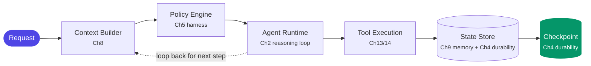

# Chapter 21: The Enterprise Agentic AI Reference Architecture

> The capstone. Twenty chapters collapse into one picture you can draw from memory, defend layer by layer, and reuse in interviews, leadership forums, and design reviews.

## 1. The architecture

```text
┌─────────────────────────────────────────────────────────────────┐
│ EXPERIENCE LAYER                                                │
│   channels (web/app/branch/contact-center) · streaming UX (Ch6) │
│   approval surfaces (Ch20) · agent-to-UI events (Ch14)          │
├─────────────────────────────────────────────────────────────────┤
│ AGENT LAYER                                                     │
│   routers + specialist agents (Ch3/15) · autonomy matrix (Ch20) │
│   per-agent identity & owner (Ch19)                             │
├─────────────────────────────────────────────────────────────────┤
│ ORCHESTRATION & HARNESS LAYER                                   │
│   graphs, state, checkpoints, interrupts (Ch4)                  │
│   harness: bounds, tool policy, sandbox, context asm (Ch5/8)    │
│   memory services (Ch9) · job queue + workers (Ch6)             │
├─────────────────────────────────────────────────────────────────┤
│ KNOWLEDGE LAYER                                                 │
│   RAG service (Ch10) · knowledge graph (Ch11) · semantic layer  │
│   + live APIs, unified by knowledge routing (Ch12)              │
├─────────────────────────────────────────────────────────────────┤
│ TOOL & INTEGRATION LAYER                                        │
│   tool registry (Ch13) · MCP gateway: authN/authZ/audit (Ch14)  │
│   AI gateway: model routing, caching, quotas (Ch18)             │
├─────────────────────────────────────────────────────────────────┤
│ ENTERPRISE SYSTEMS                                              │
│   core banking · CRM · LOS · data platform · payment rails      │
└─────────────────────────────────────────────────────────────────┘
   CROSS-CUTTING (every layer, by design, not decoration):
   SECURITY (Ch19) · OBSERVABILITY (Ch16) · EVALS (Ch17)
   GOVERNANCE (Ch20) · RELIABILITY & COST (Ch18) · DEPLOYMENT (Ch7)
```

## 2. The ten defining decisions (the defense of the diagram)

Each layer earns its place through a decision you can now argue both sides of:

1. **Control flow**: deterministic graphs with model-owned edges counted and named (Ch1/4) — the non-determinism budget.
2. **One harness, many agents** (Ch5): reliability machinery is platform, not per-team craft — concretely, four platform capabilities the earlier layer diagram only names in passing:
   - **Model Gateway** — a distinct layer from Ch14's tool gateway: it sits between every agent and the model providers, not between an agent and its tools. It owns model routing (cheap models for extraction and classification, frontier models for planning and synthesis — Ch18's cost-lever #3), provider fallback chains (Ch18 §1), and per-team/per-agent usage metering, so "which model, at what cost, with what fallback" is answered once at the gateway instead of once per agent.
   - **Agent Gateway** — distinct again: the entry point that routes an inbound request to the *right* agent or team (formalizing the router pattern from Ch3/15 into a governed component) and enforces per-tenant isolation before any harness, model, or tool code runs. This is where multi-tenancy is actually enforced — not the tool gateway, which governs a call once an agent is already running, and not the Model Gateway, which governs a model call once a step has already started.
   - **Multi-tenancy** — the property that makes this decision credible at scale: team A's agents, data, and cost stay isolated from team B's while both run on the same platform. It's enforced in layers, not by one control — the Agent Gateway above for request routing and tenant boundaries, entitlement-filtered context (Ch8) and knowledge contracts (Ch10–12) for data isolation, per-tenant budgets and fair-share scheduling (Ch6/18) for cost and compute isolation, and per-agent workload identity (Ch19) so one tenant's agent can never assume another's.
   - **Agent lifecycle management** — registration, versioning, config management, deployment/rollback, and deprecation, run as a platform capability alongside deployment (Ch7) rather than duplicated per team. The versioning axis is three-dimensional and each dimension ships independently: agent version, prompt version, and tool version are separate but linked, so a prompt rollback doesn't force an agent redeploy and a tool-schema bump doesn't silently invalidate a pinned prompt. Registration lives next to Ch13's tool registry — an agent registry with the same instinct: nothing runs unregistered, and every version is attributable.
3. **Async by construction** (Ch6): job/queue/worker with streaming — agents never live on the request path.
4. **Identity, not keys** (Ch7/19): workload identity everywhere; agents are governed NHIs with owners and kill handles.
5. **Context as budgeted, governed assembly** (Ch8): the assembler is a compliance component.
6. **Knowledge routed, not stuffed** (Ch10–12): four source types behind contracts; the graph as explainability substrate.
7. **Tools as capability grants** (Ch13/14): registry + gateway = one governed choke point; user entitlements travel with every call.
8. **Multi-agent only on named justifications** (Ch15): context, permissions, cost tiers, parallelism — never metaphor.
9. **Traces → evals → gates** (Ch16/17): telemetry is the audit record; evals decide releases; production feeds the datasets.
10. **Autonomy per action class + governance as platform features** (Ch20): the matrix, MRM inventory, audit, kill drills — FREE-AI-ready by construction.

## 3. What flows through it (one request, annotated)

"Should we raise customer X's card limit?" → Experience layer authenticates, opens job (Ch6) → router sends to card agent (Ch3), running under its identity for this RM (Ch19) → graph plans (Ch4); context assembled under budget with entitlement-filtered data (Ch8) → knowledge routing fans out: policy (RAG), exposure (graph), history (SQL), balance (API) (Ch12) via gateway-audited tools (Ch14) → synthesis with per-claim citations; recommendation is L1, the limit change is L2 → interrupt; RM approves on an evidence-bearing surface (Ch20) → action executes idempotently (Ch6/13); trace, cost, and outcome recorded (Ch16); sampled into next month's eval suite (Ch17). Every chapter, one request.

## 3b. The agent runtime, layer by layer

Section 3 traced one request through the architecture's *layers*. This section traces the same request through the *runtime* that actually executes it — the physical path a request takes once it's inside the platform, stage by stage, with every stage owned by a component this curriculum already built rather than a new one invented for this diagram.



- **Request** enters through the Agent Gateway (§2's decision #2 sub-bullets) — routed to the right agent/team, tenant-scoped, identity-attached, before any model or tool code runs.
- **Context Builder** (Ch8) assembles the budgeted, entitlement-filtered context for this step — the same assembler §1's diagram calls a compliance component, invoked fresh at every step of the loop, not once per request.
- **Policy Engine** is Ch5's harness wearing its enforcement hat: bounds, tool policy, and the autonomy-matrix check (Ch20) that decides whether this step can proceed unsupervised or must interrupt for approval.
- **Agent Runtime** is Ch2's reasoning loop itself — reason, plan, select tool, act, observe, reflect — running inside whatever execution environment and sandbox Ch19 assigns this agent's trust tier: untrusted-content processing gets no default network, a well-scoped internal agent gets more.
- **Tool Execution** hands off to Ch13's registry and Ch14's gateway — the same governed choke point decision #7 describes, called from inside the runtime rather than wrapped around it.
- **State Store** is Ch9's memory services for what the agent should remember across turns and sessions, backed by Ch4's durability layer for what the graph needs to survive a crash mid-step.
- **Checkpoint** is Ch4's durability layer again, from the other side: state persists after every node so a crash or an interrupt (Ch20's human-in-the-loop) resumes exactly where it left off instead of re-running side effects that already happened — Ch6's idempotency is what makes that resumed retry safe rather than a duplicate action.

None of these seven stages is new work — that is the point of drawing them as one runtime instead of leaving them as seven separate chapters. What's new is the composition. **Worker isolation and concurrency** (Ch6): the worker pool, sized independently of the API tier and holding one run per worker in memory, is what lets the Agent Gateway fan a burst of requests out across many simultaneous Agent Runtime instances without one tenant's spike starving another's — Ch6's per-tenant fair-share scheduling, now visible as a runtime property rather than a queueing detail. **Cancellation** (Ch6) is a flag the runtime checks between nodes, not a kill signal mid-tool-call, so a cancelled run never leaves a half-executed side effect at the Tool Execution stage. **Execution environments** span a spectrum the Agent Runtime stage has to route into deliberately: a stateless container for a short synchronous step, a sandboxed subprocess with no default network for untrusted-content processing (Ch19), and a durable, resumable process for a run that waits hours or days on an external event (Ch4 §4's durable-execution pattern). Draw this diagram next to section 1's layer diagram in an interview, and "where does an individual request actually go" stops being an abstract question.

## 4. Build order (the pragmatic sequencing)

Platforms fail by building all layers thin. Sequence by value-with-proof: (1) one use case, single agent, harness + traces from day one; (2) backend + deployment (it's a service now); (3) evals before scaling usage; (4) knowledge layer as the second use case demands routing; (5) gateway + registry as the third team arrives; (6) governance features as autonomy ambition rises. The platform emerges from use cases that worked — it is *extracted*, not pre-built.

## 5. Deliverables of this capstone (the portfolio centerpiece)

1. **The reference architecture document** (10–15 pages): the diagram, the ten decisions each with alternatives-considered and trade-offs, the annotated request flow, and the FREE-AI/MRM control mapping (Ch20).
2. **The diagram set**: full architecture, request sequence, autonomy matrix, threat model.
3. **The three projects as evidence**: Banking Agent Platform (layers 1–3 + 5), Knowledge Intelligence Agent (layer 4), Eval & Observability platform (cross-cutting) — each README pointing back to the decisions it demonstrates.
4. **The cost model**: a standalone artifact, not a paragraph in the architecture document — Ch18's four cost levers (context discipline, prompt caching, model routing, budgets) turned into this platform's own per-agent and per-tenant numbers, calls × context × model price × retries, projected at current volume and at 10x, with the Model Gateway's usage metering (§2) as the data source rather than an estimate. (A dedicated model-strategy chapter, if this curriculum grows one, would deepen the model-routing line item; until then this stays the platform's own cost accounting.)
5. **The failure-scenario analysis**: a walkthrough of what breaks and how the platform contains it — a misbehaving agent (Q4 below), a compromised or misrouted tenant, a model-provider outage, a cascading tool failure — each scenario mapped to the specific control that bounds it (kill handle, autonomy matrix, fallback chain, circuit breaker), extending Ch18's single-agent failure story (§4 there) across the whole platform. (A dedicated failure-taxonomy chapter, if this curriculum grows one, would formalize the scenario catalog; until then this analysis is the capstone's own.)

Together these say the one thing a portfolio must say at AVP/architect level: *not "I can build an agent" but "I can design, defend, and govern the system agents live in."*

## 5b. Frontier watchlist (know them; don't build on them yet)

Topics to track without coupling the platform to them: **computer-use / GUI agents** (agents operating browsers and desktops directly — powerful where no API exists, currently slow and brittle; in a bank, treat as RPA's successor with RPA's controls); **learning agents** (Ch9's adaptation loops maturing toward continuous improvement — governance-gated); **exploration/discovery agents** (open-ended research patterns — fits innovation labs, not the production path); and **voice-native agents** (your Siddhi adjacency — the harness/eval machinery here applies unchanged, with latency budgets tightened 10×). Each gets a paragraph in leadership briefings and zero load-bearing roles in the reference architecture until the controls story matures.

## 6. Architect's take: using this artifact

In interviews: draw layers left-to-right in ninety seconds, then let the interviewer pick a box — every box has a chapter behind it. In leadership forums: lead with the cross-cutting bar and the autonomy matrix; executives buy governance and cost posture, not graph frameworks. On LinkedIn: publish the diagram + ten decisions as a series. Internally: use it as the review template — every new agent proposal answers "where does this sit, and which of the ten decisions does it stress?"

## Governance & security lens — the roll-up

Every chapter's lens converges here into one statement for leadership: **each layer of the platform carries its own named controls, and the cross-cutting bar is where they aggregate** — placement decisions documented (Ch1), bounds and grants (Ch2/5), auditable patterns and graphs (Ch3/4), job ledgers and idempotency (Ch6), identity-based deployment (Ch7), the context assembler as data-governance chokepoint (Ch8), governed memory (Ch9), entitlement-aware knowledge (Ch10–12), the capability registry (Ch13), the gateway (Ch14), topology as authz (Ch15), traces as protected audit records (Ch16), evals as evidence (Ch17), validated fallbacks and clean kills (Ch18), bounded blast radius (Ch19), and the autonomy matrix (Ch20). The design habit this curriculum trains: **at every layer, ask the governance question in the same breath as the scaling question** — because in a regulated enterprise, a design that scales but can't be governed doesn't ship.

## Interview-ready lines

- "Six layers, six cross-cutting concerns, ten decisions — ask me about any box."
- "The platform is extracted from working use cases, never pre-built."
- "Executives don't buy agents; they buy bounded blast radius, audit trails, and a cost curve."
- "The reference architecture is the difference between knowing agents and owning the system they live in."


## Interview Questions & Answers

**Q1: Why should a bank build one shared agentic AI platform instead of letting each business line — cards, CRM, collections — stand up its own agent stack?**

Because the hard parts of an agent system are not the model call, they are the reliability machinery around it — bounds, tool policy, sandboxing, context budgets, memory services (Ch5/8/9) — and that machinery is exactly what regulators expect to see governed consistently, not implemented ten different ways. Decision #2 in this chapter's ten defining decisions is explicit: "one harness, many agents — reliability machinery is platform, not per-team craft." A shared platform also means one audit surface for the MRM inventory and one FREE-AI control mapping instead of ten inconsistent ones a regulator has to reconcile separately. The build-order section is honest that the platform isn't pre-built speculatively — it's extracted once a second and third use case demand the same machinery — but "extracted" still means shared, not duplicated.

**Q2: Walk me through your reference architecture using one real request end-to-end.**

Take the card-limit example from this chapter: a request to raise a customer's card limit enters the experience layer, gets authenticated, and opens an async job (Ch6) rather than blocking a thread. The router sends it to the card agent running under its own workload identity for that RM (Ch3/19); the orchestration layer's graph plans the steps while the harness assembles context under a budget, filtering by entitlements (Ch8). Knowledge routing fans out across policy RAG, exposure graph, transaction history, and a live balance API, all through gateway-audited tool calls (Ch12/14), and synthesis produces a recommendation with per-claim citations. Because raising the limit is an L2 action, it stops at an interrupt for RM approval on an evidence-bearing surface (Ch20), executes idempotently once approved, and the trace, cost, and outcome are recorded and later sampled into the eval suite (Ch16/17) — one request, every layer of the diagram touched.

**Q3: You're asked to design the enterprise agentic AI platform for a bank from scratch. What layers do you propose, and in what order do you build them?**

I'd draw six layers — experience, agent, orchestration/harness, knowledge, tool/integration, and enterprise systems — wrapped by a cross-cutting bar of security, observability, evals, governance, reliability/cost, and deployment, because none of those five belong to one layer; they belong to all of them. But I wouldn't build all six thick on day one — platforms that try to fail. I'd sequence by value-with-proof: one use case on a single agent with harness and traces from day one, then treat it as a real backend service with proper deployment, then get evals in place before scaling usage further. Only after that would I add the knowledge layer as routing needs emerge, the gateway and registry once a second and third team show up, and the heavier governance features as autonomy ambition rises — the platform gets extracted from what already worked, not pre-built on a whiteboard.

**Q4: What if one team's agent starts misbehaving — say it's making excessive or wrong tool calls? Does that take down the platform or affect other teams' agents?**

It shouldn't, and the design is meant to prove that: every agent runs under its own workload identity with a named owner (Ch7/19), not a shared service account, so a misbehaving agent's blast radius is bounded to the tool grants and entitlements attached to that identity alone. The harness's bounds and tool policy (Ch5) constrain what any single agent can do regardless of what it "wants" to do, and every tool call — good or bad — passes through the gateway's authN/authZ/audit choke point (Ch14), so the behavior is visible immediately rather than discovered later. Because each agent has its own kill handle, the operational response is to pull that one agent's traffic, not the platform's — this is what "bounded blast radius" (Ch19) means operationally, not just as a phrase for a slide.

**Q5: What are the real cost trade-offs of a shared platform versus every team building its own stack?**

A shared platform amortizes the AI gateway's model routing, caching, and quota management (Ch18) across every team's traffic instead of each team paying full price for its own inference and reliability engineering — that's the economies-of-scale case, and it's why the gateway is sequenced in "as the third team arrives" in the build order rather than built for one team alone. The trade-off is that a shared platform can become a central bottleneck: if the platform team under-invests, every new agent proposal queues behind a scarce review and onboarding capacity, and teams start pressuring for shortcuts. The way this chapter resolves that tension is by treating the reference architecture document itself as the negotiating artifact — leadership funds governance and cost posture, not agent frameworks, so the cost conversation has to be made in those terms, not "the platform is slow."

**Q6: What data security implications come from one shared platform serving knowledge and tools to many different agents and teams?**

Counterintuitively, a shared platform is more secure than ten separate stacks, because there is exactly one place — the context assembler — that has to be gotten right rather than ten. In the annotated request flow, context is "assembled under budget with entitlement-filtered data," meaning the assembler itself is treated as a data-governance component (Ch8), not a convenience layer, so an agent can never see data its calling user isn't entitled to, regardless of what the agent's prompt asks for. Knowledge routing across RAG, the knowledge graph, and live APIs sits behind contracts (Ch10–12), and every tool call — including reads — is authenticated, authorized, and audited at the MCP gateway (Ch14). The security property a shared platform buys is a single governed choke point for data access instead of N ungoverned integrations that a security team can't realistically review one by one.

**Q7: What guardrails operate at the platform level, as opposed to guardrails a single agent developer has to remember to add?**

The harness enforces bounds, tool policy, and sandboxing for every agent by default (Ch5/8), so a new agent inherits those controls instead of a developer having to reimplement them correctly each time. The autonomy matrix (Ch20) is a platform-level guardrail too — it's what makes the card-limit example split into an L1 recommendation an agent can produce freely and an L2 action that must stop at a human approval surface, and that split is a property of the action class, not something the agent's own code decides. Evals sit in front of every release as a gate (Ch17), so a change to any agent has to clear the eval suite before it ships, and telemetry from production traces (Ch16) is treated as the audit record those evals and future incident reviews rely on. The point of putting these in the cross-cutting bar rather than inside each agent is that governance becomes structural, not a checklist someone can forget.

**Q8: How does the platform enforce least-privilege access control across dozens of agents and teams without every team reinventing entitlements?**

Decision #7 makes tools capability grants rather than open access: the registry plus the gateway form one governed choke point, and user entitlements travel with every call, so the card agent acting on behalf of a specific RM only ever sees what that RM is entitled to see — enforcement happens at the gateway, not by trusting the agent's own code to behave. Each agent additionally carries its own workload identity with a named owner (Ch7/19), so an entitlement audit maps one agent to one accountable owner instead of unwinding a shared service account used by five different bots. That combination — capability-scoped tools plus per-agent identity — is what lets a platform team answer "who can touch what" for the whole estate from one registry, rather than chasing the answer team by team.

**Q9: How do you run this platform in production — deployment, versioning, and operations across potentially dozens of live agents at once?**

Deployment is identity-based (Ch7), and agents are async by construction — job, queue, and worker with streaming — so they never sit on a synchronous request path (Ch6), which means a rollout or rollback to one agent doesn't put a live channel at risk. Every agent version is release-gated by the eval suite before it ships (Ch17), and production traces feed straight back into observability and cost tracking (Ch16/18), so "is this version healthy" is answered from telemetry, not from a developer's confidence. Operationally, the reliability posture is validated fallbacks and clean, per-agent kill handles (Ch18/19), so an SRE responding to an incident pulls one agent off traffic rather than reaching for a platform-wide switch — the same bounded-blast-radius design that answers the misbehaving-agent question shows up again here as an operations property.

**Q10: After the RM approves the card-limit change and the agent executes it, what actually happens next, and why does that matter?**

The action executes idempotently so a retry or duplicate approval can't double-apply it (Ch6/13), and immediately after, the trace, its cost, and its outcome are recorded (Ch16) — that record is the artifact FREE-AI and MRM governance actually run on (Ch20), not a separate compliance write-up produced after the fact. The more important downstream step is that this same request gets sampled into next month's eval suite (Ch17): production behavior becomes the next regression test, which is how the platform's evals stay grounded in what customers and RMs are actually doing instead of drifting into a stale, synthetic benchmark. So the "what happens after" isn't just logging — it's a closed loop where every approved action makes the next release's gate slightly more honest.

**Q11: In a multi-tenant setup where one platform serves many banking teams' agents, how do you contain blast radius if something goes wrong — and how would you defend that to a regulator?**

Every agent is a governed non-human identity with a named owner and its own kill handle rather than a shared credential (Ch7/19), which is the mechanism, not just the phrase, behind "bounded blast radius." The autonomy matrix caps what each action class is allowed to do unsupervised — an L1 recommendation can run freely, but anything with real financial consequence, like the card-limit change, is L2 and stops for human approval — so even a fully compromised or badly-behaving agent can't take an L2-class action without a person in the loop. To a regulator, the defensible story is that the platform maintains an MRM inventory and can run kill drills against any single agent's identity without touching the other agents sharing the same infrastructure, because isolation is enforced at the identity and gateway layer, not by hoping each agent's code behaves.

**Q12: How do you decide when a use case actually justifies multi-agent orchestration on this platform, rather than one agent doing the whole job?**

This chapter is deliberately strict about it: decision #8 is "multi-agent only on named justifications — context, permissions, cost tiers, parallelism — never metaphor." That means a proposal to split an agent into a "team" of specialist agents has to point to one of those concrete reasons — for instance the card agent needing different entitlements than a collections agent, or a cheaper model tier being viable for a sub-task — not a vague sense that specialization sounds more sophisticated. In the reference architecture this shows up as routers plus specialist agents at the agent layer (Ch3/15), each with its own identity and owner, which only pays off when the justification is real; otherwise it's just added coordination cost and a bigger audit surface for no governance or performance benefit.

**Q13: This platform has a tool gateway (Ch14), and now a Model Gateway and an Agent Gateway. Aren't these all just "the gateway" under different names? What's actually different about each one?**

They sit at three different points on the request's physical path, and conflating them is exactly the mistake decision #2's platform capabilities are written to avoid. The Agent Gateway is the front door: it runs before any harness, model, or tool code executes, and its job is to route an inbound request to the right agent or team and enforce tenant isolation — get this one wrong and the request is running under the wrong identity before anything else even starts. The Model Gateway sits *inside* a run, between the agent and the model providers, and its job is model routing, provider fallback, and usage metering — it never sees a tool call, only a model call. The tool gateway (Ch14) sits inside the same run but on the other side of the agent's reasoning: it's what authenticates, authorizes, and audits every call the agent makes *out* to an external system, and it's where Ch13's "tool as capability grant" gets enforced. In the runtime diagram (§3b), you can point at three different boxes — the Agent Gateway is upstream of the Context Builder, the Model Gateway lives inside the Agent Runtime stage, and Tool Execution is a separate stage after it — which is the fastest way to prove in an interview that these aren't one box wearing three names.

**Q14: How would you actually prove to an auditor that multi-tenancy is enforced on this platform, not just claimed in a diagram?**

I wouldn't point at the diagram — I'd point at four independent controls that would each have to fail at the same time for one tenant to touch another's data, cost, or compute, because that's what "enforced in layers" has to mean in practice. First, every request is tenant-scoped at the Agent Gateway before anything downstream runs, so there's a single choke point to audit for tenant-routing bugs instead of trusting every agent's own code to behave. Second, the context assembler (Ch8) filters by entitlements on every call, so even a routing bug at the Agent Gateway can't surface team B's data inside team A's context — a second, independent check, not a repeat of the first. Third, cost and compute isolation run through per-tenant budgets and fair-share scheduling (Ch6/18), so the artifact an auditor actually wants — a bill and a queue-depth graph broken out by tenant — exists as a byproduct of normal operations, not a special report assembled for the audit. Fourth, every agent carries its own workload identity with a named owner (Ch19), so a forensic trace after an incident can show which tenant's identity touched what, not just what the application logs claim happened. The proof isn't the multi-tenancy story — it's that four unrelated systems, routing, context, budgets, and identity, all have to agree independently before cross-tenant access could happen at all.

**Q15: What's the difference between section 1's layer diagram and the runtime diagram in §3b — why do you need both?**

Section 1's diagram answers "what components exist and who owns each one" — it's an org chart for the system, and it's what you draw first in ninety seconds because every box maps to a chapter and a governance control. The runtime diagram in §3b answers a different question: "where does one specific request actually go, in what order, right now" — Request into the Agent Gateway, the Context Builder assembling this step's budgeted view, the Policy Engine checking bounds and autonomy before anything acts, the Agent Runtime's reason-plan-act-observe loop executing inside whatever sandbox Ch19 assigns it, Tool Execution going out through Ch13/14's governed choke point, and the State Store plus Checkpoint (Ch9/Ch4) making sure a crash mid-step resumes instead of restarting. The two diagrams have to agree with each other — every box in the runtime diagram is implemented by a layer in section 1's diagram — but they answer questions a reviewer asks at different moments: the layer diagram defends the architecture in a design review, and the runtime diagram is what you actually trace when a specific request misbehaves in production and someone asks where in the pipeline it went wrong. Being able to draw both, and show they're the same system described twice, is what separates "I understand the layers" from "I can debug what actually happened."
