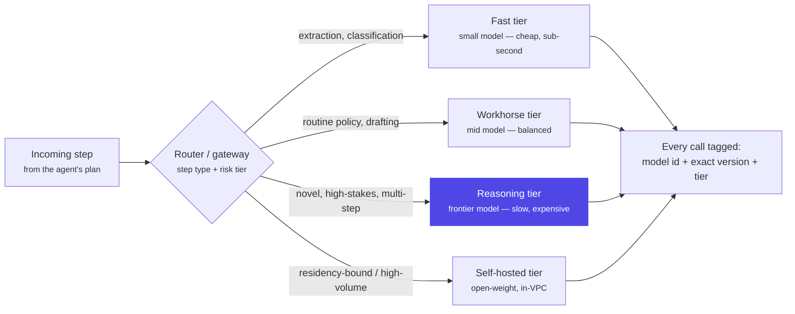

# Chapter 24: Model Strategy & Multi-Model Architecture

> Ask an engineering team which model their agent uses and you'll usually get one name. Ask a mature one and you'll get a routing table — because "which model" was never a single decision made once at kickoff, it's a portfolio position that has to be rebalanced every time a request's stakes change, a price list updates, or a provider has a bad night.

## 1. The model layer isn't one decision, it's a portfolio



Every chapter up to this one has treated "the model" as a fixed input — Ch2's agent loop calls it, Ch5's harness bounds what it can touch, Ch7 authenticates to it with workload identity instead of a key, Ch18 wraps its call in a deterministic contract and routes cheap steps to a cheap model. This chapter is about the decision sitting underneath all of that: not *can the agent reach a model*, but *which model, for which step, priced how, hosted where, decided by whom, and what happens the moment that answer needs to change.*

Two questions run through this chapter, and — as in Ch18 — they turn out to share one architecture. The first is a **capability** question: which model is actually good enough for this step, and how do you know, rather than guess? The second is a **control** question: where does that model run, whose data does it see, who is allowed to change the answer, and what proof exists that the answer they picked is still correct months later? A single "we call GPT-X" line in an architecture doc answers neither question — it just defers both of them to whichever engineer happens to be debugging a cost spike or a compliance finding at 2 a.m.

The portfolio framing matters because a **model** and a **model routing policy** are different objects with different owners. A model is a vendor product with a price list, a context window, a training cutoff, and a data-processing agreement. A routing policy is *your* architecture: a table mapping request types and risk tiers to models, versions, fallbacks, and residency constraints — the thing an architect actually designs, reviews, and defends in a risk committee. Everything from §3 onward in this chapter is about building and governing that table, not about picking a favorite model.

## 2. Why the industry needed it — the "it's just an LLM" assumption breaks at scale

Early agent projects — including, honestly, the first working version of Ch2's dispute-investigation agent — tend to hardcode one model name in one config line and call it done. It works, at pilot volume, because pilot volume hides three things that only show up at scale: cost (ten developers testing an agent is a rounding error; ten thousand customers running it daily is a line item a CFO reads), latency variance (a frontier model's median response time is fine; its p99 under load is what actually determines whether a customer-facing flow feels broken), and — the one that costs the most to discover late — that not every step in an agent's plan needs the same model. Extracting a transaction ID from a document and deciding whether a $40,000 fee waiver is policy-compliant are not the same task wearing different clothes; treating them as interchangeable "LLM calls" is the mistake this chapter exists to correct.

The industry's answer converged on the same shape Ch18 §7 describes for cost engineering generally, but applied one layer earlier: instead of one model behind one interface, put a **gateway** behind the interface — a component that can serve any model to any caller, so routing, fallback, and provider choice become configuration instead of a code change buried in a `client.chat.completions.create()` call scattered across the codebase. Ch18 already named this pattern ("an LLM-gateway layer — LiteLLM-class or your platform's own — centralizes routing, quotas, and provider failover") as one of its four cost levers. This chapter is the deeper treatment of that same component: not just how it saves money, but how it becomes the single place where model strategy is *governed* rather than merely configured — the same instinct as Ch12's knowledge router, now applied to models instead of data sources.

The failure mode that finally forces this shift is rarely a single bad answer. It's the slow realization that nobody can answer three simple questions about a production agent: which model made this specific decision, is that still the model we'd choose today, and who approved it. §4 below is what happens when none of those three questions has an answer.

## 3. A worked example — a routing table for the dispute-investigation and card-limit-change agents

Ch18 §3 already routed the dispute-investigation agent's steps by type — `fetch_transaction` and `fetch_profile` to a small model, `check_policy`'s interpretation to a frontier model — and wrapped every call in a validated, fallback-capable contract. This chapter extends that table along two axes Ch18 didn't need for its reliability argument: **risk tier**, not just step type, and **exact version pinning**, not just model name.

```python
# routing.py — the portfolio, made explicit and reviewable
ROUTES = {
    # step_type: (tier, model, pinned_version, fallback_tier)
    "fetch_transaction":  ("fast",     "small-model",     "2026-06-01", "fast_backup"),
    "fetch_profile":      ("fast",     "small-model",     "2026-06-01", "fast_backup"),
    "classify_dispute":   ("fast",     "small-model",     "2026-06-01", "fast_backup"),
    "check_policy":       ("reason",   "frontier-model",  "2026-07-15", "reason_backup"),
    "draft_rm_outreach":  ("workhorse","mid-model",        "2026-05-20", "workhorse_backup"),
}

def route(step_type: str, risk_tier: str):
    tier, model, version, fallback = ROUTES[step_type]
    if risk_tier == "high" and tier != "reason":
        tier, model, version, fallback = ROUTES["check_policy"]  # escalate, never downgrade
    return ModelCall(tier=tier, model=model, version=version, fallback_tier=fallback)
```

For the dispute-investigation agent, a routine dispute under the pre-approved threshold with no conflicting evidence never touches the reasoning tier at all: extraction and classification run on the fast tier, and `check_policy` for a clean, low-value case runs on the workhorse tier — reserving the frontier model for cases with genuinely ambiguous evidence, cross-border merchant complications, or a dollar amount above the risk threshold. That escalation rule — `risk_tier == "high"` forces the reasoning tier regardless of what the step-type table would otherwise pick — is the one line doing the most governance work in the snippet: it means a request can be *upgraded* to a more capable model by risk, but a routing bug can never silently *downgrade* a high-risk decision to a cheaper model.

The card-limit-change agent (Ch21, Ch2) makes the same pattern legible from the other direction. Most limit-increase requests are almost mechanically deterministic — bureau score clean, existing limit utilization low, no recent delinquency — and route entirely to the fast tier for extraction plus the workhorse tier for the policy check; there's no reasoning work happening that a small, well-evaluated model can't do reliably and far more cheaply. The reasoning tier only activates when the request trips an edge case the workhorse model's own confidence score or an explicit rule flags — conflicting bureau data, a recent dispute on the same account, a request that sits right at a policy boundary. §4 below is what happened the one time that escalation path's *model identity* quietly changed underneath the routing table without anyone touching the table itself.

Both agents share one more design detail worth calling out: the fallback tier named in the table (`fast_backup`, `reason_backup`, `workhorse_backup`) is a *second model*, not a retry of the first — and per Ch18 §5, every model that can reach `check_policy`'s decision path, primary or fallback, clears the identical Ch17 eval suite before it's wired in. This chapter adds one more requirement on top of that: the fallback's model identity is pinned by exact version too, for the same reason the primary is.

## 4. A failure story — the alias that quietly became a different model

The card-limit-change agent's reasoning-tier escalation path was configured, in its first production deployment, to call the provider's rolling alias — a model name that always resolves to "the current best model in this family" rather than a specific dated snapshot, chosen deliberately by the platform team so the agent would "always get the latest model" without a redeploy. For four months this worked exactly as intended: the provider shipped two minor updates behind that alias, and both were unremarkable.

The third update wasn't. The provider retired the snapshot the alias had pointed to and, per its own versioning policy, rolled the alias forward to a newer model in the same family — a routine vendor action, announced in a changelog nobody on the card-limit team subscribed to, because nothing about it looked like *their* change. No pull request touched `routing.py`. No deploy happened. The routing table still said, correctly, "escalation tier → the reasoning alias" — it just no longer meant what it had meant the day that table was last reviewed.

The new snapshot's calibration on conflicting-bureau-data cases — the specific edge case this escalation path exists for — was measurably more permissive than the one it replaced. Over the eleven days before anyone noticed, the escalation tier handled roughly 770 conflicting-bureau-data decisions under the new snapshot; the approval rate on that specific subset rose from a historical 62% to 81%, which worked out to about 150 limit increases approved that the previous snapshot's calibration would have escalated to a human underwriter instead. Nothing crashed. No schema validation failed — the new snapshot returned the identical structured decision format, because it was still the same vendor family behind the same alias. Cost moved too, in the same direction as the risk: the new snapshot priced roughly 2.2x higher on output tokens than the one it replaced, so daily spend on just this escalation path rose from about $38/day to $71/day, on top of — not instead of — the calibration drift.

What finally caught it wasn't monitoring. It was Ch17's periodic eval re-run, scheduled quarterly rather than triggered by any event, which happened to fall in that window and flagged a swing in the escalation tier's approval-rate metric against its own historical baseline large enough to fail the run. The postmortem's uncomfortable finding was structural, not procedural: the team had built a genuinely good routing table, a genuinely good eval suite, and a genuinely good fallback chain — and none of the three had a trigger condition for "the model behind an unpinned alias changed identity without a code change to notice." This is a distinct failure from Ch18 §4's fallback-during-outage incident — that story was about an *unevaluated fallback* activating during a *known* failover event; this one is about the *primary* path's model identity drifting during *ordinary operation*, invisible to every system that assumes "no deploy" means "no change."

## 5. Design decisions

- **Route by step type first, then by risk tier — and let risk only escalate, never downgrade.** §3's `route()` function encodes this as one line of logic worth defending in a design review: a routing bug should be able to make a decision *more* conservative by accident, never less.
- **Pin exact model versions on every path that can reach a production decision — primary and fallback alike.** §4 is the whole argument: a rolling alias is a convenience for a chat assistant and a governance hole for a decision-reaching agent. Treat a version bump exactly like a code deploy — reviewed, eval-gated (Ch17), and dated in the routing table, never silent.
- **Small vs. large is a benchmark question, not a taste question.** Ch18 §5 already established "model selection starts with a benchmark, not a leaderboard"; this chapter's addition is that the benchmark has to be run *per step type*, because a model that's clearly overkill for `fetch_transaction` can simultaneously be marginal for `check_policy` — one aggregate score across a whole agent hides exactly the routing opportunity you're trying to find.
- **Self-hosted vs. API-hosted is a control-and-residency decision before it's a cost decision.** An API call sends the prompt — and whatever customer data it contains — to an endpoint whose physical region is the vendor's choice unless the contract and the deployment SKU say otherwise; a self-hosted open-weight model running inside the bank's own VPC removes that question entirely, at the cost of owning GPU capacity, patching, and evaluation infrastructure the vendor used to run for you. Neither is a universally correct default — Ch7's build-vs-buy read on Bedrock AgentCore applies here too: learn what owning the stack costs, and adopt the managed path where it clears governance, not by default.
- **Open-weight vs. closed is an auditability trade, not just a capability gap.** A closed frontier model is usually ahead on raw capability, but its weights, training data, and exact update behavior are opaque — you're trusting the vendor's changelog, which is precisely what failed in §4. An open-weight model can be pinned, inspected, fine-tuned, and run entirely inside your own change-control process; the trade is that it typically trails the frontier's reasoning ceiling, so it fits the fast and workhorse tiers more comfortably than the reasoning tier for the hardest cases.
- **Data residency has to be verified per model and per endpoint, not assumed from the vendor's marketing region.** RBI's payment-systems data localization requirement is specific about *where data is stored*, not just where a company is headquartered — the 2019 clarification explicitly permits overseas storage only for the duration an overseas processing step actually needs, not as a general allowance. A routing table entry that sends `check_policy` to an API endpoint is, in RBI's terms, a data-processing decision, and needs the same "verify the actual region for this specific service" discipline Ch7 §8 already applies to Bedrock AgentCore.
- **The gateway is where all of the above becomes enforceable instead of aspirational.** A per-team model choice buried in application code is a request; the same choice enforced at a shared gateway — with version pinning, eval gates, and residency tags attached to every route — is a fact, the same distinction Ch7 draws between prompt-level and IAM-level restriction.

## 6. Trade-offs

| Dimension | Frontier API model | Mid-tier API model | Small API model | Self-hosted open-weight |
|---|---|---|---|---|
| Reasoning ceiling | Highest | Good for routine judgment | Weak on novel/ambiguous cases | Trails frontier, closing slowly |
| Cost per call | Highest | Moderate | Lowest | Fixed infra cost, near-zero marginal |
| Latency | Slower, more p99 variance | Balanced | Fastest | Depends entirely on your own capacity planning |
| Data residency / control | Vendor's region and terms | Vendor's region and terms | Vendor's region and terms | Fully in your control |
| Update behavior | Vendor-driven; version pin required (§4) | Same | Same | You control the update, and the risk of never updating |
| Ops burden | None — vendor-managed | None | None | Real — GPU capacity, patching, your own eval pipeline |
| Best fit | Novel, high-stakes, multi-step reasoning | Routine policy checks, drafting | Extraction, classification | High-volume + residency-bound steps, once justified |

Two of these trade-offs deserve their own sentence because they surprise teams the first time they hit them. First, self-hosting doesn't remove the version-pinning discipline §4 argues for — it just moves the update decision from "the vendor changed something behind an alias" to "we chose not to update, and our own model is now three capability generations behind," which is a slower failure but not a smaller one. Second, "small model" and "cheap model" are not synonyms once you count retries: Ch18 §3's typed-retry lesson applies per tier — a small model that requires two repair passes to get a schema right on 15% of calls can end up costing more per successful call than a mid-tier model that gets it right the first time, so the routing decision has to be validated against *completed, correct* calls, not list price.

## 7. Industry implementation — what production routing actually looks like in 2025–2026

The clearest public evidence that model routing works, not just as a cost story but as a *quality-preserving* one, comes from LMSYS's RouteLLM project (published as research in mid-2024, formalized as an ICLR 2025 paper) — worth citing precisely because it's an independently reproducible benchmark, not a vendor's own marketing number. Trained as a router between a strong model (GPT-4 Turbo) and a much weaker, far cheaper one (Mixtral 8x7B), their best-performing router — a matrix-factorization model trained on human preference data from Chatbot Arena — retained 95% of GPT-4's quality on MT-Bench while sending only 26% of queries to GPT-4 itself using preference data alone, improving to just 14% of queries when the training data was augmented with an LLM-judge signal; that combination worked out to **over 85% cost reduction** relative to routing everything to GPT-4. On MMLU, the same approach held 95% of GPT-4's quality while sending 54% of queries to it (a smaller win — 45% cost reduction — because MMLU's task mix has less of the "easy majority, hard minority" shape MT-Bench's conversational queries have), and on GSM8K math reasoning the reduction was a more modest 35%. The result that matters architecturally is not any single percentage — it's that the router *generalized to model pairs it was never trained on* (Claude 3 Opus and Llama 3 8B), meaning the thing being learned was closer to "how hard is this query" than "which specific models are involved," which is exactly the per-step-type signal §5's routing table is trying to capture by hand.

The gateway layer this chapter and Ch18 both point to has become its own product category rather than a DIY component most teams still build from scratch — commercial and open-source AI gateways in this space converge on the same handful of production patterns: keep the hot-path routing decision (auth, rate limits, load balancing) fast and in-memory while pushing logs and metrics to an async path so the routing overhead doesn't erase the savings routing exists to capture; treat failure modes differently by type rather than uniformly, the same typed-error discipline Ch18 §1 applies to retries — a hard 5xx triggers immediate fallback, a 429 backs off using the provider's own retry-after signal, rising latency proactively shifts *new* traffic before the dependency fully fails, and a content-filter rejection routes to policy remediation rather than a blind retry that will just get rejected again; and semantic caching ahead of the router entirely, since a meaningful share of real traffic turns out to be semantically repetitive even when no two requests are worded identically — one vendor's own reported case put savings from this layer as high as 73% on high-repetition workloads, a number worth treating as a ceiling for the right traffic shape rather than a typical result. None of this replaces the eval-gated, version-pinned discipline §4 and §5 argue for — a fast, well-cached gateway routing traffic to a model whose identity silently drifted underneath it is still §4's incident, just delivered more efficiently.

On the residency side, RBI's actual rule — clarified in 2019 and still the operative guidance — is narrower than "all data must never leave India": payment systems data must be stored in India as the default, with a specific, time-bounded exception for data genuinely being processed overseas (stored abroad *only for the duration of that processing*, not indefinitely) and a further allowance for the foreign-leg components of a cross-border transaction where operational necessity requires it. That precision matters for a model-routing table specifically because "call an API" is not automatically a violation and "self-host everything" is not automatically required — what the rule actually demands is that an architect can point at each route in the table and state, correctly, where that specific model's inference happens, for how long any data related to it is retained there, and why. That's a due-diligence exercise per model and per vendor SKU, not a policy you can satisfy once at the platform level and stop checking.

## 8. Hands-on lab

Design a model-routing policy for three request types drawn from this chapter's own agents, and defend it the way a design review would demand:

**Step 1 — classify the three request types by risk and reasoning demand.** Take (a) the card-limit-change agent's routine, bureau-clean increase request, (b) the dispute-investigation agent's `check_policy` step on a case with conflicting evidence, and (c) the R. Kapoor-style RM outreach drafting step (Ch15). For each, write one sentence stating what kind of failure is expensive here — a false approval, a wrong customer contacted, a slow response — because that's what should drive tier assignment, not intuition about "how hard the task feels."

**Step 2 — build the routing table.** Using §3's `ROUTES` structure as a template, assign each request type a tier, a specific pinned model version (not an alias), and a fallback tier. Write the one-line escalation rule that governs when a request moves *up* a tier, and state explicitly why no rule in your table can move a request *down* a tier based on cost pressure alone.

**Step 3 — benchmark before you route, per Ch18 §5.** For request type (b), specify what a real historical benchmark would need to contain (a sample of past conflicting-evidence disputes with known-correct outcomes) and what metric would tell you the workhorse tier is *not* sufficient for it — not "it feels safer to use the bigger model," but a measured accuracy gap against that benchmark.

**Step 4 — reproduce §4's failure on purpose, and design the guardrail.** State exactly what monitoring signal would have caught the alias drift *before* the quarterly eval re-run happened to catch it 11 days in, and specify the process change that pins every reasoning-tier route to a dated version with a scheduled, reviewed re-evaluation window — not "whenever someone remembers."

**Step 5 — verify residency per route.** For each of the three routes, write the one sentence an architect should be able to say to a risk reviewer: which model, hosted where, retaining data for how long, and citing which contractual or deployment fact — not the vendor's marketing page — as the source of that answer.

Deliverable: a one-page routing policy document — table plus the five one-sentence justifications from Steps 1, 3, 4, and 5 — in the same spirit as Ch18 §8's before/after report: something you could actually hand a risk committee, not a slide.

## 9. Architect's take: the banking read

A risk committee doesn't want to hear "we use GPT-X" any more than Ch18's committee wanted to hear "we optimized costs" — it wants the routing table, the version pinned on every path that reaches a decision, the eval result that justified each tier assignment, and a named owner for the residency answer on each route. That reframes "which model" from a technology preference into exactly the kind of control question a bank's leadership already knows how to evaluate, the same shift Ch18 §9 describes for cost. The uncomfortable part worth saying out loud in that room is that §4's incident cost nothing to prevent and everything to discover late: the fix was never a smarter model, it was refusing to let "the current best model" be an unreviewed, unpinned, un-audited moving target on any path that touches a customer's limit or a customer's dispute. Model strategy, done properly, is a small number of pinned, benchmarked, residency-verified routes reviewed on a schedule — not a leaderboard chase repeated every time a vendor ships a press release.

## Governance & security lens

A model choice is a data-processing decision and a change-control decision wearing an inference-cost decision's clothes. Every route in the table needs a named owner, a pinned version, and a documented residency answer — not because a regulator is likely to ask about the routing table specifically, but because §4's incident shows what happens when nobody is positioned to answer if they do. A version bump on any path reaching a production decision is a production change, full stop, and belongs behind the same review Ch18 §5 already requires of a fallback model: the same eval gate the primary cleared, not a lighter one because "it's just a newer snapshot of the same family." Governing questions:

- For every route in the current policy, can we state the exact model version, where it runs, and when that pin was last reviewed — without needing to ask an engineer to check a config file first?
- If a vendor rolls a rolling alias forward tomorrow, does anything in our stack notice before the next scheduled eval run — or only after one, the way §4's incident was actually caught?
- Who is authorized to add a model to the portfolio or change a route's tier assignment, and is that authority distinct from — and reviewed separately from — whoever owns the cost or latency numbers that route produces?

## Interview-ready lines

- "A model is a portfolio position, not a one-time pick — you rebalance it every time a request's risk changes, a price list updates, or a provider has a bad night."
- "Route by step type, then let risk only escalate the tier, never downgrade it — a routing bug should be able to make a decision more conservative by accident, never less."
- "A rolling alias is a convenience for a chat assistant and a governance hole for a decision-reaching agent — pin the version, review the bump like a deploy."
- "Small model and cheap model aren't synonyms once you count the repair passes — validate routing against completed, correct calls, not list price."
- "RouteLLM held 95% of GPT-4's quality while sending it only 14% of the traffic — the ceiling on model routing isn't a rumor, it's a reproducible benchmark."
- "Self-hosting doesn't remove the version-pinning discipline — it just trades 'the vendor silently updated us' for 'we silently fell behind,' and the second one is slower to notice, not smaller."
- "Data residency is a per-route fact, not a platform-level slide — know where each specific model actually runs, not where the vendor's homepage says the company is based."
- "The gateway is where a model choice stops being a request in someone's code and becomes a fact enforced at the platform layer."

## Interview Questions & Answers

**Q1: Why should an architect treat "which model" as a portfolio decision instead of a single choice made at project kickoff?**

Because a single model name hardcoded once hides three things that only surface at scale: cost, because ten thousand daily requests at frontier pricing is a line item a CFO notices in a way ten developer test calls never was; latency variance, because a frontier model's p99 under real load is what actually determines whether a customer-facing flow feels broken, not its median; and — the costliest to discover late — that not every step in an agent's plan carries the same stakes, so extracting a transaction ID and deciding a $40,000 fee waiver end up sharing a model purely by accident of how the code was first written. §3's routing table for the dispute-investigation and card-limit-change agents makes the alternative concrete: extraction and classification run on a fast, cheap tier while genuinely novel or high-value judgment calls escalate to a reasoning tier, with the assignment justified by a benchmark rather than habit. Treating model choice as a portfolio — reviewed, rebalanced, and owned — is what turns "which model" from an engineer's afternoon decision into something a risk committee can actually evaluate.

**Q2: What if your primary model provider has a multi-hour outage — walk through what a properly designed model portfolio does, and what it doesn't automatically fix?**

A properly built portfolio has a fallback tier defined per route, per §3's table, with the fallback model pinned to an exact version and already cleared through the identical Ch17 eval suite the primary passed — so a provider outage triggers a failover that Ch18 §3's circuit breaker executes automatically, without anyone treating the moment as an emergency design decision. What it doesn't automatically fix is everything §4's incident is actually about: an outage is a *visible* event that gets logged, alerted on, and reviewed, whereas a provider quietly rolling a rolling alias forward to a new model snapshot during ordinary operation produces no outage, no alert, and no obvious trigger to re-check anything — which is why this chapter's design decisions insist on pinning exact versions on every decision-reaching path rather than relying on "we'll notice when something breaks." An outage is the easy case because the system is built to notice it; a silent identity change on a still-working path is the hard case, because nothing about it looks like an incident until an eval re-run or a reconciliation review happens to catch the drift.

**Q3: After a router picks a model and the call completes, what actually needs to happen downstream, and why does §4's incident show that step being skipped?**

Every completed call needs to be tagged with the exact model identity and version that produced it, not just "which tier," because that tag is the only thing that lets a later review isolate a specific window of decisions the way §4's postmortem eventually had to. In the card-limit-change agent's incident, the escalation path was calling a rolling alias, so the routing log correctly recorded "reasoning tier, escalation route" on every one of those roughly 770 conflicting-bureau-data decisions over eleven days — but nothing in that log distinguished the days running the old snapshot from the days running the new one, because the alias itself never changed, only what it silently pointed to. The fix that follows is logging the resolved, dated model version at call time, not just the alias or tier name, so a drift like this can be isolated to an exact time window in minutes rather than waiting for a quarterly eval run to notice an aggregate metric had moved. The general principle is that "the call succeeded" is not the end of the model-strategy pipeline — tagging what actually executed is what makes every later governance question answerable.

**Q4: Break down the token and cost economics of a model-routing decision — what actually drives the savings, and where do naive assumptions go wrong?**

The naive assumption is that routing savings equal the price difference between models, but §6's trade-off table and Ch18 §3's typed-retry lesson both point at the real driver: cost per *completed, correct* call, not list price per token. A small model that needs a repair pass on 15% of calls because its structured output is less reliable can end up more expensive per successful result than a mid-tier model that gets the schema right the first time, so a routing decision validated only against sticker price will systematically over-route to models that look cheap and aren't. RouteLLM's own benchmark is the concrete counterpoint done right: on MT-Bench, holding 95% of GPT-4's quality while sending only 14% of queries to GPT-4 produced over 85% cost reduction — but that number only holds because the router was trained and validated against actual task difficulty and completed quality, not against an assumption that cheap models are always fine for the easy-looking majority of traffic. The economics only work when the benchmark, not the price list, decides the routing table.

**Q5: What data security and residency implications follow from a model-routing decision, specifically for a bank operating under RBI's rules?**

Every route in a policy is also a data-processing decision: an API call sends the prompt — and whatever customer data it carries — to an endpoint whose physical region is the vendor's choice unless the contract explicitly pins it, and RBI's payment-systems data localization rule requires that data be stored in India by default, with only a narrow, time-bounded exception for data genuinely being processed overseas for the duration that processing actually takes. That means "we call a hosted API" is not automatically a violation and "we self-host everything" is not automatically required — what's actually required is that an architect can state, per route, exactly where that specific model's inference happens and for how long any related data is retained there, the same discipline Ch7 §8 already demands when verifying Bedrock AgentCore services against RBI localization rather than trusting the headline region claim. A routing table that hasn't had this verification done per model and per vendor SKU is a residency question waiting to be asked by an auditor who already knows the answer isn't on file.

**Q6: What guardrails would you put around a model swap — upgrading or replacing a model on a route that reaches a production decision?**

The core guardrail, drawn directly from §4's incident, is that a model version change on any decision-reaching path is a production deploy and gets treated like one: reviewed, eval-gated against the identical Ch17 suite the model it's replacing had to pass, and dated in the routing table with a named approver — never a silent consequence of a rolling alias resolving to something new behind the scenes. That single rule would have prevented §4 entirely: pinning the escalation tier to a dated snapshot instead of a rolling alias means the provider's third update simply doesn't take effect until someone deliberately re-points the route and re-runs the eval suite against it, converting an invisible drift into a visible, reviewable change. The second layer is scheduling, not just gating — a periodic re-evaluation window on every pinned route, so even a deliberately-approved version stays validated as the frontier and the underlying task distribution both shift over time, echoing Ch18 §5's point that a routing decision has a shelf life and yesterday's benchmark result doesn't stay true forever. The guardrail has to cover both the moment of the swap and the months after it, because §4's actual damage accumulated in the gap between those two checks.

**Q7: Who should be allowed to change a routing policy in production, and why can't that be purely an engineering call?**

Changing a route touches at least three concerns that don't all report to the same owner: cost (whoever owns the model spend line), risk (whoever owns the eval gate and the policy the route ultimately serves), and residency (whoever owns the bank's data-localization posture) — and §4's incident is a direct illustration of what happens when a routing change (in that case, an unreviewed vendor-side one) has no gate that any of those three owners would have caught. The practical answer is a change-control process modeled on Ch7's deploy-approval gate: a routing table change, including a version bump on an existing route, requires the same reviewed, evidenced sign-off as a production code deploy, with the eval result attached as evidence rather than asserted. Engineering should absolutely own *how* the gateway executes routing — the mechanism from §3 — but *which* model sits on which route, at what pinned version, is a decision that belongs on the same governance register Ch18's Governance & security lens already puts fallback-model approval on, not a config file an individual engineer can edit and merge alone.

**Q8: What production deployment considerations does a multi-model routing architecture add beyond a single-model deployment?**

Beyond the gateway component itself — which Ch18 already frames as centralizing routing, quotas, and provider failover — a multi-model deployment needs per-route observability that tags every completed call with its resolved model version (Q3), a scheduled re-evaluation cadence per pinned route rather than a one-time benchmark (§5, §8's lab), and monitoring that treats "no code deploy happened" as insufficient evidence that nothing changed, because §4's incident produced exactly zero deploys and still materially changed production behavior. Operationally, the gateway's own reliability matters more than a single-model deployment's client library did: the industry pattern in §7 keeps the hot-path routing decision fast and in-memory, treats different failure types (hard errors, rate limits, rising latency, content-filter rejections) with different responses rather than one blind retry policy, and pushes logging to an async path so routing overhead doesn't erase the savings routing exists to produce. The net addition is real operational surface — but it's the same surface Ch18 already argued reliability machinery needs testing, just one layer higher, at the model-selection layer instead of the tool-call layer.

**Q9: Design a model-routing policy for three request types: a routine card-limit increase, a dispute investigation with conflicting evidence, and an RM outreach draft. Walk through your reasoning.**

Start from what's expensive to get wrong in each, not from how each task feels: a routine, bureau-clean limit increase is high-volume and low-stakes per request, so it routes to the fast tier for extraction and the workhorse tier for the policy check, with no reasoning-tier traffic at all under normal conditions — §3's escalation rule only pulls it up a tier if a bureau-conflict or boundary-case signal fires. A dispute with conflicting evidence is exactly the case §3 reserves the reasoning tier for, because the failure mode — a wrong fee-waiver decision — is expensive and hard to detect after the fact, so it's worth the frontier model's latency and cost, gated by the same eval suite Ch18 §5 requires of anything reaching that decision. RM outreach drafting (Ch15's R. Kapoor case) sits in the workhorse tier because drafting quality matters but the actual failure mode that hurt in Ch15 wasn't model capability at all — it was a missing `role_direction` field in a handoff between agents — so no amount of routing sophistication substitutes for the upstream data-contract fix; routing this step to the reasoning tier would have been expensive and wouldn't have prevented that specific incident. The three routes together illustrate the chapter's core discipline: tier assignment follows a benchmarked risk-and-reasoning judgment per step, not a single blanket policy applied to "the agent."

**Q10: You're asked to design the model portfolio for the card-limit-change agent end to end, informed by this chapter's own failure story. What do you build?**

Start with §3's routing table: fast tier for extraction and routine bureau-clean checks, workhorse tier for standard policy evaluation, reasoning tier reserved for conflicting-bureau-data or boundary cases, with every route pinned to a dated model version rather than a rolling alias — the single change that would have prevented §4's incident outright. Every route's model, primary and fallback, clears the identical Ch17 eval suite specific to limit-change decisions before it goes live, and every completed call is tagged with its resolved model version so a drift can be isolated to hours, not the eleven days it took §4's quarterly eval run to catch one. Layer in a scheduled re-evaluation window per pinned route, not just a gate at initial rollout, and a residency verification per route stating exactly where each model's inference happens and for how long related data is retained there, since a limit-change decision touches the same customer bureau and account data RBI's localization rule cares about. Finally, ownership: routing-table changes go through the same change-control review a production deploy would (Q7), with cost, risk, and residency each having a named reviewer — because §4's actual root cause wasn't a bad model, it was that no one owned the question of whether the model behind an alias was still the model the table's authors had reviewed.

**Q11: How do you decide when a step genuinely needs a large, frontier-class model versus when a small model is sufficient — beyond "the task feels hard"?**

The decision has to come from a benchmark built on that step's own real historical inputs and outputs, scored on the metrics that step actually cares about, echoing Ch18 §5's "benchmark, not leaderboard" rule and RouteLLM's own methodology in §7 — a router trained on real preference data generalized to model pairs it had never seen, because what it had actually learned was a signal for task difficulty, not a fixed list of which models are strong. In practice that means running both a small and a large model against a held-out sample of a step's real cases, measuring the accuracy gap directly, and only keeping the step on the expensive tier if that gap is real and matters for the failure mode in question — the dispute-investigation agent's `check_policy` step on ambiguous evidence clears that bar, while `fetch_transaction` clearly doesn't, because there's no reasoning judgment happening in a field-extraction call for the frontier model to be better at. The trap to avoid is proxy reasoning — "this step involves policy language, so it must need the smartest model" — which is exactly the kind of untested assumption a benchmark either confirms or, more usefully, disproves before it costs anything in production.

**Q12: What's the actual trade-off between self-hosting an open-weight model and calling a closed model through a vendor API, for a regulated bank specifically?**

Self-hosting trades away frontier capability — open-weight models typically trail the closed frontier's reasoning ceiling, so they fit the fast and workhorse tiers more comfortably than the hardest reasoning-tier cases — in exchange for full control: you decide when the model updates, so §4's failure mode of a vendor silently rolling a snapshot forward simply can't happen, because there's no alias to drift. What self-hosting doesn't remove is the discipline itself — a self-hosted model you never update just fails in the opposite direction, falling further behind the capability frontier without anyone noticing, which is slower than §4's incident but not smaller in the long run. The residency argument cuts cleanly toward self-hosting for genuinely high-volume, sensitive routes, since it eliminates the "verify where this vendor's inference actually runs" exercise §5 and Q5 both require — but it adds real, ongoing cost in GPU capacity, patching, and running your own eval pipeline that a managed API absorbs for you. The honest answer in a design review names both sides explicitly: self-host where residency or auditability genuinely justifies owning that operational burden, and use a managed API — with the version-pinning and eval-gating discipline this chapter argues for regardless — everywhere that burden isn't earning its keep.
