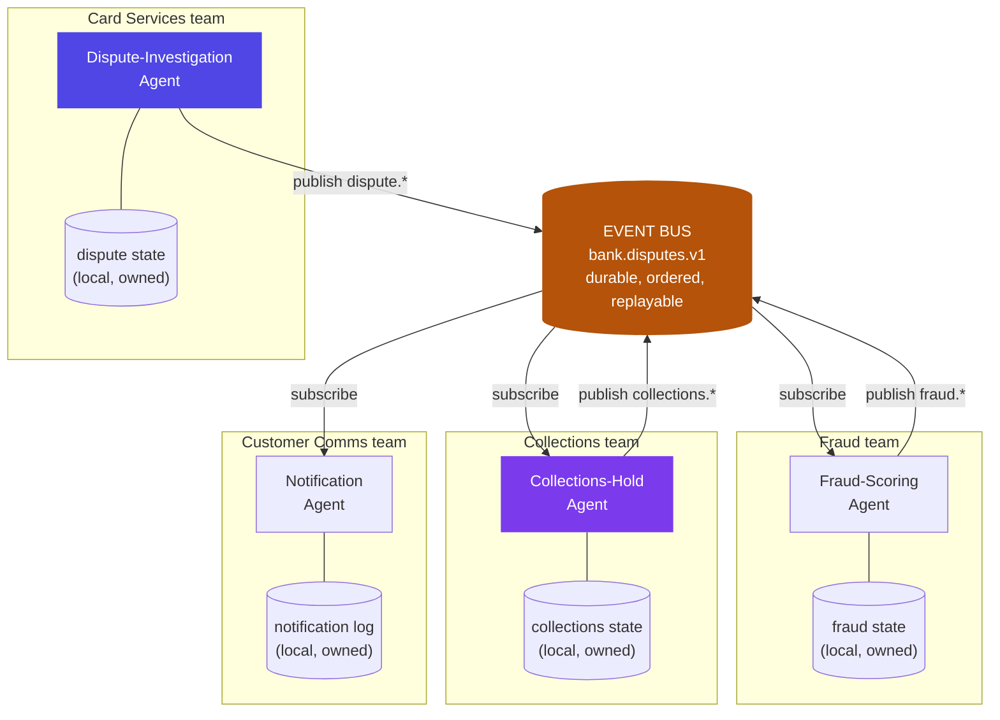

# Chapter 26: Distributed Agent Systems

> Chapter 6 made one service survive a slow tool call. Chapter 15 made three agents survive an ambiguous handoff. Neither chapter prepares you for the moment the dispute agent, the collections agent, and the fraud agent are owned by three different teams, deployed on three different Tuesdays, and none of them can safely call each other directly anymore.

## 1. The architecture — from one service to an estate

Chapter 6 solved a single-service problem: one API, one queue, one worker pool, one state store, all deployed together, all owned by one team. The fix was a fast path and a slow path inside one deployable boundary — and it's still the right answer whenever an agent workload lives inside one team's service. Chapter 15 solved a coordination problem sitting *on top of* that: a supervisor or pipeline of a small, named set of agents, talking through typed delegation contracts, usually still deployed and released together, or close enough that a direct function call or a synchronous API call between them is a reasonable choice.

This chapter starts where both of those stop holding. A production bank doesn't run three coordinated agents — it runs dozens, each owned by a different team, each with its own release cadence, its own on-call rotation, its own database, and often its own cloud account. The card-services team's dispute-investigation agent (Ch2, hardened in Ch5/Ch6) needs to tell the collections team's agent to pause outreach on a disputed account. The collections team didn't write that agent's code, doesn't control when card-services deploys, and has no reason to trust that a synchronous call from an unfamiliar service will be fast, correct, or even reachable at 2 a.m. during someone else's deploy. Ch15's `Delegation` contract assumed the caller and the worker could reasonably agree on a shared request/response cycle. Across an independently-deployed service boundary, that assumption is the thing that breaks first — not because the agents reason worse, but because the *substrate* underneath them is now a distributed system in the classical sense, with everything that implies: partial failure, network partitions, clocks that don't agree, and no shared memory.

The answer the rest of this chapter builds toward is the same one distributed systems arrived at decades before agents existed: stop calling across the boundary directly, and coordinate through a durable, shared log of *events* instead. An agent doesn't ask another team's agent to do something — it publishes a fact ("this dispute was just opened") and lets every agent that cares about that fact subscribe and react on its own schedule, in its own service, under its own team's control.



No agent in this diagram calls another agent's endpoint. Every agent talks to exactly one thing it doesn't own — the bus — and everything it does own — its own state, its own database, its own deploy pipeline — stays behind its own team's boundary. That single change is what makes "dozens of agents across dozens of teams" tractable instead of a distributed monolith with agent-shaped nodes.

## 2. Why the industry needed it — from three agents to an estate

Ch15's join-problem story worked because it had a hidden assumption baked in: Signal Scout, Counterparty Enricher, and Relationship Strategist were, practically speaking, one team's pipeline. They shipped together, versioned together, and a delegation contract change was a code review away from being enforced on both ends at once. That assumption scales to a handful of agents. It does not scale to an estate.

Picture the same bank eighteen months later. The relationship-opportunity pipeline from Ch15 is in production. So is the dispute-investigation agent from Ch2/Ch6. So is a fraud-scoring agent the fraud team built independently. So is a collections-hold agent, a KYC-refresh agent, a credit-line-monitoring agent, and a dozen more — each shipped by a different team, each on its own release train, each with its own idea of what "the current state of a customer's dispute" means. Three things break, in order, as that count climbs:

**Direct calls become a distributed monolith.** The naive fix — have the dispute agent call the collections agent's API directly when a dispute opens — recreates exactly the tangled service-to-service call graph that microservice architectures spent the 2015–2020 decade learning to avoid, except now every node in the graph is also slow and non-deterministic. A synchronous call chain across three or four team boundaries means the collections team's Friday-afternoon deploy can take down the card-services team's dispute flow, and neither team finds out until a customer complains, because nobody who owns the calling code also owns the code being called.

**No single agent — or team — can see or own the truth.** Ch6 solved "does this job's state survive a worker crash" for one service with one state store. Once "is this dispute still open" has to be answered consistently by four different agents in four different services, there is no longer one authoritative place that state lives unless you deliberately design one. Each agent's local database is, at best, a stale copy of a fact some other team's agent produced.

**A workflow that spans services can't use a database transaction to stay consistent.** The dispute-investigation agent's decision to approve a refund, the collections agent's decision to pause outreach, and the notification agent's decision to message the customer are three separate writes in three separate databases owned by three separate teams. There is no `BEGIN; ... COMMIT;` that spans all three — the classic distributed-transaction problem, and the reason the saga pattern (§5) exists at all.

The industry's answer to all three, at scale, is the same shape this chapter's §1 diagram shows: an event bus as the shared substrate, each agent's state as a locally-owned, eventually-consistent read model built from events it subscribes to, and multi-step cross-service workflows modeled as sagas with explicit compensation instead of as transactions that pretend a distributed system can behave like a single database.

## 3. A worked example — the dispute-investigation agent, one service among many

Extend Ch2 and Ch6's dispute-investigation agent past its own service boundary. It still runs exactly the way Ch6 designed it — job queue, worker pool, checkpointed graph, all inside the card-services team's deployment. What's new is what happens *after* it reaches a conclusion, because that conclusion now has to reach three other teams' agents without any of them calling each other.

**The event envelope.** Every fact any agent in the estate might care about is published as one typed event, on one shared topic per domain (`bank.disputes.v1`), with a common envelope regardless of payload:

```python
class DisputeEvent(BaseModel):
    event_id: str          # UUID, the idempotency key for every consumer (§5)
    event_type: str        # "dispute.opened" | "dispute.resolved" | "refund.issued" | ...
    schema_version: int    # bump on breaking payload changes, never reuse a version
    aggregate_id: str      # dispute_id — every event about one dispute carries it
    occurred_at: datetime  # when the fact became true, not when it was published
    producer: str          # "card-services.dispute-agent" — who asserted this fact
    on_behalf_of: str      # user/system identity, travels with every event (Ch19 NHI)
    trace_id: str          # correlates this event to a run's full trace (Ch16)
    payload: dict          # typed per event_type, validated against its own schema
```

**The choreography.** No orchestrator agent calls the other three — each agent subscribes only to the events its own job needs, and reacts:

1. **Dispute-Investigation Agent** (card-services) opens an investigation and publishes `dispute.opened{dispute_id, account_id, transaction_id, amount, reason}`.
2. **Fraud-Scoring Agent** (fraud team), subscribed to `dispute.opened`, scores the transaction and publishes `fraud.flagged` or `fraud.cleared` — it never talks to card-services' agent or database at all; it only knows what the event told it.
3. **Collections-Hold Agent** (collections team), also subscribed to `dispute.opened`, pauses outreach on that account and publishes `collections.paused{dispute_id, account_id, paused_at}` — an outreach hold the collections agent enforces entirely from its own local state, built from events, not from asking card-services "is this still open?"
4. The Dispute-Investigation Agent completes its own investigation (unaffected by any of the above — it never waits on them) and publishes `dispute.resolved{dispute_id, outcome, resolved_at}`.
5. If `outcome == "approved"`, a refund service publishes `refund.issued{dispute_id, refund_id, amount}` once the core-banking write succeeds.
6. The Collections-Hold Agent, subscribed to both `dispute.resolved` *and* `refund.issued`, resumes outreach only once both have arrived — resuming on `dispute.resolved` alone would let it restart collections activity on an account whose refund could still fail (§5's saga logic).
7. A Notification Agent (customer comms), subscribed to `collections.paused`, `collections.resumed`, and `refund.issued`, composes and sends whichever customer message fits the sequence it actually observed.

Every one of these seven steps is a different team's code, deployed on a different day, and none of them ever called another team's endpoint. The only thing every agent agrees to is the event schema — which is exactly the same discipline Ch15's §5 fix demanded of the `Delegation` contract (structured, checkable fields, never a name a downstream step has to interpret), now enforced across a schema registry instead of a single codebase's type system.

## 4. A failure story — the collections call that arrived after the refund

On a routine Tuesday, the collections team rolled out a minor update to their agent's consumer service — three replicas, one at a time, a standard rolling deploy. When the second replica restarted, its Kafka consumer group rebalanced, which is itself unremarkable — except a slow database migration the new pod ran on startup held up its first commit, and the group's consumer lag climbed steadily instead of catching up in the usual few seconds. By the time it self-healed, the collections agent's event consumer had fallen **41 minutes** behind the event log.

Nothing about this looked like an outage. The dispute-investigation agent kept publishing normally; the event bus kept accepting and ordering events normally; the collections agent's process was healthy by every infrastructure signal — it just hadn't read its own mail yet. During those 41 minutes, **9 accounts** had a `dispute.resolved` event sitting in the topic, unconsumed by the collections agent.

Separately — and this is the part that turned a slow consumer into a customer-facing incident — a daily 6:00 a.m. batch job, owned by the collections team, built the day's outbound call list by reading the collections agent's own Postgres materialized view *directly*, bypassing the event bus entirely. Someone had added that shortcut eight months earlier for query performance, and it had never been flagged as an anti-pattern because it had never caused a visible problem before. That morning, it ran squarely inside the lag window. One of the 9 accounts had been resolved and refunded **6 minutes** before the batch job's 6:00 a.m. query — but the collections agent's local read model still showed "collections active" for that account, because the `dispute.resolved` event that should have flipped it hadn't been consumed yet. The account appeared on the day's call list, and roughly three hours later a collections vendor called the customer about a transaction that had already been refunded that same morning.

The other 8 affected accounts self-corrected before any other consumer read their state — the lag cleared well before the next batch job ran at 9 a.m. — so the blast radius that actually reached a customer was one account, one call. No alert fired, because no consumer-lag alerting existed for this topic at all; the incident surfaced two days later through a customer complaint escalated to a relationship manager, and a support engineer traced `dispute_id` across the event log's offsets, the collections consumer group's retained lag metrics, and the batch job's run log to find both the 41-minute window and the fact that the batch job had never gone through the event bus in the first place.

Two root causes, not one: an operational gap (no SLO or alert on consumer lag, so a stalled consumer was invisible until a human complained) and an architectural violation (a downstream job reading another agent's *private* local state directly instead of subscribing to the event log, which is the one thing every agent in this estate is supposed to agree is authoritative). Fixing only the first would have caught the lag faster next time; it would not have stopped a bypass-the-bus shortcut from reading stale state the next time *any* consumer fell behind for *any* reason. Both had to be fixed, and neither one alone would have been enough.

## 5. Design decisions

- **Event bus for cross-team coordination; direct calls stay inside one team's boundary.** The dividing line isn't "is this a multi-agent system" (Ch15 already covers that) — it's "does this call cross an independent deployment boundary owned by a different team." Inside one team's service, Ch15's direct delegation contracts are still the right, simpler tool. The moment card-services needs to tell collections something, publish an event; never call collections' API directly, because that recreates the tangled, fragile call graph §2 describes, with a non-deterministic agent at every node.
- **Choreography over orchestration for cross-team sagas; orchestration where one team owns the whole flow.** §3's seven-step sequence is choreographed — no central coordinator, each agent reacts to events on its own. That's the right default across team boundaries, because it means no single team's service becomes a bottleneck or a single point of failure for a workflow it doesn't fully control. Where one team genuinely owns an entire multi-step flow end-to-end and needs strong, centralized visibility and audit — a deterministic, latency-sensitive process like document ingestion — an explicit saga orchestrator (a Step Functions-style state machine, per §7) is the better trade: it gives up some team-autonomy for a single place to see the whole flow's status.
- **Saga with compensation, not a distributed transaction.** There is no `BEGIN; COMMIT;` spanning card-services', collections', and comms' three separate databases, so §4's `dispute.resolved{approved}` → `refund.issued` step models failure explicitly: if the refund write fails after the dispute was already resolved as approved, the compensating action is *not* to silently revert the resolution (the investigation's conclusion was still correct) — it's to keep collections paused, route the account to a human ops queue for manual refund handling, and have the Notification Agent send a different message than the success path. Compensation is a business action, not a database rollback — undoing "we approved your dispute" would be dishonest; the honest compensation is "we approved it, the refund is delayed, here's what happens next."
- **State is locally owned; the event log is the only shared truth.** Every agent's local database is a *materialized view* built from events it subscribes to — never write directly to another agent's store, and never let a downstream job read another agent's store as if it were authoritative, which is precisely the shortcut that turned §4's ordinary consumer lag into a customer-facing incident. If a consumer's local view can be stale, anything reading that view instead of the event log inherits the staleness silently.
- **Idempotency crosses a boundary now, not just a retry.** Ch6 made a *job* safe to run twice at one API's boundary, keyed on a client-generated idempotency key. This chapter needs the same guarantee at N independent consumers, keyed on `event_id`: every event handler must be safe to process the same event twice, because an event bus — like Ch6's queue — is at-least-once by design, and redelivery after a consumer crash or a rebalance (exactly what happened in §4) is normal, not exceptional. On the publish side, this pairs with the **transactional outbox pattern**: an agent's state-changing write and the event describing it are committed in the same local database transaction (an outbox table), with a separate relay publishing from that table to the bus — solving the "dual-write problem" of a state change committing while its event silently fails to publish, or the reverse, without needing a distributed transaction to do it.

## 6. Trade-offs

| Dimension | Synchronous direct calls | Event-driven (choreography) | Saga (orchestrated) | Distributed 2PC-style transaction |
|---|---|---|---|---|
| **Latency per hop** | Lowest — one network round trip | Higher — publish, consumer poll/rebalance, process | Higher still — coordinator adds a hop | Highest — every participant blocks until every other votes |
| **Failure isolation** | Poor — a slow/down callee blocks the caller directly | Strong — a stalled consumer (§4) delays *that* consumer's view, never the publisher | Moderate — the orchestrator is a new single point of failure for the whole flow | Very poor — any one participant's outage blocks the whole transaction |
| **Team autonomy** | Low — callee's API and uptime become the caller's dependency | High — each team owns its own consumer, deploy cadence, and local state | Lower than choreography — one team's orchestrator now dictates the flow's shape for everyone | Lowest — all participants must agree on transaction protocol and be up simultaneously |
| **Consistency model** | Strong, but only while both sides are up | Eventually consistent — §4's 41-minute lag is the honest cost of this choice | Eventually consistent, with explicit compensation on failure | Strong (when it works) — the reason it's tempting, and the reason it doesn't survive real outages |
| **Auditability** | Ad hoc — depends on each service's own logging | Strong by default — the event log itself is a replayable, ordered record (Ch6's "queue is a ledger," generalized) | Strong — the orchestrator's state machine shows exactly which step a workflow is on | Strong when it completes; opaque when it hangs mid-vote |
| **Operational cost** | Low new infrastructure, high hidden coupling cost | A new durable, scaled piece of shared infrastructure to run and monitor (consumer lag, dead-letter topics) | Everything event-driven needs, plus the orchestrator's own uptime and versioning | Requires every participating system to support the same distributed-transaction protocol — rarely true across independently owned databases in practice |
| **When it's the right call** | Two components inside one team's deploy boundary (Ch15's world) | The default for anything crossing an independently-deployed team boundary | One team owns an entire multi-step, deterministic, auditable flow end-to-end | Almost never, across real organizational boundaries — the honest reason sagas exist |

## 7. Industry implementation

**Confluent's public architecture writing on "autonomous agentic event-driven systems" states the core rule plainly: agents should never call each other directly**, because direct API or function calls between agents create tight coupling, synchronous failure propagation, and implicit dependencies exactly as §2 argues. Their recommended shape matches §1's diagram closely — each agent publishes its observations and decisions as events to a durable streaming backbone, other agents subscribe only to the topics their own domain needs, and state lives in shared materialized views built by stream processors rather than in any one agent's private memory, so "no agent owns state privately." That last point is the direct fix for §4's incident: the collections batch job's bypass of the event log in favor of a private materialized view is precisely the anti-pattern this industry guidance names.

**Temporal has built a durable-execution product specifically for long-running agent workflows that cross service and failure boundaries**, positioning it around a problem statement worth quoting: every AI team ends up rebuilding the same abstractions for long-running sessions, state persistence, and resilience to external failures. Its workflows-as-code model handles retries, state persistence across extended periods, and human-in-the-loop pauses without a hand-rolled state machine — the orchestrated-saga half of §6's table, packaged as a product. Its published customer list for durable AI agent workloads includes Replit (which migrated its coding agent to Temporal specifically for confidence against edge cases in long-running runs), OpenAI, Netflix, Coinbase, DoorDash, Snap, Cloudflare, GitLab, Remitly, Brex, Deloitte, and Retool, with a reported 99.9999% trailing 30-day uptime for the platform itself.

**AWS's own prescriptive guidance for agentic AI on serverless infrastructure recommends coexistence, not a single winner, between choreography and orchestration** — EventBridge as the shared event backbone, feeding both Step Functions (deterministic, fully auditable state machines, best for latency-sensitive or compliance-heavy flows with well-defined control flow) and Bedrock Agents/AgentCore (LLM-driven, adaptive tool selection for flows where the next step genuinely depends on model reasoning, not a fixed graph). Their explicit trade-off table names exactly what §6 names here: Step Functions wins on audit trail and determinism, agent-native orchestration wins on handling unstructured input and adapting without a redeploy — and a mature architecture routes each specific flow to whichever model fits its own risk and structure, rather than picking one pattern for the whole estate.

**The transactional outbox pattern is the production-grade answer to the dual-write problem §5 names**, and it shows up wherever event-driven systems are built seriously: writing the domain-state change and its corresponding event in the same local database transaction (an outbox table), then relaying committed rows to the bus (commonly via change-data-capture tooling like Debezium reading the database's own write-ahead log). This gives atomicity between "the fact happened" and "the fact was published" without needing the distributed transaction §6's table argues against, and — paired with `event_id`-keyed consumer idempotency — gets an event-driven system to effectively-once delivery semantics built entirely from at-least-once primitives, the same philosophy Ch6 applied to job queues, one layer further out.

## 8. Hands-on lab

Design the event schema and saga for a multi-service banking workflow — a card dispute that has to touch fraud, collections, and customer-comms — then break it deliberately the way §4's incident broke, and fix it.

**Stage 1 — design the event envelope and schema registry.** Define the common envelope from §3 (`event_id`, `event_type`, `schema_version`, `aggregate_id`, `occurred_at`, `producer`, `on_behalf_of`, `trace_id`, `payload`) and the full set of typed payloads for the dispute lifecycle: `dispute.opened`, `fraud.flagged`/`fraud.cleared`, `collections.paused`, `dispute.resolved`, `refund.issued`, `refund.failed`, `collections.resumed`, `customer.notified`. Every payload gets its own schema, versioned independently.

**Stage 2 — build the choreography.** Implement (or stub) the four agents from §3 as independent consumers of one topic, each subscribing only to the events its own job needs. Wire the happy path: dispute opens → fraud scores and collections pauses in parallel → dispute resolves approved → refund issues → collections resumes (only after *both* `dispute.resolved` and `refund.issued` have arrived) → customer is notified. Confirm no agent calls another agent's code directly — trace every interaction through the bus.

**Stage 3 — design the compensation path.** Force `refund.issued` to fail after `dispute.resolved{approved}` has already published. Implement the saga's compensating branch per §5: collections stays paused, the account routes to a human ops queue, and the Notification Agent sends the delayed-refund message instead of the success message. Confirm the dispute's resolution itself is never silently reverted.

**Stage 4 — reproduce §4's incident on purpose.** Inject an artificial consumer-lag delay on the collections agent (pause its consumer process for several minutes while events keep publishing), and have a separate "batch job" read the collections agent's local materialized store directly instead of subscribing to events. Confirm you can reproduce the exact failure: an account shows stale state to the bypass reader while the authoritative event log has already moved on.

**Stage 5 — fix it two ways.** First, add consumer-lag alerting (a threshold and an alert, not just a dashboard). Second — the fix that actually matters — remove the batch job's direct database read and make it consume from the event log like every other agent, so a lagging consumer is *late* but never *wrong*. Re-run Stage 4's injected delay and confirm the batch job's output is now correctly stale-and-caught-up rather than stale-and-silently-acted-on.

Deliverable: the event schema document, a diagram of the choreography (happy path and compensation path), and a short incident writeup for the Stage 4 bug you reproduced — root cause, blast radius, detection method, and why an alert alone (without removing the bypass read) wouldn't have been a complete fix.

## 9. Architect's take: the banking read

This is what Ch21's reference architecture actually looks like eighteen months after it ships: not three or four agents any one architect can hold in their head, but an estate where card services, collections, fraud, and comms each run their own agents on their own release trains, and the event bus is the one piece of shared infrastructure every team's audit and risk function actually has to understand. That reframes a question a bank's infrastructure review will ask differently than it asks Ch6's version of it — not "what happens if this one service goes down," but "when the collections team's consumer falls behind for forty minutes, what does every other team's agent see, and does anything downstream treat a stale local view as truth." §4's incident is small in dollar terms and large in what it reveals: an architecture can be individually correct at every step — every agent did exactly what its own inputs told it to do — and still produce a customer-facing failure, because the failure lived in an assumption about freshness that nobody had written down. The event log itself becomes an audit artifact that spans team boundaries the way Ch6's per-service queue never could — "show me every fact that was true about this customer's dispute, in the order it became true, regardless of which team's agent asserted it" is a question this architecture can answer and a collection of independently-logging microservices usually cannot.

## Governance & security lens

A shared event bus is a shared trust boundary, and it needs the same discipline Ch15 applied to inter-agent delegation, extended across organizational lines: an event published by one team's agent is *input* to every other team's agent that subscribes to it, and a poisoned, malformed, or simply wrong event from one producer becomes every subscriber's trusted fact unless it's validated at the boundary. Access control has to be explicit and enforced at the bus, not assumed from goodwill — which services may *publish* to which event types, and which may *subscribe*, is an authorization matrix in exactly Ch15's sense, just drawn at the topic level instead of the agent level; a service that can publish `dispute.resolved` events it has no business asserting is a bigger risk than one that merely reads them. Event payloads that cross service and team boundaries carry the same customer PII and transaction data Ch6 flagged for job queues — encrypted in transit and at rest, with the added twist that a payload now also crosses a *team* boundary, so schema-level data minimization (publish only what a subscriber's stated use case needs, not the full internal record) matters more here than inside one team's own service. Replay is a double-edged capability worth naming explicitly: the event log's replayability is what makes incident reconstruction possible (as in §4), but replaying events into a consumer that isn't idempotent re-triggers every side effect those events originally caused — which is exactly why §5's `event_id`-keyed idempotency isn't optional plumbing, it's what makes replay safe to use as a governance and audit tool at all. Governing questions:

- Which services are authorized to publish to which event types, and is that enforced by the bus itself or only by convention?
- If we replay this topic from an hour ago to reconstruct an incident, does any subscriber re-trigger a real-world action it already took the first time?
- When one team's consumer falls behind, does any other team's process treat that consumer's local state as authoritative instead of the event log itself — as §4's incident shows, that question is exactly what a design review should have asked before the batch job's shortcut shipped.

## Interview-ready lines

- "Ch6 made one service survive a slow tool call. Ch15 made three agents survive an ambiguous handoff. This chapter is about what happens when the agents themselves are owned by different teams and deployed on different days."
- "Agents shouldn't call each other directly across a team boundary — publish a fact, let whoever cares about it subscribe."
- "There's no BEGIN/COMMIT across three teams' databases — that's what the saga pattern and compensating actions are actually for."
- "The event log is the only shared truth; any agent's local state is a materialized view that can be stale, and anything that reads it as if it can't is the incident waiting to happen."
- "A consumer that's forty-one minutes behind isn't broken — it's exactly what at-least-once, eventually-consistent delivery promises. What's broken is a downstream job that read its stale view as if it were the event log itself."
- "Compensation is a business action, not a database rollback — you don't un-approve a correct dispute decision because the refund step failed; you pause collections, route to a human, and say so."
- "Idempotency used to mean 'don't run this job twice.' At estate scale it means 'don't apply this event twice' — at every one of N independent consumers, not just at one API's front door."


## Interview Questions & Answers

**Q1: How is the coordination problem in this chapter different from Ch15's multi-agent orchestration?**

Ch15 assumed a small, named set of agents that could reasonably share a delegation contract and, in most cases, a release cadence — the relationship-opportunity pipeline's three agents shipped together and a schema change was a code review away from being enforced on both ends. This chapter starts once that assumption stops holding: dozens of agents, each owned by a different team, each with its own deploy pipeline, its own database, and no shared moment where "both sides agree on the contract" is guaranteed. The dispute-investigation agent and the collections-hold agent in §3 are a clean example — neither team controls when the other deploys, so a synchronous call between them recreates the tangled, fragile service-to-service call graph the microservices era spent years learning to avoid, except now every node is also non-deterministic. The fix is architectural, not just organizational: coordinate through a durable, shared event log instead of direct calls, so each team's release cadence stays entirely its own business.

**Q2: What if the event bus itself goes down — how does the system behave, and what's the fallback?**

An event bus going down is closer to a network partition than a single-service outage: publishers can't publish, and every subscriber simply stops seeing new facts, but nothing about any one agent's own service necessarily crashes — the dispute-investigation agent can still finish investigations and write to its own database, it just can't tell collections or comms about it until the bus recovers. The honest design response is the same fail-clean discipline Ch18 applies to a struggling model dependency: producers buffer or queue locally (or, with the outbox pattern from §5, simply accumulate committed-but-unpublished rows) rather than losing the fact, and a circuit breaker on the publish path fails fast instead of blocking the agent's own work on a bus that isn't accepting writes. The bigger operational question is detection and catch-up, which is exactly what §4's incident got wrong at a smaller scale: without consumer-lag and publish-failure alerting, a bus outage looks identical to "everything's fine, just slow" until a downstream consumer's staleness produces a customer-facing problem, so the same lag SLO that would have caught the 41-minute collections delay is the frontline defense against a full bus outage too.

**Q3: Walk through what happens when a saga step fails partway through — specifically, `dispute.resolved{approved}` publishes but the refund write fails afterward.**

This is §5's compensation design made concrete: the refund service, subscribed to `dispute.resolved`, attempts the core-banking write and it fails — say, a closed account or a downstream system outage — so it publishes `refund.failed{dispute_id, transaction_id, reason}` instead of `refund.issued`. The compensating action is deliberately *not* to revert the dispute's resolution, because the investigation's conclusion (the customer's dispute is valid) was still correct; undoing it would be dishonest, not corrective. Instead, the Collections-Hold Agent — which only resumes outreach once *both* `dispute.resolved` and `refund.issued` have arrived per §3's step 6 — simply never sees the second event and stays paused, the account routes to a human ops queue for manual refund handling, and the Notification Agent, seeing `refund.failed` instead of `refund.issued`, sends a "your dispute was approved, the refund is delayed" message rather than a success message. Nothing in this path required a distributed transaction; it required every subscriber to have an explicit answer for "what do I do if the expected next event never arrives, or a failure event arrives instead."

**Q4: What are the cost implications of running an estate this way — message volume, event storage, and replay costs?**

Every fact any agent might care about now generates a published event, so message volume scales with the number of state transitions across the whole estate, not just the number of user requests — a single dispute in §3's worked example produces at least seven events across its lifecycle, multiplied by every dispute the bank processes. Event storage is the second cost axis: a durable, replayable log (the property that makes incident reconstruction like §4's possible at all) means retention policy is a real budget line, not a rounding error, and a bank's compliance retention requirements will usually push that further out than pure operational need would. Replay itself is cheap to trigger and expensive to do carelessly — reprocessing a topic to reconstruct an incident or backfill a new consumer reads the same volume of data again, and if that consumer isn't idempotent (§5), a careless replay can also re-trigger every real-world side effect the original events caused, turning a debugging exercise into a second incident. The practical lever, same as Ch18's context-discipline argument generalized to infrastructure, is designing lean event payloads (structured facts, not full customer records) and a retention tier that matches actual audit and replay needs rather than "keep everything forever by default."

**Q5: What data security considerations apply to event payloads that cross service and team boundaries?**

An event payload carries the same customer PII and transaction data Ch6 flagged for job queues, but now it also crosses a *team* boundary, not just a network hop inside one service — every subscribing team gets a copy of whatever the payload contains, whether or not their agent's actual job needs all of it. The discipline that follows is schema-level data minimization: `dispute.opened` needs enough for fraud and collections agents to act (account, transaction, amount, reason), not the customer's full profile, because every field included is a field now replicated into every subscriber's own storage and logs. Encryption in transit and at rest applies exactly as it does to any core banking data store, and because the event log is durable and replayable by design, a payload published today is effectively a payload that exists somewhere for as long as retention policy says it does — which makes the minimization question more consequential here than for a request/response call that's gone once the connection closes. §4's incident is a useful reminder that this cuts both ways: the collections batch job's shortcut of reading another agent's private store directly wasn't just an architectural violation, it was also an unreviewed second copy of customer data living outside the path anyone had actually assessed for access control.

**Q6: What guardrails would you put in place to prevent the kind of eventual-consistency drift that caused this chapter's failure story?**

Two guardrails, matching the incident's two root causes. First, consumer-lag alerting with an actual SLO — not a dashboard someone might glance at, but a threshold (say, a few minutes) that pages someone, because §4's 41-minute lag was invisible for two days precisely because nothing was watching for it. Second, and the one that actually closes the failure class rather than just detecting it faster: no consumer, anywhere in the estate, may read another agent's local materialized state directly — every reader, including internal batch jobs owned by the same team as the agent whose data they want, goes through the event log. The collections team's own batch job reading its own agent's Postgres view felt safe because it stayed inside one team's boundary, but the staleness problem doesn't care about team ownership — it cares about whether a reader is looking at the event log (which is authoritative and was current) or a downstream copy (which can lag for any of a dozen operational reasons). A guardrail enforced only at the network layer (services can't call each other) wouldn't have caught this, because the violation was a same-team database read; the rule has to be architectural and reviewed, not just an access-control policy.

**Q7: How should access control work for a shared event bus — which services can publish and subscribe to which event types?**

Publish and subscribe rights are an authorization matrix in exactly Ch15's sense, just drawn at the topic and event-type level instead of the agent level: the dispute-investigation agent is authorized to publish `dispute.opened` and `dispute.resolved` because it's the sole source of truth for those facts, while the collections agent is authorized to subscribe to both but never to publish them — it can publish `collections.paused` and `collections.resumed`, and nothing else. Enforcing this at the bus itself (schema registry plus topic-level ACLs), rather than trusting every producer to behave, matters because a service that can publish an event type it has no business asserting is a materially bigger risk than one that merely over-subscribes and wastes some bandwidth — a compromised or misconfigured service publishing a false `dispute.resolved` could trigger a real refund based on a fact nobody actually verified. Subscribe-side scoping matters for the minimization reason in Q5: a service should subscribe only to the event types its actual job needs, not the whole topic, the same "exactly the tools its job needs, never just in case" discipline Ch15 applied to per-agent tool grants, now applied to per-service topic access.

**Q8: What does this look like in production — what do you monitor, and what does deploy discipline require?**

Production monitoring centers on consumer lag per subscriber (the direct fix for §4), dead-letter volume for events that repeatedly fail processing, publish-side failures on the outbox relay, and schema-compatibility checks on every producer deploy, because a breaking payload change from one team can silently corrupt every other team's consumer without either side's own tests ever catching it. Deploy discipline has to treat the event schema as a versioned public contract between teams that don't share a repository — schema evolution rules (additive-only within a version, a new `schema_version` for anything breaking) matter more here than in Ch15's single-codebase pipeline, because there's no shared type system to catch a mismatch at build time. Each team still deploys its own consumer independently — that autonomy is the whole point of choreography over orchestration (§5) — but a rolling deploy needs to account for the rebalance behavior that caused §4's lag spike in the first place: a slow startup step (like the migration script in that incident) run during a consumer-group rebalance is exactly the kind of ordinary deploy hygiene issue that turns into a cross-team incident when nobody's watching lag. The operational rule worth carrying forward is the one from §6's table: choreography buys team autonomy at the cost of needing real observability into a shared piece of infrastructure nobody solely owns.

**Q9: Beyond consumer-lag alerting, how do idempotency requirements here differ from what Ch6 already solved for the dispute-investigation agent's job queue?**

Ch6 made a single API's job submission safe to retry — one idempotency key, checked at one boundary, so a client's network retry never created a second job. This chapter needs the same property multiplied across every independent consumer in the estate, because an event bus, like Ch6's queue, is at-least-once by delivery design: the same `dispute.resolved` event can be redelivered to the collections agent after a consumer crash or rebalance (exactly what happened in §4), and every one of those N consumers — fraud, collections, comms, and whatever new service subscribes next year — needs its own handler to be safe against processing that event twice. The mechanism is the same idea Ch6 used, applied per-consumer instead of per-API: key deduplication on `event_id`, so "have I already applied this exact fact" is answered locally by each subscriber rather than assumed centrally. Combined with the transactional outbox pattern on the publish side (§5), which solves the complementary dual-write problem of a state change committing without its event ever reaching the bus, the two together get an estate built entirely from at-least-once primitives to behave, end to end, as if delivery were effectively-once — without ever requiring the distributed transaction that isn't actually available across independently owned databases.

**Q10: Orchestrated saga versus choreographed saga — when would you pick one over the other for a banking multi-agent workflow, and what does §3's worked example suggest?**

§3's dispute-fraud-collections-comms flow is deliberately choreographed: no central coordinator decides "now call fraud, now call collections" — each agent reacts to events on its own, which is the right default whenever a workflow crosses independent team boundaries, because it means no single team's service becomes a bottleneck or single point of failure for a process it doesn't fully own. AWS's own prescriptive guidance for agentic systems argues explicitly for coexistence rather than a single winner: a deterministic, auditable, latency-sensitive process is a good fit for a centralized orchestrator (their example is Step-Functions-style document ingestion, with a full visual state-trace and clear audit trail), while an adaptive, cross-team flow where the value is in team autonomy and loose coupling favors choreography. The trade §6's table makes explicit is that orchestration buys a single place to see the whole workflow's status at the cost of making the orchestrator itself a new dependency every participating team now has to trust; choreography gives up that single view in exchange for genuine team-level deploy independence. For a bank, the practical rule is: pick orchestration when one team owns the entire flow end-to-end and regulatory audit needs a single state-machine view of it; pick choreography — §3's default — the moment the flow genuinely spans teams that need to ship on their own schedules.

**Q11: Design the event schema and saga for a card dispute that has to touch fraud, collections, and customer-comms services, each owned by a different team.**

Start from §3's envelope — `event_id`, `event_type`, `schema_version`, `aggregate_id` (the `dispute_id`), `occurred_at`, `producer`, `on_behalf_of`, `trace_id` — wrapped around typed payloads for `dispute.opened`, `fraud.flagged`/`fraud.cleared`, `collections.paused`, `dispute.resolved`, `refund.issued`, `refund.failed`, `collections.resumed`, and `customer.notified`. The dispute-investigation agent (card services) is the sole publisher of `dispute.opened` and `dispute.resolved`; the fraud agent subscribes to `dispute.opened` and publishes its own score independently, never blocking the investigation; the collections agent subscribes to `dispute.opened` to pause outreach and to *both* `dispute.resolved` and `refund.issued` before resuming it, so a failed refund (§3, Q3) never lets collections restart prematurely; the comms agent subscribes broadly across all of the above to compose whichever customer message fits the actual sequence observed. Every handler is keyed for idempotency on `event_id` (Q9), every producer writes through a transactional outbox (§5), and the whole design assumes no agent ever calls another team's service directly — the schema registry, not a shared codebase, is the contract every team is actually agreeing to.

**Q12: Six months after this system ships, the bank wants to add a new recovery-agency service that consumes dispute and collections events, without touching any existing agent's code. How does this architecture support that, and what could go wrong?**

This is the concrete payoff of choreography over direct calls: the new recovery-agency consumer simply subscribes to whichever existing topics it needs — likely `dispute.resolved` and `collections.paused`/`collections.resumed` — and every existing producer keeps publishing exactly as before, with zero code change and zero coordination required from the card-services, collections, or comms teams. That's the architectural promise §1 and §7's Confluent citation both make: new subscribers are additive by construction, which is precisely what a direct-call architecture (Q1) cannot offer without every upstream service adding a new outbound call for every new downstream consumer. What could go wrong is exactly §4's failure mode, generalized: if the new service is under any pressure to move fast, the path of least resistance is the same shortcut the collections team took eight months earlier — reading an existing agent's database directly instead of subscribing properly, because it's faster to build and nobody reviews it as an architecture change. The guardrail is the same one Q6 already names: enforce "no direct reads of another team's private state" as a reviewed rule at design time for any new consumer, and treat the new service's own consumer lag as something that needs alerting from day one, not something added retroactively after its own version of the collections incident.
